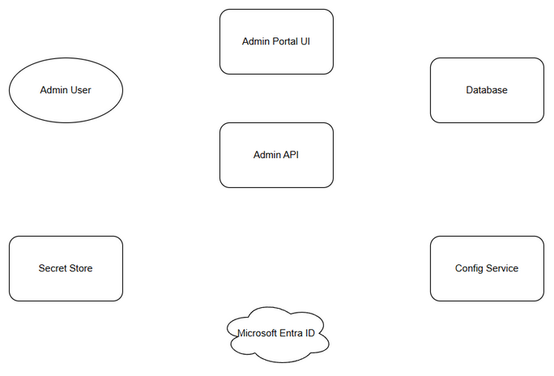
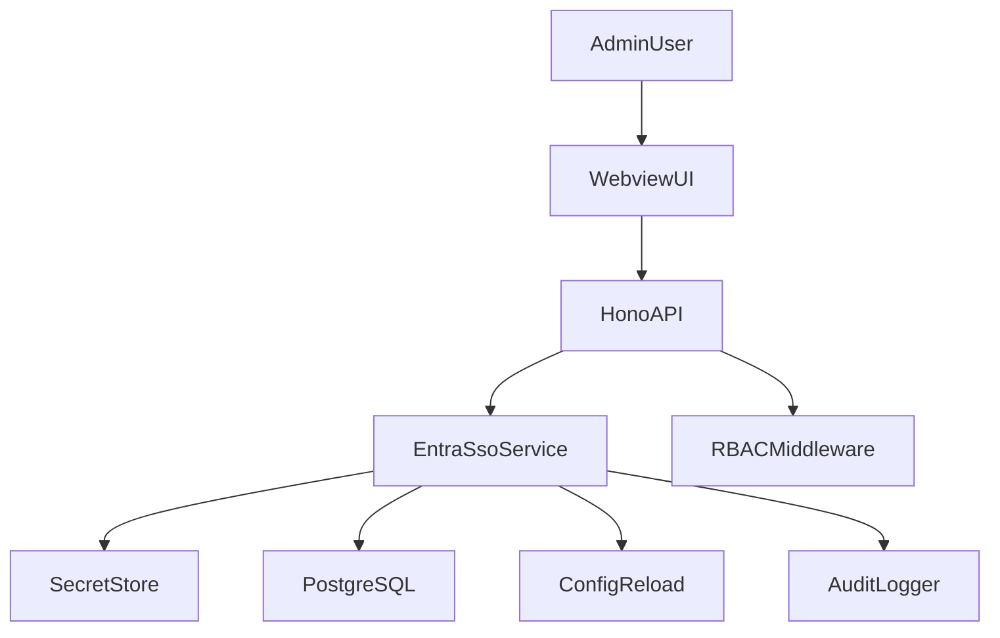
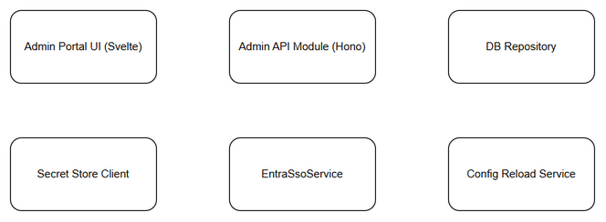
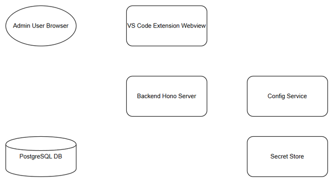
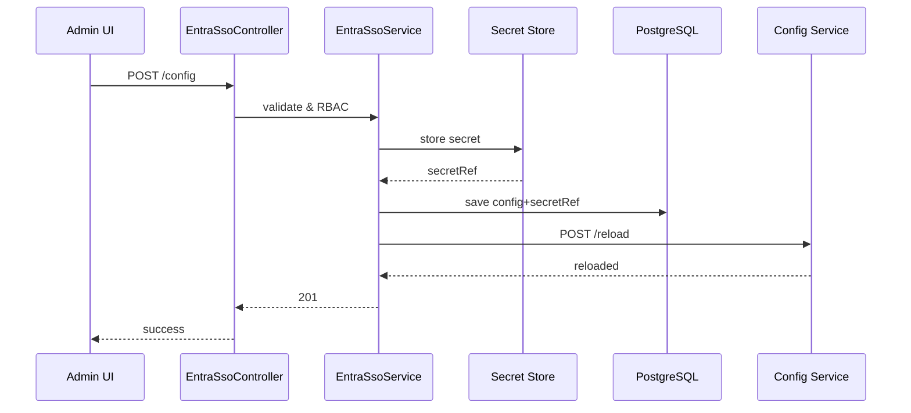
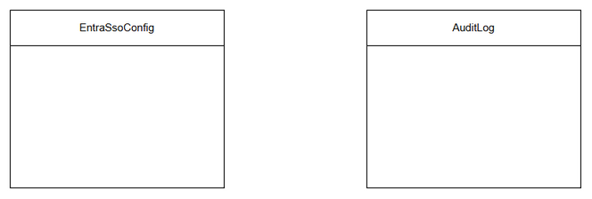
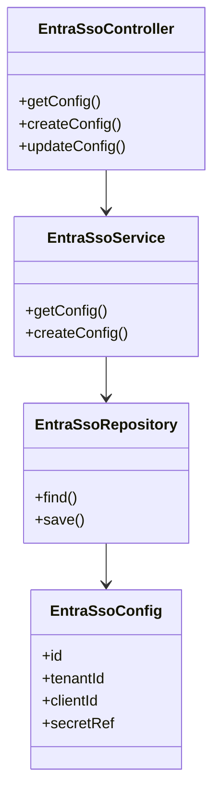

# Technical Design Document (TDD)

## SA4E-276 — Admin UI for Entra SSO configuration management

---

## Document Information

| Field | Value |
|-------|-------|
| Jira Ticket | SA4E-276 |
| Title | Admin UI for Entra SSO configuration management |
| Author | SA Agent |
| Version | 1.0 |
| Date | 2026-09-17 |
| Status | Draft |
| Related BRD | BRD.md |
| Related FSD | FSD.md |

---

## Author Tracking

| Role | Name - Position | Responsibility |
|------|-----------------|----------------|
| Author | SA Agent – Solution Architect | Create document |
| Peer Reviewer | TBD – Product Owner | Review document |

---

## Revision History

| Version | Date | Author | Changes |
|---------|------|--------|---------|
| 1.0 | 2026-09-17 | SA Agent | Initiate document — auto-generated from BRD and FSD |

---

## Sign-Off

| Name | Signature and date |
|------|--------------------|
| | ☐ I agree and confirm the technical design in this TDD |
| | ☐ I agree and confirm the technical design in this TDD |

---

## 1. Introduction

> **Scope Boundary:** This TDD specifies HOW to implement the requirements defined in the FSD. It does NOT repeat functional requirements, business rules, use cases, or UI specifications — refer to the FSD for those.

### 1.1 Purpose

Design technical implementation for Admin Portal UI and backend services to manage Microsoft Entra SSO configuration with secure secret storage, RBAC enforcement, hot reload, and audit logging.

### 1.2 Scope

Technical scope covers Admin Portal Svelte UI screens, Hono backend API module `/api/v1/entra-sso`, integration with Secret Store Service and Config Reload Service, database persistence for non-secret config, RBAC middleware, audit logging.

### 1.3 Technology Stack

| Layer | Technology | Version |
|-------|-----------|---------|
| Language | TypeScript | 5.5 |
| Framework | Hono | 4.0 |
| Frontend | Svelte 4 + Vite | 4.x |
| Database | PostgreSQL / better-sqlite3 | 15 |
| Build Tool | npm | 10 |
| Container | Docker | 24 |
| CI/CD | GitHub Actions | - |
| Logging | Pino | 9.14 |

### 1.4 Design Principles

- SOLID and clean architecture with separation of Controller-Service-Repository
- Secrets never in DB plain text; secretRef stored
- RBAC enforced at backend middleware, not UI only
- Fail-safe secret store write before DB commit
- Hot reload with fallback controlled restart

### 1.5 Constraints

- Existing Admin Portal authentication and session management must be reused
- Secret Store service is external, assumed available
- Config reload must complete within 5s p95

### 1.6 References

| Document | Location |
|----------|----------|
| BRD | documents/SA4E-276/BRD.md |
| FSD | documents/SA4E-276/FSD.md |

---

## 2. System Architecture

### 2.1 Architecture Overview

Admin Portal UI communicates with Admin API Module via REST JSON. API enforces JWT RBAC, validates input, coordinates Secret Store and DB, triggers Config Reload Service and Audit Logger.


*[Edit in draw.io](diagrams/architecture.drawio)*



### 2.2 Component Diagram


*[Edit in draw.io](diagrams/component.drawio)*

| Component | Responsibility | Technology |
|-----------|---------------|------------|
| Admin Portal UI | Svelte screens for Entra SSO config CRUD | Svelte 4 + Vite |
| Admin API Module | Hono routes `/api/v1/entra-sso` | Hono + Zod |
| EntraSsoService | Business logic, secret handling, reload trigger | TypeScript |
| Secret Store Client | Store/retrieve client secret | REST client |
| Config Reload Service Client | Trigger hot reload | REST client |
| DB Repository | Persist non-secret config | better-sqlite3 / pg |

### 2.3 Deployment Architecture


*[Edit in draw.io](diagrams/deployment.drawio)*

Backend Hono server runs in container with DB access. Webview UI runs inside VS Code extension. Secret Store and Config Service are external SaaS/internal services.

### 2.4 Communication Patterns

| From | To | Protocol | Pattern | Description |
|------|----|----------|---------|-------------|
| Web UI | Admin API | HTTPS/JSON | Sync | CRUD config |
| Admin API | Secret Store | HTTPS/JSON | Sync | Store/retrieve secret |
| Admin API | Config Service | HTTPS/JSON | Sync | Reload trigger |
| Admin API | PostgreSQL | TCP/SQL | Sync | Read/write config |

---

## 3. API Design

> Functional contracts defined in FSD §3.1.6. Technical details below.

### 3.1 API Overview

| # | Endpoint | Method | Description | Source |
|---|----------|--------|-------------|--------|
| 1 | /api/v1/entra-sso/config | GET | Retrieve config masked | UC-001 |
| 2 | /api/v1/entra-sso/config | POST | Create config | UC-001 |
| 3 | /api/v1/entra-sso/config/{id} | PUT | Update config | UC-001 |
| 4 | /api/v1/entra-sso/config/{id} | DELETE | Delete config | UC-001 |

### 3.2 API: Get Configuration

**Implements:** UC-001

| Attribute | Value |
|-----------|-------|
| Method | GET |
| Path | /api/v1/entra-sso/config |
| Auth | Bearer JWT |
| Rate Limit | 60/min |

**Response 200:**
```json
{
  "id": "uuid",
  "tenantId": "string",
  "clientId": "string",
  "clientSecretMasked": "********",
  "secretRef": "secret://entra/clientSecret",
  "redirectUri": "string",
  "issuerUrl": "string",
  "jwksUrl": "string",
  "enabled": true,
  "status": "healthy",
  "updatedAt": "2026-09-17T00:00:00Z",
  "updatedBy": "user-id"
}
```

**Error Responses:**
| Status | Code | Message |
|--------|------|---------|
| 401 | UNAUTHORIZED | Missing/invalid JWT |
| 403 | FORBIDDEN | No view permission |
| 404 | NOT_FOUND | No configuration |

### 3.3 API: Create Configuration

**Method:** POST /api/v1/entra-sso/config
**Auth:** JWT + RBAC AuthAdmin/SystemAdmin

**Request Body:**
```json
{
  "tenantId": "uuid",
  "clientId": "uuid",
  "clientSecret": "string",
  "redirectUri": "https://...",
  "issuerUrl": "https://...",
  "jwksUrl": "https://...",
  "enabled": true
}
```

**Response 201:** Config object as above.

**Error Responses:** 400 Validation, 403 Forbidden, 500 Secret Store error

### 3.4 API: Update Configuration

**Method:** PUT /api/v1/entra-sso/config/{id}
Partial fields allowed. If clientSecret empty, secretRef retained.

### 3.5 API: Delete Configuration

**Method:** DELETE /api/v1/entra-sso/config/{id}
Triggers audit log and config reload.



---

## 4. Database Design

> Logical model from FSD §4. Physical DDL below.

### 4.1 Schema Overview


*[Edit in draw.io](diagrams/db-schema.drawio)*

### 4.2 DDL Scripts

#### Table: entra_sso_config

```sql
CREATE TABLE entra_sso_config (
    id UUID PRIMARY KEY DEFAULT gen_random_uuid(),
    tenant_id VARCHAR(100) NOT NULL,
    client_id VARCHAR(100) NOT NULL,
    secret_ref VARCHAR(255) NOT NULL,
    redirect_uri TEXT NOT NULL,
    issuer_url TEXT NOT NULL,
    jwks_url TEXT,
    enabled BOOLEAN NOT NULL DEFAULT FALSE,
    status VARCHAR(50),
    updated_at TIMESTAMP NOT NULL DEFAULT NOW(),
    updated_by VARCHAR(100) NOT NULL
);
CREATE INDEX idx_entra_config_updated_at ON entra_sso_config(updated_at);
CREATE UNIQUE INDEX idx_entra_config_tenant_client ON entra_sso_config(tenant_id, client_id);
```

#### Table: audit_log

```sql
CREATE TABLE audit_log (
    id UUID PRIMARY KEY DEFAULT gen_random_uuid(),
    entity_type VARCHAR(100) NOT NULL,
    entity_id UUID NOT NULL,
    action VARCHAR(20) NOT NULL,
    user_id VARCHAR(100) NOT NULL,
    timestamp TIMESTAMP NOT NULL DEFAULT NOW(),
    details JSONB
);
CREATE INDEX idx_audit_entity ON audit_log(entity_type, entity_id);
CREATE INDEX idx_audit_timestamp ON audit_log(timestamp);
```

### 4.3 Migration Plan

| Order | Script | Description |
|-------|--------|-------------|
| 1 | V1__create_entra_sso_config.sql | Create config table |
| 2 | V2__create_audit_log.sql | Create audit log table |

### 4.4 Query Patterns

| Operation | Query | Target |
|-----------|-------|--------|
| Get config | SELECT * FROM entra_sso_config LIMIT 1 | <50ms |
| Update config | UPDATE entra_sso_config SET ... WHERE id = ? | <100ms |

---

## 5. Class / Module Design

### 5.1 Package Structure

```
backend/modules/auth/entra-sso/
├── controller/
│   └── EntraSsoController.ts
├── service/
│   ├── EntraSsoService.ts
│   └── EntraSsoServiceImpl.ts
├── repository/
│   └── EntraSsoRepository.ts
├── model/
│   └── EntraSsoConfig.ts
├── dto/
│   ├── EntraSsoCreateRequest.ts
│   └── EntraSsoResponse.ts
└── routes.ts
```

### 5.2 Key Interfaces

```typescript
export interface EntraSsoService {
  getConfig(): Promise<EntraSsoConfig>;
  createConfig(dto: CreateDto): Promise<EntraSsoConfig>;
  updateConfig(id: string, dto: UpdateDto): Promise<EntraSsoConfig>;
  deleteConfig(id: string): Promise<void>;
}
```

### 5.3 Design Patterns

| Pattern | Where Used | Rationale |
|---------|-----------|-----------|
| Repository | Data access | Abstract DB |
| Strategy | Secret store client | Pluggable store |
| Middleware | RBAC | Cross-cutting auth |

### 5.4 Error Handling

| Exception | HTTP | Code |
|-----------|------|------|
| ValidationError | 400 | VALIDATION_FAILED |
| ForbiddenError | 403 | RBAC_DENIED |
| SecretStoreError | 500 | SECRET_STORE_UNAVAILABLE |



---

## 6. Integration Design

### 6.1 External System: Secure Secret Store

| Attribute | Value |
|-----------|-------|
| Protocol | REST HTTPS |
| Endpoint | /secrets |
| Auth | Service token |
| Timeout | 5s |
| Retry | 3x exponential backoff |
| Circuit Breaker | 5 failures |

Sequence: Service writes secret, receives secretRef, stores ref in DB.

### 6.2 External System: Config Reload Service

`POST /config/reload` body `{service:"auth", configId:"..."}`

### 6.3 External System: Audit Log

Write audit events synchronously best effort.

---

## 7. Security Design

### 7.1 Authentication

JWT Bearer token validated by `server/jwt-auth.ts`. Claims include roles.

### 7.2 Authorization

| Role | Endpoints | Permissions |
|------|-----------|-------------|
| Auth Admin | /api/v1/entra-sso/* | READ WRITE |
| System Admin | /api/v1/entra-sso/* | READ WRITE |
| Auth Viewer | GET /config | READ |

### 7.3 Data Protection

| Data | At Rest | In Transit | In Logs |
|------|---------|------------|---------|
| clientSecret | AES-256 in Secret Store | TLS 1.2+ | Never |
| tenantId/clientId | Plain DB | TLS | Masked |

### 7.4 Input Validation

TenantId/ClientId UUID v4 regex, RedirectUri HTTPS URL, clientSecret min 8 chars.

---

## 8. Performance & Scalability

### 8.1 Caching Strategy

Config cached in-memory 30s TTL, invalidated on update.

### 8.2 Connection Pooling

PostgreSQL pool min 5 max 20, idle timeout 30s.

### 8.3 Performance Targets

| Operation | Target |
|-----------|--------|
| Config save + reload | <5s p95 |
| Config GET | <100ms p95 |

---

## 9. Monitoring & Observability

### 9.1 Logging

Structured JSON via Pino. Log config changes, RBAC denied, secret store errors.

### 9.2 Metrics

Latency histogram, error rate counter, reload duration.

### 9.3 Health Checks

`/api/v1/health` checks DB, Secret Store, Config Service.

---

## 10. Deployment Considerations

### 10.1 Environment Configuration

| Property | DEV | PROD |
|----------|-----|------|
| SECRET_STORE_URL | http://secret-store.dev | https://secret-store.prod |
| CONFIG_SERVICE_URL | http://config.dev | https://config.prod |

### 10.2 Feature Flags

`ENTRA_SSO_MANAGEMENT_ENABLED` default true.

### 10.3 Rollback Strategy

Database migration rollback script, config revert to previous secretRef, manual restart if hot reload fails.

---

## 11. E2E Test Architecture

### 11.1 Framework & Language
- Framework: vitest E2E-API + Playwright E2E-UI
- Language: TypeScript
- Tests live in `backend/tests/`

### 11.2 Test Structure
- E2E-API: `backend/tests/e2e/entra-sso.e2e.test.ts`
- E2E-UI: Playwright tests for Svelte webview

### 11.3 E2E-API Test Design
- Auth setup via JWT generation helper
- Data cleanup via DB truncate after suite
- Test cases: create valid config, validation failure, RBAC denied, secret store failure

---

## 12. Appendix

### Open Questions

| # | Question | Status |
|---|----------|--------|
| 1 | Secret Store migration for existing plain text secrets | Open |

---

## ⛔ MANDATORY: Diagram Requirements

All diagrams referenced exist as draw.io + PNG.

| Diagram | File |
|---------|------|
| Architecture | diagrams/architecture.drawio |
| Component | diagrams/component.drawio |
| Deployment | diagrams/deployment.drawio |
| API Sequence | diagrams/api-sequence-save.drawio |
| DB Schema | diagrams/db-schema.drawio |
| Class | diagrams/class-diagram.drawio |
