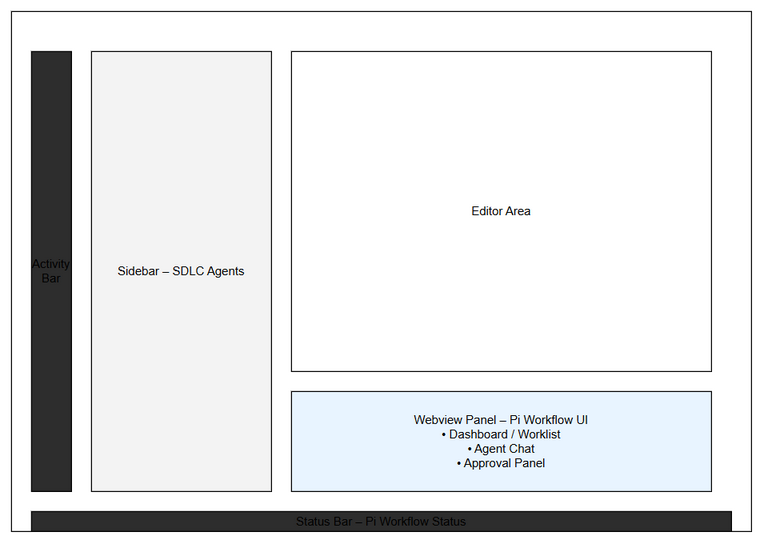
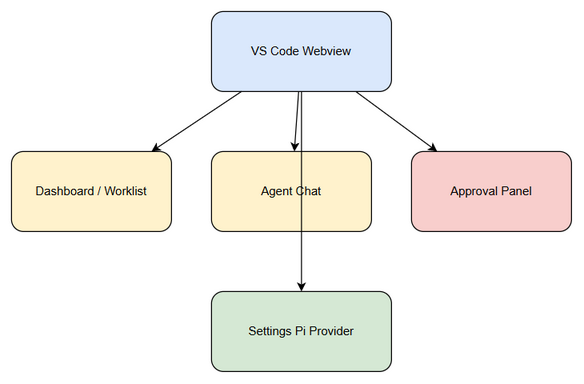
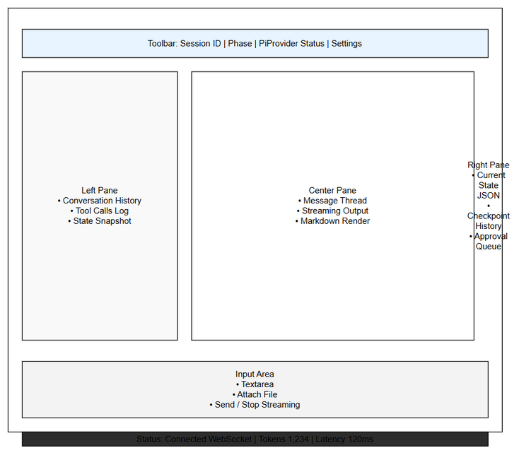
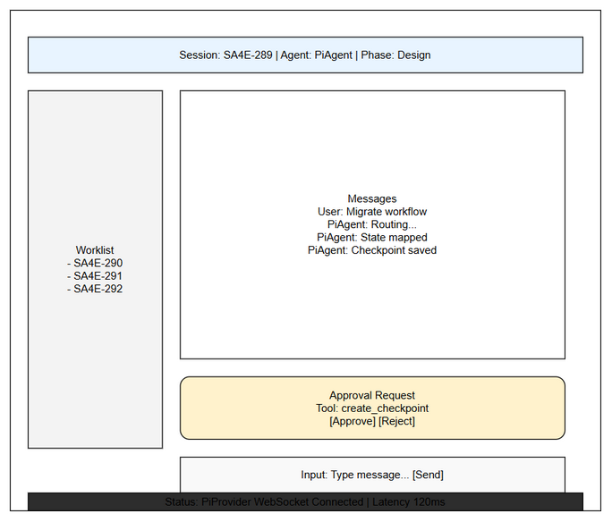
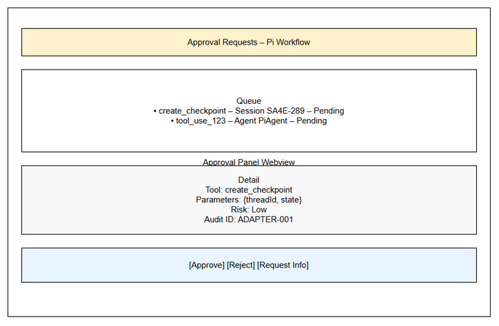
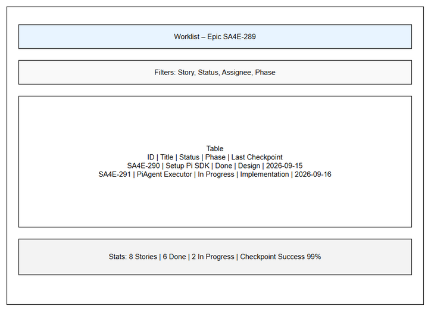
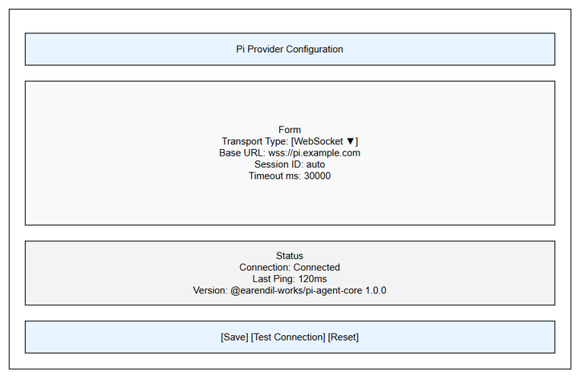

# Pi Chat UI Layout — Update Spec (for the implementing AI)

Instruction spec to **update the existing chat webview** from the current single-column layout to the mockup 3-pane workflow layout. Read this together with `PI-CHAT-UI-LAYOUT-CHECKLIST.md` (phased plan). This file is the precise "what/where/how".

> Scope: layout + panels only. Do NOT change the Pi engine. Fix the runtime "Unknown provider" bug (provider registration) BEFORE this. Reuse existing components; no rewrite.

## Mockups (source of truth — embedded below, files in this folder)

### Overall VS Code placement — `vscode-ui-mockup.png`
Webview Panel (bottom-right) hosts the Pi Workflow UI = Dashboard/Worklist + Agent Chat + Approval.



### Webview flow — `ui-flow.png`
Webview → Dashboard/Worklist, Agent Chat, Approval Panel, Settings Pi Provider.



### Chat 3-pane skeleton — `chat-window-internal.png`
Toolbar / Left (History, Tool Calls, State Snapshot) / Center (Message Thread, Streaming, Markdown) / Right (State JSON, Checkpoint History, Approval Queue) / Input / Status Bar.



### Chat 3-pane with real data — `chat-screen-detail.png`
Session SA4E-289, Worklist SA4E-290..292, inline Approval Request (create_checkpoint).



### Approval Panel — `approval-detail.png`
Queue (pending) + Detail (Tool, Parameters, Risk, Audit ID) + `[Approve] [Reject] [Request Info]`.



### Dashboard / Worklist — `dashboard-detail.png`
Worklist Epic SA4E-289: Filters, Table (ID|Title|Status|Phase|Last Checkpoint), Stats.



### Settings (reference — already implemented) — `settings-detail.png`


## Current state (what exists today, on main)
- `extension/src/webview/App.svelte` → renders `ChatPanel.svelte` only.
- `ChatPanel.svelte` = single column: `ChatHeader` → `ServiceOfflineWarning` → `ChatMessageList` → `ChatInput` → `PermissionGuard` (conditional). RAF token batching already wired (`startBatching/pushToken/stopBatching`).
- Stores: `chatStore`, `toolStore`, `connectionStore`, `contextStore`, `diffTrackerStore`, `agentStore`.
- Approvals TODAY: `PermissionGuard.svelte` driven by `toolStore.activeToolsList` (tool with `status==='pending' && requiresApproval`), replies via `respondToolCall(toolId, 'APPROVE'|'REJECT', pattern?)` in `postMessage.ts`.
- Ext↔webview contract: `extension/src/chat-panel/message-protocol.ts` + `message-routing.ts` + `message-handler.ts`; webview send helpers in `extension/src/webview/postMessage.ts`.

## Target layout (from mockups)
```
┌───────────────────────────────────────────────────────────────┐
│ Toolbar:  Session | Phase | PiProvider Status | [Settings]       │  ← new (extend ChatHeader)
├───────────┬───────────────────────────────┬─────────────────────┤
│ Left Pane │ Center Pane (primary)         │ Right Pane          │
│ • History │ • Message Thread              │ • Current State JSON│
│ • Tool Log│ • Streaming Output            │ • Checkpoint History│
│ • State   │ • Markdown Render             │ • Approval Queue    │
│  Snapshot │   (reuse ChatMessageList)     │                     │
├───────────┴───────────────────────────────┴─────────────────────┤
│ Input Area: Textarea | Attach File | [Send] / [Stop Streaming]   │  ← reuse ChatInput + add Stop
├───────────────────────────────────────────────────────────────┤
│ Status Bar: Connected | Tokens N | Latency Nms                   │  ← new
└───────────────────────────────────────────────────────────────┘
Approval Panel (approval-detail.png): shown inline in Center (yellow box) AND summarized in Right Pane Queue.
Worklist/Dashboard (dashboard-detail.png): separate tab within the panel.
```

## How to implement (concrete)

### Step 1 — Layout shell (don't fork the chat)
- Create `extension/src/webview/components/PiChatLayout.svelte` = CSS-grid shell with `toolbar / left / center / right / input / statusbar` areas; left & right panes **collapsible**.
- `App.svelte` renders `PiChatLayout` instead of `ChatPanel` directly. Move the existing `ChatHeader/ChatMessageList/ChatInput/PermissionGuard` composition INTO the center column of `PiChatLayout` (keep RAF batching + all existing handlers intact).
- Follow `frontend-structure` steering: markup in `.svelte`, logic in stores/`.ts`, no HTML strings, use `var(--vscode-*)` tokens, native `<select>` styling rules.

### Step 2 — Real-data store + protocol (NO hardcoding)
- New store `extension/src/webview/stores/piWorkflowStore.ts`:
  ```ts
  export interface PiWorkflowState {
    sessionId?: string; phase?: string;
    providerStatus: 'connected'|'disconnected'|'connecting'; // default 'disconnected'
    providerName?: string; model?: string;
    tokensUsed?: number; contextWindow?: number; latencyMs?: number;
  }
  ```
  Default = empty/`disconnected`. **Never** hardcode `sa4e-289-session`/`connected` (that was SEC-289-11).
- Extend `message-protocol.ts` (ext→webview): `pi:state`, `pi:tokens`, `pi:toolLog`, `pi:approvalQueue`, `pi:checkpointHistory`, `pi:worklist`. (webview→ext): `pi:approvalDecision {id, decision}`. Add matching handlers in `message-routing.ts`/`message-handler.ts` and webview listeners that update the stores.
- Emit from `PiWorkflowAdapter` using existing sources: `piSessionId`, `currentPhase`/`pipelineStatus`, `sdkAvailable`→providerStatus, tool events (from `pi-event-mapper`), checkpoint saves (`KbRemoteCheckpointerStore`), `getDetectedContextWindow`. Add a latency measurement around the turn.

### Step 3 — Panels
- **Toolbar**: extend `ChatHeader.svelte` to show Session | Phase | Provider status pill | Settings button (opens settings panel). Bind `piWorkflowStore`.
- **Left Pane** (`LeftPane.svelte`, new): History (`chatStore`), Tool Calls Log (`toolStore`/`pi:toolLog`), State Snapshot (`piWorkflowStore`). Use the branch draft's markup/CSS as *visual reference only*; wire real stores.
- **Right Pane** (`RightPane.svelte`, new): Current State JSON (pretty-print `PipelineState`), Checkpoint History (`pi:checkpointHistory`), Approval Queue summary.
- **Status Bar** (`StatusBar.svelte`, new): `connectionStore` + `pi:tokens`.
- **Input**: reuse `ChatInput.svelte`; add a Stop-Streaming button wired to `PiProvider.abort()` (through the adapter + protocol).

### Step 4 — Approval Panel (highest value; backend exists)
- `ApprovalPanel.svelte` per `approval-detail.png`: Queue (`tool – session – Pending`), Detail (Tool, Parameters, Risk, Audit ID), actions `[Approve] [Reject] [Request Info]`.
- Two integration options — pick the SIMPLER that fits:
  - **(A) Reuse existing approval flow:** the current tool-approval already works via `toolStore.activeToolsList` + `PermissionGuard` + `respondToolCall`. If the Pi gate surfaces pending tools into `toolStore`, `ApprovalPanel` can be a richer view over the same store + `respondToolCall`. Prefer this — least new plumbing.
  - **(B) New pi-specific queue:** `pi:approvalQueue` / `pi:approvalDecision` events wired to `ToolApprovalGate` via the adapter's `handleApproval`.
- Show approval inline in Center (yellow box, like `chat-screen-detail.png`) and summarized in Right Pane.

### Step 5 — Worklist tab (dashboard-detail.png)
- `WorklistPanel.svelte` as a TAB within the panel (avoid a 2nd webview): Filters (Story/Status/Assignee/Phase), Table (ID|Title|Status|Phase|Last Checkpoint), Stats.
- Data: epic subtasks SA4E-290..297 via the Jira MCP path + checkpoint metadata; feed via `pi:worklist`. This is the only panel needing a new data provider.

### Step 6 — Tests + verify
- Component tests under `extension/src/webview/__tests__/` (match existing style): store→render for Toolbar/Left/Right/StatusBar; ApprovalPanel actions emit the right message; Worklist renders rows; assert stores default to empty/`disconnected` (no hardcode).
- Protocol round-trip test: adapter emits `pi:*` → store updates → render.
- `cd extension; npx tsc --noEmit` clean; `npx vitest run src/webview` green (stable ≥3 runs).
- Manual in Kiro: streamed tokens in Center; tool triggers Approval → Approve → proceeds; Worklist shows real SA4E-290..297 statuses.

## Acceptance criteria
- [ ] Chat renders as toolbar + 3 collapsible panes + input + status bar (matches `chat-window-internal.png`).
- [ ] Toolbar/State Snapshot/Status Bar show REAL session/phase/provider/tokens (no hardcoded values).
- [ ] Center chat = existing `ChatMessageList`/`ChatInput` behavior preserved (streaming, slash commands, agent select).
- [ ] Approval Panel can Approve/Reject a real pending tool and the tool proceeds/aborts accordingly.
- [ ] Stop-Streaming aborts the active Pi run.
- [ ] Worklist tab lists epic subtasks with status/phase/last-checkpoint.
- [ ] tsc clean; webview tests green; manual verify recorded.

## Guardrails
- Reuse existing components/stores/protocol; extend, don't fork.
- No hardcoded session/provider/model/status (SEC-289-11).
- `frontend-structure` steering: `.svelte` markup + `.ts` logic, `var(--vscode-*)`, native select styling, every async action has feedback (loading/empty/error/success), no silent catch.
- UI-relative paths only (no absolute `/...`).
- Runtime provider-registration bug fixed first.
- Out of scope: Pi engine internals; SA4E-297 LangGraph removal (SA4E-307 does not exist).

## New/changed files (indicative)
| File | Change |
|------|--------|
| `extension/src/webview/App.svelte` | Render `PiChatLayout` |
| `extension/src/webview/components/PiChatLayout.svelte` | NEW grid shell |
| `extension/src/webview/components/LeftPane.svelte` / `RightPane.svelte` / `StatusBar.svelte` / `ApprovalPanel.svelte` / `WorklistPanel.svelte` | NEW panels |
| `extension/src/webview/components/ChatHeader.svelte` | Extend → toolbar (session/phase/provider/settings) |
| `extension/src/webview/components/ChatInput.svelte` | Add Stop-Streaming |
| `extension/src/webview/stores/piWorkflowStore.ts` | NEW (real data) |
| `extension/src/chat-panel/message-protocol.ts` + `message-routing.ts` + `message-handler.ts` | Add `pi:*` events |
| `extension/src/webview/postMessage.ts` | Add `pi:approvalDecision` sender |
| `extension/src/pi-workflow/pi-workflow-adapter.ts` | Emit `pi:*`; handle approvalDecision; latency; expose abort |
| `extension/src/webview/__tests__/*` | Component + protocol tests |
