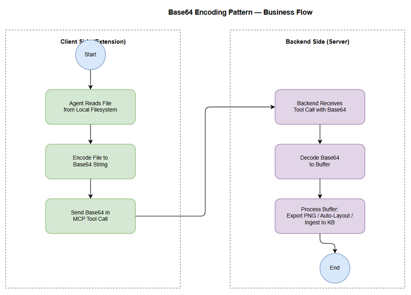
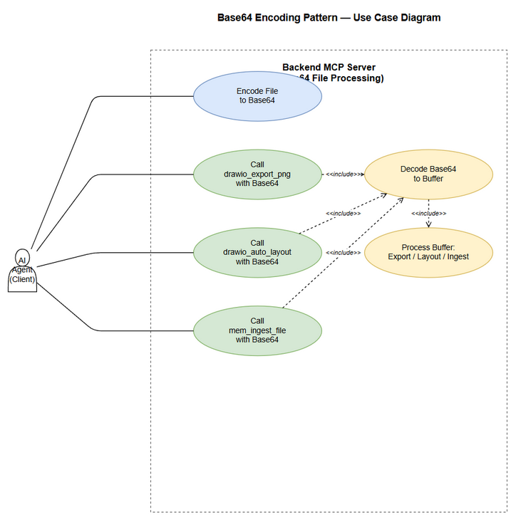

# Business Requirements Document (BRD)

## Kiro SDLC Agents — SA4E-29: Base64 Encoding Pattern for Backend File Access

---

## Document Information

| Field | Value |
|-------|-------|
| Jira Ticket | SA4E-29 |
| Title | Base64 Encoding Pattern for Backend File Access |
| Author | BA Agent |
| Version | 1.0 |
| Date | 2026-07-11 |
| Status | Draft |

---

## Author Tracking

| Role | Name - Position | Responsibility |
|------|-----------------|----------------|
| Author | BA Agent – Business Analyst | Create document |
| Peer Reviewer | Duc Nguyen Minh – Reporter | Review document |

---

## Revision History

| Version | Date | Author | Changes |
|---------|------|--------|---------|
| 1.0 | 2026-07-11 | BA Agent | Initiate document — auto-generated from Jira ticket SA4E-29 |

---

## Sign-Off

| Name | Signature and date |
|------|--------------------|
| | ☐ I agree and confirm all criteria on this BRD as expected requirements |
| | ☐ I agree and confirm all criteria on this BRD as expected requirements |

---

## 1. Introduction

### 1.1 Scope

This change request addresses a fundamental architectural limitation in the SDLC multi-agent system: the backend MCP server cannot access the client-side filesystem. Tools such as `drawio_export_png`, `drawio_auto_layout`, and `mem_ingest_file` accept a `file_path` parameter, but when the backend receives this path, it has no access to the file because the file resides on the client machine (VS Code extension host).

The solution is to introduce a **base64 encoding pattern**: files are encoded to a base64 string on the client side, passed to the backend via the tool call payload, and decoded on the backend before processing.

The scope includes:
- Updating affected tools to accept an optional `base64_content` parameter alongside (or instead of) `file_path`
- Implementing client-side encoding logic
- Implementing backend-side decoding logic
- Updating all call sites that invoke these tools

### 1.2 Out of Scope

- Modifying tools that do not accept file paths (e.g., `mem_search`, `find_tools`)
- Adding new file-related tools beyond the three affected ones
- Building a persistent file transfer protocol (base64 is stateless per-call)
- Streaming large files in chunks (base64 for files up to typical diagram/document sizes)

### 1.3 Preliminary Requirement

- The backend must support Node.js `Buffer.from()` or equivalent for base64 decode
- The client (extension host) must have filesystem read access to encode files
- All three affected tools must be registered and deployed before or alongside this change

---

## 2. Business Requirements

### 2.1 High Level Process Map

When an AI agent needs to process a file (export a drawio diagram to PNG, auto-layout a diagram, or ingest a file into the knowledge base), it first reads the file from the local filesystem on the client side, encodes it to a base64 string, and sends that string as part of the MCP tool call. The backend receives the base64 payload, decodes it to a buffer, and performs the requested operation. The result is returned to the agent.


*[Edit in draw.io](diagrams/business-flow.drawio)*


*[Edit in draw.io](diagrams/use-case.drawio)*

### 2.2 List of User Stories / Use Cases

| # | Story / Use Case / Epic | Priority | Source Ticket |
|---|-------------------------|----------|---------------|
| 1 | As an AI agent, I want to call `drawio_export_png` with base64-encoded XML so that diagrams can be exported without backend filesystem access. | MUST HAVE | SA4E-29 |
| 2 | As an AI agent, I want to call `drawio_auto_layout` with base64-encoded XML so that diagrams can be auto-laid out without backend filesystem access. | MUST HAVE | SA4E-29 |
| 3 | As an AI agent, I want to call `mem_ingest_file` with base64-encoded content so that files can be ingested into the knowledge base without backend filesystem access. | MUST HAVE | SA4E-29 |
| 4 | As a backend developer, I want a reusable base64 decode utility so that all file-accepting tools handle encoding consistently. | SHOULD HAVE | SA4E-29 |

---

### 2.3 Details of User Stories

---

#### Business Flow

**Step 1:** The AI agent identifies a file that needs processing (e.g., a `.drawio` file for export, or a `.md` file for knowledge base ingestion).

**Step 2:** The agent reads the file content from the local filesystem using the client-side `fs.readFile` or equivalent API.

**Step 3:** The agent encodes the file buffer to a base64 string using `Buffer.toString('base64')` or client-side `btoa()`.

**Step 4:** The agent calls the appropriate MCP tool (`drawio_export_png`, `drawio_auto_layout`, or `mem_ingest_file`) passing the base64 string as the `base64_content` parameter. The `file_path` parameter becomes optional or is used for metadata only (e.g., filename hint).

**Step 5:** The backend receives the tool call, extracts the `base64_content`, and decodes it using `Buffer.from(base64, 'base64')`.

**Step 6:** The backend processes the decoded buffer (exports PNG, applies auto-layout, or ingests to knowledge base).

**Step 7:** The result is returned to the agent.

> **Note:** Backward compatibility must be maintained — if neither `base64_content` nor `file_path` is provided, the tool should return a meaningful error. If `file_path` is provided and accessible (e.g., during local development), it should still work as before.

---

#### STORY 1: Base64 Export for drawio_export_png

> As an AI agent, I want to call `drawio_export_png` with base64-encoded XML so that diagrams can be exported without backend filesystem access.

**Requirement Details:**

1. The `drawio_export_png` tool MUST accept a new optional parameter `base64_content` (string — the base64-encoded drawio XML).
2. When `base64_content` is provided, the backend MUST decode it and use the decoded XML as the diagram source.
3. The existing `file_path` parameter SHOULD remain as an alternative for local development.
4. The tool MUST validate that at least one of `file_path` or `base64_content` is provided.
5. The output PNG MUST be returned as base64 in the tool response, or written to a path specified by the caller if a `file_path` is given.

**Data Fields:**

| Field | Type | Required | Description | Example |
|-------|------|----------|-------------|---------|
| file_path | string | No | Local path to .drawio file | `C:\diagrams\flow.drawio` |
| base64_content | string | No | Base64-encoded drawio XML | `PHhtbD48L3htbD4=` |
| output_path | string | No | Path to write output PNG | `C:\diagrams\flow.png` |

**Acceptance Criteria:**

1. Given a valid base64-encoded drawio XML, when `drawio_export_png` is called with `base64_content`, then a PNG is successfully generated and returned.
2. Given neither `file_path` nor `base64_content` is provided, when `drawio_export_png` is called, then a validation error is returned.
3. Given both `file_path` and `base64_content` are provided, when `drawio_export_png` is called, then `base64_content` takes precedence (or both are tried with file first).
4. Given an invalid base64 string, when `drawio_export_png` is called, then a decoding error is returned.
5. Given the backend cannot write to the output path, when export completes, then the PNG data is still returned as base64 in the response.

---

#### STORY 2: Base64 Auto-Layout for drawio_auto_layout

> As an AI agent, I want to call `drawio_auto_layout` with base64-encoded XML so that diagrams can be auto-laid out without backend filesystem access.

**Requirement Details:**

1. The `drawio_auto_layout` tool MUST accept a new optional parameter `base64_content` (string — the base64-encoded drawio XML).
2. When `base64_content` is provided, the backend MUST decode it, apply auto-layout, and return the laid-out XML.
3. The existing `file_path` parameter SHOULD remain as an alternative for local development.
4. The tool MUST validate that at least one of `file_path` or `base64_content` is provided.
5. The output (laid-out XML) MUST be returned directly in the tool response.

**Data Fields:**

| Field | Type | Required | Description | Example |
|-------|------|----------|-------------|---------|
| file_path | string | No | Local path to .drawio file | `C:\diagrams\flow.drawio` |
| base64_content | string | No | Base64-encoded drawio XML | `PHhtbD48L3htbD4=` |

**Acceptance Criteria:**

1. Given a valid base64-encoded drawio XML, when `drawio_auto_layout` is called with `base64_content`, then the laid-out XML is returned successfully.
2. Given neither `file_path` nor `base64_content` is provided, when `drawio_auto_layout` is called, then a validation error is returned.
3. Given an invalid base64 string, when `drawio_auto_layout` is called, then a decoding error is returned.
4. Given a valid base64 content with layout issues, when auto-layout completes, then the returned XML has corrected orthogonal edge routing and spacing.

---

#### STORY 3: Base64 File Ingestion for mem_ingest_file

> As an AI agent, I want to call `mem_ingest_file` with base64-encoded content so that files can be ingested into the knowledge base without backend filesystem access.

**Requirement Details:**

1. The `mem_ingest_file` tool MUST accept a new optional parameter `base64_content` (string — the base64-encoded file content).
2. When `base64_content` is provided, the backend MUST decode it and use the decoded content for ingestion.
3. A new optional parameter `filename` SHOULD be added to provide the original filename (for metadata/tagging purposes).
4. The existing `file_path` parameter SHOULD remain as an alternative for local development.
5. The tool MUST validate that at least one of `file_path` or `base64_content` is provided.

**Data Fields:**

| Field | Type | Required | Description | Example |
|-------|------|----------|-------------|---------|
| file_path | string | No | Local path to file | `C:\docs\BRD.md` |
| base64_content | string | No | Base64-encoded file content | `IyBCdXNpbmVzcyBSZXE=` |
| filename | string | No | Original filename for metadata | `BRD.md` |

**Acceptance Criteria:**

1. Given a valid base64-encoded file content, when `mem_ingest_file` is called with `base64_content`, then the content is successfully ingested into the knowledge base.
2. Given neither `file_path` nor `base64_content` is provided, when `mem_ingest_file` is called, then a validation error is returned.
3. Given `filename` is provided alongside `base64_content`, when ingestion completes, then the filename is stored as metadata with the knowledge base entry.
4. Given an invalid base64 string, when `mem_ingest_file` is called, then a decoding error is returned.
5. Given a very large file encoded in base64, when ingestion is attempted, then the tool handles it within reasonable memory limits (or returns an appropriate size-limit error).

---

#### STORY 4: Reusable Base64 Decode Utility

> As a backend developer, I want a reusable base64 decode utility so that all file-accepting tools handle encoding consistently.

**Requirement Details:**

1. A shared utility function `decodeBase64(base64String: string): Buffer` MUST be created in a common location (e.g., `backend/src/utils/base64.ts`).
2. The utility MUST handle standard base64 with proper error handling for invalid strings.
3. All three affected tools MUST use this shared utility rather than implementing inline decode logic.
4. The utility MUST support both standard base64 and base64url variants.

**Acceptance Criteria:**

1. Given a valid base64 string, when `decodeBase64` is called, then a Buffer with the correct decoded content is returned.
2. Given an invalid base64 string, when `decodeBase64` is called, then an error with a descriptive message is thrown.
3. Given all three tools use the utility, then no tool has inline base64 decode logic (verified by code review).
4. Given a base64url-encoded string, when `decodeBase64` is called, then it is correctly decoded (handles `-` and `_` replacements).

---

## 3. Dependencies

| Dependency | Type | Related Ticket | Description |
|------------|------|----------------|-------------|
| Node.js Buffer API | Infrastructure | N/A | Server-side `Buffer.from()` for base64 decode |
| Client-side fs access | System | N/A | Extension host `fs.readFile` to encode files |
| drawio_export_png tool | System | F6-drawio-engine | Must be updated to accept base64 |
| drawio_auto_layout tool | System | F6-drawio-engine | Must be updated to accept base64 |
| mem_ingest_file tool | System | F1-memory-kb | Must be updated to accept base64 |

---

## 4. Stakeholders

| Role | Name / Team | Responsibility | Source |
|------|-------------|----------------|--------|
| Reporter / Product Owner | Duc Nguyen Minh | Defines requirements, approves BRD | Ticket reporter |
| Backend Developer | Backend / Platform team | Implements decode utility + tool parameter updates | Assumed |
| AI Agent consumers | All agents (BA, SA, DEV, QA) | Call these tools with base64 pattern | Derived from system design |
| Extension Developer | Extension / Client team | Implements client-side encoding logic | Assumed |

---

## 5. Risks and Assumptions

### 5.1 Risks

| Risk | Impact | Likelihood | Mitigation |
|------|--------|------------|------------|
| Large files cause excessive memory usage from base64 overhead (~33% size increase) | Medium | Medium | Document size limits; consider streaming for future |
| Backward compatibility break for agents using file_path directly | High | Low | Keep file_path as fallback; deprecate with warning |
| Invalid base64 strings from malformed client encoding | Medium | Medium | Input validation + descriptive error messages |
| Race condition if same file is encoded and sent twice | Low | Low | Stateless per-call — no shared state |

### 5.2 Assumptions

- All affected tools are already deployed in the MCP server.
- The client (VS Code extension host) has full filesystem read access.
- Files are small enough (typically < 10 MB) that base64 encoding overhead is acceptable.
- Agents will be updated to use the base64 pattern in their workflows.

---

## 6. Non-Functional Requirements

| Category | Requirement | Details |
|----------|-------------|---------|
| Performance | Decode latency < 50ms | Base64 decode of typical files (< 10 MB) completes in under 50ms |
| Compatibility | 100% backward compatibility | Existing `file_path` calls continue working unchanged |
| Security | Input validation | All base64 inputs validated before decode; invalid inputs rejected with clear error |
| Maintainability | Single decode utility | All tools use the shared `decodeBase64` utility |
| Usability | Clear error messages | Errors include what went wrong and how to fix it |

---

## 7. Related Tickets

| Ticket Key | Summary | Status | Type | Relationship |
|------------|---------|--------|------|--------------|
| SA4E-29 | Base64 Encoding Pattern for Backend File Access | To Do | Task | Main ticket |
| F6-drawio-engine | Draw.io Engine — XML Layout & PNG Export | In Progress | Feature | Affected tools |
| F1-memory-kb | Memory & Knowledge Base | In Progress | Feature | Affected tool (mem_ingest_file) |

---

## 8. Appendix

### Affected Tools and their current signatures

| Tool | Current Parameter | New Proposed Parameter(s) |
|------|-------------------|--------------------------|
| `drawio_export_png` | `file_path: string` | `file_path?: string`, `base64_content?: string`, `output_path?: string` |
| `drawio_auto_layout` | `file_path: string` | `file_path?: string`, `base64_content?: string` |
| `mem_ingest_file` | `file_path: string` | `file_path?: string`, `base64_content?: string`, `filename?: string` |

### Base64 Encoding Pattern Pseudocode

**Client-side (TypeScript):**
```typescript
import * as fs from 'fs';
const buffer = fs.readFileSync('/path/to/file.drawio');
const base64 = buffer.toString('base64');
// Call tool: { base64_content: base64 }
```

**Backend-side (TypeScript):**
```typescript
function decodeBase64(encoded: string): Buffer {
  return Buffer.from(encoded, 'base64');
}
// Process decoded buffer...
```

### Glossary

| Term | Definition |
|------|------------|
| Base64 | Binary-to-text encoding scheme that represents binary data in an ASCII string format |
| Base64url | URL-safe variant of base64 using `-` and `_` instead of `+` and `/` |
| file_path | Local filesystem path parameter (current approach — backend cannot access) |
| base64_content | New parameter carrying file content as base64-encoded string |
| MCP Tool | Model Context Protocol tool — a function exposed by the server to AI agents |

### Reference Documents

| Document | Link / Location |
|----------|-----------------|
| F6 Drawio Engine BRD | `documents/F6-drawio-engine/BRD.md` |
| F1 Memory KB BRD | `documents/F1-memory-kb/BRD.md` |

### Diagram Index

| # | Diagram | Image | Source (editable) |
|---|---------|-------|-------------------|
| 1 | Business Flow | [business-flow.png](diagrams/business-flow.png) | [business-flow.drawio](diagrams/business-flow.drawio) |
| 2 | Use Case Diagram | [use-case.png](diagrams/use-case.png) | [use-case.drawio](diagrams/use-case.drawio) |
