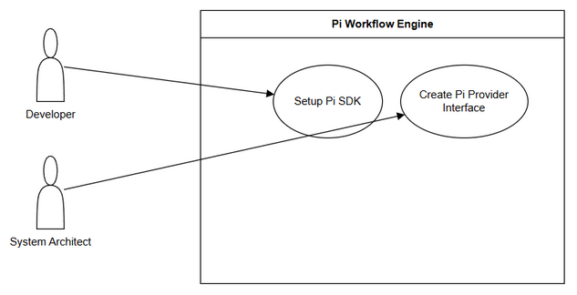

# Business Requirements Document (BRD)

## SA4E-290 — SA4E-289.1 – Setup Pi SDK & Pi Provider

---

## Document Information

| Field | Value |
|-------|-------|
| Jira Ticket | SA4E-290 |
| Title | SA4E-289.1 – Setup Pi SDK & Pi Provider |
| Author | BA Agent |
| Version | 1.0 |
| Date | 2026-09-15 |
| Status | Draft |

---

## Author Tracking

| Role | Name - Position | Responsibility |
|------|-----------------|----------------|
| Author | BA Agent – Business Analyst | Create document |
| Peer Reviewer | TBD | Review document |

---

## Revision History

| Version | Date | Author | Changes |
|---------|------|--------|---------|
| 1.0 | 2026-09-15 | BA Agent | Initiate document — auto-generated from Jira ticket SA4E-290 and Epic SA4E-289 |

---

## Sign-Off

| Name | Signature and date |
|------|--------------------|
| | ☐ I agree and confirm all criteria on this BRD as expected requirements |
| | ☐ I agree and confirm all criteria on this BRD as expected requirements |

---

## 1. Introduction

### 1.1 Scope

Cài đặt `@earendil-works/pi-agent-core` và tạo Pi Provider interface. Đây là bước đầu tiên của Epic SA4E-289 *Migrate LangGraph Workflow Engine to Pi SDK Option C*.

Mục tiêu là cung cấp lớp trừu tượng Pi Provider để thay thế lớp LLM provider hiện tại trong LangGraph engine, tạo nền tảng cho việc di chuyển toàn bộ workflow engine sang Pi SDK primitives trong khi vẫn giữ logic pipeline SDLC, state management và các điểm tích hợp.

Phạm vi bao gồm:
- Thêm Pi SDK vào dependencies dự án
- Định nghĩa Pi Provider interface tương thích với hợp đồng provider LLM hiện có
- Đảm bảo Provider có thể khởi tạo PiAgent với transport WebSocket/HTTP
- Tài liệu hóa kiến trúc Pi Provider cho các bước migration tiếp theo

### 1.2 Out of Scope

- Xây dựng PiAgent Executor, Phase Router, State Adapter, Checkpointer Adapter
- Logic Human Approval, Streaming adapter, Context window detection
- Kiểm thử tích hợp, QA, và LangGraph cleanup
- Thay đổi workflow execution logic, Subgraphs, hoặc state schema

### 1.3 Preliminary Requirement

- Codebase VS Code extension hiện có với LangGraph engine đang hoạt động
- Truy cập npm registry cho `@earendil-works/pi-agent-core`
- Tài liệu Pi SDK và migration plan `documents/pi-migration-plan.md` có sẵn
- Epic SA4E-289 đã được phê duyệt với Option C: Full Replacement

---

## 2. Business Requirements

### 2.1 High Level Process Map

User Input / Migration Initiation
    ↓
Intent Classification & Phase Selection
    ↓
Install Pi SDK
    ↓
Create Pi Provider Interface
    ↓
Validate Provider Initialization
    ↓
Handover to PiAgent Executor development

*[Edit in draw.io](diagrams/business-flow.drawio)*

### 2.2 List of User Stories / Use Cases

| # | Story / Use Case / Epic | Priority | Source Ticket |
|---|-------------------------|----------|---------------|
| 1 | As a developer, I want Pi SDK installed in project dependencies so that Pi SDK primitives can be used in workflow engine | MUST HAVE | SA4E-290 |
| 2 | As a system architect, I want Pi Provider interface created so that LLM provider abstraction is consistent with existing provider contract | MUST HAVE | SA4E-290 |
| 3 | As a technical lead, I want Pi Provider architecture documented so that migration steps can be executed with clarity | SHOULD HAVE | SA4E-289 |

*[Edit in draw.io](diagrams/use-case.drawio)*

---

### 2.3 Details of User Stories

---

#### Business Flow

**Step 1:** Khởi tạo migration plan từ Epic SA4E-289 và đọc `documents/pi-migration-plan.md`

**Step 2:** Cài đặt `@earendil-works/pi-agent-core` vào package.json, chạy install và xác thực không có xung đột dependencies

**Step 3:** Thiết kế và tạo Pi Provider interface theo mapping LangGraph → Pi SDK primitives

**Step 4:** Đảm bảo Provider hỗ trợ transport abstraction WebSocket/HTTP, state management session/turn, agent fundamentals tool use/message handling

**Step 5:** Ghi nhận kiến trúc và bàn giao cho bước 2: PiAgent Executor

> **Note:** Provider phải giữ tương thích ngược với các trường pipeline state hiện tại như ticketKey, threadId, currentPhase, pipelineStatus.

---

#### STORY 1: Setup Pi SDK Installation

> As a developer, I want Pi SDK installed in project dependencies so that Pi SDK primitives can be used in workflow engine

**Requirement Details:**
1. Thêm `@earendil-works/pi-agent-core` vào dependencies của extension backend
2. Phiên bản phải tương thích với tài liệu Pi SDK và migration plan
3. Cài đặt thành công qua npm/yarn không gây xung đột với LangGraph dependencies hiện tại
4. Ghi nhận phiên bản và ngày cài đặt trong tài liệu

**Acceptance Criteria:**
1. Package `@earendil-works/pi-agent-core` xuất hiện trong package.json với version hợp lệ
2. `npm install` / `yarn install` hoàn tất không có lỗi
3. `node_modules/@earendil-works/pi-agent-core` tồn tại sau install
4. Không có breaking change với dependencies hiện tại của extension

**Validation Rules:**
- Version phải được xác nhận từ tài liệu Pi SDK
- Không downgrade các dependencies core hiện tại

**Error Handling:**
- Network failure during install: retry with exponential backoff
- Version conflict: báo cáo và yêu cầu review architecture

---

#### STORY 2: Create Pi Provider Interface

> As a system architect, I want Pi Provider interface created so that LLM provider abstraction is consistent with existing provider contract

**Requirement Details:**
1. Tạo interface `PiProvider` tương thích với hợp đồng LLM provider hiện có
2. Interface phải hỗ trợ khởi tạo `PiAgent` instance với transport WebSocket/HTTP
3. Bao gồm các phương thức cơ bản: `initialize`, `createAgent`, `stream`, `handleToolUse`
4. Mapping các khái niệm LangGraph sang Pi SDK primitives:
   - Compiled graph → `PiAgent` instance + custom executor
   - State snapshot → PiAgent internal state + custom checkpoint
   - Human approval → ToolApprovalGate + Pi tool result handling

**Data Fields (if applicable):**

| Field | Type | Required | Description | Example |
|-------|------|----------|-------------|---------|
| providerName | string | Yes | Tên provider | PiProvider |
| transportType | enum | Yes | WebSocket hoặc HTTP | WebSocket |
| piSessionId | string | No | Internal Pi session ID | pi_sess_123 |
| currentAgentId | string | No | Agent đang thực thi | agent_sdlc |

**Acceptance Criteria:**
1. File interface `pi-provider.ts` được tạo trong `src/pi-workflow/`
2. Interface định nghĩa đầy đủ các phương thức theo Pi SDK capabilities
3. Tài liệu interface mô tả mapping LangGraph → Pi SDK
4. Kiến trúc Pi Provider được mô tả trong diagram use-case

**UI Specifications:** Không áp dụng

**Validation Rules:**
- Tên phương thức phải khớp với contract provider hiện tại
- Transport type phải là WebSocket hoặc HTTP

**Error Handling:**
- Pi SDK initialization failure: log error và fallback to existing provider
- Missing configuration: throw configuration error với message rõ ràng

---

## 3. Dependencies

| Dependency | Type | Related Ticket | Description |
|------------|------|----------------|-------------|
| Pi SDK Package | External | SA4E-289 | `@earendil-works/pi-agent-core` phải có sẵn trên npm |
| Epic Migration Plan | System | SA4E-289 | Option C Full Replacement strategy |
| Existing LangGraph Engine | System | N/A | Cần giữ nguyên đến khi migration hoàn tất |
| RemoteCheckpointer Backend | Infrastructure | SA4E-289 | Giữ nguyên backend checkpoint |

---

## 4. Stakeholders

| Role | Name / Team | Responsibility | Source |
|------|-------------|----------------|--------|
| Reporter / Creator | Duc Nguyen Minh | Define requirement | SA4E-290 |
| Epic Owner | Duc Nguyen Minh | Oversee migration | SA4E-289 |
| Developer | TBD | Implement SDK install & provider | SA4E-290 |
| System Architect | TBD | Review provider interface design | SA4E-289 |

---

## 5. Risks and Assumptions

### 5.1 Risks

| Risk | Impact | Likelihood | Mitigation |
|------|--------|------------|------------|
| Pi SDK API thay đổi sau release | High | Medium | Khóa version trong package.json, theo dõi changelog |
| Không tương thích với provider contract hiện tại | High | Medium | Thiết kế adapter pattern từ đầu |
| Dependency conflict với LangGraph | Medium | Low | Kiểm tra peer dependencies trước install |
| Thiếu tài liệu Pi SDK | Medium | Low | Yêu cầu support từ Pi SDK team |

### 5.2 Assumptions

- Pi SDK `@earendil-works/pi-agent-core` ổn định và có tài liệu đầy đủ
- Transport WebSocket/HTTP được hỗ trợ trong môi trường VS Code extension
- Team chấp nhận Option C Full Replacement strategy

---

## 6. Non-Functional Requirements

| Category | Requirement | Details |
|----------|-------------|---------|
| Performance | Không áp dụng ở bước setup | Đánh giá ở bước executor |
| Security | Không lưu API key trong code | Sử dụng cấu hình môi trường |
| Scalability | Không áp dụng | TBD |
| Availability | SDK phải install được trong môi trường dev | Yêu cầu internet |

> No specific non-functional requirements identified for setup phase. To be confirmed with technical team.

---

## 7. Related Tickets

| Ticket Key | Summary | Status | Type | Relationship |
|------------|---------|--------|------|--------------|
| SA4E-290 | SA4E-289.1 – Setup Pi SDK & Pi Provider | In Progress | Story | Main ticket |
| SA4E-289 | Migrate LangGraph Workflow Engine to Pi SDK (Option C) | To Do | Epic | Parent epic |

---

## 8. Appendix

### Reference Documents

| Document | Link / Location |
|----------|-----------------|
| Pi Migration Plan | documents/pi-migration-plan.md |
| BRD Template | documents/templates/BRD-TEMPLATE.md |
| Epic SA4E-289 | Jira SA4E-289 |

### Glossary

| Term | Definition |
|------|------------|
| Pi SDK | `@earendil-works/pi-agent-core` - SDK cung cấp agent fundamentals, transport abstraction |
| Pi Provider | Abstraction layer kết nối Pi SDK với workflow engine |
| Option C | Full Replacement strategy - rewrite workflow engine using Pi SDK primitives |
| LangGraph | Workflow engine hiện tại sử dụng compiled graph và checkpoint |

---

*Generated by BA Agent from Jira tickets SA4E-290, SA4E-289 and documents/pi-migration-plan.md*
