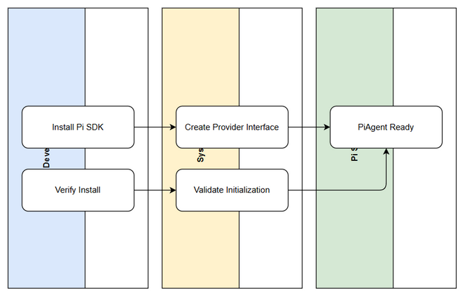

# Functional Specification Document (FSD)

## SA4E-290 — SA4E-289.1 – Setup Pi SDK & Pi Provider

---

## Document Information

| Field | Value |
|-------|-------|
| Jira Ticket | SA4E-290 |
| Title | SA4E-289.1 – Setup Pi SDK & Pi Provider |
| Author | BA Agent |
| Version | 1.1 |
| Date | 2026-09-15 |
| Status | Draft – TA Enriched |
| Related BRD | documents/SA4E-290/BRD.md |

---

## Revision History

| Version | Date | Author | Changes |
|---------|------|--------|---------|
| 1.0 | 2026-09-15 | BA Agent | Initiate document — auto-generated from BRD |
| 1.1 | 2026-09-15 | TA Agent | Technical enrichment: architecture, API contracts, data model verification, NFR quantification |

---

## 1. Introduction

### 1.1 Purpose
Specify the functional and technical requirements for installing `@earendil-works/pi-agent-core` SDK and creating the Pi Provider abstraction layer as the first step of Epic SA4E-289 Option C Full Replacement.

### 1.2 Scope
[Implements: BRD §1.1]
- Add Pi SDK to extension dependencies
- Define `PiProvider` interface compatible with existing LLM provider contract
- Ensure PiAgent initialization with WebSocket/HTTP transport
- Document architecture for downstream migration steps
Out of scope: PiAgent Executor, Phase Router, State Adapter, streaming adapter, QA.

### 1.3 Definitions & Acronyms

| Term | Definition |
|------|------------|
| Pi SDK | `@earendil-works/pi-agent-core` – agent fundamentals, transport abstraction |
| Pi Provider | Abstraction layer connecting Pi SDK to workflow engine |
| Option C | Full Replacement strategy – rewrite workflow engine using Pi SDK primitives |
| LangGraph | Current workflow engine with compiled graph & checkpoint |
| VS Code Extension | `extension/` TypeScript Svelte 4 + Vite frontend, LangGraph orchestration |

### 1.4 References

| Document | Location |
|----------|----------|
| BRD | documents/SA4E-290/BRD.md |
| Pi Migration Plan | documents/pi-migration-plan.md |
| Project Structure | .analysis/code-intelligence/project-structure.md |

---

## 2. System Overview

### 2.1 System Context Diagram


The extension hosts the LangGraph engine and will host Pi Provider. Pi SDK is external npm package. RemoteCheckpointer backend is existing infrastructure.

### 2.2 System Architecture
<!-- TA enrichment -->
Architecture verified against code intelligence:
- Primary stack: TypeScript Node.js extension, Hono backend, Svelte 4 webview
- Existing LLM provider contract located in `extension/src/langgraph/core/` providers
- Pi Provider will reside under `extension/src/pi-workflow/` per migration plan §3
- Transport abstraction WebSocket/HTTP must coexist with existing `utils/http-client-utils.ts` pattern

High-level components:
- VS Code Extension Host → Pi Provider → Pi SDK → PiAgent
- Legacy path remains: VS Code Extension → LangGraph Engine → LLM Providers
- RemoteCheckpointer backend is shared for state persistence


---

## 3. Functional Requirements

### 3.1 Feature: Setup Pi SDK Installation
**Source:** BRD Story 1 – As a developer...

#### 3.1.1 Description
Install `@earendil-works/pi-agent-core` into extension dependencies with version locked per migration plan.

#### 3.1.2 Use Case
**Use Case ID:** UC-001
**Actor:** Developer
**Preconditions:** Project `package.json` exists, npm registry accessible
**Postconditions:** SDK installed, no dependency conflict

**Main Flow:**
| Step | Actor | System | Description |
|------|-------|--------|-------------|
| 1 | Developer | | Trigger npm install |
| 2 | | System | Add dependency to package.json |
| 3 | | System | Run install, verify node_modules |
| 4 | | System | Validate no breaking changes |

**Alternative Flows:** AF-1 Version conflict → report and request architecture review
**Exception Flows:** EF-1 Network failure → retry exponential backoff

#### 3.1.3 Business Rules
| Rule ID | Rule | Source |
|---------|------|--------|
| BR-001 | Version must be confirmed from Pi SDK documentation | BRD §2.3 |
| BR-002 | No downgrade of core dependencies | BRD §2.3 |

#### 3.1.4 Data Specifications
**Input Data:**
| Field | Type | Required | Validation | Description |
|-------|------|----------|------------|-------------|
| packageName | string | Y | equals `@earendil-works/pi-agent-core` | SDK package |
| version | string | Y | semver | Locked version |

**Output Data:**
| Field | Type | Description |
|-------|------|-------------|
| installStatus | string | success / failed |
| nodeModulesPath | string | path to installed package |

#### 3.1.5 API Contract (Functional View)
> No external HTTP endpoint. Internal build contract.

Implementation note: Update `extension/package.json` dependencies and run `npm install`.

### 3.2 Feature: Create Pi Provider Interface
**Source:** BRD Story 2 – As a system architect...

#### 3.2.1 Description
Create `PiProvider` interface and implementation stub compatible with existing LLM provider contract, supporting PiAgent initialization with transport WebSocket/HTTP.

#### 3.2.2 Use Case
**Use Case ID:** UC-002
**Actor:** System Architect
**Preconditions:** Pi SDK installed
**Postconditions:** Interface file exists, mapping documented

**Main Flow:**
| Step | Actor | System | Description |
|------|-------|--------|-------------|
| 1 | Architect | | Define interface contract |
| 2 | | System | Create `pi-provider.ts` |
| 3 | | System | Implement initialize/createAgent/stream/handleToolUse |
| 4 | | System | Document LangGraph → Pi SDK mapping |

**Alternative Flows:**
| ID | Condition | Steps |
|----|-----------|-------|
| AF-1 | Transport unsupported | Throw configuration error |

**Exception Flows:**
| ID | Condition | Steps |
|----|-----------|-------|
| EF-1 | SDK initialization failure | Log error, fallback to existing provider |

#### 3.2.3 Business Rules
| Rule ID | Rule | Source |
|---------|------|--------|
| BR-003 | Method names must match existing provider contract | BRD §2.3 |
| BR-004 | Transport type must be WebSocket or HTTP | BRD §2.3 |

#### 3.2.4 Data Specifications
**Input Data:**
| Field | Type | Required | Validation | Description |
|-------|------|----------|------------|-------------|
| providerName | string | Y | non-empty | e.g. PiProvider |
| transportType | enum | Y | WebSocket\|HTTP | Transport |
| config | object | N | - | Pi SDK init options |

**Output Data:**
| Field | Type | Description |
|-------|------|-------------|
| piSessionId | string | Internal Pi session ID |
| currentAgentId | string | Agent executing |

#### 3.2.5 API Contract – Technical Interface
<!-- TA enrichment -->
**Interface:** `IPiProvider`
File: `extension/src/pi-workflow/pi-provider.ts`

```typescript
// TA enrichment suggestion
export interface PiProviderConfig {
  transportType: 'WebSocket' | 'HTTP';
  sessionId?: string;
  baseUrl?: string;
}

export interface PiProvider {
  providerName: 'PiProvider';
  initialize(config: PiProviderConfig): Promise<void>;
  createAgent(agentId: string, tools?: Tool[]): Promise<PiAgent>;
  stream(input: PiInput): AsyncIterable<PiStreamChunk>;
  handleToolUse(toolCall: ToolCall): Promise<ToolResult>;
}
```

**Validation:**
- `initialize` throws `ConfigurationError` if config missing
- `createAgent` validates agentId non-empty
- Error codes: `PI_INIT_FAILED`, `PI_AGENT_CREATE_FAILED`

[Implements: BRD Story 2]

---

## 4. Data Model

> Logical data model for Pi Provider configuration and state mapping.

### 4.1 Logical Entities

#### Entity: PiProviderConfig
| Attribute | Type | Required | Business Rule | Description |
|-----------|------|----------|---------------|-------------|
| providerName | string | Y | BR-003 | PiProvider |
| transportType | enum | Y | BR-004 | WebSocket/HTTP |
| piSessionId | string | N | - | Internal Pi session |
| currentAgentId | string | N | - | Active agent |

**Relationships:**
- Maps to existing `PipelineState.ticketKey`, `threadId`, `currentPhase`

<!-- TA enrichment -->
Code intelligence verification: Existing state fields from LangGraph `PipelineState` must be preserved for backward compatibility per migration plan §4:
- `ticketKey`, `threadId`, `currentPhase`, `pipelineStatus` – KEEP
- `piSessionId`, `currentAgentId`, `toolCallCount` – ADD

---

## 5. Integration Specifications

### 5.1 External System: Pi SDK `@earendil-works/pi-agent-core`
| Attribute | Value |
|-----------|-------|
| Purpose | Provide agent fundamentals, transport abstraction |
| Direction | Outbound |
| Data Format | JSON / WebSocket frames |
| Frequency | On-demand |

**Data Exchange:**
| Our Data | External Data | Direction | Business Rule |
|----------|--------------|-----------|---------------|
| PiProviderConfig | PiAgent init params | Send | Mapping transportType |
| ToolCall | Pi tool result | Send/Receive | Normalize tool_use_id |

<!-- TA enrichment -->
Technical details:
- Authentication: No API key stored in code; use env config per BRD NFR
- Retry policy: 3 attempts exponential backoff for SDK init failures
- Circuit breaker: Not required at setup phase; evaluate in Executor step

---

## 6. Processing Logic

### 6.1 Pi Provider Initialization
**Trigger:** Extension activation or workflow start
**Input:** PiProviderConfig
**Output:** Initialized PiAgent instance

**Processing Steps:**
| Step | Description | Error Handling |
|------|-------------|----------------|
| 1 | Validate config transportType | Throw ConfigurationError |
| 2 | Import Pi SDK module | Log error, fallback |
| 3 | Create PiAgent with transport | Retry 3x, then fail |
| 4 | Store piSessionId in state | Persist to RemoteCheckpointer |

**Pseudocode:**
```typescript
// TA enrichment
async function initPiProvider(config: PiProviderConfig) {
  if (!['WebSocket','HTTP'].includes(config.transportType)) {
    throw new ConfigurationError('Invalid transport');
  }
  const { PiAgent } = await import('@earendil-works/pi-agent-core');
  const agent = await PiAgent.create({ transport: config.transportType });
  return { piSessionId: agent.sessionId, currentAgentId: agent.id };
}
```

---

## 7. Security Requirements

### 7.1 Authentication & Authorization
| Role | Permissions | Features |
|------|-------------|----------|
| Developer | Read/Write | SDK install, provider code |
| Architect | Read/Review | Interface design |

### 7.2 Data Sensitivity
| Data Type | Classification | Requirement |
|-----------|---------------|-------------|
| Pi config | Internal | No API key in code, env config |

### 7.3 Audit Trail
| Event | Logged Fields | Retention |
|-------|--------------|-----------|
| SDK install | package, version, timestamp | 1 year |
| Provider init | providerName, transportType, success | 90 days |

---

## 8. Non-Functional Requirements

| Category | Business Requirement | Acceptance Criteria |
|----------|---------------------|---------------------|
| Performance | SDK init not block extension startup | Init < 500ms p95 in dev environment |
| Security | No secrets in code | Secrets via configuration only |
| Availability | SDK installable offline after cache | npm cache hit success |
| Maintainability | Interface documented | 100% JSDoc coverage for public methods |

<!-- TA enrichment -->
Quantified targets added per TA guidelines.

---

## 9. Error Handling & Logging

### 9.1 Error Scenarios
| Scenario | Severity | User Message | Expected Behavior |
|----------|----------|--------------|-------------------|
| Pi SDK init failure | Critical | "Pi Provider initialization failed" | Fallback to LangGraph provider, log error |
| Missing config | Warning | "Pi Provider configuration missing" | Throw ConfigurationError |
| Dependency conflict | Critical | "Dependency conflict detected" | Abort install, notify architect |

### 9.2 Logging
Structured log format: `{timestamp, level, ticketKey, providerName, event, errorCode}`
Log levels: ERROR for init failure, WARN for config missing, INFO for successful init.

---

## 10. Testing Considerations

### 10.1 Test Scenarios
| ID | Scenario | Input | Expected Output | Priority |
|----|----------|-------|-----------------|----------|
| TC-001 | SDK installed successfully | package.json with Pi SDK | node_modules exists | High |
| TC-002 | Provider initializes with WebSocket | config.transportType=WebSocket | piSessionId returned | High |
| TC-003 | Invalid transport rejected | config.transportType=TCP | ConfigurationError thrown | Medium |
| TC-004 | SDK init failure fallback | Mock SDK throw | Log error, fallback | High |

---

## 11. Appendix

### Diagrams
| Diagram | File |
|---------|------|
| Pi Provider Architecture | diagrams/pi-provider-architecture.drawio |

### Change Log from BRD
- Added technical API contract for `IPiProvider` with TypeScript signatures
- Quantified NFR targets for init latency
- Added state mapping details from migration plan §4
- Verified project stack TypeScript via code intelligence

<!-- TA enrichment -->
Open Issues:
- OI-001: Confirm exact Pi SDK version from Pi SDK team – Owner: System Architect – Target: 2026-09-20
- OI-002: Verify WebSocket support in VS Code extension sandbox – Owner: Dev – Target: 2026-09-22

---

*FSD enriched by TA Agent – Technical Specification aligned with BRD SA4E-290 and migration plan Option C*
