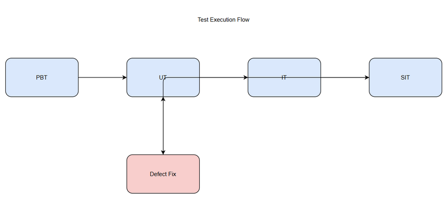

# Software Test Plan (STP)

## SA4E-289 — SA4E-290: SA4E-289.1 – Setup Pi SDK & Pi Provider

---

## Document Information

| Field | Value |
|-------|-------|
| Jira Ticket | SA4E-290 |
| Title | SA4E-289.1 – Setup Pi SDK & Pi Provider |
| Author | QA Agent |
| Version | 1.0 |
| Date | 2026-09-16 |
| Status | Draft |
| Related BRD | documents/SA4E-290/BRD.md |
| Related FSD | documents/SA4E-290/FSD.md |
| Related TDD | N/A |

---

## Author Tracking

| Role | Name - Position | Responsibility |
|------|-----------------|----------------|
| Author | QA Agent – QA Engineer | Create document |
| Peer Reviewer | TBD – QA Lead | Review document |

---

## Revision History

| Version | Date | Author | Changes |
|---------|------|--------|---------|
| 1.0 | 2026-09-16 | QA Agent | Initiate document — auto-generated from BRD, FSD |

---

## Sign-Off

| Name | Signature and date |
|------|--------------------|
| | ☐ I agree and confirm the test plan in this STP |
| | ☐ I agree and confirm the test plan in this STP |

---

## 1. Introduction

### 1.1 Purpose

This Test Plan defines the testing strategy, scope, resources and schedule for validating Story SA4E-290: Setup Pi SDK & Pi Provider. The objective is to verify that `@earendil-works/pi-agent-core` is correctly installed, Pi Provider interface is created with correct contract compatibility, and architecture documentation is complete for Epic SA4E-289 Option C migration.

### 1.2 Test Objectives

- Verify Pi SDK installation succeeds without dependency conflicts per BRD Story 1 AC
- Validate PiProvider interface exists, defines required methods and transport support per FSD 3.2
- Ensure business rules BR-001 to BR-004 are enforced
- Verify error handling for SDK init failure, missing config, dependency conflict
- Confirm non-functional requirements: init latency <500ms p95 in dev, no secrets in code, 100% JSDoc coverage for public methods
- Ensure backward compatibility with existing PipelineState fields ticketKey, threadId, currentPhase, pipelineStatus

### 1.3 References

| Document | Location |
|----------|----------|
| BRD | documents/SA4E-290/BRD.md |
| FSD | documents/SA4E-290/FSD.md |
| Pi Migration Plan | documents/pi-migration-plan.md |

---

## 2. Test Strategy

### 2.1 Test Levels

| Level | Scope | Automation | Tools |
|-------|-------|------------|-------|
| PBT | Correctness properties for config validation (random transport values, version strings) | Automated | fast-check |
| UT | Unit tests for PiProvider config validation, method contracts | Automated | vitest |
| IT | Integration tests for SDK import and Provider initialization in-process | Automated | vitest |
| E2E-API | REST endpoint E2E — not applicable for setup story | Automated | N/A |
| E2E-UI | Browser UI E2E — not applicable for setup story | Automated | N/A |
| SIT | Manual exploratory verification of file existence, package.json, architecture docs | Manual | File system |

### 2.2 Test Types

| Type | Description | Applicable |
|------|-------------|------------|
| Functional Testing | Verify features work per FSD use cases UC-001, UC-002 | Yes |
| Regression Testing | Ensure existing LangGraph provider contract not broken | Yes |
| Performance Testing | Init latency <500ms p95 in dev | Yes |
| Security Testing | No secrets in code, config via env | Yes |
| Compatibility Testing | Dependency compatibility with LangGraph | Yes |

### 2.3 Test Approach

Risk-based prioritization on dependency conflict and interface contract mismatch. Automation focused on unit and integration validation. Manual SIT for file system verification.

### 2.4 Entry Criteria

UT: Code checked in, Pi SDK installed
IT: UT passed
SIT: IT passed

### 2.5 Exit Criteria

UT: 100% pass, coverage ≥80%
IT: All scenarios pass
SIT: 100% executed, 0 Critical defects

---

## 3. Test Scope

### 3.1 Features In Scope

| # | Feature | Priority | FSD Ref | Test Type |
|---|---------|----------|---------|-----------|
| 1 | Setup Pi SDK Installation | High | UC-001, BR-001, BR-002 | Functional/Integration |
| 2 | Create Pi Provider Interface | High | UC-002, BR-003, BR-004 | Functional/Unit |
| 3 | Architecture Documentation | Medium | FSD 4.1 | SIT |

### 3.2 Features Out of Scope

PiAgent Executor, Phase Router, Streaming adapter

### 3.3 Test Cases Summary

| Level | Count | Automated | Manual |
|-------|-------|-----------|--------|
| PBT | 2 | 2 | 0 |
| UT | 6 | 6 | 0 |
| IT | 4 | 4 | 0 |
| E2E-API | 0 | 0 | 0 |
| E2E-UI | 0 | 0 | 0 |
| SIT | 8 | 0 | 8 |
| Total | 20 | 12 | 8 |

---

## 4. Test Environment

Dev environment localhost, extension host.

Test data: pi-provider-testdata.csv

---

## 5. Test Schedule

Test Planning 2026-09-16, UT/IT 2026-09-17-18, SIT 2026-09-19

---

## 6. Resources & Responsibilities

Test Lead: QA Agent
QA Engineer: QA Agent
Developer: TBD
Architect: TBD

---

## 7. Risk & Mitigation

Risks documented per BRD 5.1

---

## 8. Defect Management

Severity and priority as standard.

---

## 9. Test Metrics & Reporting

Execution rate 100%, Pass rate ≥95%

---

## 10. Appendix

Glossary and assumptions
