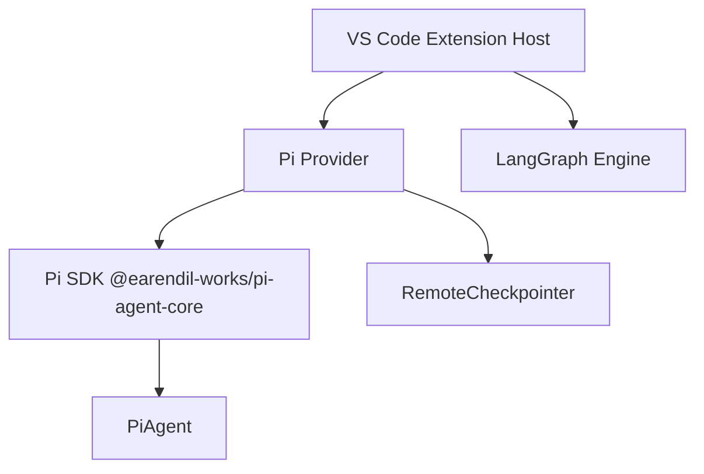
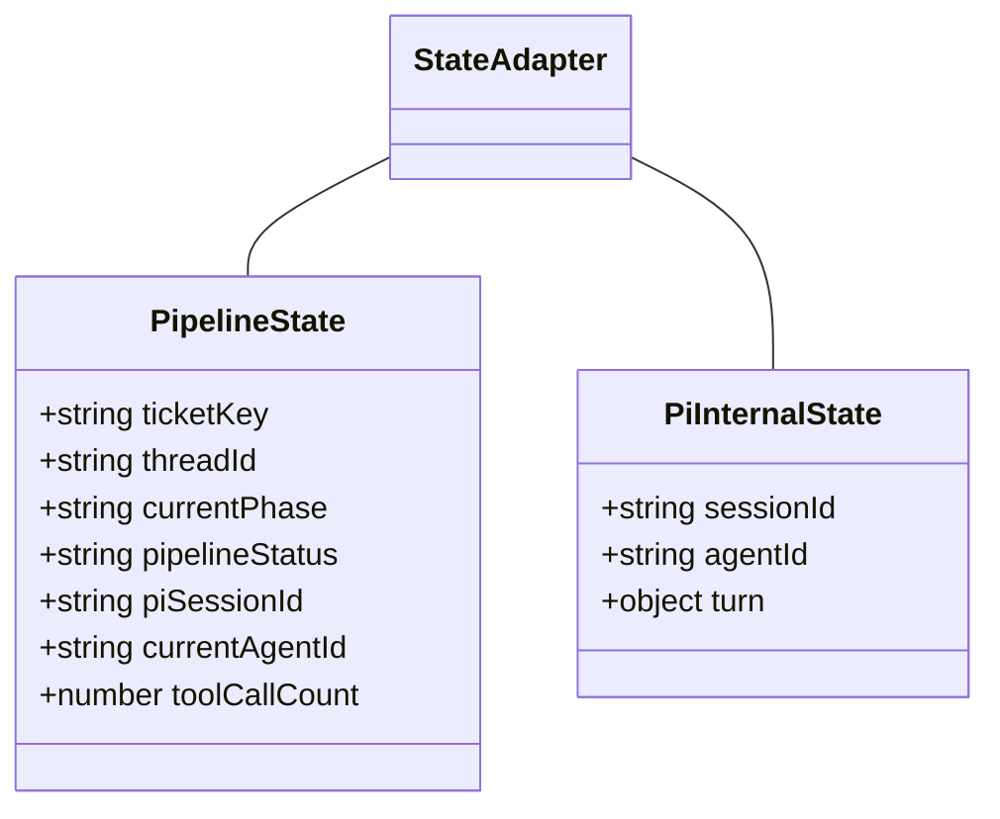
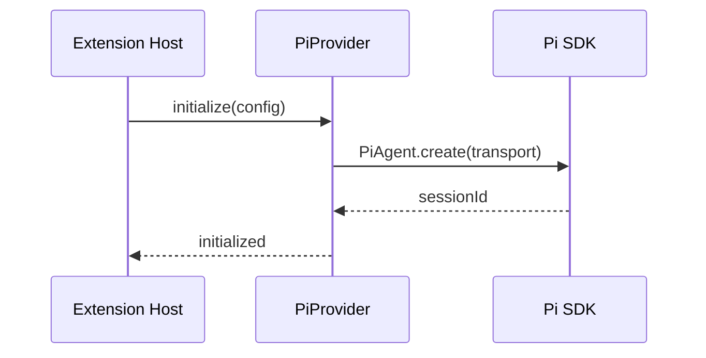

# Technical Design Document (TDD)

## SA4E-290 — SA4E-289.1 – Setup Pi SDK & Pi Provider

---

## Document Information

| Field | Value |
|-------|-------|
| Jira Ticket | SA4E-290 |
| Title | SA4E-289.1 – Setup Pi SDK & Pi Provider |
| Author | SA Agent |
| Version | 1.0 |
| Date | 2026-09-16 |
| Status | Draft |
| Related BRD | documents/SA4E-290/BRD.md |
| Related FSD | documents/SA4E-290/FSD.md |

---

## Author Tracking

| Role | Name - Position | Responsibility |
|------|-----------------|----------------|
| Author | SA Agent – Solution Architect | Create document |
| Peer Reviewer | TBD – System Architect | Review document |

---

## Revision History

| Version | Date | Author | Changes |
|---------|------|--------|---------|
| 1.0 | 2026-09-16 | SA Agent | Initial TDD from BRD/FSD and pi-migration-plan |

---

## Sign-Off

| Name | Signature and date |
|------|--------------------|
| | ☐ I agree and confirm the technical design in this TDD |
| | ☐ I agree and confirm the technical design in this TDD |

---

## 1. Introduction

### 1.1 Purpose
Define technical design for installing `@earendil-works/pi-agent-core` SDK and creating Pi Provider abstraction layer as first step of Epic SA4E-289 Option C Full Replacement. Design ensures Pi Provider interface is compatible with existing LLM provider contract, supports WebSocket/HTTP transport, and preserves PipelineState backward compatibility.

### 1.2 Scope
Technical scope covers:
- Pi SDK dependency installation in `extension/package.json`
- Pi Provider module under `extension/src/pi-workflow/`
- Interface `IPiProvider` with methods initialize/createAgent/stream/handleToolUse
- State mapping PipelineState ↔ Pi SDK internal state
- Dependency and migration plan documentation
Out of scope: PiAgent Executor, Phase Router, State Adapter implementation, QA, LangGraph cleanup.

### 1.3 Technology Stack

| Layer | Technology | Version |
|-------|-----------|---------|
| Language | TypeScript | 5.x |
| Framework | VS Code Extension + Vite + Svelte 4 | 4.x |
| Backend | Hono + Node.js |  |
| Pi SDK | `@earendil-works/pi-agent-core` | locked per migration plan |
| Build Tool | npm |  |
| Package Manager | npm/yarn |  |

### 1.4 Design Principles
- Adapter Pattern for LangGraph → Pi SDK mapping
- Interface Segregation for provider contract
- Open/Closed for future transport support
- Dependency Inversion — workflow depends on IPiProvider abstraction

### 1.5 Constraints
- Must coexist with existing LangGraph engine until full migration
- No API key in code — env config only
- VS Code extension sandbox limits WebSocket usage
- Version locked to avoid SDK API churn

### 1.6 References
| Document | Location |
|----------|----------|
| BRD | documents/SA4E-290/BRD.md |
| FSD | documents/SA4E-290/FSD.md |
| Pi Migration Plan | documents/pi-migration-plan.md |

---

## 2. System Architecture

### 2.1 Architecture Overview
Extension host loads Pi Provider which wraps Pi SDK. Legacy LangGraph path remains active in parallel.




*[Edit in draw.io](diagrams/pi-provider-architecture.drawio)*

### 2.2 Component Diagram

*[Edit in draw.io](diagrams/component.drawio)*

| Component | Responsibility | Technology |
|-----------|---------------|------------|
| PiProvider | Abstraction for Pi SDK init, agent creation, streaming, tool handling | TypeScript |
| PiProviderConfig | Configuration DTO transportType, sessionId, baseUrl | TypeScript |
| PiWorkflow Module | Future engine orchestrator | TypeScript |
| RemoteCheckpointer | State persistence backend | HTTP |
| Existing LLM Providers | Anthropic/OpenAI/Ollama | TypeScript |

### 2.3 Deployment Architecture
Pi SDK installed in extension `node_modules`. No new server deployment.


*[Edit in draw.io](diagrams/deployment.drawio)*

### 2.4 Communication Patterns
| From | To | Protocol | Pattern | Description |
|------|----|----------|---------|-------------|
| Extension | Pi SDK | WebSocket/HTTP | Sync/Async | Agent init and streaming |
| Pi Provider | RemoteCheckpointer | HTTP REST | Async | State persistence |
| VS Code | Pi Provider | In-process | Sync | Provider init |

---

## 3. API Design

> Internal interface design. No external HTTP endpoint at this stage.

### 3.1 API Overview
| # | Interface | Method | Description | Source |
|---|----------|--------|-------------|--------|
| 1 | IPiProvider | initialize | Init PiAgent with transport | UC-002 |
| 2 | IPiProvider | createAgent | Create PiAgent instance | UC-002 |
| 3 | IPiProvider | stream | Stream tokens from PiAgent | UC-002 |
| 4 | IPiProvider | handleToolUse | Handle tool call via Pi SDK | UC-002 |

### 3.2 API: IPiProvider.initialize
**Implements:** UC-002, BR-003

| Attribute | Value |
|-----------|-------|
| Method | initialize(config: PiProviderConfig): Promise<void> |
| Auth | N/A internal |
| Rate Limit | N/A |

**Request Body:**
```typescript
interface PiProviderConfig {
  transportType: 'WebSocket' | 'HTTP';
  sessionId?: string;
  baseUrl?: string;
}
```

**Success Response:** void

**Error Responses:**
| Status | Code | Message |
|--------|------|---------|
| Error | PI_INIT_FAILED | Pi SDK initialization failed |
| Error | ConfigurationError | Invalid transport type |

---

## 4. Database Design
No new database schema. State mapping uses existing RemoteCheckpointer tables.

### 4.1 Schema Overview
Existing PipelineState fields preserved:
- ticketKey, threadId, currentPhase, pipelineStatus

New fields added to state for Pi compatibility:
- piSessionId, currentAgentId, toolCallCount


*[Edit in draw.io](diagrams/db-schema.drawio)*

### 4.2 State Mapping


---

## 5. Class / Module Design

### 5.1 Package Structure
```
extension/src/pi-workflow/
├── pi-provider.ts          # IPiProvider interface + default impl stub
├── pi-provider-config.ts   # PiProviderConfig DTO
├── types/
│   └── pi-workflow-state.ts
└── __tests__/
    └── pi-provider.test.ts
```

### 5.2 Key Interfaces
```typescript
export interface PiProviderConfig {
  transportType: 'WebSocket' | 'HTTP';
  sessionId?: string;
  baseUrl?: string;
}

export interface IPiProvider {
  providerName: 'PiProvider';
  initialize(config: PiProviderConfig): Promise<void>;
  createAgent(agentId: string, tools?: Tool[]): Promise<PiAgent>;
  stream(input: PiInput): AsyncIterable<PiStreamChunk>;
  handleToolUse(toolCall: ToolCall): Promise<ToolResult>;
}
```

### 5.3 Design Patterns
| Pattern | Where Used | Rationale |
|---------|-----------|-----------|
| Adapter | PiProvider ↔ Pi SDK | Map LangGraph provider contract to Pi SDK primitives |
| Strategy | TransportType | WebSocket vs HTTP selection |
| Factory | createAgent | Agent instantiation |

### 5.4 Error Handling
| Exception | Error Code | When Thrown |
|-----------|------------|------------|
| ConfigurationError | PI_CONFIG_INVALID | transportType not WebSocket/HTTP |
| PiInitError | PI_INIT_FAILED | SDK import fails |
| PiAgentCreateError | PI_AGENT_CREATE_FAILED | agentId empty |


*[Edit in draw.io](diagrams/class-diagram.drawio)*

---

## 6. Integration Design

### 6.1 External System: Pi SDK @earendil-works/pi-agent-core
| Attribute | Value |
|-----------|-------|
| Protocol | WebSocket / HTTP |
| Endpoint | Configurable baseUrl |
| Authentication | Env config, no hardcoded key |
| Timeout | 8000ms |
| Retry Policy | 3 attempts exponential backoff |
| Circuit Breaker | Not required at setup phase |

**Sequence Diagram:**



*[Edit in draw.io](diagrams/api-sequence-init.drawio)*

---

## 7. Security Design

### 7.1 Authentication
No external auth at setup phase. Pi SDK config via environment variables.

### 7.2 Data Protection
| Data Type | At Rest | In Transit | In Logs |
|-----------|---------|------------|---------|
| Pi config | Encrypted env | TLS | Masked |

---

## 8. Performance & Scalability

### 8.1 Performance Targets
| Operation | Target | Measurement |
|-----------|--------|-------------|
| SDK init | < 500ms p95 dev | Init latency |
| Agent create | < 300ms | Creation time |

### 8.2 Caching
No caching at setup phase.

---

## 9. Monitoring & Observability

### 9.1 Logging
| Log Event | Level | Fields |
|-----------|-------|--------|
| SDK install | INFO | package, version, timestamp |
| Provider init | INFO | providerName, transportType, success |
| Init failure | ERROR | errorCode, message |

Structured log format: `{timestamp, level, ticketKey, providerName, event, errorCode}`

---

## 10. Deployment Considerations

### 10.1 Environment Configuration
| Property | DEV | SIT | UAT | PROD |
|----------|-----|-----|-----|------|
| PI_TRANSPORT | WebSocket | WebSocket | WebSocket | HTTP |
| PI_BASE_URL | http://localhost | ... | ... | ... |

### 10.2 Feature Flags
| Flag | Default | Description |
|------|---------|-------------|
| piProviderEnabled | false | Toggle Pi Provider usage |

### 10.3 Rollback Strategy
Revert package.json dependency and remove pi-workflow module. LangGraph provider remains default.

---

## 11. E2E Test Architecture

### 11.1 Framework & Language
- Framework: vitest + Playwright
- Language: TypeScript
- Tests live in `extension/src/pi-workflow/__tests__/`

### 11.2 Test Structure
Unit tests for PiProvider interface, config validation.

### 11.3 E2E-API Test Design
Not applicable for setup phase.

---

## 12. Migration Plan Reference

From documents/pi-migration-plan.md Option C:
- Step 1: Cài Pi SDK + tạo Pi Provider — 0.5 ngày
- Step 2: PiAgent Executor — 1 ngày
- Step 3: Phase Router
- Step 4: State Adapter
- Step 5: Approval Adapter
- Step 6: Integration & Cleanup

State fields to keep: ticketKey, threadId, currentPhase, pipelineStatus
State fields to add: piSessionId, currentAgentId, toolCallCount

---

## 13. Appendix

### Open Issues
| # | Question | Status |
|---|----------|--------|
| OI-001 | Confirm exact Pi SDK version | Open |
| OI-002 | Verify WebSocket support in VS Code sandbox | Open |

---
