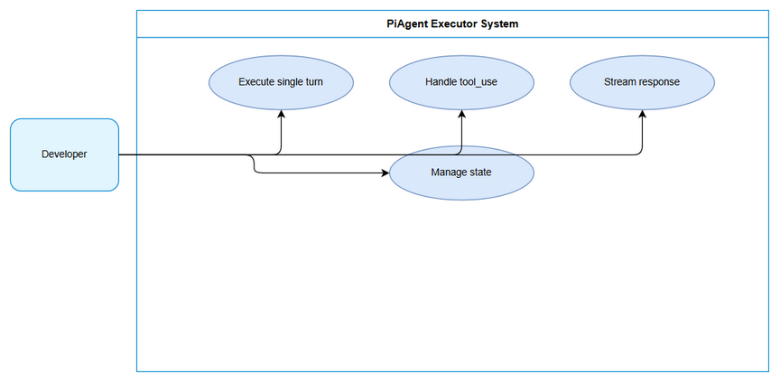
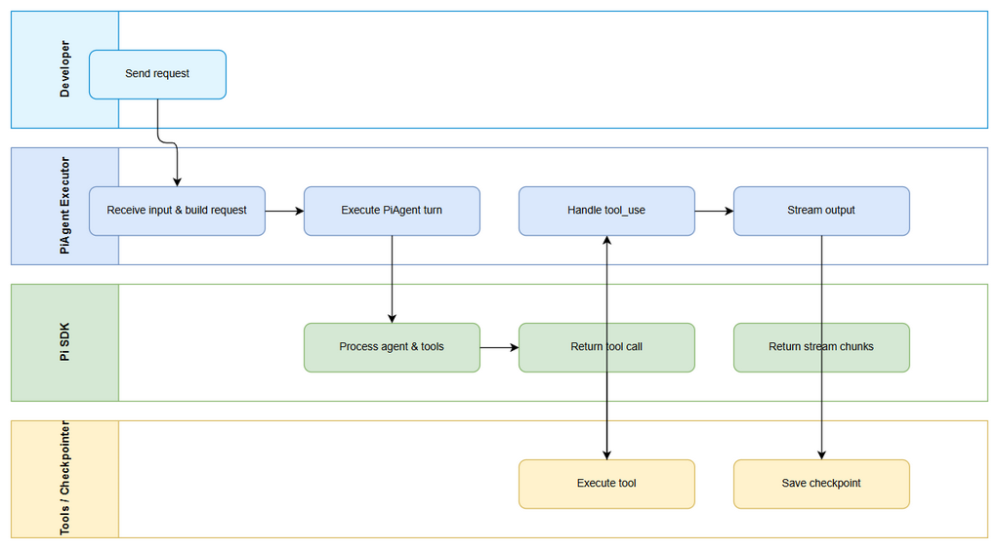

# Business Requirements Document (BRD)

## SDLC Agents 4 Enterprise — SA4E-291: SA4E-289.2 – PiAgent Executor single turn

---

## Document Information

| Field | Value |
|-------|-------|
| Jira Ticket | SA4E-291 |
| Title | SA4E-289.2 – PiAgent Executor single turn |
| Author | BA Agent |
| Version | 1.0 |
| Date | 2026-09-16 |
| Status | Draft |

---

## Author Tracking

| Role | Name - Position | Responsibility |
|------|-----------------|----------------|
| Author | BA Agent – Business Analyst | Create document |
| Peer Reviewer |  | Review document |

---

## Revision History

| Version | Date | Author | Changes |
|---------|------|--------|---------|
| 1.0 | 2026-09-16 | BA Agent | Initiate document — auto-generated from Jira ticket SA4E-291 and linked tickets |

---

## Sign-Off

| Name | Signature and date |
|------|--------------------|
| | ☐ I agree and confirm all criteria on this BRD as expected requirements |
| | ☐ I agree and confirm all criteria on this BRD as expected requirements |

---

## 1. Introduction

### 1.1 Scope

Xây dựng pi-agent-executor.ts để execute 1 turn với PiAgent, xử lý tool_use, streaming. Module này là bước 2 trong Epic SA4E-289 Migrate LangGraph Workflow Engine to Pi SDK Option C.

Phạm vi bao gồm:
- Triển khai PiAgent Executor single turn sử dụng @earendil-works/pi-agent-core
- Nhận input là messages, agent config, pipeline state và thực thi một lượt agent
- Xử lý tool_use: phát hiện, chuẩn hóa tool call ID, chuẩn bị payload cho approval gate
- Hỗ trợ streaming: nhận và chuyển tiếp stream chunks từ PiAgent
- Trả về kết quả gồm messages cập nhật, tool calls, trạng thái execution
- Tích hợp với State Adapter hiện có để ánh xạ PipelineState ↔ Pi internal state

### 1.2 Out of Scope

- Phase Router, State Adapter, Checkpointer Adapter, Approval Adapter
- Full workflow orchestration và phase transition logic
- Testing QA và LangGraph cleanup
- UI/UX changes

### 1.3 Preliminary Requirement

- Pi SDK đã cài đặt và Pi Provider đã tạo: SA4E-290
- Kế hoạch migration documents/pi-migration-plan.md đã phê duyệt
- PipelineState schema hiện tại có sẵn

---

## 2. Business Requirements

### 2.1 High Level Process Map

User Input → Intent Classification → Phase Selection → Agent Assignment → **PiAgent Executor single turn** → Tool Use Loop → Phase Transition Check

PiAgent Executor là thành phần cốt lõi thực thi một lượt agent, thay thế LangGraph `graph.invoke(state)` bằng `workflow.execute(ticket, phase, input)` với vòng lặp tool_use tùy chỉnh.

*[Edit in draw.io](diagrams/use-case.drawio)*

*[Edit in draw.io](diagrams/business-flow.drawio)*

### 2.2 List of User Stories / Use Cases

| # | Story / Use Case / Epic | Priority | Source Ticket |
|---|-------------------------|----------|---------------|
| 1 | As a System Engineer, I want PiAgent Executor to execute a single PiAgent turn with tool_use handling and streaming so that the SDLC workflow engine can process agent steps without LangGraph | MUST HAVE | SA4E-291 |
| 2 | As a Developer, I want executor output to be compatible with existing PipelineState so that state persistence via RemoteCheckpointer remains functional | SHOULD HAVE | SA4E-291 |

### 2.3 Details of User Stories

#### Business Flow

**Step 1:** Developer gửi request chứa ticketKey, messages, agent config

**Step 2:** PiAgent Executor nhận input và build PiAgent request qua Pi Provider

**Step 3:** Executor gọi PiAgent.executeTurn / stream

**Step 4:** Pi SDK xử lý agent và trả về tool call nếu có

**Step 5:** Executor chuẩn hóa tool_use_id và chuẩn bị cho approval gate

**Step 6:** Executor stream output chunks về client

**Step 7:** Kết thúc turn, trả về updated messages và state

> **Note:** Executor không quyết định phase transition, chỉ thực thi một turn.

#### STORY 1: PiAgent Executor single turn

> As a System Engineer, I want PiAgent Executor to execute a single PiAgent turn with tool_use handling and streaming so that the SDLC workflow engine can process agent steps without LangGraph

**Requirement Details:**

1. Xây dựng `src/pi-workflow/pi-agent-executor.ts` theo kiến trúc Option C
2. Executor nhận tham số: `messages`, `agentId`, `sessionId`, `tools`
3. Thực thi một turn bằng PiAgent với hỗ trợ streaming
4. Phát hiện và xử lý tool_use events, chuẩn hóa format tool_use_id
5. Trả về kết quả: `messages`, `toolCalls`, `streamChunks`, `error`

**Data Fields (if applicable):**

| Field | Type | Required | Description | Example |
|-------|------|----------|-------------|---------|
| ticketKey | string | Yes | Jira ticket key | SA4E-291 |
| sessionId | string | Yes | Pi session ID | pi_sess_123 |
| agentId | string | Yes | Agent identifier | ba-agent |
| messages | array | Yes | Chat history | [...] |
| tools | array | No | Available tools | [...] |

**Acceptance Criteria:**

1. Executor có thể thực thi một turn thành công với PiAgent và trả về response message
2. Khi PiAgent yêu cầu tool_use, executor capture tool call và trả về structured tool call object
3. Streaming chunks được phát ra liên tục và có thể consume bằng SSE/NDJSON reader
4. Lỗi từ Pi SDK được catch và trả về error object với code và message
5. Output state có thể ánh xạ về PipelineState qua State Adapter

**UI Specifications (if applicable):**

Không áp dụng cho story này.

**Validation Rules (if applicable):**

- ticketKey phải khớp pattern `[A-Z]+-\d+`
- sessionId không được rỗng
- messages phải là mảng non-empty

**Error Handling (if applicable):**

- Pi SDK timeout: retry 1 lần, sau đó trả về error `PI_TIMEOUT`
- Tool_use format invalid: log warning và bỏ qua tool call
- Streaming disconnect: trả về partial result

---

#### STORY 2: State compatibility

> As a Developer, I want executor output to be compatible with existing PipelineState so that state persistence via RemoteCheckpointer remains functional

**Requirement Details:**

1. Executor output phải chứa các trường bắt buộc: ticketKey, threadId, currentPhase, pipelineStatus, chatHistory
2. Thêm trường Pi SDK compatibility: piSessionId, currentAgentId, toolCallCount

**Acceptance Criteria:**

1. StateAdapter có thể chuyển đổi hai chiều giữa PipelineState và PiInternalState
2. RemoteCheckpointer vẫn lưu được state sau mỗi turn

---

## 3. Dependencies

| Dependency | Type | Related Ticket | Description |
|------------|------|----------------|-------------|
| Pi SDK Installation | System | SA4E-290 | Cài Pi SDK + tạo Pi Provider |
| Migration Plan | Document | SA4E-289 | documents/pi-migration-plan.md |
| Phase Router | System | SA4E-292 | Chưa thực hiện, out of scope |
| State Adapter | System | SA4E-293 | Cần interface hợp tác |

---

## 4. Stakeholders

| Role | Name / Team | Responsibility | Source |
|------|-------------|----------------|--------|
| Reporter/Creator | Duc Nguyen Minh | Requirement owner | SA4E-291 |
| Epic Owner | Duc Nguyen Minh | Epic SA4E-289 | SA4E-289 |

---

## 5. Risks and Assumptions

### 5.1 Risks

| Risk | Impact | Likelihood | Mitigation |
|------|--------|------------|------------|
| Pi SDK API thay đổi | High | Medium | Pin version, viết adapter layer |
| Tool_use format khác LangGraph | High | Medium | Normalize tool_use_id trong executor |
| Streaming format không tương thích | Medium | Medium | Adapt SSE/NDJSON reader |

### 5.2 Assumptions

- Pi SDK @earendil-works/pi-agent-core hỗ trợ tool_use và streaming
- RemoteCheckpointer backend không thay đổi
- PipelineState schema giữ nguyên các trường core

---

## 6. Non-Functional Requirements

| Category | Requirement | Details |
|----------|-------------|---------|
| Performance | Executor turn latency | < 2s cho turn không tool |
| Security | Tool input validation | Validate tool params trước khi execute |
| Scalability | Session tracking | Hỗ trợ nhiều concurrent sessions |
| Availability | Error handling | Graceful degradation khi Pi SDK lỗi |

---

## 7. Related Tickets

| Ticket Key | Summary | Status | Type | Relationship |
|------------|---------|--------|------|--------------|
| SA4E-291 | SA4E-289.2 – PiAgent Executor single turn | To Do | Story | Main ticket |
| SA4E-289 | Migrate LangGraph Workflow Engine to Pi SDK (Option C) | To Do | Epic | Parent Epic |
| SA4E-290 | SA4E-289.1 – Setup Pi SDK & Pi Provider | To Do | Story | Predecessor |
| SA4E-292 | SA4E-289.3 – Phase Router | To Do | Story | Follows |
| SA4E-293 | SA4E-289.4 – State Adapter | To Do | Story | Related |

---

## 8. Appendix

### Glossary

| Term | Definition |
|------|------------|
| PiAgent | Agent instance từ Pi SDK |
| Tool_use | Sự kiện agent yêu cầu gọi tool |
| Single turn | Một lượt thực thi agent, không loop |

### Reference Documents

| Document | Link / Location |
|----------|-----------------|
| Pi Migration Plan | documents/pi-migration-plan.md |
| Epic SA4E-289 | Jira SA4E-289 |

### Diagram Index

| # | Diagram | Image | Source (editable) |
|---|---------|-------|-------------------|
| 1 | Use Case Diagram | [use-case.png](diagrams/use-case.png) | [use-case.drawio](diagrams/use-case.drawio) |
| 2 | Business Flow | [business-flow.png](diagrams/business-flow.png) | [business-flow.drawio](diagrams/business-flow.drawio) |

---
