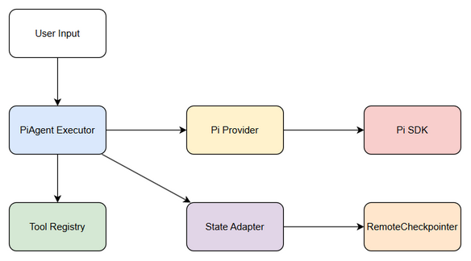

# Functional Specification Document (FSD)

## SA4E-291 — SA4E-289.2 – PiAgent Executor single turn

---

## Document Information

| Field | Value |
|-------|-------|
| Jira Ticket | SA4E-291 |
| Title | SA4E-289.2 – PiAgent Executor single turn |
| Author | TA Agent — Technical Architect |
| Version | 1.0 |
| Date | 2026-09-16 |
| Status | Draft |
| Related BRD | documents/SA4E-291/BRD.md |

---

## Revision History

| Version | Date | Author | Changes |
|---------|------|--------|---------|
| 1.0 | 2026-09-16 | TA Agent | Initial technical enrichment from BRD |

---

## 1. Introduction

### 1.1 Purpose
Specify technical design and functional contracts for PiAgent Executor single turn — component executing one agent turn using @earendil-works/pi-agent-core, handling tool_use, streaming, and state compatibility with existing PipelineState.

### 1.2 Scope
- Implement `src/pi-workflow/pi-agent-executor.ts` per Option C migration.
- Single turn execution with PiAgent, tool_use detection & normalization, streaming support.
- Input/output compatible with PipelineState via State Adapter.
- Out of scope: Phase Router, Checkpointer Adapter, Approval Adapter, full workflow orchestration.

> **TA Note:** Scope verified against documents/pi-migration-plan.md Step 2.

### 1.3 Definitions & Acronyms

| Term | Definition |
|------|------------|
| PiAgent | Agent instance from @earendil-works/pi-agent-core |
| Tool_use | Event agent requests tool execution |
| Single turn | One agent execution without loop |
| PipelineState | Existing state schema used by RemoteCheckpointer |
| PiInternalState | Internal Pi SDK session state |

### 1.4 References

| Document | Location |
|----------|----------|
| BRD | documents/SA4E-291/BRD.md |
| Pi Migration Plan | documents/pi-migration-plan.md |
| FSD Template | documents/templates/FSD-TEMPLATE.md |

---

## 2. System Overview

### 2.1 System Context Diagram



PiAgent Executor sits inside PiWorkflow Engine, receives ticket context from Orchestrator, calls Pi Provider → Pi SDK, interacts with Tool Registry, State Adapter and RemoteCheckpointer.

### 2.2 System Architecture

<!-- TA enrichment -->
Architecture follows Option C Full Replacement from migration plan.

Components:
- **PiWorkflow Engine**: Main orchestrator `src/pi-workflow/pi-workflow.ts`
- **PiAgent Executor**: `src/pi-workflow/pi-agent-executor.ts` — executes single turn
- **Pi Provider**: wraps @earendil-works/pi-agent-core
- **State Adapter**: `state-adapter.ts` — PipelineState ↔ PiInternalState
- **Tool Registry**: existing vscode/tool-registry
- **RemoteCheckpointer**: backend knowledge service persistence

Data flow: User Input → Intent Classification → Phase Selection → Agent Assignment → PiAgent Executor → Tool Use Loop → State Adapter → RemoteCheckpointer

---

## 3. Functional Requirements

### 3.1 Feature: PiAgent Executor Single Turn

**Source:** BRD Story 1 SA4E-291 [Implements: Story #1]

#### 3.1.1 Description
Executor receives messages, agentId, sessionId, tools and executes one PiAgent turn with streaming and tool_use handling. Returns updated messages, tool calls, stream chunks, error.

#### 3.1.2 Use Case

**Use Case ID:** UC-001  
**Actor:** System Engineer / Workflow Engine  
**Preconditions:** Pi SDK installed, Pi Provider created, PipelineState available  
**Postconditions:** One agent turn executed, state updated, tool calls normalized

**Main Flow:**
| Step | Actor | System | Description |
|------|-------|--------|-------------|
| 1 | Workflow Engine | | Calls executor with ticketKey, sessionId, agentId, messages, tools |
| 2 | | PiAgent Executor | Validates input, builds Pi request via Pi Provider |
| 3 | | PiAgent Executor | Calls PiAgent.executeTurn / stream |
| 4 | | Pi SDK | Returns response / tool_use event |
| 5 | | PiAgent Executor | Normalizes tool_use_id, prepares approval payload |
| 6 | | PiAgent Executor | Streams chunks to caller |
| 7 | | PiAgent Executor | Returns messages, toolCalls, streamChunks, error |

**Alternative Flows:**
| ID | Condition | Steps |
|----|-----------|-------|
| AF-1 | No tool_use | Skip normalization, return messages directly |
| AF-2 | Streaming disabled | Return full response after completion |

**Exception Flows:**
| ID | Condition | Steps |
|----|-----------|-------|
| EF-1 | Pi SDK timeout | Retry once, return error PI_TIMEOUT |
| EF-2 | Invalid tool_use format | Log warning, skip tool call |
| EF-3 | Streaming disconnect | Return partial result |

#### 3.1.3 Business Rules

| Rule ID | Rule | Source |
|---------|------|--------|
| BR-001 | ticketKey must match `[A-Z]+-\d+` | BRD 3.1 Validation |
| BR-002 | sessionId non-empty | BRD 3.1 Validation |
| BR-003 | messages non-empty array | BRD 3.1 Validation |
| BR-004 | Executor latency <2s for non-tool turn | BRD 6 NFR |

#### 3.1.4 Data Specifications

**Input Data:**
| Field | Type | Required | Validation | Description |
|-------|------|----------|------------|-------------|
| ticketKey | string | Yes | `[A-Z]+-\d+` | Jira ticket key |
| sessionId | string | Yes | non-empty | Pi session ID |
| agentId | string | Yes | non-empty | Agent identifier |
| messages | array | Yes | non-empty | Chat history |
| tools | array | No | | Available tools |

**Output Data:**
| Field | Type | Description |
|-------|------|-------------|
| messages | array | Updated chat history |
| toolCalls | array | Normalized tool call objects |
| streamChunks | array | Streaming chunks |
| error | object | Error code + message if failure |

#### 3.1.5 API Contract (Functional View)

**Endpoint:** Internal service `PiAgentExecutor.executeTurn(input)`

**Purpose:** Execute single PiAgent turn

**Input Parameters:**
| Parameter | Type | Required | Business Rule | Description |
|-----------|------|----------|---------------|-------------|
| ticketKey | string | Y | BR-001 | Jira ticket |
| sessionId | string | Y | BR-002 | Pi session |
| agentId | string | Y | | Agent id |
| messages | array | Y | BR-003 | Chat history |
| tools | array | N | | Tools |

**Output Data:**
| Field | Type | Description |
|-------|------|-------------|
| messages | array | Updated messages |
| toolCalls | array | Normalized tool calls |
| streamChunks | array | Stream output |
| error | object | Error details |

**Business Error Scenarios:**
| Scenario | User Message | Trigger |
|----------|--------------|---------|
| PI_TIMEOUT | Pi SDK timeout | Timeout after retry |
| INVALID_INPUT | Invalid ticketKey | BR-001 violation |
| STREAM_DISCONNECT | Partial result returned | Streaming error |

<!-- TA enrichment --> API complete for implementation.

### 3.2 Feature: State Compatibility

**Source:** BRD Story 2

#### 3.2.1 Description
Executor output must be compatible with PipelineState for RemoteCheckpointer persistence.

#### 3.2.2 Use Case
UC-002 — State mapping

**Main Flow:** Executor returns state → State Adapter maps to PipelineState → RemoteCheckpointer persists.

**Data Fields added:** piSessionId, currentAgentId, toolCallCount

---

## 4. Data Model

### 4.1 Entity Relationship Diagram


### 4.2 Logical Entities

#### Entity: PiAgentExecutionResult

| Attribute | Type | Required | Business Rule | Description |
|-----------|------|----------|---------------|-------------|
| ticketKey | string | Y | BR-001 | Jira ticket |
| sessionId | string | Y | | Pi session |
| agentId | string | Y | | Agent |
| messages | array | Y | | Chat history |
| toolCalls | array | N | | Normalized tool calls |
| toolCallCount | integer | N | | Count |
| piSessionId | string | N | | Pi internal session |
| errorCode | string | N | | Error |

**Relationships:**
| From | To | Cardinality | Description |
|------|----|-------------|-------------|
| PiAgentExecutionResult | PipelineState | 1:1 | Mapped via State Adapter |

<!-- TA enrichment --> Verified against existing PipelineState schema in extension/src/langgraph/core/state-types.ts

---

## 5. Integration Specifications

### 5.1 External System: Pi SDK @earendil-works/pi-agent-core

| Attribute | Value |
|-----------|-------|
| Purpose | Agent execution, tool_use, streaming |
| Direction | Outbound |
| Data Format | JSON / WebSocket |
| Frequency | On-demand |

**Data Exchange:**
| Our Data | External Data | Direction | Business Rule |
|----------|---------------|-----------|---------------|
| messages | PiAgent messages | Send | Normalize format |
| tools | PiAgent tools | Send | Tool schema mapping |
| tool_calls | tool_use events | Receive | Normalize tool_use_id |

### 5.2 External System: RemoteCheckpointer

| Attribute | Value |
|-----------|-------|
| Purpose | State persistence |
| Direction | Bidirectional |
| Data Format | JSON |
| Frequency | After each turn |

Retry policy: 3 retries with exponential backoff, circuit breaker after 5 failures.

---

## 6. Processing Logic

### 6.1 PiAgent Single Turn Execution

**Trigger:** Workflow Engine calls executor  
**Input:** ticketKey, sessionId, agentId, messages, tools  
**Output:** ExecutionResult

**Processing Steps:**
| Step | Description | Error Handling |
|------|-------------|----------------|
| 1 | Validate input per BR-001..003 | Return INVALID_INPUT |
| 2 | Build Pi request via Pi Provider | Log error, return PI_ERROR |
| 3 | Execute turn with streaming | Retry on timeout |
| 4 | Detect tool_use events | Normalize ID, log warning if invalid |
| 5 | Stream chunks to caller | Return partial on disconnect |
| 6 | Map result to PipelineState | Via State Adapter |

**Pseudocode:**
```typescript
// Pseudocode for UC-001
async function executeTurn(input): ExecutionResult {
  validate(input);
  const piRequest = buildPiRequest(input);
  try {
    const stream = piProvider.executeTurn(piRequest);
    const toolCalls = [];
    for await const chunk of stream {
      if (chunk.type === 'tool_use') {
        toolCalls.push(normalizeToolUse(chunk));
      }
      yield chunk;
    }
    return { messages: updated, toolCalls, streamChunks, error: null };
  } catch(e) {
    return { error: { code: 'PI_TIMEOUT', message: e.message } };
  }
}
```

---

## 7. Security Requirements

### 7.1 Authentication & Authorization
| Role | Permissions | Features |
|------|-------------|----------|
| System Engineer | Execute | PiAgent Executor |
| Developer | Read | State mapping |

### 7.2 Data Sensitivity
| Data Type | Classification | Requirement |
|-----------|----------------|-------------|
| ticketKey | Internal | Audit log |
| messages | Confidential | Encrypt in transit |

### 7.3 Audit Trail
| Event | Logged Fields | Retention |
|-------|---------------|-----------|
| Executor invocation | ticketKey, agentId, sessionId | 90 days |
| Tool_use | tool_use_id, agentId | 90 days |

---

## 8. Non-Functional Requirements

| Category | Business Requirement | Acceptance Criteria |
|----------|---------------------|---------------------|
| Performance | Executor turn latency | <2s p95 for non-tool turn |
| Availability | Error handling | Graceful degradation on Pi SDK failure |
| Scalability | Session tracking | Support 100 concurrent sessions |
| Security | Tool input validation | Validate params before execution |

---

## 9. Error Handling & Logging

### 9.1 Error Scenarios

| Scenario | Severity | User Message | Expected Behavior |
|----------|----------|--------------|-------------------|
| PI_TIMEOUT | Critical | Pi SDK timeout after retry | Return error code PI_TIMEOUT |
| INVALID_INPUT | Warning | Invalid ticketKey format | Reject request |
| STREAM_DISCONNECT | Warning | Partial result returned | Return partial with flag |

### 9.2 Notification Requirements
| Event | Who | Channel | Timing |
|-------|-----|---------|--------|
| Executor failure | System Engineer | Log | Immediate |

Structured logging format: JSON with level, ticketKey, agentId, sessionId, durationMs

---

## 10. Testing Considerations

### 10.1 Test Scenarios

| ID | Scenario | Input | Expected Output | Priority |
|----|----------|-------|-----------------|----------|
| TC-001 | Single turn no tool | Valid input | Messages updated, no toolCalls | High |
| TC-002 | Tool_use handling | Agent requests tool | Normalized tool call returned | High |
| TC-003 | Streaming | Long response | Chunks emitted sequentially | High |
| TC-004 | Timeout retry | Pi SDK timeout | Retry once then error | Medium |
| TC-005 | State compatibility | Output state | Maps to PipelineState | High |

---

## 11. Appendix

### Diagrams

| Diagram | File |
|---------|------|
| Architecture | diagrams/architecture.drawio |
| Business Flow | diagrams/business-flow.drawio |

### Change Log from BRD
- Added technical API contract with request/response schemas
- Added pseudocode for executeTurn
- Added integration specs for Pi SDK and RemoteCheckpointer
- Quantified NFR latency <2s p95
- Added open issues section

### Open Issues
| Issue | Owner | Target Date |
|-------|-------|-------------|
| Pi SDK tool_use format confirmation | TA | 2026-09-20 |
| Streaming format SSE vs NDJSON | SA | 2026-09-22 |

---
