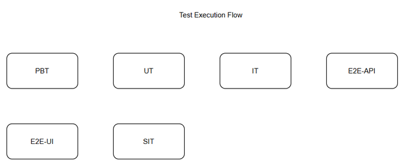
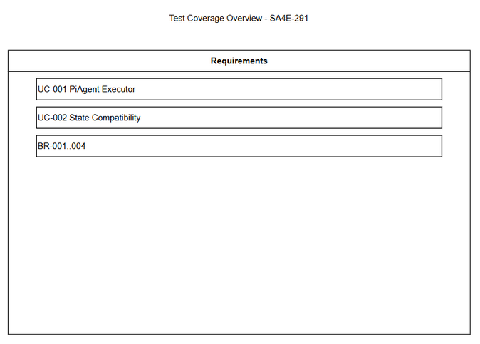

# Software Test Plan (STP)

## SA4E-291 — SA4E-289.2 – PiAgent Executor single turn

---

## Document Information

| Field | Value |
|-------|-------|
| Jira Ticket | SA4E-291 |
| Title | SA4E-289.2 – PiAgent Executor single turn |
| Author | QA Agent |
| Version | 1.0 |
| Date | 2026-09-16 |
| Status | Draft |
| Related BRD | documents/SA4E-291/BRD.md |
| Related FSD | documents/SA4E-291/FSD.md |
| Related TDD | documents/SA4E-291/TDD.md |

---

## Author Tracking

| Role | Name - Position | Responsibility |
|------|-----------------|----------------|
| Author | QA Agent – QA Engineer | Create document |
| Peer Reviewer |  | Review document |

---

## Revision History

| Version | Date | Author | Changes |
|---------|------|--------|---------|
| 1.0 | 2026-09-16 | QA Agent | Initiate document — auto-generated from BRD, FSD, and TDD |

---

## Sign-Off

| Name | Signature and date |
|------|--------------------|
| | ☐ I agree and confirm the test plan in this STP |
| | ☐ I agree and confirm the test plan in this STP |

---

## 1. Introduction

### 1.1 Purpose

This Test Plan defines strategy, scope, schedule, resources and entry/exit criteria for testing PiAgent Executor single turn component per SA4E-291. The executor replaces LangGraph `graph.invoke` with `workflow.execute` using @earendil-works/pi-agent-core, handling single turn execution, tool_use normalization and streaming.

### 1.2 Test Objectives

- Verify executor executes single PiAgent turn with correct messages, toolCalls and streamChunks
- Validate tool_use detection, normalization and approval payload preparation
- Validate input validation per BR-001..003 and error handling PI_TIMEOUT, INVALID_INPUT, STREAM_DISCONNECT
- Ensure output compatibility with PipelineState via State Adapter
- Verify non-functional requirements: latency <2s p95 non-tool turn, graceful degradation
- Ensure streaming chunks are emitted sequentially and can be consumed via SSE/NDJSON

### 1.3 References

| Document | Location |
|----------|----------|
| BRD | documents/SA4E-291/BRD.md |
| FSD | documents/SA4E-291/FSD.md |
| TDD | documents/SA4E-291/TDD.md |

---

## 2. Test Strategy

### 2.1 Test Levels

| Level | Scope | Automation | Tools |
|-------|-------|------------|-------|
| PBT | Correctness properties random inputs | Automated | fast-check |
| UT | Unit/edge case tests | Automated | vitest |
| IT | API integration Hono app in-process | Automated | vitest + Hono `app.request()` |
| E2E-API | REST endpoint E2E real server | Automated | vitest + fetch |
| E2E-UI | Browser UI E2E Playwright | Automated | Playwright |
| SIT | Manual exploratory / edge cases only | Manual | Browser |

### 2.2 Test Types

| Type | Description | Applicable |
|------|-------------|------------|
| Functional Testing | Verify features work per FSD use cases | Yes |
| Regression Testing | Ensure existing features are not broken | Yes |
| Performance Testing | Verify response times and load capacity | Yes |
| Security Testing | Verify tool input validation | Yes |
| Usability Testing | N/A for internal service | No |

### 2.3 Test Approach

Risk-based prioritization focusing on tool_use handling, streaming and state compatibility. Automation prioritized for CRUD-like executor flows. SIT manual only for visual timing and complex UX. E2E-API tests cover executor service via internal API. E2E-UI covers extension UI integration.

### 2.4 Entry Criteria

| Level | Entry Criteria |
|-------|---------------|
| SIT | Code deployed to SIT, unit tests passed, test data prepared, Pi SDK installed |
| UAT | SIT completed with 0 Critical defects, ≤2 Major defects open |

### 2.5 Exit Criteria

| Level | Exit Criteria |
|-------|--------------|
| SIT | 100% test cases executed, 0 Critical defects, ≤2 Major defects open |
| UAT | All UAT scenarios passed, business sign-off obtained |

### 2.6 Test Cases Summary

| Level | Count | Automated | Manual |
|-------|-------|-----------|--------|
| PBT | 4 | 4 | 0 |
| UT | 8 | 8 | 0 |
| IT | 6 | 6 | 0 |
| E2E-API | 5 | 5 | 0 |
| E2E-UI | 4 | 4 | 0 |
| SIT | 6 | 0 | 6 |
| **Total** | **33** | **27 (82%)** | **6 (18%)** |

---

## 3. Test Scope

### 3.1 Features In Scope

| # | Feature / Story | Priority | FSD Reference | Test Type |
|---|----------------|----------|---------------|-----------|
| 1 | PiAgent Executor single turn with tool_use & streaming | High | UC-001, BR-001..004 | Functional/Integration |
| 2 | State compatibility with PipelineState | High | UC-002 | Integration |
| 3 | Input validation and error handling | High | BR-001..003, EF-1..3 | Functional |
| 4 | Performance latency <2s p95 non-tool | Medium | NFR Performance | Non-Functional |

### 3.2 Features Out of Scope

| # | Feature | Reason |
|---|---------|--------|
| 1 | Phase Router | SA4E-292, out of scope |
| 2 | Checkpointer Adapter, Approval Adapter | SA4E-293 etc., out of scope |
| 3 | Full workflow orchestration | Out of scope per BRD |
| 4 | UI/UX changes | No UI for this story |

---

## 4. Test Environment

### 4.1 Environment Requirements

| Environment | URL | Database | Purpose |
|-------------|-----|----------|---------|
| SIT | http://localhost:3000 | SQLite test | System Integration Testing |
| UAT | http://uat.sdlc.local | Postgres | User Acceptance Testing |

### 4.2 Test Data Requirements

| Data Type | Description | Source | Preparation |
|-----------|-------------|--------|-------------|
| Pre-seeded sessions | Pi session IDs, ticket keys | CSV testdata | Import before SIT |
| Executor input messages | Valid/invalid messages, tools | CSV testdata | Generated |
| Mock Pi SDK responses | Tool_use events, stream chunks | Mock server | Stub |

### 4.3 External Dependencies

| System | Dependency | Mock/Stub Available |
|--------|-----------|---------------------|
| Pi SDK @earendil-works/pi-agent-core | Agent execution | Stub for timeout test |
| RemoteCheckpointer | State persistence | Mock HTTP |

---

## 5. Test Schedule

| Phase | Start Date | End Date | Duration | Milestone |
|-------|-----------|----------|----------|-----------|
| Test Planning | 2026-09-16 | 2026-09-16 | 1d | STP + STC approved |
| Test Data Preparation | 2026-09-17 | 2026-09-17 | 1d | Test data ready |
| SIT Execution | 2026-09-18 | 2026-09-20 | 3d | SIT sign-off |
| Defect Fix & Retest | 2026-09-21 | 2026-09-22 | 2d | All Critical/Major fixed |
| UAT Execution | 2026-09-23 | 2026-09-24 | 2d | UAT sign-off |

---

## 6. Resources & Responsibilities

| Role | Name | Responsibility |
|------|------|---------------|
| Test Lead | QA Agent | Test planning, coordination |
| QA Engineer | QA Agent | Test case design, execution |
| BA | Duc Nguyen Minh | UAT support |
| Developer | DEV | Bug fixing |
| DevOps | DevOps | Environment setup |

---

## 7. Risk & Mitigation

| # | Risk | Impact | Likelihood | Mitigation |
|---|------|--------|------------|------------|
| 1 | Pi SDK API changes | High | Medium | Pin version, adapter layer |
| 2 | Tool_use format mismatch | High | Medium | Normalize tool_use_id, add tests |
| 3 | Streaming format incompatibility | Medium | Medium | Support SSE/NDJSON reader tests |
| 4 | Test data not available | Medium | Low | Prepare mock data in advance |

---

## 8. Defect Management

### 8.1 Severity Levels

| Severity | Definition | Example |
|----------|-----------|---------|
| Critical | System crash, data loss | PI_TIMEOUT not handled |
| Major | Feature not working | Tool call not normalized |
| Minor | Logging issue | Missing audit field |
| Trivial | Typo | Doc typo |

### 8.2 Priority Levels

| Priority | Definition | SLA |
|----------|-----------|-----|
| P1 | Must fix immediately | 4h |
| P2 | Must fix before release | 1d |
| P3 | Should fix | 3d |
| P4 | Nice to fix | Next release |

### 8.3 Defect Lifecycle

New → Open → In Progress → Fixed → Ready for Retest → Verified → Closed

---

## 9. Test Metrics & Reporting

### 9.1 Metrics

| Metric | Formula | Target |
|--------|---------|--------|
| Test Execution Rate | Executed/Total | 100% |
| Pass Rate | Passed/Executed | ≥95% |
| Defect Density | Defects/Test Cases | ≤0.1 |
| Critical Defect Count | Count | 0 |

### 9.2 Reporting Schedule

Daily test status during SIT, defect summary daily.

---

## 10. Appendix

### Test Coverage Overview

