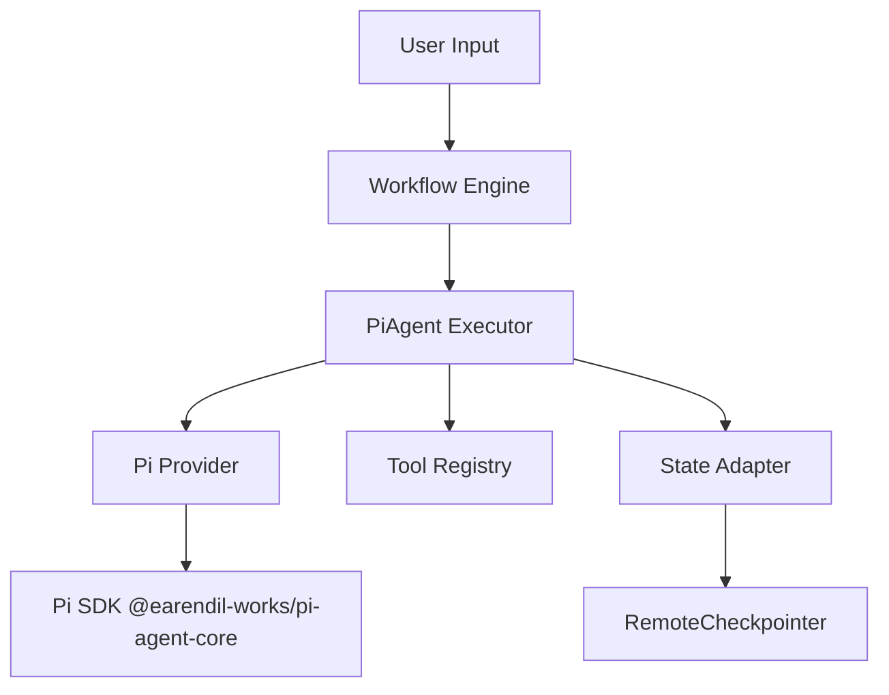
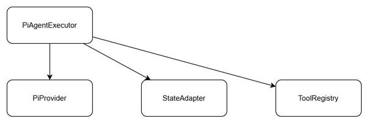
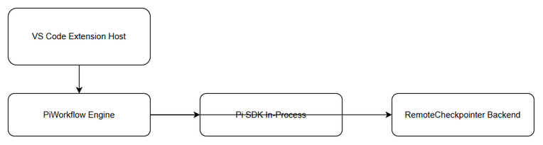
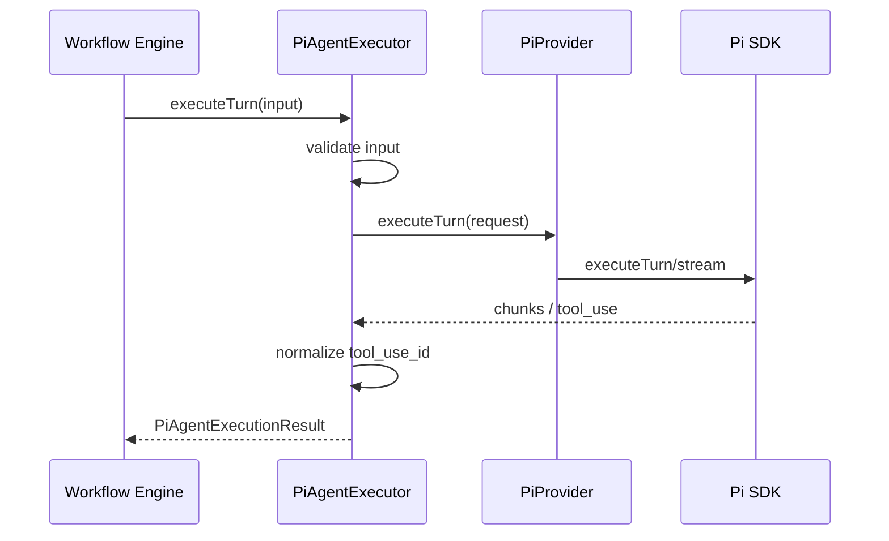
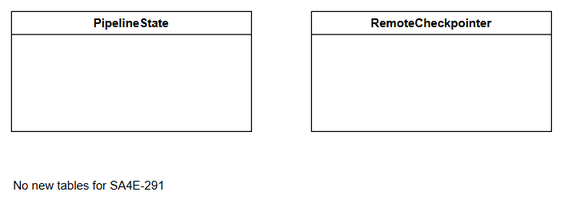
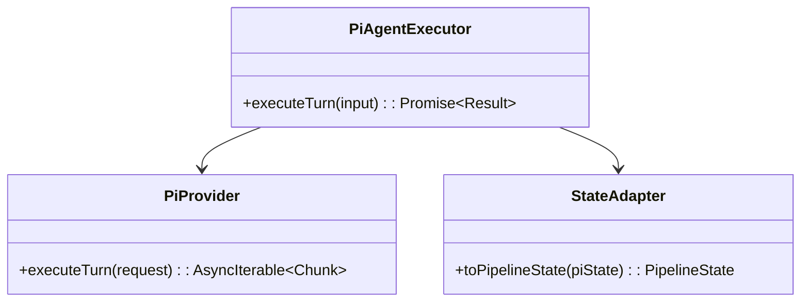
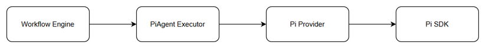

# Technical Design Document (TDD)

## SA4E-291 — PiAgent Executor single turn

---

## Document Information

| Field | Value |
|-------|-------|
| Jira Ticket | SA4E-291 |
| Title | SA4E-289.2 – PiAgent Executor single turn |
| Author | SA Agent |
| Version | 1.0 |
| Date | 2026-09-16 |
| Status | Draft |
| Related BRD | documents/SA4E-291/BRD.md |
| Related FSD | documents/SA4E-291/FSD.md |

---

## Author Tracking

| Role | Name - Position | Responsibility |
|------|-----------------|----------------|
| Author | SA Agent – Solution Architect | Create document |
| Peer Reviewer |  | Review document |

---

## Revision History

| Version | Date | Author | Changes |
|---------|------|--------|---------|
| 1.0 | 2026-09-16 | SA Agent | Initiate document — auto-generated from BRD and FSD |

---

## 1. Introduction

### 1.1 Purpose
Thiết kế kỹ thuật cho PiAgent Executor single turn, component thực thi một lượt agent bằng @earendil-works/pi-agent-core, xử lý tool_use, streaming và tương thích PipelineState. Thiết kế này định nghĩa kiến trúc module, API nội bộ, luồng tích hợp Pi SDK và RemoteCheckpointer, đảm bảo tuân thủ BRD/FSD.

### 1.2 Scope
- Triển khai `src/pi-workflow/pi-agent-executor.ts`
- Execute single turn với streaming và tool_use normalization
- Tích hợp Pi Provider, State Adapter, Tool Registry
- Out of scope: Phase Router, Checkpointer Adapter, Approval Adapter, full workflow orchestration

### 1.3 Technology Stack

| Layer | Technology | Version |
|-------|-----------|---------|
| Language | TypeScript | 5.x |
| Framework | Node.js / VS Code Extension | - |
| Pi SDK | @earendil-works/pi-agent-core | latest |
| State Persistence | RemoteCheckpointer | existing |
| Logging | Pino | - |

### 1.4 Design Principles
- Single Responsibility: Executor chỉ thực thi một turn
- Adapter Pattern: ánh xạ PipelineState ↔ PiInternalState
- Fail-fast validation
- Streaming backpressure handling

### 1.5 Constraints
- Pi SDK API có thể thay đổi → cần adapter layer
- Tool_use format khác LangGraph → normalize tool_use_id
- Latency <2s p95 cho turn không tool

### 1.6 References
| Document | Location |
|----------|----------|
| BRD | documents/SA4E-291/BRD.md |
| FSD | documents/SA4E-291/FSD.md |

---

## 2. System Architecture

### 2.1 Architecture Overview
PiAgent Executor nằm trong PiWorkflow Engine, nhận request từ Orchestrator, gọi Pi Provider → Pi SDK, tương tác Tool Registry, State Adapter và RemoteCheckpointer.


*[Edit in draw.io](diagrams/architecture.drawio)*



### 2.2 Component Diagram

*[Edit in draw.io](diagrams/component.drawio)*

| Component | Responsibility | Technology |
|-----------|---------------|------------|
| PiAgentExecutor | Execute single turn, streaming, tool_use normalization | TypeScript |
| PiProvider | Wrap Pi SDK calls | @earendil-works/pi-agent-core |
| StateAdapter | Map PipelineState ↔ PiInternalState | TypeScript |
| ToolRegistry | Provide tool schemas | existing |

### 2.3 Deployment Architecture

*[Edit in draw.io](diagrams/deployment.drawio)*

Extension chạy trong VS Code host, Pi SDK chạy in-process, RemoteCheckpointer là backend service.

### 2.4 Communication Patterns
| From | To | Protocol | Pattern | Description |
|------|----|----------|---------|-------------|
| Workflow Engine | PiAgentExecutor | In-process call | Sync | Execute turn request |
| PiAgentExecutor | PiProvider | In-process | Sync/Stream | Execute turn / stream chunks |
| PiAgentExecutor | StateAdapter | In-process | Sync | Map state |
| StateAdapter | RemoteCheckpointer | HTTP/JSON | Async | Persist state |

---

## 3. API Design

> API nội bộ, không expose HTTP. Contract định nghĩa trong FSD §3.1.5.

### 3.1 API Overview
| # | Service | Method | Description | Source |
|---|---------|--------|-------------|--------|
| 1 | PiAgentExecutor | executeTurn(input) | Execute single PiAgent turn | UC-001 |

### 3.2 API: PiAgentExecutor.executeTurn
**Implements:** UC-001, BR-001..004

| Attribute | Value |
|-----------|-------|
| Method | executeTurn |
| Auth | Internal |
| Rate Limit | N/A |

**Request:**
```typescript
interface ExecuteTurnInput {
  ticketKey: string; // BR-001
  sessionId: string; // BR-002
  agentId: string;
  messages: Array<{role:string, content:string}>;
  tools?: Tool[];
}
```

**Response:**
```typescript
interface PiAgentExecutionResult {
  ticketKey: string;
  sessionId: string;
  agentId: string;
  messages: Array<...>;
  toolCalls: NormalizedToolCall[];
  streamChunks: StreamChunk[];
  error?: { code: string; message: string };
  piSessionId?: string;
  toolCallCount?: number;
}
```

**Error Mapping:**
| Code | Status | Description |
|------|--------|-------------|
| PI_TIMEOUT | - | Timeout after retry |
| INVALID_INPUT | - | BR-001/002/003 violation |
| STREAM_DISCONNECT | - | Partial result |



---

## 4. Database Design

Không tạo bảng mới. State persistence sử dụng RemoteCheckpointer backend hiện có. PipelineState schema đã tồn tại.

**Note:** Database analysis skipped — no new persistent tables introduced.


*[Edit in draw.io](diagrams/db-schema.drawio)*

---

## 5. Class / Module Design

### 5.1 Package Structure
```
src/pi-workflow/
├── pi-agent-executor.ts
├── pi-provider.ts
├── types/
│   ├── executor.types.ts
│   └── pi.types.ts
└── utils/
    └── tool-normalizer.ts
```

### 5.2 Key Interfaces
```typescript
export interface PiAgentExecutor {
  executeTurn(input: ExecuteTurnInput): Promise<PiAgentExecutionResult>;
}
```

### 5.3 Design Patterns
| Pattern | Where Used | Rationale |
|---------|-----------|-----------|
| Adapter | StateAdapter | Map PipelineState |
| Strategy | Tool normalization | Format differences |

### 5.4 Error Handling
| Exception | Code | When Thrown |
|-----------|------|-------------|
| InvalidInputError | INVALID_INPUT | Validation fail |
| PiTimeoutError | PI_TIMEOUT | SDK timeout |



---

## 6. Integration Design

### 6.1 External System: Pi SDK
| Attribute | Value |
|-----------|-------|
| Protocol | In-process JS |
| Timeout | 5s |
| Retry Policy | 1 retry |


*[Edit in draw.io](diagrams/api-sequence-execute.drawio)*

---

## 7. Security Design

### 7.1 Authentication
Internal service.

### 7.2 Input Validation
- ticketKey regex `[A-Z]+-\d+`
- sessionId non-empty
- messages non-empty

---

## 8. Performance & Scalability

### 8.1 Performance Targets
| Operation | Target |
|-----------|--------|
| executeTurn non-tool | <2s p95 |

---

## 9. Monitoring & Observability

### 9.1 Logging
Structured JSON with ticketKey, agentId, sessionId, durationMs.

---

## 10. Deployment Considerations

### 10.1 Rollback Strategy
Revert commit và fallback về LangGraph executor.

---

## 11. E2E Test Architecture

### 11.1 Framework & Language
- Framework: vitest + Playwright
- Language: TypeScript

### 11.2 Test Design
- File: `pi-agent-executor.e2e.test.ts`
- Cases: single turn, tool_use, streaming, timeout, state compatibility

---

## Appendix

### Open Issues
| # | Question | Status |
|---|----------|--------|
| 1 | Pi SDK tool_use format confirmation | Open |
| 2 | Streaming format SSE vs NDJSON | Open |
