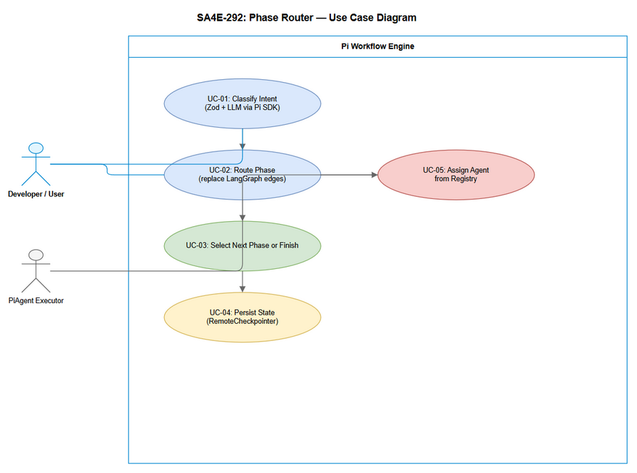
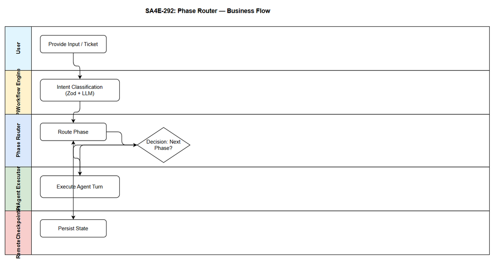

# Business Requirements Document (BRD)

## SDLC Agents 4 Enterprise — SA4E-292: SA4E-289.3 – Phase Router

---

## Document Information

| Field | Value |
|-------|-------|
| Jira Ticket | SA4E-292 |
| Title | SA4E-289.3 – Phase Router |
| Author | BA Agent |
| Version | 1.0 |
| Date | 2026-09-16 |
| Status | Draft |

---

## Author Tracking

| Role | Name - Position | Responsibility |
|------|-----------------|----------------|
| Author | BA Agent – Business Analyst | Create document |
| Peer Reviewer | TBD – Reviewer | Review document |

---

## Revision History

| Version | Date | Author | Changes |
|---------|------|--------|---------|
| 1.0 | 2026-09-16 | BA Agent | Initiate document — auto-generated from Jira ticket SA4E-292 and Epic SA4E-289 |

---

## Sign-Off

| Name | Signature and date |
|------|--------------------|
| | ☐ I agree and confirm all criteria on this BRD as expected requirements |
| | ☐ I agree and confirm all criteria on this BRD as expected requirements |

---

## 1. Introduction

### 1.1 Scope

Implement `phase-router.ts` to provide phase transition logic replacing LangGraph edges in the SDLC Agents 4 Enterprise VS Code extension. The component will perform intent classification using Zod schema validation + LLM via Pi SDK, enable automatic phase selection and routing, and integrate with the PiWorkflow Engine under Epic SA4E-289 – Migrate LangGraph Workflow Engine to Pi SDK Option C.

The scope includes:
- Phase transition decision logic based on current pipeline state and LLM-classified intent
- Intent classification with Zod-validated schemas and Pi SDK LLM provider
- Integration with `PiAgent Executor`, `State Adapter`, and `RemoteCheckpointer` backend
- Preservation of existing pipeline state fields for backward compatibility

Source: SA4E-292 description, SA4E-289 Epic description, documents/pi-migration-plan.md

### 1.2 Out of Scope

- Full LangGraph engine removal – handled in later epic steps
- Pi SDK installation and Pi Provider creation – covered in Bước 1 of migration plan
- UI changes for end users – no UI specifications identified in tickets
- Human approval gate redesign – adaptation only via `approval-adapter.ts`

To be confirmed with stakeholders for any additional exclusions.

### 1.3 Preliminary Requirement

- Pi SDK `@earendil-works/pi-agent-core` installed and Pi Provider created
- PiAgent Executor for single turn execution implemented
- Existing `PipelineState` schema and `RemoteCheckpointer` backend available
- Migration plan Option C architecture approved

---

## 2. Business Requirements

### 2.1 High Level Process Map

User / Ticket Input → Intent Classification (Zod + LLM via Pi SDK) → Phase Selection → Agent Assignment → Tool Use Loop → Phase Transition Check → Next Phase or Finish → Persistence (RemoteCheckpointer).

The Phase Router replaces LangGraph edge routing with custom executor routing logic, using Pi SDK primitives for agent execution and state management.

*[Edit in draw.io](diagrams/use-case.drawio)*

*[Edit in draw.io](diagrams/business-flow.drawio)*

### 2.2 List of User Stories / Use Cases

| # | Story / Use Case / Epic | Priority | Source Ticket |
|---|-------------------------|----------|---------------|
| 1 | As a SDLC workflow engine, I want to route phase transitions automatically based on intent classification so that the pipeline progresses without LangGraph edges | MUST HAVE | SA4E-292 |
| 2 | As a system, I want to classify user/system intent using Zod + LLM via Pi SDK so that phase selection is accurate and validated | MUST HAVE | SA4E-292 |
| 3 | As a developer, I want phase router to integrate with PiAgent Executor and State Adapter so that state is preserved across phases | SHOULD HAVE | SA4E-289 |

---

### 2.3 Details of User Stories

#### Business Flow

**Step 1:** Receive ticket / phase request from workflow engine
**Step 2:** Load current `PipelineState` including `currentPhase`, `ticketKey`, `pipelineStatus`
**Step 3:** Classify intent using Zod schema validation + LLM via Pi SDK
**Step 4:** Select next phase based on classification and business rules
**Step 5:** Assign agent from registry for selected phase
**Step 6:** Execute agent turn via PiAgent Executor, handle tool use loop
**Step 7:** Check phase completion criteria
**Step 8:** Persist updated state to RemoteCheckpointer
**Step 9:** Return control to workflow orchestrator for next iteration or finish

> **Note:** Phase transitions must be deterministic and traceable to intent classification results. Errors in classification must trigger fallback to manual review.

---

#### STORY 1: Automatic Phase Routing

> As a SDLC workflow engine, I want to route phase transitions automatically based on intent classification so that the pipeline progresses without LangGraph edges

**Requirement Details:**

1. Implement `phase-router.ts` with logic equivalent to LangGraph edges for phase transitions
2. Router must accept current `PipelineState` and intent classification output
3. Router must determine next phase ID or finish condition
4. Router must be compatible with PiWorkflow Engine architecture described in `documents/pi-migration-plan.md`
5. Integration points: `pi-agent-executor.ts`, `state-adapter.ts`, `checkpointer-adapter.ts`

**Data Fields (if applicable):**

| Field | Type | Required | Description | Example |
|-------|------|----------|-------------|---------|
| ticketKey | string | Yes | Jira ticket identifier | SA4E-292 |
| currentPhase | string | Yes | Current SDLC phase | requirements |
| intent | object | Yes | Classified intent with Zod schema | {action: "transition", target: "specification"} |
| nextPhase | string | No | Determined next phase | specification |
| piSessionId | string | No | Pi SDK session identifier | pi_sess_123 |
| errors | array | No | Error messages during routing | [] |

**Acceptance Criteria:**

No explicit acceptance criteria were found in Jira ticket SA4E-292. To be confirmed with stakeholders.

**UI Specifications (if applicable):**

No UI specifications identified from tickets.

**Validation Rules (if applicable):**

- Intent object must pass Zod schema validation before routing
- `currentPhase` must be a valid phase from pipeline definition
- `nextPhase` must be a valid successor per business rules

**Error Handling (if applicable):**

- Invalid intent schema: log error, return current phase unchanged
- Unknown phase: log error, trigger manual review flag
- LLM classification timeout: fallback to rule-based default transition

---

#### STORY 2: Intent Classification with Zod + LLM

> As a system, I want to classify user/system intent using Zod + LLM via Pi SDK so that phase selection is accurate and validated

**Requirement Details:**

1. Use Pi SDK LLM provider to classify intent from user input / state changes
2. Validate classification output with Zod schemas
3. Provide structured intent output for Phase Router consumption
4. Support extensible intent types for future phases

**Data Fields:**

| Field | Type | Required | Description | Example |
|-------|------|----------|-------------|---------|
| inputText | string | Yes | Text to classify | "Move to specification phase" |
| intentSchema | object | Yes | Zod schema definition | IntentSchema |
| classifiedIntent | object | Yes | Validated intent | {type: "phase_change", target: "specification"} |

**Acceptance Criteria:**

No explicit acceptance criteria found in tickets.

**Validation Rules:**

- Classification output must conform to Zod schema
- LLM response must be parsed safely with error handling

**Error Handling:**

- Schema validation failure: retry classification with stricter prompt
- LLM error: return error intent and halt routing

---

## 3. Dependencies

| Dependency | Type | Related Ticket | Description |
|------------|------|----------------|-------------|
| Pi SDK Installation & Pi Provider | System | SA4E-289 | Prerequisite Bước 1 of migration plan |
| PiAgent Executor | System | SA4E-289 | Must be implemented before router integration |
| State Adapter | System | SA4E-289 | PipelineState <-> Pi SDK state mapping |
| RemoteCheckpointer backend | Infrastructure | SA4E-289 | Persistence unchanged from LangGraph |

---

## 4. Stakeholders

| Role | Name / Team | Responsibility | Source |
|------|-------------|----------------|--------|
| Reporter/Creator | Duc Nguyen Minh | Ticket owner | SA4E-292 |
| Epic Owner | Duc Nguyen Minh | Migration oversight | SA4E-289 |

---

## 5. Risks and Assumptions

### 5.1 Risks

| Risk | Impact | Likelihood | Mitigation |
|------|--------|------------|------------|
| LangGraph edge behavior differences | High | Medium | Maintain mapping table and regression tests |
| LLM intent classification inaccuracy | Medium | Medium | Zod validation + fallback rules |
| State serialization incompatibility | High | Low | Use State Adapter with unit tests |

### 5.2 Assumptions

- Pi SDK provides equivalent LLM tool use capabilities as LangGraph
- Existing `RemoteCheckpointer` backend remains compatible
- Phase definitions remain unchanged during migration

---

## 6. Non-Functional Requirements

| Category | Requirement | Details |
|----------|-------------|---------|
| Performance | Phase routing decision latency | To be confirmed with technical team |
| Security | LLM prompt handling | No specific requirements identified |
| Scalability | Support concurrent workflow executions | To be confirmed |
| Availability | Phase router must not block pipeline | To be confirmed |

> No specific non-functional requirements identified. To be confirmed with technical team.

---

## 7. Related Tickets

| Ticket Key | Summary | Status | Type | Relationship |
|------------|---------|--------|------|--------------|
| SA4E-292 | SA4E-289.3 – Phase Router | To Do | Story | Main ticket |
| SA4E-289 | Migrate LangGraph Workflow Engine to Pi SDK (Option C) | To Do | Epic | Parent Epic |

---

## 8. Appendix

### Reference Documents

| Document | Link / Location |
|----------|-----------------|
| Pi Migration Plan | documents/pi-migration-plan.md |
| Epic SA4E-289 | Jira SA4E-289 |

### Glossary

| Term | Definition |
|------|------------|
| Phase Router | Component replacing LangGraph edges for phase transitions |
| Pi SDK | @earendil-works/pi-agent-core |
| PipelineState | Existing SDLC pipeline state object |
| RemoteCheckpointer | Persistence backend for workflow state |
