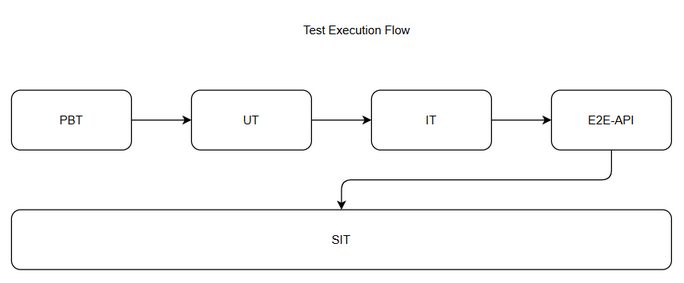
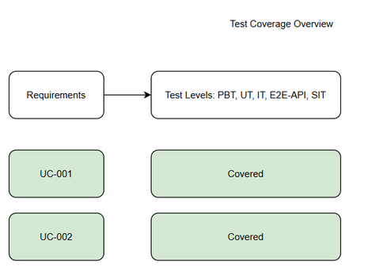

# Software Test Plan (STP)

## SDLC Agents 4 Enterprise — SA4E-292: SA4E-289.3 – Phase Router

---

## Document Information

| Field | Value |
|-------|-------|
| Jira Ticket | SA4E-292 |
| Title | SA4E-289.3 – Phase Router |
| Author | QA Agent |
| Version | 1.0 |
| Date | 2026-09-16 |
| Status | Draft |
| Related BRD | BRD.md |
| Related FSD | FSD.md |
| Related TDD | N/A |

---

## Author Tracking

| Role | Name - Position | Responsibility |
|------|-----------------|----------------|
| Author | QA Agent – QA Engineer | Create document |
| Peer Reviewer | TBD – Reviewer | Review document |

---

## Revision History

| Version | Date | Author | Changes |
|---------|------|--------|---------|
| 1.0 | 2026-09-16 | QA Agent | Initiate document — auto-generated from BRD and FSD |

---

## Sign-Off

| Name | Signature and date |
|------|--------------------|
| | ☐ I agree and confirm the test plan in this STP |
| | ☐ I agree and confirm the test plan in this STP |

---

## 1. Introduction

### 1.1 Purpose

This Test Plan defines the testing strategy, scope, resources and schedule for SA4E-292 Phase Router.

### 1.2 Test Objectives

- Verify functional requirements from FSD UC-001, UC-002
- Validate business rules BR-001 to BR-004
- Ensure phase routing deterministic and traceable
- Verify intent classification with Zod + LLM
- Validate error handling
- Ensure integration with PiAgent Executor, State Adapter, RemoteCheckpointer

### 1.3 References

| Document | Location |
|----------|----------|
| BRD | documents/SA4E-292/BRD.md |
| FSD | documents/SA4E-292/FSD.md |

---

## 2. Test Strategy

### 2.1 Test Levels

| Level | Scope | Automation | Tools |
|-------|-------|------------|-------|
| PBT | Correctness properties with random inputs | Automated | fast-check |
| UT | Unit tests for phase-router.ts | Automated | vitest |
| IT | Integration Hono in-process | Automated | vitest + Hono app.request() |
| E2E-API | REST endpoint E2E real server | Automated | vitest + fetch |
| E2E-UI | N/A | Automated | N/A |
| SIT | Manual exploratory | Manual | Browser / logs |

### 2.2 Test Types

Functional, Regression, Performance, Security, Integration

### 2.3 E2E Automation Coverage

Phase transition via API -> E2E-API, Intent classification -> IT/E2E-API, Error flows -> E2E-API

### 2.4 Test Cases Summary

| Level | Count | Automated | Manual |
|-------|-------|-----------|--------|
| PBT | 3 | 3 | 0 |
| UT | 8 | 8 | 0 |
| IT | 6 | 6 | 0 |
| E2E-API | 5 | 5 | 0 |
| E2E-UI | 0 | 0 | 0 |
| SIT | 4 | 0 | 4 |
| Total | 26 | 22 | 4 |

### 2.5 Test Approach

Risk-based, property-based, unit, integration, E2E-API

### 2.6 Entry/Exit Criteria

SIT entry: code deployed, unit tests passed. Exit: 100% executed, 0 Critical defects.

---

## 3. Test Scope

### 3.1 In Scope

Automatic Phase Routing, Intent Classification, Integration, Error Handling, Audit trail

### 3.2 Out of Scope

LangGraph removal, Pi SDK install, UI changes, approval gate redesign

---

## 4. Test Environment

SIT http://localhost:3000 SQLite

Test data in testdata/

External dependencies mocked

---

## 5. Test Schedule

Planning 2026-09-16, Data prep 2026-09-17, SIT 2026-09-18-19

---

## 6. Resources

Test Lead QA Agent, BA Duc Nguyen Minh, Developer TBD

---

## 7. Risk & Mitigation

LLM inaccuracy -> Zod validation fallback, State serialization -> Adapter tests

---

## 8. Defect Management

Severity Critical/Major/Minor/Trivial, Priority P1-P4, Lifecycle standard

---

## 9. Test Metrics

Execution rate 100%, Pass rate >=95%

---

