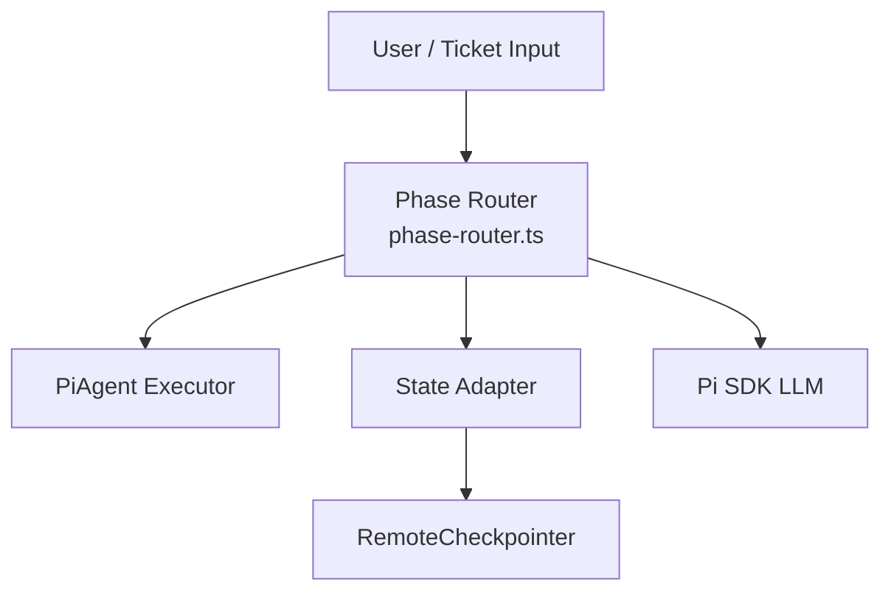
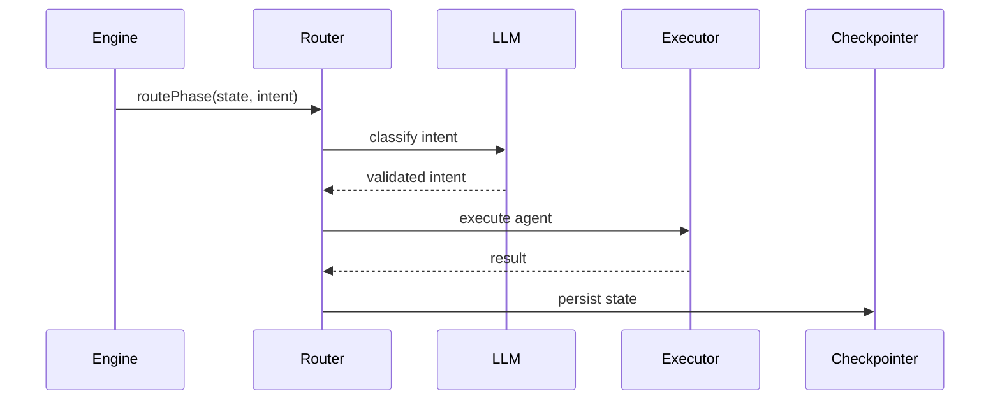

# Technical Design Document (TDD)

## SA4E-292: SA4E-289.3 – Phase Router

---

## Document Information

| Field | Value |
|-------|-------|
| Jira Ticket | SA4E-292 |
| Title | SA4E-289.3 – Phase Router |
| Author | SA Agent |
| Version | 1.0 |
| Date | 2026-09-16 |
| Status | Draft |
| Related BRD | documents/SA4E-292/BRD.md |
| Related FSD | documents/SA4E-292/FSD.md |

---

## Author Tracking

| Role | Name - Position | Responsibility |
|------|-----------------|----------------|
| Author | SA Agent – Solution Architect | Create document |
| Peer Reviewer | TBD – Reviewer | Review document |

---

## Revision History

| Version | Date | Author | Changes |
|---------|------|--------|---------|
| 1.0 | 2026-09-16 | SA Agent | Initiate document — auto-generated from BRD and FSD |

---

## Sign-Off

| Name | Signature and date |
|------|--------------------|
| | ☐ I agree and confirm the technical design in this TDD |
| | ☐ I agree and confirm the technical design in this TDD |

---

## 1. Introduction

### 1.1 Purpose
Design Phase Router component `phase-router.ts` replacing LangGraph edges in SDLC Agents 4 Enterprise VS Code extension with Pi SDK Option C architecture. Provides deterministic phase transition logic using Zod-validated intent classification via Pi SDK LLM, integrates with PiAgent Executor, State Adapter, RemoteCheckpointer, preserves PipelineState backward compatibility.

### 1.2 Scope
Technical scope covers:
- Phase transition decision logic implementation in `src/pi-workflow/phase-router.ts`
- Intent classification service with Zod + Pi SDK LLM provider
- Integration adapters: State Adapter, Checkpointer Adapter, Approval Adapter
- State schema adaptation between PipelineState and Pi SDK internal state

Out of scope: Pi SDK installation, UI changes, full LangGraph removal.

### 1.3 Technology Stack

| Layer | Technology | Version |
|-------|-----------|---------|
| Language | TypeScript | 5.x |
| Framework | VS Code Extension + Hono Backend | - |
| LLM Provider | Pi SDK @earendil-works/pi-agent-core | latest |
| Validation | Zod | 3.x |
| Logging | Pino | 8.x |
| State Persistence | RemoteCheckpointer + better-sqlite3 | - |

### 1.4 Design Principles
- SOLID, dependency inversion for PiAgent Executor
- Deterministic routing with traceable intent classification
- Fail-safe fallback to rule-based transitions
- Backward compatibility for PipelineState fields

### 1.5 Constraints
- Existing RemoteCheckpointer backend must remain unchanged
- Phase definitions remain unchanged during migration
- Phase routing decision latency target < 500ms p95

### 1.6 References
| Document | Location |
|----------|----------|
| BRD | documents/SA4E-292/BRD.md |
| FSD | documents/SA4E-292/FSD.md |
| Pi Migration Plan | documents/pi-migration-plan.md |

---

## 2. System Architecture

### 2.1 Architecture Overview
High-level PiWorkflow Engine flow per Option C:
`User Input → Intent Classification (Zod + LLM via Pi SDK) → Phase Selection → Agent Assignment → Tool Use Loop → Phase Transition Check → Next Phase or Finish → Persistence (RemoteCheckpointer)`


*[Edit in draw.io](diagrams/architecture.drawio)*



### 2.2 Component Diagram

*[Edit in draw.io](diagrams/component.drawio)*

| Component | Responsibility | Technology |
|-----------|---------------|------------|
| phase-router.ts | Phase transition logic replacing LangGraph edges | TypeScript |
| pi-agent-executor.ts | Single agent turn execution | Pi SDK |
| state-adapter.ts | PipelineState ↔ Pi SDK state mapping | TypeScript |
| checkpointer-adapter.ts | RemoteCheckpointer adaptation | TypeScript |
| intent-classifier.ts | Zod-validated intent classification | Zod + Pi SDK |

### 2.3 Deployment Architecture

*[Edit in draw.io](diagrams/deployment.png)*

Extension runs in VS Code host, backend Hono server provides Knowledge API and RemoteCheckpointer. Pi SDK communicates via WebSocket/HTTP to Pi service.

### 2.4 Communication Patterns
| From | To | Protocol | Pattern | Description |
|------|----|----------|---------|-------------|
| Phase Router | Pi SDK LLM | HTTP/WebSocket | Sync | Intent classification |
| Phase Router | PiAgent Executor | In-process | Sync | Agent turn execution |
| State Adapter | RemoteCheckpointer | HTTP | Sync | State persistence |

---

## 3. API Design

> Functional contracts from FSD §3.1.5. Technical implementation details below.

### 3.1 API Overview
| # | Endpoint | Method | Description | Source |
|---|----------|--------|-------------|--------|
| 1 | routePhase | internal | Determine next phase | UC-001 |
| 2 | classifyIntent | internal | Zod-validated intent classification | UC-002 |

### 3.2 API: routePhase
**Implements:** UC-001, BR-001..BR-004

| Attribute | Value |
|-----------|-------|
| Method | internal function |
| Path | src/pi-workflow/phase-router.ts |
| Auth | System internal |

**Request Parameters:**
| Parameter | Type | Required | Validation | Description |
|-----------|------|----------|------------|-------------|
| currentState | PipelineState | Yes | BR-002 | Current pipeline state |
| classifiedIntent | Intent | Yes | Zod schema | Validated intent |

**Response:**
```json
{
  "nextPhase": "specification",
  "updatedState": { ... },
  "errors": []
}
```

**Error Responses:**
| Status | Code | Message | Description |
|--------|------|---------|-------------|
| Logical | INVALID_INTENT | Intent schema validation failed | Zod validation fails |
| Logical | UNKNOWN_PHASE | Phase not in definition | Manual review required |

---

## 4. Database Design

### 4.1 Schema Overview
No new tables required. Phase Router uses existing PipelineState persistence via RemoteCheckpointer and Knowledge Service SQLite.


*[Edit in draw.io](diagrams/db-schema.drawio)*

Existing Knowledge DB schema:
- threads, messages, checkpoints, tool_executions, artifacts, events, agents

### 4.2 DDL Scripts
No DDL changes. State adapter maps fields:
- ticketKey, threadId, currentPhase, pipelineStatus, chatHistory, agentOutputs, errors

### 4.3 Migration Plan
No schema migration. Adapter layer ensures backward compatibility.

---

## 5. Class / Module Design

### 5.1 Package Structure
```
src/pi-workflow/
├── pi-workflow.ts
├── phase-router.ts
├── pi-agent-executor.ts
├── state-adapter.ts
├── approval-adapter.ts
├── checkpointer-adapter.ts
└── types/
    └── pi-workflow-state.ts
```

### 5.2 Key Interfaces
```typescript
export interface IPhaseRouter {
  routePhase(currentState: PipelineState, classifiedIntent: Intent): Promise<RoutingResult>;
}

export interface IntentClassifier {
  classify(inputText: string, schema: ZodSchema): Promise<IntentClassification>;
}
```

### 5.3 Design Patterns
| Pattern | Where Used | Rationale |
|---------|-----------|-----------|
| Strategy | Phase transition rules | Deterministic routing per phase |
| Adapter | State Adapter | PipelineState ↔ Pi SDK mapping |
| Repository | Checkpointer Adapter | Persistence abstraction |

### 5.4 Error Handling
| Exception | Status | Error Code | When Thrown |
|-----------|--------|------------|-------------|
| InvalidIntentError | Logical | INVALID_INTENT | Zod validation fails |
| UnknownPhaseError | Logical | UNKNOWN_PHASE | Phase not defined |

---

## 6. Integration Design

### 6.1 External System: Pi SDK
| Attribute | Value |
|-----------|-------|
| Protocol | WebSocket/HTTP |
| Authentication | Pi Provider token |
| Timeout | 5000ms |
| Retry Policy | 2 retries with exponential backoff |
| Circuit Breaker | 5 failures → open 30s |

**Sequence Diagram:**

*[Edit in draw.io](diagrams/api-sequence-router.drawio)*



### 6.2 External System: RemoteCheckpointer
Bidirectional JSON over HTTP. Persist on phase transition with retry 3x backoff.

---

## 7. Security Design

### 7.1 Authentication
System-to-system internal. Pi SDK provider uses token from configuration. No user-facing auth.

### 7.2 Authorization
No role-based endpoints. Internal services only.

### 7.3 Data Protection
Pipeline state contains ticket metadata – classification Internal. Logged fields masked for piSessionId.

### 7.4 Input Validation
- Intent object validated via Zod schema before routing
- currentPhase validated against enum SDLCPhase
- nextPhase validated as valid successor

---

## 8. Performance & Scalability

### 8.1 Caching Strategy
Intent classification results cached per ticketKey for 60s TTL.

### 8.2 Connection Pooling
HTTP client pool for Pi SDK: min 2, max 10.

### 8.3 Performance Targets
| Operation | Target | Measurement |
|-----------|--------|-------------|
| Phase routing decision | < 500ms p95 | In-process timer |

---

## 9. Monitoring & Observability

### 9.1 Logging
| Log Event | Level | Fields | Destination |
|-----------|-------|--------|-------------|
| Phase transition | INFO | ticketKey, currentPhase, nextPhase, intent | Console/structured |
| Intent classification failure | WARN | ticketKey, error | Console |

### 9.2 Metrics
| Metric | Type | Description | Alert Threshold |
|--------|------|-------------|-----------------|
| routing_latency_ms | Histogram | Phase routing latency | p95 > 500ms |
| classification_failures | Counter | Intent classification errors | > 5/min |

### 9.3 Health Checks
Pi SDK availability check via `llmProvider.isAvailable()`.

---

## 10. Deployment Considerations

### 10.1 Environment Configuration
| Property | DEV | SIT | PROD |
|----------|-----|-----|------|
| PI_PROVIDER_URL | dev.pi.local | sit.pi.local | prod.pi.local |
| LOG_LEVEL | debug | info | warn |

### 10.2 Feature Flags
`PI_WORKFLOW_ENABLED` toggles Phase Router vs LangGraph routing.

### 10.3 Rollback Strategy
Feature flag off → revert to LangGraph edges. State remains compatible.

---

## 11. E2E Test Architecture

### 11.1 Framework & Language
- **Framework**: vitest (E2E-API) + Playwright (E2E-UI)
- **Language**: TypeScript
- **API test client**: fetch / Hono app.request() against running server

### 11.2 Test Structure
- Unit tests: `extension/src/**/*.test.ts`
- Integration tests: `extension/src/langgraph/**/*.test.ts`
- E2E-API tests: `backend/tests/e2e/*.e2e.test.ts`

### 11.3 Reusable Components
- **e2e setup**: server start, Phase Router initialization, mock Pi SDK
- **Helpers**: createPipelineState, mockIntentClassification, assertPhaseTransition

### 11.4 E2E-API Test Design for Phase Router
- File: `phase-router.e2e.test.ts`
- Test cases: valid intent → next phase, invalid schema → stay, LLM timeout → fallback
- Auth setup: internal system, no JWT required
- Data cleanup: reset in-memory state after each test

### 11.5 E2E-UI Test Design
No UI changes per BRD. N/A.

---

## 12. Appendix

### Glossary
| Term | Definition |
|------|------------|
| Phase Router | Replaces LangGraph edges for phase transitions |
| Pi SDK | @earendil-works/pi-agent-core |
| PipelineState | Existing SDLC pipeline state object |

### Open Questions
| # | Question | Status | Answer |
|---|----------|--------|--------|
| 1 | Exact Pi SDK session ID format | Open | To be confirmed |
| 2 | Performance target validation | Open | Pending technical confirmation |

---

## Diagram Requirements
All diagrams referenced above must exist as draw.io files and PNG exports.

| Diagram | File |
|---------|------|
| Architecture | diagrams/architecture.drawio |
| Component | diagrams/component.drawio |
| Deployment | diagrams/deployment.drawio |
| API Sequence | diagrams/api-sequence-router.drawio |
| DB Schema | diagrams/db-schema.drawio |
| Class Diagram | diagrams/class-diagram.drawio |
