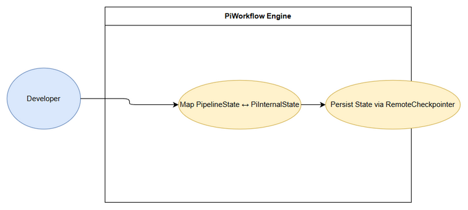
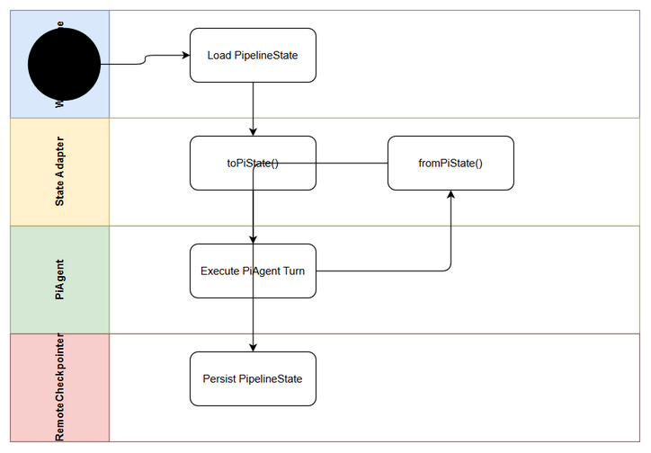

# Business Requirements Document (BRD)

## SA4E-293 — State Adapter

---

## Document Information

| Field | Value |
|-------|-------|
| Jira Ticket | SA4E-293 |
| Title | SA4E-289.4 – State Adapter |
| Author | BA Agent |
| Version | 1.0 |
| Date | 2026-09-16 |
| Status | Draft |

---

## Author Tracking

| Role | Name - Position | Responsibility |
|------|-----------------|----------------|
| Author | BA Agent – Business Analyst | Create document |
| Peer Reviewer | TBD – Reviewer | Review document |

---

## Revision History

| Version | Date | Author | Changes |
|---------|------|--------|---------|
| 1.0 | 2026-09-16 | BA Agent | Initiate document — auto-generated from Jira ticket SA4E-293 and Epic SA4E-289 |

---

## Sign-Off

| Name | Signature and date |
|------|--------------------|
| | ☐ I agree and confirm all criteria on this BRD as expected requirements |
| | ☐ I agree and confirm all criteria on this BRD as expected requirements |

---

## 1. Introduction

### 1.1 Scope

Implement State Adapter for Pi SDK migration Option C. The adapter provides bidirectional mapping between existing `PipelineState` used by LangGraph workflow engine and Pi SDK internal state, enabling the SDLC Agents 4 Enterprise VS Code extension to execute workflows using `@earendil-works/pi-agent-core` while preserving state management, checkpointing, and pipeline logic.

Specific deliverables:
- `state-adapter.ts` with `toPiState(pipelineState: PipelineState): PiInternalState` and `fromPiState(piState: PiInternalState): PipelineState`
- `types/pi-workflow-state.ts` defining extended state schema with Pi compatibility fields
- Added fields: `piSessionId`, `currentAgentId`, `toolCallCount`
- Backward compatibility with RemoteCheckpointer backend

Source: SA4E-293 description, Epic SA4E-289 and documents/pi-migration-plan.md

### 1.2 Out of Scope

- Workflow execution engine implementation
- Phase router, agent executor, or approval adapter
- UI changes or user-facing features
- LangGraph removal/cleanup
- Pi SDK provider installation

To be confirmed with stakeholders for non-functional performance targets.

### 1.3 Preliminary Requirement

- Pi SDK `@earendil-works/pi-agent-core` installed and accessible
- Existing `PipelineState` definition and RemoteCheckpointer backend available
- Epic SA4E-289 architecture approved
- State schema documentation from migration plan reviewed

---

## 2. Business Requirements

### 2.1 High Level Process Map

User workflow input → Intent Classification → Phase Selection → Agent Assignment → PiAgent Execution → State Adapter mapping PipelineState ↔ PiInternalState → Phase Transition Check → Persistence via RemoteCheckpointer → Next Phase / Finish

State Adapter sits at the boundary between legacy PipelineState and Pi SDK state, ensuring data fidelity during migration.

*[Edit in draw.io](diagrams/use-case.drawio)*

*[Edit in draw.io](diagrams/business-flow.drawio)*

### 2.2 List of User Stories / Use Cases

| # | Story / Use Case / Epic | Priority | Source Ticket |
|---|-------------------------|----------|---------------|
| 1 | As a developer, I want bidirectional state mapping between PipelineState and Pi SDK state so that existing SDLC pipeline can run on Pi SDK without data loss | MUST HAVE | SA4E-293 |
| 2 | As a system, I want new Pi-specific fields piSessionId, currentAgentId, toolCallCount persisted in state so that Pi workflow execution can be tracked | MUST HAVE | SA4E-293 |
| 3 | As a maintainer, I want state adapter to remain compatible with RemoteCheckpointer serialization so that checkpoints remain restorable | SHOULD HAVE | SA4E-289 |

---

### 2.3 Details of User Stories

---

#### Business Flow

**Step 1:** Workflow execution begins with PipelineState loaded from RemoteCheckpointer or new ticket start.

**Step 2:** StateAdapter.toPiState converts PipelineState to PiInternalState, injecting piSessionId, currentAgentId, toolCallCount.

**Step 3:** PiAgent executes single turn using PiInternalState via Pi SDK.

**Step 4:** PiAgent returns updated PiInternalState after tool use and message handling.

**Step 5:** StateAdapter.fromPiState converts PiInternalState back to PipelineState, preserving backward-compatible fields.

**Step 6:** Updated PipelineState is serialized and persisted via RemoteCheckpointer.

**Step 7:** Phase Router evaluates transition; loop continues or finishes.

> **Note:** Round-trip conversion must be lossless for core PipelineState fields defined in migration plan.

---

#### STORY 1: State Adapter Bidirectional Mapping

> As a developer, I want bidirectional state mapping between PipelineState and Pi SDK state so that existing SDLC pipeline can run on Pi SDK without data loss

**Requirement Details:**

1. Implement `state-adapter.ts` class with methods `toPiState` and `fromPiState`
2. Define `types/pi-workflow-state.ts` schema extending PipelineState with Pi compatibility fields
3. Maintain backward compatibility with existing fields: ticketKey, threadId, currentPhase, pipelineStatus, chatHistory, agentOutputs, errors, pipelineDefinition, autonomyLevel
4. Add Pi-specific fields: piSessionId, currentAgentId, toolCallCount
5. Ensure serialization format compatible with RemoteCheckpointer backend

**Data Fields (if applicable):**

| Field | Type | Required | Description | Example |
|-------|------|----------|-------------|---------|
| ticketKey | string | Yes | Jira ticket identifier | SA4E-293 |
| threadId | string | Yes | Execution thread identifier | 123e4567 |
| currentPhase | string | Yes | Current SDLC phase | phase-2-specification |
| pipelineStatus | string | Yes | Overall pipeline status | running |
| piSessionId | string | No | Internal Pi session ID | pi_sess_abc123 |
| currentAgentId | string | No | Agent currently executing | ba-agent |
| toolCallCount | number | No | Number of tool calls in current turn | 3 |
| chatHistory | array | Yes | Conversation history | [...] |
| agentOutputs | object | Yes | Outputs per agent | {...} |
| errors | array | No | Error list | [...] |

**Acceptance Criteria:**

1. `toPiState` correctly maps all required PipelineState fields to PiInternalState without data loss
2. `fromPiState` correctly reconstructs PipelineState from PiInternalState preserving original values
3. New fields piSessionId, currentAgentId, toolCallCount are populated and persisted
4. Round-trip conversion PipelineState → PiInternalState → PipelineState yields equivalent state for core fields
5. Serialized state can be saved and loaded via RemoteCheckpointer without errors
6. Unit tests pass for mapping edge cases: null fields, missing optional fields, large objects

**UI Specifications (if applicable):**

N/A – No UI changes

**Validation Rules (if applicable):**

- ticketKey must match pattern `[A-Z]+-\d+`
- piSessionId must be non-empty string if provided
- toolCallCount must be >= 0 integer

**Error Handling (if applicable):**

- Mapping error on missing required field: log error and throw StateMappingError
- Serialization failure: log warning, return original state, do not persist corrupted state

---

#### STORY 2: Pi-Specific State Fields

> As a system, I want new Pi-specific fields piSessionId, currentAgentId, toolCallCount persisted in state so that Pi workflow execution can be tracked

**Requirement Details:**

1. Extend state schema in `types/pi-workflow-state.ts` with Pi fields
2. Ensure fields are optional for backward compatibility
3. Default values: piSessionId = generated UUID, currentAgentId = null, toolCallCount = 0

**Acceptance Criteria:**

1. New fields exist in TypeScript types and are exported
2. State adapter initializes piSessionId on first conversion if missing
3. toolCallCount increments correctly per PiAgent turn
4. Fields persist across checkpoint save/load cycles

---

## 3. Dependencies

| Dependency | Type | Related Ticket | Description |
|------------|------|----------------|-------------|
| Pi SDK Installation | System | SA4E-289 | `@earendil-works/pi-agent-core` must be installed |
| PipelineState Definition | System | SA4E-289 | Existing state schema must be documented |
| RemoteCheckpointer Backend | Infrastructure | SA4E-289 | Checkpoint storage must be operational |
| Epic Migration Plan | External | SA4E-289 | documents/pi-migration-plan.md reference |

---

## 4. Stakeholders

| Role | Name / Team | Responsibility | Source |
|------|-------------|----------------|--------|
| Reporter | Duc Nguyen Minh | Requirement owner | SA4E-293 |
| BA Agent | BA Agent | BRD author | SA4E-293 |
| SA Agent | TBD | Technical design | SA4E-289 |

---

## 5. Risks and Assumptions

### 5.1 Risks

| Risk | Impact | Likelihood | Mitigation |
|------|--------|------------|------------|
| State schema drift between PipelineState and Pi SDK | High | Medium | Maintain adapter tests and schema validation |
| RemoteCheckpointer incompatibility with Pi state shape | High | Medium | Use adapter serialization layer, test round-trip |
| Missing Pi SDK state fields causes execution errors | Medium | Medium | Default values and validation in adapter |

### 5.2 Assumptions

- Pi SDK internal state structure is stable and documented
- RemoteCheckpointer can store extended JSON schema without changes
- Existing PipelineState fields remain unchanged during migration

---

## 6. Non-Functional Requirements

| Category | Requirement | Details |
|----------|-------------|---------|
| Performance | State mapping latency | < 5ms per conversion for typical state size |
| Security | State data confidentiality | State persisted via existing RemoteCheckpointer security |
| Scalability | State size | Support state up to 5MB per ticket |
| Availability | Adapter reliability | 99.9% success rate for mapping operations |

> If no non-functional requirements are identified from the tickets, state: "No specific non-functional requirements identified. To be confirmed with technical team."

---

## 7. Related Tickets

| Ticket Key | Summary | Status | Type | Relationship |
|------------|---------|--------|------|--------------|
| SA4E-293 | SA4E-289.4 – State Adapter | To Do | Story | Main ticket |
| SA4E-289 | Migrate LangGraph Workflow Engine to Pi SDK (Option C) | To Do | Epic | Parent Epic |

---

## 8. Appendix

### Glossary

| Term | Definition |
|------|------------|
| PipelineState | Existing LangGraph workflow state object |
| PiInternalState | State representation compatible with Pi SDK |
| State Adapter | Component mapping between PipelineState and PiInternalState |
| RemoteCheckpointer | Backend for workflow checkpoint persistence |

### Reference Documents

| Document | Link / Location |
|----------|-----------------|
| Pi Migration Plan | documents/pi-migration-plan.md |
| Epic SA4E-289 | https://jiraassist.atlassian.net/browse/SA4E-289 |

---

*Generated by BA Agent from Jira tickets SA4E-293, SA4E-289 and documents/pi-migration-plan.md*
