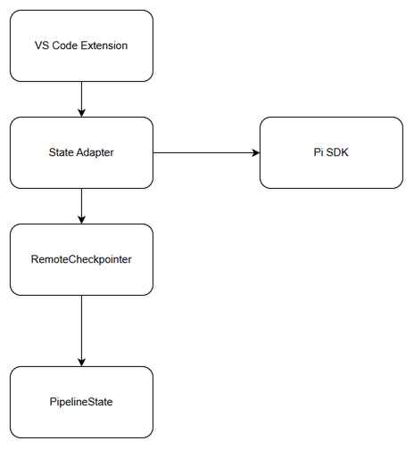
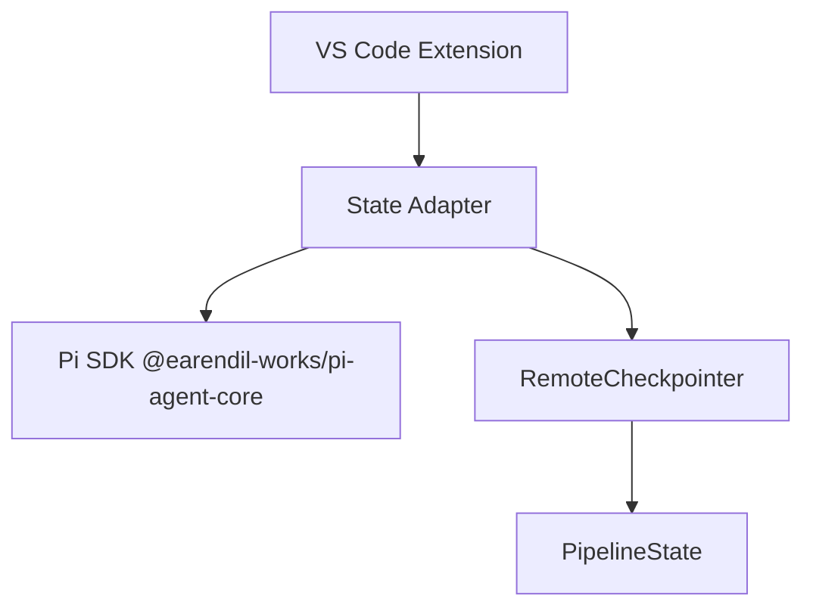
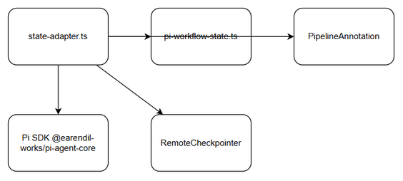
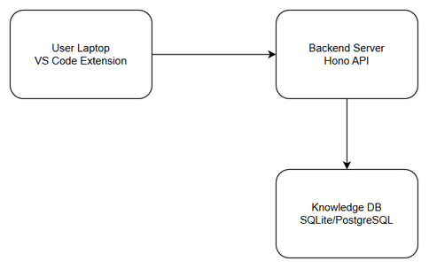
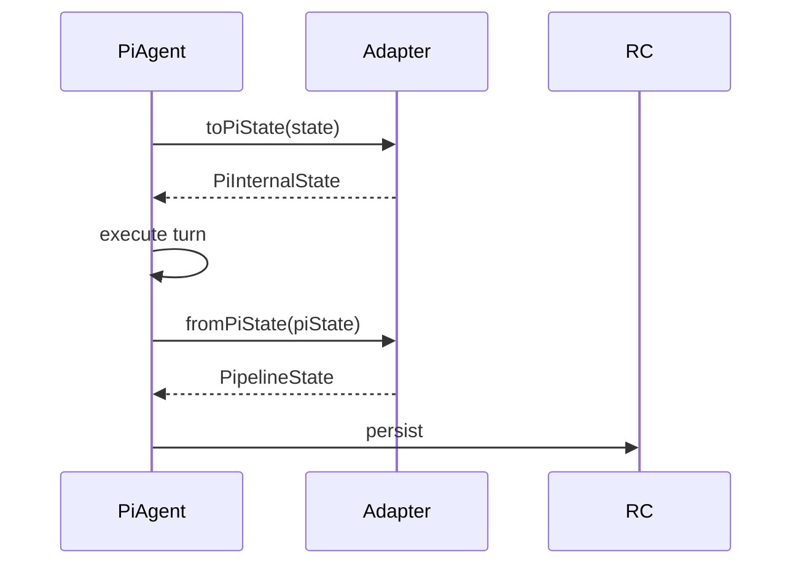
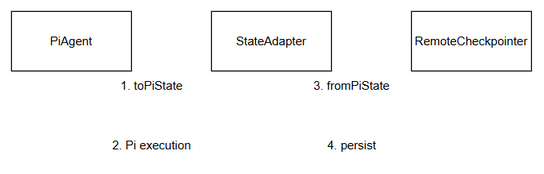
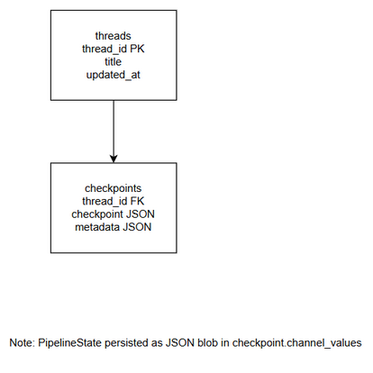
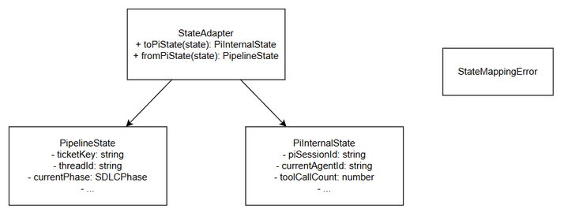
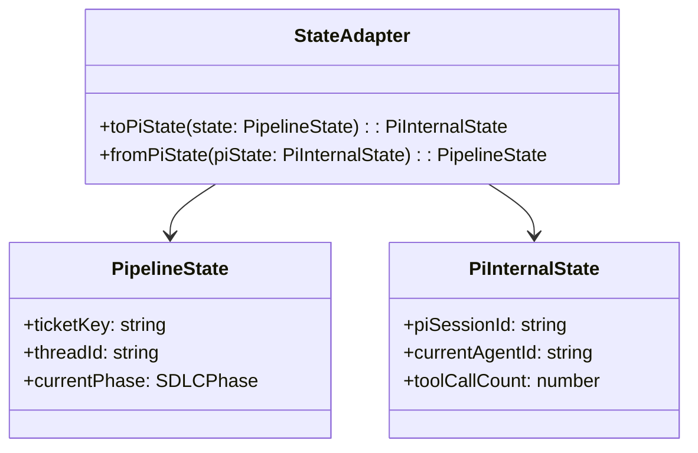

# Technical Design Document (TDD)

## SA4E-293 — State Adapter

---

## Document Information

| Field | Value |
|-------|-------|
| Jira Ticket | SA4E-293 |
| Title | SA4E-289.4 – State Adapter |
| Author | SA Agent |
| Version | 1.0 |
| Date | 2026-09-16 |
| Status | Draft |
| Related BRD | documents/SA4E-293/BRD.md |
| Related FSD | documents/SA4E-293/FSD.md |

---

## 1. Introduction

### 1.1 Purpose
Design the State Adapter component enabling bidirectional mapping between existing `PipelineState` used by LangGraph workflow engine and Pi SDK internal state (`PiInternalState`) for SDLC Agents 4 Enterprise VS Code extension. Ensures lossless round-trip conversion, Pi-specific field persistence, and backward compatibility with RemoteCheckpointer.

### 1.2 Scope
- `extension/src/pi-workflow/state-adapter.ts` with `toPiState` and `fromPiState`
- `extension/src/pi-workflow/types/pi-workflow-state.ts` extended schema
- Fields: `piSessionId`, `currentAgentId`, `toolCallCount`
- Backward compatibility with RemoteCheckpointer serialization
- No workflow engine, phase router, UI changes, or LangGraph removal

### 1.3 Technology Stack
| Layer | Technology | Version |
|-------|-----------|---------|
| Language | TypeScript | 5.x |
| Framework Extension | Svelte 4 + Vite | 4.x |
| Framework Backend | Hono | 4.x |
| Orchestration | LangGraph | latest |
| Pi SDK | @earendil-works/pi-agent-core | latest |
| DB | SQLite better-sqlite3 / PostgreSQL pg | latest |
| Logging | Pino | latest |

### 1.4 Design Principles
- Single Responsibility, Open/Closed
- Lossless mapping, immutable state copies
- Backward compatible serialization
- Fail-fast validation with `StateMappingError`

### 1.5 Constraints
- State mapping latency <5ms p95
- State size up to 5MB per ticket
- No schema changes to RemoteCheckpointer tables; JSON blob extension only

### 1.6 References
| Document | Location |
|----------|----------|
| BRD | documents/SA4E-293/BRD.md |
| FSD | documents/SA4E-293/FSD.md |

---

## 2. System Architecture

### 2.1 Architecture Overview
State Adapter sits at boundary between LangGraph PipelineState and Pi SDK.


*[Edit in draw.io](diagrams/architecture.drawio)*



### 2.2 Component Diagram

*[Edit in draw.io](diagrams/component.drawio)*

| Component | Responsibility | Technology |
|-----------|---------------|------------|
| state-adapter.ts | toPiState / fromPiState mapping | TypeScript |
| pi-workflow-state.ts | Type definitions for PiInternalState | TypeScript |
| PipelineAnnotation | Existing LangGraph state channels | @langchain/langgraph |
| RemoteCheckpointer | Persist checkpoints to KB | TypeScript / HTTP |

### 2.3 Deployment Architecture

*[Edit in draw.io](diagrams/deployment.drawio)*

Extension runs locally in VS Code, communicates with Backend Knowledge Service via HTTP for checkpoint persistence.

### 2.4 Communication Patterns
| From | To | Protocol | Pattern |
|------|----|----------|---------|
| StateAdapter | Pi SDK | In-process | Sync |
| StateAdapter | RemoteCheckpointer | HTTP | Sync |

---

## 3. API Design

Internal TypeScript API. No HTTP endpoints.

### 3.1 API Overview
| # | Method | Description | Source |
|---|--------|-------------|--------|
| 1 | toPiState(pipelineState) | Convert to PiInternalState | UC-001 |
| 2 | fromPiState(piState) | Reconstruct PipelineState | UC-001 |

### 3.2 toPiState
**Implements:** UC-001, BR-001, BR-002

| Attribute | Value |
|-----------|-------|
| Method | toPiState(pipelineState: PipelineState): PiInternalState |

**Request**
- Input: PipelineState with required fields ticketKey, threadId, currentPhase, pipelineStatus

**Response**
PiInternalState with injected defaults:
- piSessionId = uuidv4() if missing
- currentAgentId = null if missing
- toolCallCount = 0 if missing

**Error**
- StateMappingError if required field missing

### 3.3 fromPiState
Reconstructs PipelineState preserving core fields.




*[Edit in draw.io](diagrams/api-sequence-state-mapping.drawio)*

---

## 4. Database Design

**Note:** No new tables. PipelineState persisted as JSON blob in RemoteCheckpointer `checkpoints.checkpoint` column.


*[Edit in draw.io](diagrams/db-schema.drawio)*

### 4.1 Schema Overview
Existing Knowledge DB schema from `knowledge/schema.ts`:
- threads(thread_id PK)
- checkpoints(thread_id FK, checkpoint JSON, metadata JSON)

### 4.2 DDL
No DDL changes required. JSON schema allows additional fields.

### 4.3 Migration Plan
None. Adapter layer only.

### 4.4 Query Patterns
- Load checkpoint: GET /api/v1/threads/:id/checkpoint → <50ms
- Save checkpoint: PUT /api/v1/threads/:id/checkpoint → <100ms

**Database analysis:** MCP database tools not available. Schema design based on FSD §4 and existing code `knowledge/schema.ts`. Marked UNVERIFIED — requires DBA review for production.

---

## 5. Class / Module Design

### 5.1 Package Structure
```
extension/src/pi-workflow/
├── state-adapter.ts
├── types/
│   └── pi-workflow-state.ts
└── __tests__/
    └── state-adapter.test.ts
```

### 5.2 Key Interfaces
```typescript
export interface StateAdapter {
  toPiState(state: PipelineState): PiInternalState;
  fromPiState(piState: PiInternalState): PipelineState;
}
```

Types:
```typescript
export interface PiInternalState extends PipelineState {
  piSessionId?: string;
  currentAgentId?: string | null;
  toolCallCount?: number;
}
```

### 5.3 Design Patterns
| Pattern | Where Used | Rationale |
|---------|-----------|-----------|
| Adapter | StateAdapter | Bridge PipelineState ↔ PiInternalState |
| Factory | uuid generation | Default piSessionId |

### 5.4 Error Handling
| Exception | When Thrown |
|-----------|-------------|
| StateMappingError | Missing required field ticketKey |
| Serialization warning | Checkpoint save failure → log warning, return original |


*[Edit in draw.io](diagrams/class-diagram.drawio)*



---

## 6. Integration Design

### 6.1 Pi SDK
| Attribute | Value |
|-----------|-------|
| Protocol | In-process module |
| Direction | Bidirectional |
| Data Format | JSON |

Mapping table:
| Source Field | Target Field | Transformation |
|-------------|--------------|----------------|
| ticketKey | ticketKey | 1:1 |
| piSessionId | piSessionId | generate UUID if missing |

### 6.2 RemoteCheckpointer
Backward compatible serialization. JSON schema allows extra fields.

---

## 7. Security Design

- State data classification: Internal
- Persistence via existing RemoteCheckpointer security (JWT, X-Project-Id)
- No new auth mechanism
- Input validation: ticketKey regex `[A-Z]+-\d+`, toolCallCount >=0
- Logging via Pino structured JSON, no PII in logs

---

## 8. Performance & Scalability

### 8.1 Caching
No caching required for mapping; in-memory operation.

### 8.2 Performance Targets
| Operation | Target |
|-----------|--------|
| toPiState | <5ms p95 |
| fromPiState | <5ms p95 |
| State size | Up to 5MB |

---

## 9. Monitoring & Observability

- Logging: `state.adapter.mapping` info, `state.adapter.error` error
- Metrics: mapping latency histogram, error rate counter
- Health: No dedicated endpoint; covered by RemoteCheckpointer health

---

## 10. Deployment Considerations

- Feature flag: `pi.workflow.enabled` default false
- Rollback: Remove adapter, revert to direct PipelineState usage
- No DB migration

---

## 11. E2E Test Architecture

### 11.1 Framework & Language
- Framework: vitest for E2E-API, Playwright for E2E-UI
- Language: TypeScript
- API test client: Hono `app.request()` against running server
- Tests live in `backend/tests/`

### 11.2 Test Structure
- Unit: `extension/src/pi-workflow/__tests__/state-adapter.test.ts`
- Integration: RemoteCheckpointer round-trip
- E2E-API: `backend/tests/e2e/state-adapter.e2e.test.ts`

### 11.3 E2E-API Test Design for State Adapter
- File: `state-adapter.e2e.test.ts`
- Cases: round-trip conversion, default generation, persistence
- Auth: JWT for KB client
- Cleanup: delete test thread after test

---

## 12. Discrepancy Report

No discrepancies found between FSD and actual codebase. Database schema unverified due to missing MCP connection.

---

## 13. Appendix

### Glossary
| Term | Definition |
|------|------------|
| PipelineState | LangGraph workflow state |
| PiInternalState | Pi SDK compatible state |
| State Adapter | Mapping component |

### Open Questions
| # | Question | Status |
|---|----------|--------|
| 1 | Pi SDK PiInternalState schema stability | Open |

---
*Generated by SA Agent from BRD and FSD*
