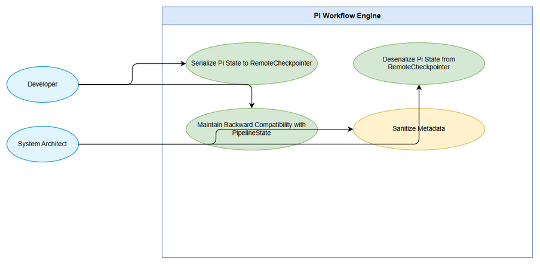
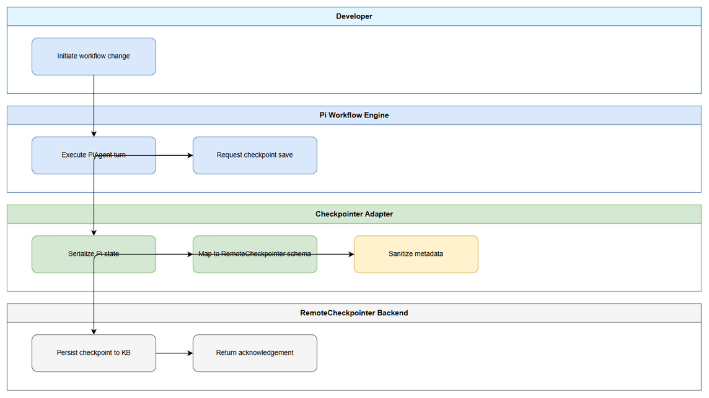
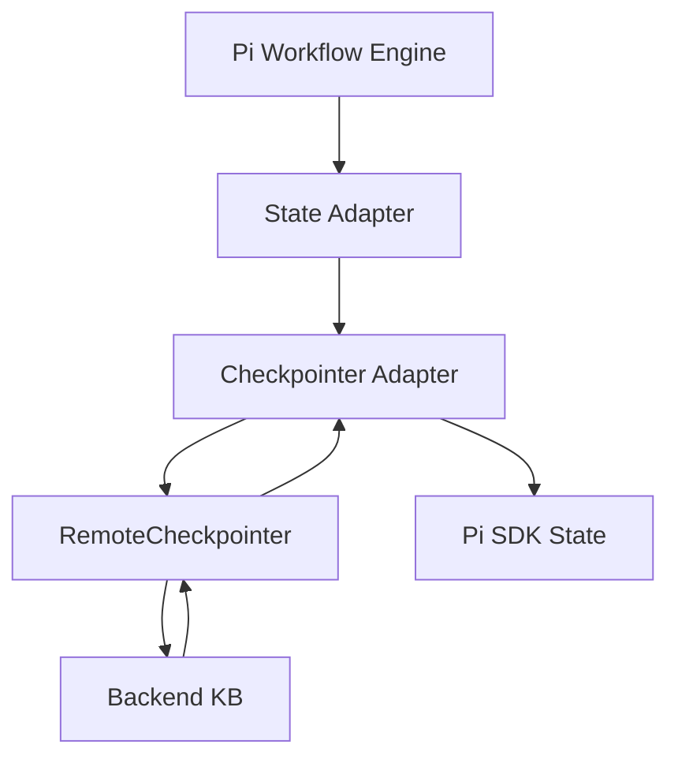

# Business Requirements Document (BRD)

## SA4E-294 — SA4E-289.5 – Checkpointer Adapter

---

## Document Information

| Field | Value |
|-------|-------|
| Jira Ticket | SA4E-294 |
| Title | SA4E-289.5 – Checkpointer Adapter |
| Author | BA Agent |
| Version | 1.0 |
| Date | 2026-09-16 |
| Status | Draft |

---

## Author Tracking

| Role | Name - Position | Responsibility |
|------|-----------------|----------------|
| Author | BA Agent – Business Analyst | Create document |
| Peer Reviewer | To be assigned – Technical Lead | Review document |

---

## Revision History

| Version | Date | Author | Changes |
|---------|------|--------|---------|
| 1.0 | 2026-09-16 | BA Agent | Initiate document — auto-generated from Jira ticket SA4E-294 and linked tickets |

---

## Sign-Off

| Name | Signature and date |
|------|--------------------|
| | ☐ I agree and confirm all criteria on this BRD as expected requirements |
| | ☐ I agree and confirm all criteria on this BRD as expected requirements |

---

## 1. Introduction

### 1.1 Scope

Implement `checkpointer-adapter.ts` as part of Epic SA4E-289 Migrate LangGraph Workflow Engine to Pi SDK Option C. The adapter provides serialization and deserialization of Pi SDK internal state to/from the existing RemoteCheckpointer backend, ensuring workflow state persistence, resume capability, and backward compatibility with the SDLC pipeline state model.

Scope includes:
- Mapping Pi SDK state (`PiInternalState`) to PipelineState format used by RemoteCheckpointer
- Serializing state to RemoteCheckpointer compatible payload
- Deserializing checkpoint payload back to Pi SDK state
- Integration with `state-adapter.ts` and `pi-workflow.ts` orchestrator
- Preservation of critical fields: ticketKey, threadId, currentPhase, pipelineStatus, chatHistory, agentOutputs, errors, piSessionId, currentAgentId

### 1.2 Out of Scope

- Changes to RemoteCheckpointer backend API or database schema
- Modifications to LangGraph engine
- UI changes or user-facing features
- Implementation of Pi SDK provider or Agent Executor

### 1.3 Preliminary Requirement

- Pi SDK `@earendil-works/pi-agent-core` installed
- RemoteCheckpointer backend operational and accessible via HTTP
- State Adapter `state-adapter.ts` defined
- Migration plan `documents/pi-migration-plan.md` approved

---

## 2. Business Requirements

### 2.1 High Level Process Map

The Checkpointer Adapter sits between Pi Workflow Engine and RemoteCheckpointer backend. During execution, Pi workflow state is captured, adapted via State Adapter, serialized by Checkpointer Adapter, and persisted via RemoteCheckpointer to Backend Knowledge Service. On resume, the flow reverses.

*[Edit in draw.io](diagrams/use-case.drawio)*

*[Edit in draw.io](diagrams/business-flow.drawio)*

### 2.2 List of User Stories / Use Cases

| # | Story / Use Case / Epic | Priority | Source Ticket |
|---|-------------------------|----------|---------------|
| 1 | As a System, I want Pi SDK state serialized to RemoteCheckpointer format so that workflow checkpoints are persisted reliably | MUST HAVE | SA4E-294 |
| 2 | As a System, I want RemoteCheckpointer payload deserialized to Pi SDK state so that workflow can resume correctly | MUST HAVE | SA4E-294 |
| 3 | As a Developer, I want backward compatible state fields preserved during migration so that existing threads remain recoverable | SHOULD HAVE | SA4E-289 |

---

### 2.3 Details of User Stories

---

#### Business Flow

**Step 1:** Pi Workflow Engine executes a phase and produces `PiInternalState`.

**Step 2:** State Adapter maps `PiInternalState` → `PipelineState` with Pi-specific fields.

**Step 3:** Checkpointer Adapter serializes `PipelineState` to RemoteCheckpointer payload JSON.

**Step 4:** RemoteCheckpointer PUTs payload to Backend KB `/api/v1/threads/{threadId}/checkpoint`.

**Step 5:** On resume, RemoteCheckpointer GETs payload from Backend KB.

**Step 6:** Checkpointer Adapter deserializes payload → `PipelineState`.

**Step 7:** State Adapter maps `PipelineState` → `PiInternalState`.

**Step 8:** Pi Workflow Engine resumes execution.

> **Note:** Serialization must preserve `ticketKey`, `threadId`, `currentPhase`, `pipelineStatus`, `chatHistory`, `agentOutputs`, `errors`, `piSessionId`, `currentAgentId`, `toolCallCount`.

---

#### STORY 1: Serialize Pi State to RemoteCheckpointer

> As a System, I want Pi SDK state serialized to RemoteCheckpointer format so that workflow checkpoints are persisted reliably

**Requirement Details:**

1. Implement `checkpointer-adapter.ts` in `src/pi-workflow/checkpointer-adapter.ts`
2. Provide `serialize(state: PipelineState): RemoteCheckpointPayload`
3. Provide `deserialize(payload: RemoteCheckpointPayload): PipelineState`
4. Ensure payload schema matches existing RemoteCheckpointer expectations
5. Handle missing optional fields gracefully

**Data Fields (if applicable):**

| Field | Type | Required | Description | Example |
|-------|------|----------|-------------|---------|
| ticketKey | string | Yes | Jira ticket key | SA4E-294 |
| threadId | string | Yes | Workflow thread identifier | tid-001 |
| currentPhase | string | Yes | Current SDLC phase | phase-3-design |
| pipelineStatus | string | Yes | Status of pipeline | running |
| piSessionId | string | Yes | Pi SDK session ID | pi-sess-abc123 |
| currentAgentId | string | No | Agent currently executing | ba-agent |
| toolCallCount | number | No | Number of tool calls | 12 |

**Acceptance Criteria:**

1. Serialize function returns valid JSON payload accepted by RemoteCheckpointer PUT endpoint
2. Deserialize function reconstructs PipelineState with all critical fields intact
3. Round-trip serialize/deserialize produces equivalent state
4. Unit tests cover happy path and missing optional fields
5. No changes required to RemoteCheckpointer backend

**UI Specifications (if applicable):**

N/A - Backend component

**Validation Rules (if applicable):**

- ticketKey must match pattern `[A-Z]+-\d+`
- threadId must be non-empty string
- piSessionId must be non-empty string
- pipelineStatus must be one of: running, paused, completed, failed

**Error Handling (if applicable):**

- Serialization error: log error, throw `CheckpointSerializationError`
- Deserialization error: log error, return empty state with error flag
- Backend unreachable: propagate error to RemoteCheckpointer retry logic

---

#### STORY 2: Deserialize RemoteCheckpointer Payload to Pi State

> As a System, I want RemoteCheckpointer payload deserialized to Pi SDK state so that workflow can resume correctly

**Requirement Details:**

1. Deserialize payload from RemoteCheckpointer GET response
2. Map PipelineState back to PiInternalState via State Adapter
3. Validate payload version compatibility
4. Return default state if payload missing

**Acceptance Criteria:**

1. Deserialize produces PiInternalState with correct piSessionId and currentAgentId
2. Missing optional fields default to null/0 without errors
3. Version mismatch detected and logged

---

## 3. Dependencies

| Dependency | Type | Related Ticket | Description |
|------------|------|----------------|-------------|
| Pi SDK Installation | Infrastructure | SA4E-290 | Pi SDK must be installed before adapter implementation |
| State Adapter | System | SA4E-293 | State Adapter provides Pi ↔ Pipeline mapping |
| RemoteCheckpointer Backend | System | SA4E-85 | Existing RemoteCheckpointer service must be operational |
| Migration Plan | Documentation | - | documents/pi-migration-plan.md |

---

## 4. Stakeholders

| Role | Name / Team | Responsibility | Source |
|------|-------------|----------------|--------|
| Reporter | Duc Nguyen Minh | Issue creator | SA4E-294 reporter |
| Epic Owner | SDLC Agents Team | Migration oversight | SA4E-289 |
| BA | BA Agent | Requirements documentation | This BRD |

---

## 5. Risks and Assumptions

### 5.1 Risks

| Risk | Impact | Likelihood | Mitigation |
|------|--------|------------|------------|
| Schema mismatch between Pi state and RemoteCheckpointer payload | High | Medium | Define explicit mapping table, add integration tests |
| Performance degradation due to large state serialization | Medium | Low | Implement selective field serialization, compress payload |
| Backward incompatibility with existing threads | High | Low | Preserve all legacy fields, version payload |

### 5.2 Assumptions

- RemoteCheckpointer backend API remains stable
- State Adapter will provide complete Pi ↔ Pipeline mapping
- Pi SDK state structure is documented and stable

---

## 6. Non-Functional Requirements

| Category | Requirement | Details |
|----------|-------------|---------|
| Performance | Serialization/deserialization latency < 50ms for typical state size | Measured in unit tests |
| Security | State payload must not contain secrets; transit over HTTPS via RemoteCheckpointer | Inherited from RemoteCheckpointer |
| Scalability | Support state sizes up to 5MB | Align with RemoteCheckpointer limits |
| Availability | Adapter failure must not block workflow execution; fallback to empty state | Graceful degradation |

> No specific non-functional requirements identified beyond above.

---

## 7. Related Tickets

| Ticket Key | Summary | Status | Type | Relationship |
|------------|---------|--------|------|--------------|
| SA4E-294 | SA4E-289.5 – Checkpointer Adapter | To Do | Story | Main ticket |
| SA4E-289 | Migrate LangGraph Workflow Engine to Pi SDK (Option C) | To Do | Epic | Parent epic |
| SA4E-293 | SA4E-289.4 – State Adapter | To Do | Story | Dependency |
| SA4E-290 | SA4E-289.1 – Setup Pi SDK & Pi Provider | In Progress | Story | Predecessor |
| SA4E-295 | SA4E-289.6 – Approval Adapter | To Do | Story | Sibling |
| SA4E-292 | SA4E-289.3 – Phase Router | To Do | Story | Sibling |

---

## 8. Appendix

### Glossary

| Term | Definition |
|------|------------|
| Pi SDK | @earendil-works/pi-agent-core |
| RemoteCheckpointer | BaseCheckpointSaver implementation using HTTP to Backend KB |
| PipelineState | SDLC pipeline state model used by LangGraph |
| PiInternalState | Internal state representation of Pi SDK |

### Reference Documents

| Document | Link / Location |
|----------|-----------------|
| Pi Migration Plan | documents/pi-migration-plan.md |
| Epic SA4E-289 | Jira SA4E-289 |
| RemoteCheckpointer Spec | documents/SA4E-85/FSD.md §3.12 |

