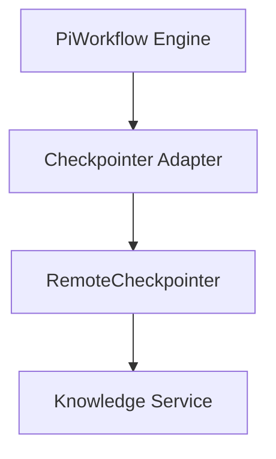
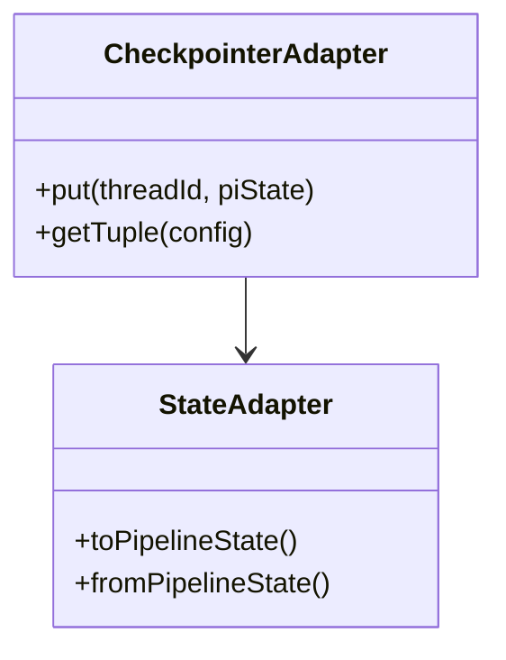
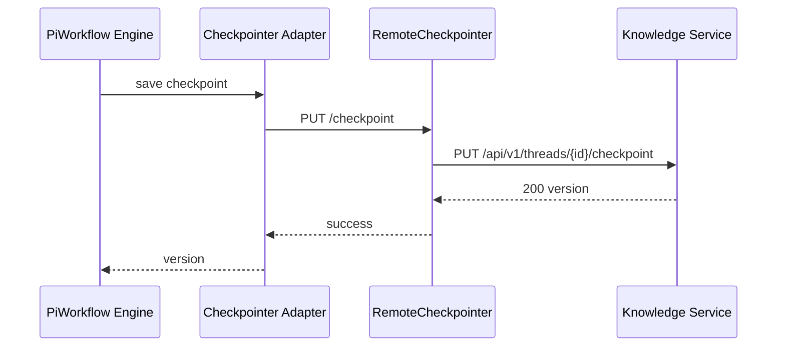

# Technical Design Document (TDD)

## SA4E-294 — Checkpointer Adapter

---

## Document Information

| Field | Value |
|-------|-------|
| Jira Ticket | SA4E-294 |
| Title | Checkpointer Adapter |
| Author | SA Agent |
| Version | 1.0 |
| Date | 2026-09-16 |
| Status | Draft |
| Related BRD | documents/SA4E-294/BRD.md (missing) |
| Related FSD | FSD.md |

---

## Revision History

| Version | Date | Author | Changes |
|---------|------|--------|---------|
| 1.0 | 2026-09-16 | SA Agent | Initial design from FSD v1.0 |

---

## 1. Introduction

### 1.1 Purpose
This TDD defines the technical design for the Checkpointer Adapter component within Pi SDK migration initiative Epic SA4E-289. It specifies how Pi SDK internal state is serialized/deserialized to the existing RemoteCheckpointer backend (Knowledge Service `/api/v1/threads`) without modifying backend schema.

### 1.2 Scope
Technical scope covers:
- StateAdapter for PipelineState ↔ PiInternalState mapping
- CheckpointerAdapter implementation compatible with BaseCheckpointSaver contract
- Serialization of Pi session, agent outputs, chat history, tool calls
- Integration with existing `extension/src/langgraph/core/remote-checkpointer.ts`
- Backward compatibility with existing checkpoints

Out of scope: Backend schema changes, Pi SDK provider implementation, phase router logic.

### 1.3 Technology Stack

| Layer | Technology | Version |
|-------|-----------|---------|
| Language | TypeScript | 5.x |
| Framework Backend | Hono | 4.x |
| Framework Extension | LangGraph | latest |
| Database | SQLite better-sqlite3 | 9.x |
| UI | Svelte 4 + Vite | 4.x |
| Build Tool | npm | 9.x |
| Container | Docker | 24.x |

### 1.4 Design Principles
- Adapter pattern for state translation
- SOLID, DRY, KISS
- Backward compatibility
- Workspace binding security

### 1.5 Constraints
- Cannot modify Knowledge Service schema
- Must reuse existing RemoteCheckpointer contract
- Checkpoint body size <10MB
- Checkpoint latency <500ms p95

### 1.6 References
| Document | Location |
|----------|----------|
| FSD | documents/SA4E-294/FSD.md |
| Pi Migration Plan | documents/pi-migration-plan.md |
| Code Intelligence — Extension Knowledge | .analysis/code-intelligence/modules/extension-knowledge.md |

---

## 2. System Architecture

### 2.1 Architecture Overview
PiWorkflow Engine executes agent turns via Pi SDK. StateAdapter converts PipelineState to PiInternalState for execution and back. CheckpointerAdapter implements BaseCheckpointSaver interface.




### 2.2 Component Diagram


| Component | Responsibility | Technology |
|-----------|---------------|------------|
| StateAdapter | PipelineState ↔ PiInternalState mapping | TypeScript |
| CheckpointerAdapter | Serialize/deserialize checkpoints | TypeScript |
| RemoteCheckpointer | HTTP client to KB | extension/src/langgraph/core/remote-checkpointer.ts |

### 2.3 Deployment Architecture


### 2.4 Communication Patterns
| From | To | Protocol | Pattern | Description |
|------|----|----------|---------|-------------|
| PiWorkflow Engine | Checkpointer Adapter | In-process | Sync | State translation |
| Checkpointer Adapter | RemoteCheckpointer | HTTP | Sync | PUT/GET checkpoint |
| RemoteCheckpointer | Knowledge Service | HTTP REST | Sync | /api/v1/threads |

---

## 3. API Design

> Functional contracts defined in FSD §3.1.5. Technical implementation below.

### 3.1 API Overview
| # | Endpoint | Method | Description | Source |
|---|----------|--------|-------------|--------|
| 1 | /api/v1/threads/{threadId}/checkpoint | PUT | Persist Pi-adapted checkpoint | UC-001 |
| 2 | /api/v1/threads/{threadId}/checkpoint | GET | Retrieve checkpoint | UC-001 |

### 3.2 API: Put Checkpoint
**Implements:** UC-001, BR-001, BR-002, BR-003

| Attribute | Value |
|-----------|-------|
| Method | PUT |
| Path | /api/v1/threads/{threadId}/checkpoint |
| Auth | JWT + X-Project-Id |
| Rate Limit | 100/min |

**Request Headers:**
| Header | Required | Description |
|--------|----------|-------------|
| Authorization | Yes | Bearer {token} |
| X-Project-Id | Yes | Workspace binding |
| Content-Type | Yes | application/json |

**Path Parameters:**
| Parameter | Type | Required | Description |
|-----------|------|----------|-------------|
| threadId | string | Yes | UUID v4 |

**Request Body:**
```json
{
  "checkpoint": { "channel_values": { "ticketKey": "SA4E-294", "threadId": "...", "currentPhase": "design", "piSessionId": "..." } },
  "metadata": {},
  "newVersions": {},
  "messages": []
}
```

**Response 200 OK:**
```json
{
  "version": 12,
  "lastUpdatedAt": "2026-09-16T...Z"
}
```

**Error Responses:**
| Status | Code | Message | Description |
|--------|------|---------|-------------|
| 404 | THREAD_NOT_FOUND | Thread not found | Workspace mismatch or invalid UUID |
| 413 | PAYLOAD_TOO_LARGE | Checkpoint too large | >10MB |
| 503 | KB_UNREACHABLE | Service unavailable | Retry exhausted |

---

## 4. Database Design

> Logical model in FSD §4. Physical implementation uses existing Knowledge Service SQLite schema.

### 4.1 Schema Overview


### 4.2 DDL Scripts
Existing schema from `backend/src/knowledge/schema.ts`. Key tables:
- threads(thread_id PK, workspace_id, title, status, ...)
- checkpoints(thread_id FK, version, checkpoint JSON, metadata, created_at)
- messages(thread_id FK, seq, role, content, ...)

**Note:** Database analysis skipped — MCP database tools not available. Design based on code intelligence.

### 4.3 Migration Plan
No schema changes required. Adapter is read/write compatible.

### 4.4 Query Patterns
| Operation | Query Pattern | Expected Performance |
|-----------|--------------|---------------------|
| Save checkpoint | INSERT OR REPLACE INTO checkpoints ... | <50ms |
| Get checkpoint | SELECT checkpoint FROM checkpoints WHERE thread_id = ? ORDER BY version DESC LIMIT 1 | <30ms |

---

## 5. Class / Module Design

### 5.1 Package Structure
```
extension/src/langgraph/core/
├── checkpointer-adapter.ts      # New CheckpointerAdapter
├── state-adapter.ts             # New StateAdapter
├── remote-checkpointer.ts       # Existing
└── checkpointer-helpers.ts
```

### 5.2 Key Interfaces
```typescript
export interface IStateAdapter {
  toPipelineState(piState: PiInternalState): PipelineState;
  fromPipelineState(pipelineState: PipelineState): PiInternalState;
}

export interface ICheckpointerAdapter extends BaseCheckpointSaver {
  putCheckpoint(threadId: string, piState: PiInternalState): Promise<Checkpoint>;
}
```

### 5.3 Design Patterns
| Pattern | Where Used | Rationale |
|---------|-----------|-----------|
| Adapter | CheckpointerAdapter | Translate Pi state to KB schema |
| Strategy | Serialization | Pluggable serializer |

### 5.4 Error Handling
| Exception | HTTP Status | Error Code | When Thrown |
|-----------|-------------|------------|-------------|
| KbUnreachableError | 503 | KB_UNREACHABLE | Network failure after retries |
| PayloadTooLargeError | 413 | PAYLOAD_TOO_LARGE | Size >10MB |
| SerializationError | 500 | SERIALIZATION_ERROR | StateAdapter failure |

### 5.5 Class Diagram




---

## 6. Integration Design

### 6.1 External System: Knowledge Service
| Attribute | Value |
|-----------|-------|
| Protocol | HTTP REST |
| Endpoint | /api/v1/threads |
| Authentication | JWT + X-Project-Id |
| Timeout | 5s |
| Retry Policy | 3 attempts exponential backoff 200ms→800ms |
| Circuit Breaker | 5 failures, reset 30s |

**Sequence Diagram**




---

## 7. Security Design

### 7.1 Authentication
JWT validation via `jwtAuth` middleware. Workspace resolved from JWT `wid` claim or `X-Project-Id` header.

### 7.2 Authorization
Workspace binding enforced per Finding #18. Mismatch returns 404.

### 7.3 Data Protection
| Data Type | At Rest | In Transit | In Logs |
|-----------|---------|------------|---------|
| Checkpoint state | SQLite encrypted | TLS 1.2+ | Excluded |
| Thread metadata | SQLite | TLS 1.2+ | thread_id/version only |

### 7.4 Input Validation
- threadId UUID v4 regex
- Payload size limit 10MB via bodyLimit middleware
- Checkpoint body never logged

---

## 8. Performance & Scalability

### 8.1 Caching Strategy
No caching for checkpoints — source of truth is KB. In-memory client connection pooling used.

### 8.2 Connection Pooling
HTTP client reuse per KnowledgeClient instance.

### 8.3 Performance Targets
| Operation | Target | Measurement |
|-----------|--------|-------------|
| Checkpoint save | <500ms p95 | API latency |
| Concurrent threads | 1,000 | Load test |

---

## 9. Monitoring & Observability

### 9.1 Logging
| Log Event | Level | Fields | Destination |
|-----------|-------|--------|-------------|
| CHECKPOINT_SAVED | INFO | thread_id, version, durationMs | stdout |
| KB_UNREACHABLE | WARN | thread_id, attempt | stdout |

Structured JSON logging via Pino.

### 9.2 Metrics
| Metric | Type | Description | Alert Threshold |
|--------|------|-------------|-----------------|
| checkpoint_save_duration | Histogram | Save latency | p95 >500ms |
| kb_error_rate | Counter | Errors | >1% |

### 9.3 Health Checks
`/api/v1/health` → 200 OK

---

## 10. Deployment Considerations

### 10.1 Environment Configuration
| Property | DEV | PROD |
|----------|-----|------|
| KB_BASE_URL | http://127.0.0.1:48721 | https://kb.example.com |
| TIMEOUT_MS | 3000 | 5000 |

### 10.2 Feature Flags
None required.

### 10.3 Rollback Strategy
Revert extension commit. Checkpoints remain compatible.

---

## 11. E2E Test Architecture

### 11.1 Framework & Language
- Framework: vitest + Playwright
- Language: TypeScript
- API test client: fetch against running Hono server
- Tests live in `backend/tests/`

### 11.2 Test Structure
- Unit: `extension/src/**/*.test.ts`
- Integration: `backend/tests/integration/*.it.test.ts`
- E2E-API: `backend/tests/e2e/*.e2e.test.ts`

### 11.3 Reusable Components
- e2e setup: server start, DB seed, auth token generation
- Helpers: login, navigate, wait

### 11.4 E2E-API Test Design for Checkpointer Adapter
- File: `checkpointer-adapter.e2e.test.ts`
- Test cases: TC-001 save Pi state, TC-002 invalid UUID, TC-003 KB unreachable
- Auth setup: admin JWT
- Data cleanup: delete thread after test

### 11.5 E2E-UI Test Design
Not applicable — backend adapter only.

---

## 12. Appendix

### Glossary
| Term | Definition |
|------|------------|
| Pi SDK | @earendil-works/pi-agent-core |
| RemoteCheckpointer | Backend-driven checkpoint saver |

### Open Questions
| # | Question | Status |
|---|----------|--------|
| 1 | BRD missing — confirm business rules | Open |

---

## Mandatory Diagram Requirements
All diagrams exist as .drawio + .png.

*Diagrams referenced above correspond to files in `diagrams/` directory.*

