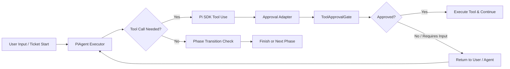
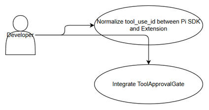
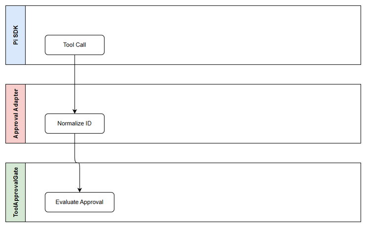
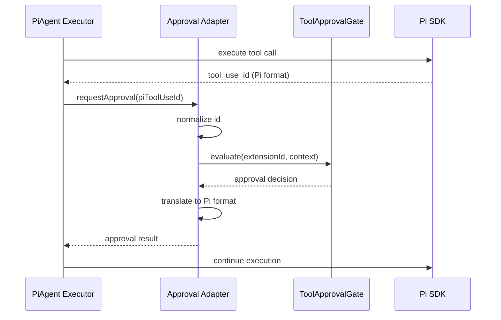

# Business Requirements Document (BRD)

## SDLC Agents 4 Enterprise — SA4E-295: SA4E-289.6 – Approval Adapter

---

## Document Information

| Field | Value |
|-------|-------|
| Jira Ticket | SA4E-295 |
| Title | SA4E-289.6 – Approval Adapter |
| Author | BA Agent |
| Version | 1.0 |
| Date | 2026-09-16 |
| Status | Draft |

---

## Author Tracking

| Role | Name - Position | Responsibility |
|------|-----------------|----------------|
| Author | BA Agent – Business Analyst | Create document |
| Peer Reviewer | TBD – Technical Lead | Review document |

---

## Revision History

| Version | Date | Author | Changes |
|---------|------|--------|---------|
| 1.0 | 2026-09-16 | BA Agent | Initiate document — auto-generated from Jira ticket SA4E-295 and Epic SA4E-289 |

---

## Sign-Off

| Name | Signature and date |
|------|--------------------|
| | ☐ I agree and confirm all criteria on this BRD as expected requirements |
| | ☐ I agree and confirm all criteria on this BRD as expected requirements |

---

## 1. Introduction

### 1.1 Scope

The Approval Adapter component is part of Epic SA4E-289 "Migrate LangGraph Workflow Engine to Pi SDK Option C". The scope is to design and implement `approval-adapter.ts` within `src/pi-workflow/` to integrate the existing `ToolApprovalGate` human-in-the-loop approval logic with the Pi SDK agent execution flow.

Key objectives:
- Bridge Pi SDK tool call results with the existing extension approval mechanism.
- Normalize `tool_use_id` format between Pi SDK and extension internals.
- Preserve current approval UX and audit trail without modifying `ToolApprovalGate` core logic.
- Enable phased migration of human approval logic to Pi SDK workflow engine.

Source: SA4E-295 description "approval-adapter.ts: tích hợp ToolApprovalGate, normalize tool_use_id giữa Pi và extension. Parent Epic SA4E-289."

### 1.2 Out of Scope

- Modifying UI components for approval display. UI changes are out of scope for this story.
- Changing ToolApprovalGate core approval rules or policies.
- Implementing new approval types beyond current LangGraph flow.
- Full LangGraph cleanup — handled in SA4E-297.

### 1.3 Preliminary Requirement

- Pi SDK installed and Pi Provider created — SA4E-290.
- PiAgent Executor single turn implemented — SA4E-291.
- Phase Router in place — SA4E-292.
- State Adapter and Checkpointer Adapter available — SA4E-293/294.
- Access to existing `ToolApprovalGate` source code and tests.

---

## 2. Business Requirements

### 2.1 High Level Process Map

The approval adapter sits between Pi SDK agent tool execution and the extension's human approval gate.

*[Edit in draw.io](diagrams/use-case.drawio)*

*[Edit in draw.io](diagrams/business-flow.drawio)*

### 2.2 List of User Stories / Use Cases

| # | Story / Use Case / Epic | Priority | Source Ticket |
|---|-------------------------|----------|---------------|
| 1 | As a developer, I want tool_use_id normalization between Pi SDK and extension so that human approval requests are correctly correlated. | MUST HAVE | SA4E-295 |
| 2 | As a system, I want ToolApprovalGate integration via adapter so that existing approval policies continue to work under Pi SDK workflow. | MUST HAVE | SA4E-295 |
| 3 | As a QA engineer, I want approval flow to preserve audit trail so that compliance requirements are met during migration. | SHOULD HAVE | SA4E-289 |

#### STORY 1: Normalize tool_use_id between Pi SDK and Extension

> As a developer, I want tool_use_id normalization between Pi SDK and extension so that human approval requests are correctly correlated.

**Requirement Details:**
1. Implement `approval-adapter.ts` in `src/pi-workflow/` as per migration plan.
2. Provide mapping functions: `piToExtensionId` and `extensionToPiId`.
3. Ensure idempotency for repeated tool calls in same session.
4. Log normalization events for debugging.

**Data Fields:**
| Field | Type | Required | Description | Example |
|-------|------|----------|-------------|---------|
| piToolUseId | string | Yes | Pi SDK tool_use_id | pi_abc123 |
| extensionToolId | string | Yes | Extension internal tool id | ext_456def |
| sessionId | string | Yes | Pi session id | sess_789 |
| ticketKey | string | Yes | Jira ticket key | SA4E-295 |

**Acceptance Criteria:**
1. Given a Pi SDK tool call, adapter returns normalized extension tool id.
2. Round-trip conversion pi→extension→pi yields original pi id.
3. Adapter handles missing id gracefully with error code ADAPTER-001.

**Validation Rules:**
- tool_use_id must be non-empty string.
- sessionId must match active Pi session.

**Error Handling:**
- Invalid Pi format: Log warning and return error to agent executor.
- Duplicate mapping: Overwrite with latest and log.

#### STORY 2: Integrate ToolApprovalGate via Adapter

> As a system, I want ToolApprovalGate integration via adapter so that existing approval policies continue to work under Pi SDK workflow.

**Requirement Details:**
1. Adapter exposes `requestApproval(toolCall)` method compatible with Pi SDK agent loop.
2. Adapter calls existing `ToolApprovalGate.evaluate()` with normalized context.
3. Adapter maps approval result to Pi SDK `toolResult` structure.

**Acceptance Criteria:**
1. Approval request flows through adapter to ToolApprovalGate without code change in gate.
2. Approved tool result is returned to PiAgent Executor in correct format.
3. Rejected tool call triggers Pi SDK exception handling path.

**Error Handling:**
- ToolApprovalGate timeout: Adapter retries once then fails open with audit log.

---

## 3. Dependencies

| Dependency | Type | Related Ticket | Description |
|------------|------|----------------|-------------|
| Pi SDK & Pi Provider | System | SA4E-290 | Must be installed before adapter implementation |
| PiAgent Executor | System | SA4E-291 | Single turn executor provides tool call hook |
| Phase Router | System | SA4E-292 | Phase transition logic depends on approval outcome |
| State Adapter | System | SA4E-293 | Session state needed for id mapping |
| Checkpointer Adapter | System | SA4E-294 | Approval decisions persisted via checkpointer |
| Epic Migration Plan | Document | SA4E-289 | Architecture guidance |

---

## 4. Stakeholders

| Role | Name / Team | Responsibility | Source |
|------|-------------|----------------|--------|
| Reporter | Duc Nguyen Minh | Requested feature | SA4E-295 |
| BA | BA Agent | Requirements documentation | BRD author |
| Dev Team | SDLC Agents Team | Implementation | Epic SA4E-289 |

---

## 5. Risks and Assumptions

### 5.1 Risks

| Risk | Impact | Likelihood | Mitigation |
|------|--------|------------|------------|
| Pi SDK tool_use_id format changes | High | Medium | Abstract mapping behind interface, add unit tests |
| ToolApprovalGate APIs incompatible | High | Medium | Adapter pattern isolates changes; early spike |
| Missing audit trail | Medium | Low | Log all mappings with ticketKey and sessionId |

### 5.2 Assumptions

- ToolApprovalGate remains unchanged during migration.
- Pi SDK provides stable tool_use_id.
- RemoteCheckpointer backend unchanged.

---

## 6. Non-Functional Requirements

| Category | Requirement | Details |
|----------|-------------|---------|
| Performance | Adapter latency | < 10ms per tool call |
| Security | Id mapping | No sensitive data in logs |
| Scalability | Concurrent sessions | Support 100+ parallel sessions |

---

## 7. Related Tickets

| Ticket Key | Summary | Status | Type | Relationship |
|------------|---------|--------|------|--------------|
| SA4E-295 | SA4E-289.6 – Approval Adapter | To Do | Story | Main ticket |
| SA4E-289 | Migrate LangGraph Workflow Engine to Pi SDK | To Do | Epic | Parent Epic |
| SA4E-290 | SA4E-289.1 – Setup Pi SDK & Pi Provider | In Progress | Story | Predecessor |
| SA4E-291 | SA4E-289.2 – PiAgent Executor single turn | To Do | Story | Predecessor |
| SA4E-292 | SA4E-289.3 – Phase Router | To Do | Story | Related |
| SA4E-293 | SA4E-289.4 – State Adapter | To Do | Story | Related |
| SA4E-294 | SA4E-289.5 – Checkpointer Adapter | To Do | Story | Related |
| SA4E-296 | SA4E-289.7 – Integration & Human Approval Logic | To Do | Story | Successor |
| SA4E-297 | SA4E-289.8 – Testing QA & LangGraph Cleanup | To Do | Story | Successor |

---

## 8. Appendix

### Glossary

| Term | Definition |
|------|------------|
| ToolApprovalGate | Existing human-in-the-loop approval component |
| Pi SDK | @earendil-works/pi-agent-core SDK |
| tool_use_id | Identifier for tool call |

### Reference Documents

| Document | Link / Location |
|----------|-----------------|
| Pi Migration Plan | documents/pi-migration-plan.md |

---

## Sequence Diagram

