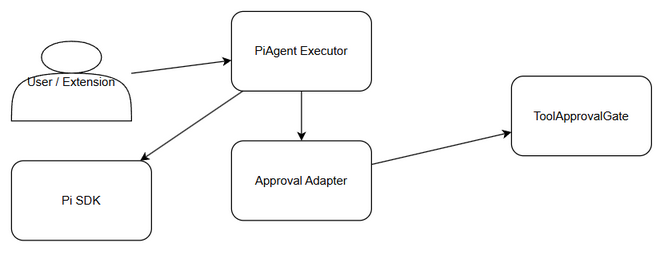
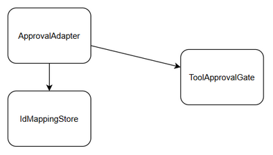
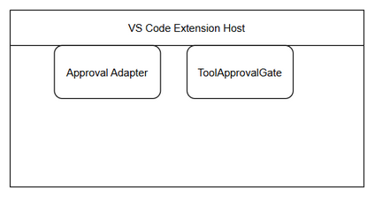

# Technical Design Document (TDD)

## SA4E-289 — SA4E-295: Approval Adapter

---

## Document Information

| Field | Value |
|-------|-------|
| Jira Ticket | SA4E-295 |
| Title | SA4E-289.6 – Approval Adapter |
| Author | SA Agent |
| Version | 1.0 |
| Date | 2026-09-16 |
| Status | Draft |
| Related BRD | documents/SA4E-295/BRD.md |
| Related FSD | documents/SA4E-295/FSD.md |

---

## Author Tracking

| Role | Name - Position | Responsibility |
|------|-----------------|----------------|
| Author | SA Agent – Solution Architect | Create document |
| Peer Reviewer | TBD – Technical Lead | Review document |

---

## Revision History

| Version | Date | Author | Changes |
|---------|------|--------|---------|
| 1.0 | 2026-09-16 | SA Agent | Initiate document — auto-generated from BRD and FSD |

---

## Sign-Off

| Name | Signature and date |
|------|--------------------|
| | ☐ I agree and confirm the technical design in this TDD |
| | ☐ I agree and confirm the technical design in this TDD |

---

## 1. Introduction

### 1.1 Purpose
Design the `approval-adapter.ts` component within `src/pi-workflow/` to bridge Pi SDK tool execution with the existing `ToolApprovalGate` human-in-the-loop approval mechanism, normalize `tool_use_id` formats, and preserve audit trail without modifying core gate logic.

### 1.2 Scope
- Implement `src/pi-workflow/approval-adapter.ts` as adapter between PiAgent Executor and ToolApprovalGate.
- Provide bidirectional ID normalization `piToExtensionId` / `extensionToPiId`.
- Expose `requestApproval(toolCall)` compatible with Pi SDK agent loop.
- Maintain session-scoped mapping for idempotency and audit logging.
Out of scope: UI changes, ToolApprovalGate core policy changes, new approval types.

### 1.3 Technology Stack

| Layer | Technology | Version |
|-------|-----------|---------|
| Language | TypeScript | 5.x |
| Framework | VS Code Extension + Pi SDK | @earendil-works/pi-agent-core |
| Runtime | Node.js | 20+ |
| Logging | Pino | latest |
| Testing | Vitest | latest |

### 1.4 Design Principles
- Adapter Pattern — isolate Pi SDK from ToolApprovalGate
- Idempotency — safe retry for repeated tool calls
- Minimal change — no modification to ToolApprovalGate core
- Auditability — structured logging with ticketKey/sessionId

### 1.5 Constraints
- Adapter latency <10ms per tool call per NFR
- Support 100+ parallel sessions
- No sensitive data in logs

### 1.6 References
| Document | Location |
|----------|----------|
| BRD | documents/SA4E-295/BRD.md |
| FSD | documents/SA4E-295/FSD.md |
| Pi Migration Plan | documents/pi-migration-plan.md |

---

## 2. System Architecture

### 2.1 Architecture Overview


*[Edit in draw.io](diagrams/architecture.drawio)*

The Approval Adapter sits between PiAgent Executor and ToolApprovalGate. Pi SDK issues tool calls with `piToolUseId`. Adapter normalizes to extension id, delegates approval evaluation to existing gate, then translates result back to Pi toolResult format.

### 2.2 Component Diagram


*[Edit in draw.io](diagrams/component.drawio)*

| Component | Responsibility | Technology |
|-----------|---------------|------------|
| ApprovalAdapter | ID normalization, requestApproval facade | TypeScript class |
| IdMappingStore | Session-scoped in-memory map with TTL | Map<string,string> |
| ToolApprovalGate | Existing human approval policy engine | extension/src/chat/engine/ToolApprovalGate.ts |
| PiAgentExecutor | Single turn Pi SDK executor | src/pi-workflow/pi-agent-executor.ts |
| CheckpointerAdapter | Persist mapping via remote checkpointer | src/pi-workflow/checkpointer-adapter.ts |

### 2.3 Deployment Architecture


*[Edit in draw.io](diagrams/deployment.drawio)*

Runs in-process within VS Code extension host. No separate service. State persisted via existing RemoteCheckpointer backend.

### 2.4 Communication Patterns

| From | To | Protocol | Pattern | Description |
|------|----|----------|---------|-------------|
| PiAgentExecutor | ApprovalAdapter | In-process | Sync | requestApproval(toolCall) |
| ApprovalAdapter | ToolApprovalGate | In-process | Async/Promise | evaluate(context) |
| ApprovalAdapter | CheckpointerAdapter | Async | Fire-and-forget | Persist mapping |

---

## 3. API Design

Internal module interface, no HTTP API.

### 3.1 API Overview

| # | Method | Description | Source |
|---|--------|-------------|--------|
| 1 | normalizeId(piToolUseId, sessionId, ticketKey) | Convert Pi id to extension id | UC-295-01 |
| 2 | requestApproval(toolCall) | Delegate approval to gate | UC-295-02 |

### 3.2 API: normalizeId

**Implements:** UC-295-01, BR-295-01, BR-295-02

| Attribute | Value |
|-----------|-------|
| Method | normalizeId(piToolUseId: string, sessionId: string, ticketKey: string): string |
| Auth | In-process |

**Error Codes:** ADAPTER-001 Missing tool_use_id, ADAPTER-002 Invalid session

### 3.3 API: requestApproval

**Implements:** UC-295-02

| Attribute | Value |
|-----------|-------|
| Method | async requestApproval(toolCall: PiToolCall): Promise<PiToolResult> |

Error Codes: ADAPTER-003 Approval gate timeout, ADAPTER-004 Mapping failure

---

## 4. Database Design

No new database tables. Mapping is session-scoped in-memory with optional persistence via Checkpointer Adapter.

Logical entity ToolIdMapping per FSD §4.

---

## 5. Class / Module Design

### 5.1 Package Structure
```
src/pi-workflow/
├── approval-adapter.ts
```

### 5.2 Key Interfaces
ApprovalAdapter with normalizeId, extensionToPiId, requestApproval.

### 5.3 Design Patterns
Adapter, Factory, Observer

---

## 6. Integration Design

ToolApprovalGate integration in-process, timeout 5s, one retry.

---

## 7. Security Design

Internal module. Audit retention 90 days. No sensitive data in logs.

---

## 8. Performance & Scalability

Latency <10ms, 100+ parallel sessions, in-memory Map with TTL cleanup.

---

## 9. Monitoring & Observability

Structured JSON logging with ticketKey, sessionId. Metrics from ToolApprovalGate.

---

## 10. Deployment Considerations

Feature flag `piApprovalAdapterEnabled`. Rollback by disabling flag.

---

## 11. E2E Test Architecture

Framework Vitest + Playwright, TypeScript. Tests in backend/tests/e2e/*.e2e.test.ts

---

## Appendix

Glossary and open questions.

