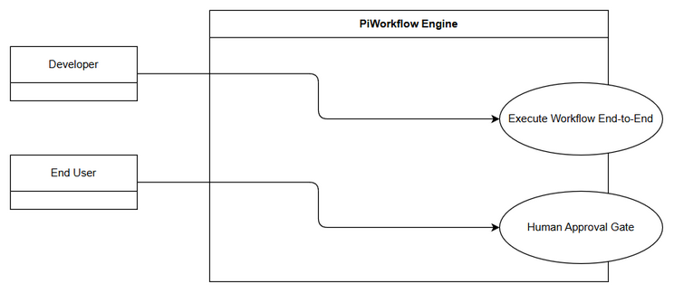
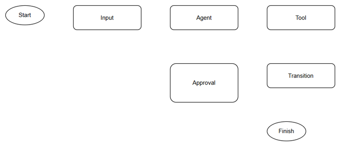

# Business Requirements Document (BRD)

## SDLC Agents 4 Enterprise VS Code Extension – Pi Workflow Engine — SA4E-296: SA4E-289.7 – Integration & Human Approval Logic

---

## Document Information

| Field | Value |
|-------|-------|
| Jira Ticket | SA4E-296 |
| Title | SA4E-289.7 – Integration & Human Approval Logic |
| Author | BA Agent |
| Version | 1.0 |
| Date | 2026-09-16 |
| Status | Draft |

---

## Author Tracking

| Role | Name - Position | Responsibility |
|------|-----------------|----------------|
| Author | BA Agent – Business Analyst | Create document |
| Peer Reviewer | TBD – SM | Review document |

---

## Revision History

| Version | Date | Author | Changes |
|---------|------|--------|---------|
| 1.0 | 2026-09-16 | BA Agent | Initiate document — auto-generated from Jira ticket SA4E-296 and linked tickets |

---

## Sign-Off

| Name | Signature and date |
|------|--------------------|
| | ☐ I agree and confirm all criteria on this BRD as expected requirements |
| | ☐ I agree and confirm all criteria on this BRD as expected requirements |

---

## 1. Introduction

### 1.1 Scope

Kết nối toàn bộ PiWorkflow engine, test flow end-to-end, giữ human-in-the-loop. Parent Epic SA4E-289 Migrate LangGraph Workflow Engine to Pi SDK Option C.

Thay thế hoàn toàn LangGraph workflow execution engine bằng Pi SDK (@earendil-works/pi-agent-core) theo Option C Full Replacement, đảm bảo pipeline SDLC vẫn chạy liền mạch, state management và checkpointing giữ tương thích ngược, và cơ chế Human Approval Gate được bảo toàn trong vòng đời tool use.

### 1.2 Out of Scope

- Xóa bỏ LangGraph engine và cleanup code, testing QA toàn diện thuộc SA4E-297
- Thiết kế kiến trúc Pi SDK Provider, PiAgent Executor, Phase Router, State Adapter, Checkpointer Adapter, Approval Adapter đã được định nghĩa ở các story SA4E-290 tới SA4E-295
- Thay đổi logic nghiệp vụ SDLC pipeline, chỉ thay đổi cơ chế execution

### 1.3 Preliminary Requirement

- Pi SDK đã cài đặt và Pi Provider tạo xong — SA4E-290
- PiAgent Executor single turn hoàn thiện — SA4E-291
- Phase Router triển khai — SA4E-292
- State Adapter và Checkpointer Adapter hoàn thiện — SA4E-293, SA4E-294
- Approval Adapter hoàn thiện — SA4E-295
- Tài liệu migration plan documents/pi-migration-plan.md đã duyệt

---

## 2. Business Requirements

### 2.1 High Level Process Map

*[Edit in draw.io](diagrams/use-case.drawio)*

*[Edit in draw.io](diagrams/business-flow.drawio)*

Quy trình cấp cao:
User Input → Intent Classification → Phase Selection → Agent Assignment → Tool Use Loop → Human Approval Gate nếu cần → Phase Transition Check → Persist State via RemoteCheckpointer → Next Phase hoặc Finish.

### 2.2 List of User Stories / Use Cases

| # | Story / Use Case / Epic | Priority | Source Ticket |
|---|-------------------------|----------|---------------|
| 1 | As a developer, I want PiWorkflow engine fully integrated with existing SDLC pipeline so that workflows execute end-to-end using Pi SDK | MUST HAVE | SA4E-296 |
| 2 | As an end user, I want human approval gate preserved during tool execution so that I can review and approve/reject actions | MUST HAVE | SA4E-296 |
| 3 | As a QA engineer, I want end-to-end test flow validated so that migration does not break existing pipeline behavior | SHOULD HAVE | SA4E-296 |

---

### 2.3 Details of User Stories

---

#### Business Flow

**Step 1:** Nhận ticket và phase hiện tại từ PipelineState
**Step 2:** Adapter chuyển đổi PipelineState → Pi SDK internal state, gán piSessionId và currentAgentId
**Step 3:** PiAgent Executor thực thi một turn agent với Pi SDK
**Step 4:** Nếu agent yêu cầu tool call, kiểm tra ToolApprovalGate
**Step 5:** Nếu tool cần approval, tạm dừng workflow và gửi yêu cầu approval tới user
**Step 6:** User quyết định Approve/Reject, quyết định được persist
**Step 7:** Workflow tiếp tục với kết quả tool, thực hiện Phase Transition Check
**Step 8:** Persist state qua RemoteCheckpointer, chuyển sang phase tiếp theo hoặc hoàn thành

> **Note:** Human-in-the-loop phải được bảo toàn y hệt hành vi cũ của LangGraph ToolApprovalGate, bao gồm rememberPattern.

---

#### STORY 1: PiWorkflow Engine Integration End-to-End

> As a developer, I want PiWorkflow engine fully integrated with existing SDLC pipeline so that workflows execute end-to-end using Pi SDK

**Requirement Details:**

1. Kết nối toàn bộ PiWorkflow engine với pipeline SDLC hiện hữu, thay thế LangGraphEngine.invoke(state) bằng workflow.execute(ticket, phase, input)
2. Đảm bảo state mapping PipelineState <-> Pi SDK state qua StateAdapter, giữ các field critical: ticketKey, threadId, currentPhase, pipelineStatus, chatHistory, agentOutputs, errors, pipelineDefinition, autonomyLevel
3. Thêm các field Pi SDK compatibility: piSessionId, currentAgentId, toolCallCount
4. Tích hợp CheckpointerAdapter để serialize/deserialize Pi state về RemoteCheckpointer backend không thay đổi
5. Thực hiện phase routing dựa trên logic cũ của LangGraph edges

**Data Fields (if applicable):**

| Field | Type | Required | Description | Example |
|-------|------|----------|-------------|---------|
| piSessionId | string | Yes | Internal Pi session ID | pi_sess_abc123 |
| currentAgentId | string | Yes | Agent đang thực thi | ba-agent |
| toolCallCount | integer | Yes | Số lượng tool calls đã thực hiện | 3 |
| approvalDecision | string | No | Quyết định approval cuối cùng | approve/reject |
| pipelineStatus | string | Yes | Trạng thái pipeline | running/paused/finished |

**Acceptance Criteria:**

1. Workflow chạy end-to-end cho một ticket mẫu từ phase Requirements đến Implementation mà không gọi LangGraphEngine
2. State sau mỗi turn được persist đúng vào RemoteCheckpointer và có thể resume
3. Phase transition xảy ra chính xác theo định nghĩa pipeline
4. Không có lỗi mapping state giữa PipelineState và Pi SDK state

**UI Specifications (if applicable):**

| No. | Name | Type | Required | Description | Note |
|-----|------|------|----------|-------------|------|
| 1 | Workflow Status Indicator | Label | Yes | Hiển thị trạng thái pipeline hiện tại | Cũ |
| 2 | Approval Request Notification | Toast/Panel | Yes | Thông báo yêu cầu approval tool | Giữ nguyên UX |

**Validation Rules (if applicable):**

- piSessionId phải unique cho mỗi thread
- currentPhase phải thuộc danh sách phase hợp lệ
- toolCallCount không âm

**Error Handling (if applicable):**

- State mapping lỗi: Log error và fallback về state trước đó
- Pi SDK exception: Capture error vào PipelineState.errors và pause workflow

---

#### STORY 2: Human Approval Logic Preservation

> As an end user, I want human approval gate preserved during tool execution so that I can review and approve/reject actions

**Requirement Details:**

1. Normalize tool_use_id format giữa Pi SDK và ToolApprovalGate cũ
2. ToolApprovalGate chặn tool call cần approval, gửi yêu cầu tới user interface
3. User quyết định approve/reject với optional rememberPattern
4. Quyết định được lưu vào state và workflow tiếp tục

**Acceptance Criteria:**

1. Tool call yêu cầu approval bị tạm dừng và hiển thị prompt approval cho user
2. Khi user approve, tool được thực thi và kết quả trả về agent
3. Khi user reject, workflow ghi log và chuyển sang xử lý alternative flow
4. rememberPattern được tôn trọng cho các lần gọi tool tương tự

**Validation Rules:**

- Decision phải là approve hoặc reject
- ToolId phải tồn tại trong danh sách tool calls đang chờ

**Error Handling:**

- Approval timeout: Workflow pause 10 phút sau đó auto-reject và thông báo

---

#### STORY 3: End-to-End Test Flow Validation

> As a QA engineer, I want end-to-end test flow validated so that migration does not break existing pipeline behavior

**Requirement Details:**

1. Chạy flow test end-to-end với ticket mẫu
2. So sánh output và state với baseline LangGraph

**Acceptance Criteria:**

1. Kết quả pipeline output khớp baseline với sai lệch < 5%
2. Human approval flow hoạt động đúng trong test scenario
3. Checkpoint resume hoạt động sau restart

---

## 3. Dependencies

| Dependency | Type | Related Ticket | Description |
|------------|------|----------------|-------------|
| Pi SDK Setup | Infrastructure | SA4E-290 | Install Pi SDK & Pi Provider |
| PiAgent Executor | System | SA4E-291 | Single turn executor |
| Phase Router | System | SA4E-292 | Phase transition logic |
| State Adapter | System | SA4E-293 | PipelineState <-> Pi state mapping |
| Checkpointer Adapter | System | SA4E-294 | RemoteCheckpointer adaptation |
| Approval Adapter | System | SA4E-295 | ToolApprovalGate adaptation |
| Migration Plan | Document | N/A | documents/pi-migration-plan.md |

---

## 4. Stakeholders

| Role | Name / Team | Responsibility | Source |
|------|-------------|----------------|--------|
| Reporter | Duc Nguyen Minh | Epic owner | SA4E-296 |
| BA | BA Agent | Requirements definition | SA4E-296 |
| Dev | TBD | Implementation | SA4E-289 |

---

## 5. Risks and Assumptions

### 5.1 Risks

| Risk | Impact | Likelihood | Mitigation |
|------|--------|------------|------------|
| Pi SDK state serialization không tương thích với RemoteCheckpointer | High | Medium | Sử dụng StateAdapter và test serialization sớm |
| Human approval UX bị thay đổi | Medium | Medium | Giữ nguyên ToolApprovalGate interface |
| Performance giảm do custom executor | Medium | Low | Benchmark so sánh với LangGraph baseline |

### 5.2 Assumptions

- Các adapter SA4E-293 tới SA4E-295 đã hoàn thiện và đúng spec
- RemoteCheckpointer backend không thay đổi
- Pi SDK phiên bản ổn định và hỗ trợ streaming

---

## 6. Non-Functional Requirements

| Category | Requirement | Details |
|----------|-------------|---------|
| Performance | Workflow execution latency | Không tăng > 15% so với LangGraph baseline |
| Security | Human approval audit trail | Mọi quyết định approval được log |
| Scalability | Concurrent workflows | Hỗ trợ ít nhất 10 concurrent sessions |
| Availability | State persistence | Checkpoint save success rate > 99% |

---

## 7. Related Tickets

| Ticket Key | Summary | Status | Type | Relationship |
|------------|---------|--------|------|--------------|
| SA4E-296 | SA4E-289.7 – Integration & Human Approval Logic | To Do | Story | Main ticket |
| SA4E-289 | Migrate LangGraph Workflow Engine to Pi SDK (Option C) | To Do | Epic | Epic parent |
| SA4E-295 | SA4E-289.6 – Approval Adapter | To Do | Story | Relates to |
| SA4E-294 | SA4E-289.5 – Checkpointer Adapter | To Do | Story | Relates to |
| SA4E-293 | SA4E-289.4 – State Adapter | To Do | Story | Relates to |
| SA4E-292 | SA4E-289.3 – Phase Router | To Do | Story | Relates to |
| SA4E-291 | SA4E-289.2 – PiAgent Executor single turn | To Do | Story | Relates to |
| SA4E-290 | SA4E-289.1 – Setup Pi SDK & Pi Provider | In Progress | Story | Relates to |
| SA4E-297 | SA4E-289.8 – Testing QA & LangGraph Cleanup | To Do | Story | Follows |

---

## 8. Appendix

### Glossary

| Term | Definition |
|------|------------|
| Pi SDK | @earendil-works/pi-agent-core |
| PiWorkflow Engine | Custom workflow orchestrator built on Pi SDK primitives |
| ToolApprovalGate | Human-in-the-loop approval logic for tool use |
| RemoteCheckpointer | Backend persistence for workflow state |

### Reference Documents

| Document | Link / Location |
|----------|-----------------|
| Pi Migration Plan | documents/pi-migration-plan.md |
| Epic SA4E-289 | Jira SA4E-289 |
