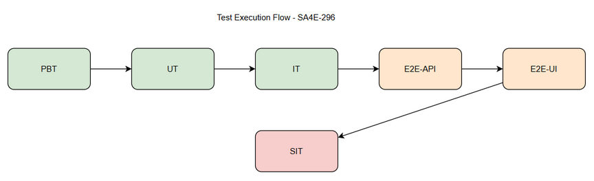
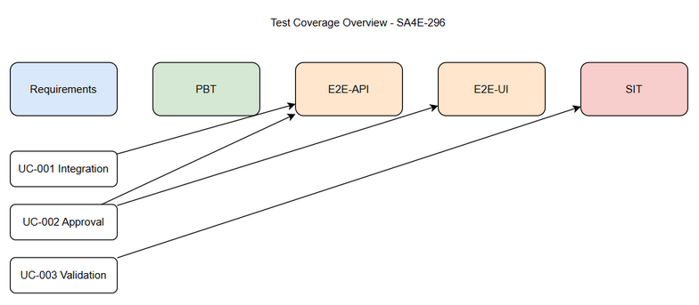

# Software Test Plan (STP)

## SDLC Agents 4 Enterprise – SA4E-296: SA4E-289.7 – Integration & Human Approval Logic

---

## Document Information

| Field | Value |
|-------|-------|
| Jira Ticket | SA4E-296 |
| Title | SA4E-289.7 – Integration & Human Approval Logic |
| Author | QA Agent |
| Version | 1.0 |
| Date | 2026-09-16 |
| Status | Draft |
| Related BRD | documents/SA4E-296/BRD.md |
| Related FSD | documents/SA4E-296/FSD.md |
| Related TDD | documents/SA4E-296/TDD.md |

---

## Author Tracking

| Role | Name - Position | Responsibility |
|------|-----------------|----------------|
| Author | QA Agent – QA Engineer | Create document |
| Peer Reviewer | TBD – SM | Review document |

---

## Revision History

| Version | Date | Author | Changes |
|---------|------|--------|---------|
| 1.0 | 2026-09-16 | QA Agent | Initiate document — auto-generated from BRD, FSD, and TDD |

---

## Sign-Off

| Name | Signature and date |
|------|--------------------|
| | ☐ I agree and confirm the test plan in this STP |
| | ☐ I agree and confirm the test plan in this STP |

---

## 1. Introduction

### 1.1 Purpose
Test Plan for SA4E-296 Integration & Human Approval Logic. Mục tiêu đảm bảo PiWorkflow engine tích hợp hoàn toàn với SDLC pipeline hiện hữu, state mapping và checkpointing tương thích ngược, và cơ chế Human Approval Gate được bảo toàn y hệt hành vi LangGraph cũ.

### 1.2 Test Objectives
- Verify PiWorkflow engine chạy end-to-end từ Requirements → Implementation không gọi LangGraphEngine
- Validate StateAdapter mapping PipelineState ↔ Pi SDK state không lỗi, persist/resume qua RemoteCheckpointer
- Validate Phase Router chuyển phase chính xác theo pipeline definition
- Verify Human Approval Gate chặn tool call, hiển thị prompt, xử lý approve/reject và rememberPattern
- Ensure non-functional requirements: latency ≤ +15% vs LangGraph, checkpoint success >99%, concurrent ≥10
- Confirm audit trail approval decisions được log

### 1.3 References

| Document | Location |
|----------|----------|
| BRD | documents/SA4E-296/BRD.md |
| FSD | documents/SA4E-296/FSD.md |
| TDD | documents/SA4E-296/TDD.md |

---

## 2. Test Strategy

### 2.1 Test Levels

| Level | Scope | Automation | Tools |
|-------|-------|------------|-------|
| PBT | Correctness properties random inputs | Automated | fast-check |
| UT | Unit/edge case tests | Automated | vitest |
| IT | API integration Hono app in-process | Automated | vitest + Hono `app.request()` |
| E2E-API | REST endpoint E2E real server | Automated | vitest + fetch |
| E2E-UI | Browser UI E2E Playwright | Automated | Playwright |
| SIT | Manual exploratory / edge cases only | Manual | Browser |

### 2.2 Test Cases Summary

| Level | Count | Automated | Manual |
|-------|-------|-----------|--------|
| PBT | 3 | 3 | 0 |
| UT | 12 | 12 | 0 |
| IT | 8 | 8 | 0 |
| E2E-API | 6 | 6 | 0 |
| E2E-UI | 5 | 5 | 0 |
| SIT | 4 | 0 | 4 |
| **Total** | **38** | **34 (89%)** | **4 (11%)** |

### 2.3 Test Types
| Type | Description | Applicable |
|------|-------------|------------|
| Functional Testing | Verify features per FSD use cases UC-001/002/003 | Yes |
| Regression Testing | Ensure SDLC pipeline behavior unchanged | Yes |
| Performance Testing | Latency ≤15% vs LangGraph, checkpoint success >99% | Yes |
| Security Testing | Approval audit trail, auth | Yes |
| UI Testing | Workflow Status Indicator, Approval Notification | Yes |

### 2.4 Test Approach
Risk-based prioritization: Story 1 Integration End-to-End và Story 2 Human Approval là MUST HAVE, ưu tiên automate E2E-API/E2E-UI để giảm manual SIT. SIT manual chỉ cho visual timing và UX judgment.

**E2E Automation Coverage:**
- CRUD workflow execute → E2E-API
- Approval approve/reject flow → E2E-UI
- Phase transition → E2E-API
- State persist/resume → E2E-API
- UI notification toast → E2E-UI
- Blocking overlay timing → SIT manual

### 2.5 Entry Criteria

| Level | Entry Criteria |
|-------|---------------|
| SIT | Code deployed to SIT, unit tests passed, Pi SDK installed, test data prepared, feature toggle workflow.engine='pi' enabled |
| UAT | SIT completed with 0 Critical, ≤2 Major open, UAT environment ready |

### 2.6 Exit Criteria

| Level | Exit Criteria |
|-------|--------------|
| SIT | 100% test cases executed, 0 Critical defects, ≤2 Major defects open, coverage RTM ≥95% |
| UAT | All UAT scenarios passed, business sign-off obtained |

---

## 3. Test Scope

### 3.1 Features In Scope

| # | Feature / Story | Priority | FSD Reference | Test Type |
|---|----------------|----------|---------------|-----------|
| 1 | PiWorkflow Engine Integration End-to-End | High | UC-001, Story 1 | Functional/E2E-API |
| 2 | Human Approval Logic Preservation | High | UC-002, Story 2 | Functional/E2E-UI |
| 3 | End-to-End Test Flow Validation | Medium | UC-003, Story 3 | Regression/Performance |
| 4 | StateAdapter mapping & Checkpointer | High | BR-001 | Integration |
| 5 | Phase Router transition | High | BR-002 | Functional |
| 6 | Approval Adapter normalizeToolUseId | High | BR-003 | Functional |

### 3.2 Features Out of Scope
| # | Feature | Reason |
|---|---------|--------|
| 1 | Xóa LangGraph engine và cleanup code | Thuộc SA4E-297 |
| 2 | Thiết kế kiến trúc Pi SDK Provider | Đã hoàn thiện SA4E-290..295 |
| 3 | Thay đổi logic nghiệp vụ SDLC pipeline | Chỉ thay đổi cơ chế execution |

---

## 4. Test Environment

### 4.1 Environment Requirements
| Environment | URL | Database | Purpose |
|-------------|-----|----------|---------|
| SIT | http://localhost:3000 | SQLite dev | System Integration Testing |
| UAT | http://uat.sdcl.app | PostgreSQL | User Acceptance Testing |

### 4.2 Browser Requirements
| Browser | Version | OS | Required |
|---------|---------|----|----------|
| Chrome | 120+ | Windows/Mac | Yes |
| Edge | 120+ | Windows | No |

### 4.3 Test Data Requirements
| Data Type | Description | Source | Preparation |
|-----------|-------------|--------|-------------|
| Pre-seeded tickets | Sample ticket SA4E-296 flow | DB seed | Insert via script |
| Approval test data | Tool calls requiring approval | CSV | pre-seeded-users.csv |
| State snapshots | PipelineState examples | JSON | testdata/state-samples.json |

### 4.4 External Dependencies
| System | Dependency | Mock/Stub |
|--------|------------|-----------|
| Pi SDK | @earendil-works/pi-agent-core | No |
| RemoteCheckpointer | Hono backend | Stub for unit tests |

---

## 5. Test Schedule

| Phase | Start Date | End Date | Duration | Milestone |
|-------|-----------|----------|----------|-----------|
| Test Planning | 2026-09-16 | 2026-09-17 | 2d | STP + STC approved |
| Test Data Prep | 2026-09-17 | 2026-09-18 | 2d | Test data ready |
| SIT Execution | 2026-09-19 | 2026-09-23 | 5d | SIT sign-off |
| Defect Fix & Retest | 2026-09-24 | 2026-09-26 | 3d | Critical/Major fixed |
| UAT Execution | 2026-09-27 | 2026-09-29 | 3d | UAT sign-off |

---

## 6. Resources & Responsibilities

| Role | Name | Responsibility |
|------|------|---------------|
| Test Lead | QA Agent | Test planning, coordination |
| QA Engineer | QA Agent | Test case design/execution |
| BA | BA Agent | UAT support |
| Developer | TBD | Bug fixing |
| DevOps | TBD | Environment setup |

---

## 7. Risk & Mitigation

| # | Risk | Impact | Likelihood | Mitigation |
|---|------|--------|------------|------------|
| 1 | Pi SDK state serialization không tương thích RemoteCheckpointer | High | Medium | StateAdapter test sớm, unit test serialization |
| 2 | Human approval UX bị thay đổi | Medium | Medium | Giữ nguyên ToolApprovalGate interface, E2E-UI kiểm tra |
| 3 | Performance giảm >15% | Medium | Low | Benchmark vs LangGraph baseline |
| 4 | Approval timeout | Medium | Low | Test timeout 10 min auto-reject |

---

## 8. Defect Management

### 8.1 Severity Levels
| Severity | Definition | Example |
|----------|-----------|---------|
| Critical | System crash, data loss, security breach | State mapping lỗi mất dữ liệu |
| Major | Feature not working, workaround exists | Approval gate không chặn |
| Minor | UI issue | Notification toast sai vị trí |
| Trivial | Typo | Label sai chính tả |

### 8.2 Priority Levels
| Priority | Definition | SLA |
|----------|-----------|-----|
| P1 | Must fix immediately | 4h |
| P2 | Must fix before release | 1 day |
| P3 | Should fix if time permits | 3 days |
| P4 | Nice to fix | Next release |

### 8.3 Defect Lifecycle
New → Open → In Progress → Fixed → Ready for Retest → Verified → Closed

---

## 9. Test Metrics & Reporting

### 9.1 Metrics
| Metric | Target |
|--------|--------|
| Test Execution Rate | 100% |
| Pass Rate | ≥ 95% |
| Defect Density | ≤ 0.1 |
| Critical Defect Count | 0 |
| Defect Fix Rate | ≥ 90% |

### 9.2 Reporting
Daily Test Status during SIT/UAT, Defect Summary daily, Test Completion Report end of SIT/UAT.

---

## 10. Appendix

### Glossary
SIT, UAT, STP, STC, Pi SDK, ToolApprovalGate

### Assumptions
- Adapters SA4E-293..295 đã hoàn thiện
- RemoteCheckpointer backend không thay đổi
- Pi SDK stable

