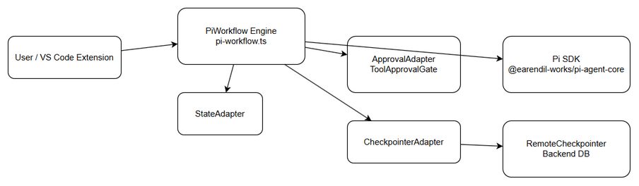
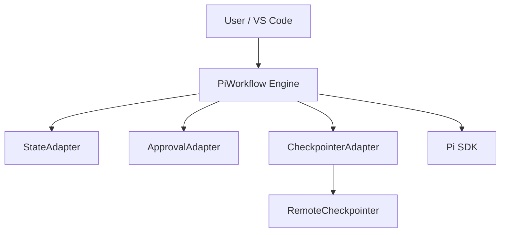
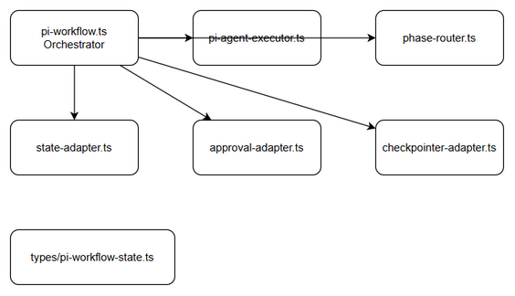
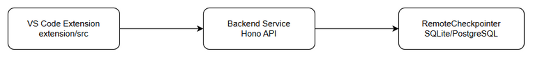
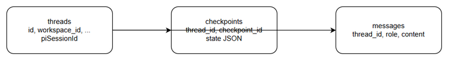
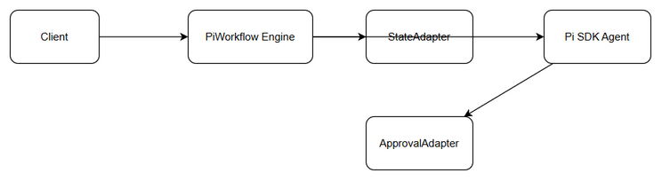

# Technical Design Document (TDD)

## SA4E-296 — SA4E-289.7 – Integration & Human Approval Logic

---

## Document Information

| Field | Value |
|-------|-------|
| Jira Ticket | SA4E-296 |
| Title | SA4E-289.7 – Integration & Human Approval Logic |
| Author | SA Agent |
| Version | 1.0 |
| Date | 2026-09-16 |
| Status | Draft |
| Related BRD | documents/SA4E-296/BRD.md |
| Related FSD | documents/SA4E-296/FSD.md |

---

## Author Tracking

| Role | Name - Position | Responsibility |
|------|-----------------|----------------|
| Author | SA Agent – Solution Architect | Create document |
| Peer Reviewer | TBD – SM | Review document |

---

## Revision History

| Version | Date | Author | Changes |
|---------|------|--------|---------|
| 1.0 | 2026-09-16 | SA Agent | Initiate document — auto-generated from BRD and FSD |

---

## 1. Introduction

### 1.1 Purpose
Design technical implementation for full integration of PiWorkflow engine built on Pi SDK replacing LangGraph execution engine, preserving human-in-the-loop approval gates and end-to-end SDLC pipeline execution.

### 1.2 Scope
Technical scope covers extension/src/pi-workflow/ orchestrator, StateAdapter, ApprovalAdapter, CheckpointerAdapter, PhaseRouter, PiAgent Executor. Feature toggle workflow.engine='pi'. No functional requirement redefinition.

### 1.3 Technology Stack

| Layer | Technology | Version |
|-------|-----------|---------|
| Language | TypeScript | 5.x |
| Framework | VS Code Extension API + Pi SDK | @earendil-works/pi-agent-core |
| Backend | Hono + Better-SQLite3 | v4 |
| Build Tool | npm | 10.x |
| Container | N/A | - |

### 1.4 Design Principles
- Backward compatibility of PipelineState
- Human-in-the-loop preservation
- Adapter pattern for state/checkpointer/approval
- Minimal latency overhead ≤15% vs LangGraph

### 1.5 Constraints
- Pi SDK does not provide compiled workflow engine; custom executor required
- RemoteCheckpointer backend unchanged
- Approval UX must remain identical

### 1.6 References
| Document | Location |
|----------|----------|
| BRD | documents/SA4E-296/BRD.md |
| FSD | documents/SA4E-296/FSD.md |
| Pi Migration Plan | documents/pi-migration-plan.md |

---

## 2. System Architecture

### 2.1 Architecture Overview
PiWorkflow Engine replaces LangGraphEngine.invoke(state) with workflow.execute(ticket, phase, input). State flows through adapters to Pi SDK internal state, tool approval gate intercepts tool calls, phase router drives transitions.


*[Edit in draw.io](diagrams/architecture.drawio)*



### 2.2 Component Diagram


*[Edit in draw.io](diagrams/component.drawio)*

| Component | Responsibility | Technology |
|-----------|---------------|------------|
| pi-workflow.ts | Main orchestrator, execute loop | TypeScript |
| pi-agent-executor.ts | Single turn PiAgent execution | Pi SDK |
| phase-router.ts | Phase transition logic | TypeScript |
| state-adapter.ts | PipelineState <-> Pi state mapping | TypeScript |
| approval-adapter.ts | ToolApprovalGate adaptation | TypeScript |
| checkpointer-adapter.ts | RemoteCheckpointer serialization | TypeScript |
| types/pi-workflow-state.ts | Extended state schema | TypeScript |

### 2.3 Deployment Architecture


*[Edit in draw.io](diagrams/deployment.drawio)*

Extension runs in VS Code host, backend Hono service provides RemoteCheckpointer API, SQLite/PostgreSQL persists threads/checkpoints.

### 2.4 Communication Patterns

| From | To | Protocol | Pattern | Description |
|------|----|----------|---------|-------------|
| Extension | PiWorkflow | In-process | Sync | execute(ticket,phase,input) |
| PiWorkflow | Pi SDK | In-process | Sync | Agent turn execution |
| CheckpointerAdapter | RemoteCheckpointer | HTTP/REST | Async | Save/load state |
| ApprovalAdapter | UI | Event | Async | Approval request/notification |

---

## 3. API Design

### 3.1 API Overview
Internal API contracts defined in FSD UC-001. No external REST endpoints added; workflow.execute is internal.

| # | Endpoint | Method | Description | Source |
|---|----------|--------|-------------|--------|
| 1 | workflow.execute | invoke | Execute PiWorkflow turn | UC-001 |
| 2 | handleToolApproval | invoke | Process approval decision | UC-002 |

### 3.2 API: workflow.execute
**Implements:** UC-001, BR-001

| Attribute | Value |
|-----------|-------|
| Method | invoke |
| Path | internal |
| Auth | N/A |
| Rate Limit | N/A |

**Input:**
```json
{
  "ticketKey": "SA4E-296",
  "threadId": "uuid",
  "currentPhase": "Requirements",
  "input": {}
}
```

**Output:**
```json
{
  "pipelineState": {
    "ticketKey": "SA4E-296",
    "piSessionId": "pi_sess_abc123",
    "currentAgentId": "ba-agent",
    "toolCallCount": 3,
    "pipelineStatus": "running"
  }
}
```

---

## 4. Database Design

### 4.1 Schema Overview
RemoteCheckpointer uses existing Knowledge DB schema. Pi integration adds piSessionId to threads, state JSON includes Pi fields.


*[Edit in draw.io](diagrams/db-schema.drawio)*

### 4.2 DDL Scripts
No new tables. Existing schema extended via state JSON.

Existing tables: threads, checkpoints, messages, tool_executions.

### 4.3 Migration Plan
State schema migration via StateAdapter; no DDL changes.

---

## 5. Class / Module Design

### 5.1 Package Structure
```
extension/src/pi-workflow/
├── pi-workflow.ts
├── pi-agent-executor.ts
├── phase-router.ts
├── state-adapter.ts
├── approval-adapter.ts
├── checkpointer-adapter.ts
└── types/
    └── pi-workflow-state.ts
```

### 5.2 Key Interfaces
```typescript
export interface IStateAdapter {
  toPiState(state: PipelineState): PiInternalState;
  fromPiState(piState: PiInternalState): PipelineState;
}
export interface IApprovalAdapter {
  normalizeToolUseId(toolCall: any): string;
  handleApproval(decision: 'approve'|'reject'): void;
}
```

### 5.3 Design Patterns
| Pattern | Where Used | Rationale |
|---------|-----------|-----------|
| Adapter | StateAdapter, ApprovalAdapter, CheckpointerAdapter | Bridge Pi SDK to existing pipeline |
| Strategy | PhaseRouter | Pluggable transition rules |
| Repository | CheckpointerAdapter | Abstract persistence |

### 5.4 Error Handling
| Exception | HTTP Status | Error Code | When Thrown |
|-----------|-------------|------------|------------|
| STATE_MAPPING_ERROR | - | ERR_STATE_MAP | Adapter mapping fails |
| APPROVAL_TIMEOUT | - | ERR_APPROVAL_TIMEOUT | No decision in 10 min |
| PI_SDK_ERROR | - | ERR_PI_SDK | Pi SDK exception |

---

## 6. Integration Design

### 6.1 External System: Pi SDK
| Attribute | Value |
|-----------|-------|
| Protocol | In-process NPM |
| Endpoint | @earendil-works/pi-agent-core |
| Authentication | N/A |
| Timeout | 30s |
| Retry Policy | 3x exponential backoff |

**Sequence Diagram:**


*[Edit in draw.io](diagrams/api-sequence-execute.drawio)*

### 6.2 RemoteCheckpointer Integration
Retry 3x, serialize Pi state to JSON, preserve thread_id.

---

## 7. Security Design

### 7.1 Authentication
Extension context provides user identity; backend JWT for checkpointer API.

### 7.2 Authorization
Roles: developer, qa. Feature toggle workflow.engine='pi' controlled via config.

### 7.3 Data Protection
Approval decisions logged for audit 1 year retention. State at rest encrypted via backend.

---

## 8. Performance & Scalability

### 8.1 Caching Strategy
Pi session state cached in memory per thread TTL 30 min.

### 8.2 Connection Pooling
RemoteCheckpointer HTTP pool max 10.

### 8.3 Performance Targets
| Operation | Target | Measurement |
|-----------|--------|-------------|
| Workflow turn | < 1.15x LangGraph baseline | p95 latency |
| Checkpoint save | 99% success | Availability |

---

## 9. Monitoring & Observability

### 9.1 Logging
Approval decisions INFO level with ticketKey, toolId, decision.

### 9.2 Metrics
workflow.turn.duration, workflow.approval.wait_time, checkpoint.save.error_rate

---

## 10. Deployment Considerations

### 10.1 Environment Configuration
workflow.engine = 'pi' toggle.

### 10.2 Feature Flags
piWorkflowEnabled default false, enable per workspace.

### 10.3 Rollback Strategy
Revert workflow.engine to 'langgraph', state remains compatible.

---

## 11. E2E Test Architecture

### 11.1 Framework & Language
Framework: vitest + Playwright, Language: TypeScript

### 11.2 Test Structure
backend/tests/e2e/pi-workflow.e2e.test.ts

### 11.3 E2E-API Test Design
Validate workflow.execute end-to-end for sample ticket, verify phase transition and approval gate.

---

## Appendix

### Glossary
Pi SDK, PiWorkflow Engine, ToolApprovalGate, RemoteCheckpointer

### Open Questions
None.

---
