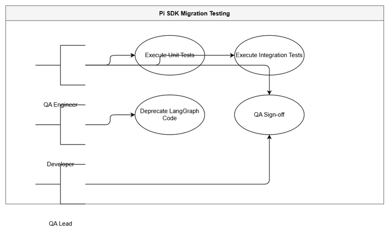
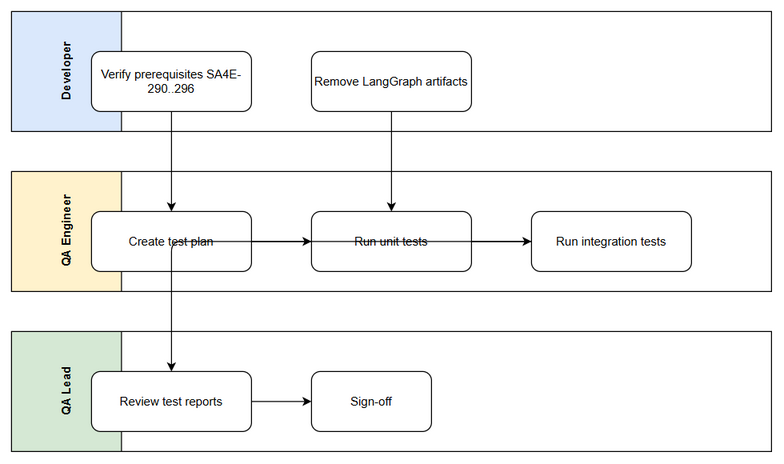

# Business Requirements Document (BRD)

## SA4E-297 — SA4E-289.8 – Testing QA & LangGraph Cleanup

---

## Document Information

| Field | Value |
|-------|-------|
| Jira Ticket | SA4E-297 |
| Title | SA4E-289.8 – Testing QA & LangGraph Cleanup |
| Author | BA Agent |
| Version | 1.0 |
| Date | 2026-09-16 |
| Status | Draft |

---

## Author Tracking

| Role | Name - Position | Responsibility |
|------|-----------------|----------------|
| Author | BA Agent – Business Analyst | Create document |
| Peer Reviewer | TBD – TBD | Review document |

---

## Revision History

| Version | Date | Author | Changes |
|---------|------|--------|---------|
| 1.0 | 2026-09-16 | BA Agent | Initiate document — auto-generated from Jira ticket SA4E-297 and linked tickets |

---

## Sign-Off

| Name | Signature and date |
|------|--------------------|
| | ☐ I agree and confirm all criteria on this BRD as expected requirements |
| | ☐ I agree and confirm all criteria on this BRD as expected requirements |

---

## 1. Introduction

### 1.1 Scope

This Business Requirements Document describes the testing, QA sign-off, and LangGraph cleanup activities for story SA4E-297 – Testing QA & LangGraph Cleanup, which is part of Epic SA4E-289 Migrate LangGraph Workflow Engine to Pi SDK Option C.

Scope includes:
- Execute unit tests and integration tests for the PiWorkflow Engine components built in previous stories SA4E-290 to SA4E-296
- Perform QA sign-off of the migration from LangGraph to Pi SDK Option C
- Deprecate and remove legacy LangGraph code, subgraphs, and state management artifacts that are no longer used
- Verify regression-free behavior and ensure the SDLC pipeline executes correctly using Pi SDK primitives
- Update references, documentation, and knowledge base to reflect removal of LangGraph dependencies

Source: Jira SA4E-297 description "Unit/integration tests, QA sign-off, deprecate/xóa code LangGraph cũ. Parent Epic SA4E-289."

### 1.2 Out of Scope

- Implementation of new Pi SDK features or bug fixes to PiWorkflow Engine — these belong to stories SA4E-290 to SA4E-296
- New functional enhancements beyond migration parity
- Production deployment activities — handled by DevOps in later phases
- Performance tuning beyond baseline QA verification

If not available from tickets, state: To be confirmed with stakeholders.

### 1.3 Preliminary Requirement

Prerequisites before execution of SA4E-297:
- Pi SDK installation and Pi Provider completed — SA4E-290
- PiAgent Executor single turn implemented — SA4E-291
- Phase Router implemented — SA4E-292
- State Adapter implemented — SA4E-293
- Checkpointer Adapter implemented — SA4E-294
- Approval Adapter implemented — SA4E-295
- Integration & Human Approval Logic implemented — SA4E-296
- Pi-migration plan reviewed — documents/pi-migration-plan.md

---

## 2. Business Requirements

### 2.1 High Level Process Map

The high-level business process for Testing QA & LangGraph Cleanup is:

QA Engineer triggers test execution against PiWorkflow Engine → Unit tests run for pi-workflow modules → Integration tests run for end-to-end SDLC pipeline → QA validation checklist executed → Defects logged if found → Developer fixes or confirms → Code cleanup removes LangGraph artifacts → Final QA sign-off → Knowledge base updated

*[Edit in draw.io](diagrams/use-case.drawio)*

*[Edit in draw.io](diagrams/business-flow.drawio)*

### 2.2 List of User Stories / Use Cases

| # | Story / Use Case / Epic | Priority | Source Ticket |
|---|-------------------------|----------|---------------|
| 1 | As a QA Engineer, I want to execute unit and integration tests for PiWorkflow Engine so that migration quality is verified | MUST HAVE | SA4E-297 |
| 2 | As a Developer, I want to deprecate and remove legacy LangGraph code so that codebase is clean and maintainable | MUST HAVE | SA4E-297 |
| 3 | As a QA Lead, I want to complete QA sign-off for Pi SDK migration so that the epic can progress to deployment | MUST HAVE | SA4E-297 |

---

### 2.3 Details of User Stories

---

#### Business Flow

**Step 1:** Verify prerequisites from SA4E-290 to SA4E-296 are completed and merged.

**Step 2:** QA Engineer creates test execution plan covering unit tests for pi-workflow/* modules, integration tests for pipeline phases, and regression scenarios.

**Step 3:** Execute unit tests for `pi-workflow.ts`, `pi-agent-executor.ts`, `phase-router.ts`, `state-adapter.ts`, `checkpointer-adapter.ts`, `approval-adapter.ts`.

**Step 4:** Execute integration tests for end-to-end ticket processing using Pi SDK workflow engine with RemoteCheckpointer backend.

**Step 5:** Validate human approval flow, tool use, and state persistence.

**Step 6:** Developer performs LangGraph cleanup: remove LangGraphEngine, subgraphs, PipelineState legacy parts, and update imports.

**Step 7:** QA re-runs regression suite after cleanup.

**Step 8:** QA Lead performs sign-off checklist.

**Step 9:** Update documents/pi-migration-plan.md references and ingest BRD/FSD into KB.

> **Note:** Cleanup must not break RemoteCheckpointer backend compatibility and must preserve `ticketKey`, `threadId`, `currentPhase`, `pipelineStatus` fields.

---

#### STORY 1: Testing QA for PiWorkflow Engine

> As a QA Engineer, I want to execute unit and integration tests for PiWorkflow Engine so that migration quality is verified

**Requirement Details:**

1. Execute unit tests for all modules under `src/pi-workflow/` including pi-workflow.ts, pi-agent-executor.ts, phase-router.ts, state-adapter.ts, checkpointer-adapter.ts, approval-adapter.ts, kb-client.ts
2. Execute integration tests for SDLC pipeline phases using Pi SDK agent execution
3. Verify phase transition logic matches previous LangGraph behavior
4. Verify state serialization/deserialization via State Adapter and Checkpointer Adapter
5. Verify Tool Approval Gate works with Pi SDK tool_use_id normalization
6. Verify streaming and context window handling
7. Log test results and defects

**Data Fields (if applicable):**

| Field | Type | Required | Description | Example |
|-------|------|----------|-------------|---------|
| ticketKey | string | Yes | Jira ticket key for test execution | SA4E-297 |
| testCaseId | string | Yes | Identifier of test case | UT-PI-001 |
| testStatus | enum | Yes | PASS / FAIL / SKIPPED | PASS |
| defectId | string | No | Jira defect key if failed | SA4E-298 |

**Acceptance Criteria:**

1. No information available from the provided tickets — acceptance criteria not explicitly listed in SA4E-297. To be confirmed with stakeholders.
2. Unit test coverage for pi-workflow modules >= baseline defined in epic.
3. Integration tests pass for all 7 phases of SDLC pipeline.
4. QA sign-off checklist completed.

**UI Specifications (if applicable):**

No UI specifications identified from Jira ticket.

**Validation Rules (if applicable):**

- Test execution must use same RemoteCheckpointer backend configuration as production.

**Error Handling (if applicable):**

- Test failure: log defect, block sign-off
- Missing prerequisite: abort test execution with clear error

---

#### STORY 2: LangGraph Cleanup

> As a Developer, I want to deprecate and remove legacy LangGraph code so that codebase is clean and maintainable

**Requirement Details:**

1. Identify and deprecate LangGraphEngine, subgraphs, and related utilities
2. Remove unused LangGraph imports and type definitions
3. Clean up dead code and comments referencing LangGraph workflow execution
4. Update documentation to remove LangGraph references
5. Ensure no runtime errors after removal

**Acceptance Criteria:**

1. No information available from the provided tickets — acceptance criteria not explicitly listed.
2. Build succeeds without LangGraph workflow dependencies.
3. No references to removed LangGraph code remain in src/pi-workflow/.
4. Existing tests still pass after cleanup.

**UI Specifications (if applicable):**

N/A

**Validation Rules (if applicable):**

- Cleanup must preserve backward compatibility for ticket state fields.

**Error Handling (if applicable):**

- If removal causes compilation error, restore and analyze dependency.

---

#### STORY 3: QA Sign-off

> As a QA Lead, I want to complete QA sign-off for Pi SDK migration so that the epic can progress to deployment

**Requirement Details:**

1. Review test execution reports
2. Verify defect closure
3. Confirm LangGraph cleanup completed
4. Provide sign-off approval

**Acceptance Criteria:**

1. No information available from the provided tickets.

---

## 3. Dependencies

| Dependency | Type | Related Ticket | Description |
|------------|------|----------------|-------------|
| Pi SDK & Pi Provider Setup | Technical | SA4E-290 | Prerequisites for PiWorkflow Engine |
| PiAgent Executor | Technical | SA4E-291 | Single turn execution |
| Phase Router | Technical | SA4E-292 | Phase transition logic |
| State Adapter | Technical | SA4E-293 | PipelineState <-> Pi SDK mapping |
| Checkpointer Adapter | Technical | SA4E-294 | RemoteCheckpointer adaptation |
| Approval Adapter | Technical | SA4E-295 | ToolApprovalGate adaptation |
| Integration & Human Approval Logic | Technical | SA4E-296 | Integration completion |
| Pi Migration Plan | Document | N/A | documents/pi-migration-plan.md |

---

## 4. Stakeholders

| Role | Name / Team | Responsibility | Source |
|------|-------------|----------------|--------|
| Reporter | Duc Nguyen Minh | Epic owner | SA4E-297 reporter |
| QA Engineer | TBD | Test execution | SA4E-297 |
| Developer | TBD | LangGraph cleanup | SA4E-297 |
| BA Agent | BA Agent | Requirements documentation | BRD author |

---

## 5. Risks and Assumptions

### 5.1 Risks

| Risk | Impact | Likelihood | Mitigation |
|------|--------|------------|------------|
| Regressions after LangGraph removal | High | Medium | Comprehensive integration tests before sign-off |
| Missing acceptance criteria in Jira | Medium | High | Confirm with stakeholders and epic owner |
| Pi SDK behavior differs from LangGraph | High | Medium | State Adapter validation and manual QA |
| Test coverage insufficient | Medium | Medium | Define coverage baseline from epic |

### 5.2 Assumptions

- Previous stories SA4E-290 to SA4E-296 are completed and merged
- RemoteCheckpointer backend remains unchanged
- QA team has access to test environments
- No new functional requirements introduced during cleanup

---

## 6. Non-Functional Requirements

| Category | Requirement | Details |
|----------|-------------|---------|
| Performance | No specific non-functional requirements identified. To be confirmed with technical team. | |
| Security | No specific non-functional requirements identified. | |
| Scalability | No specific non-functional requirements identified. | |
| Availability | No specific non-functional requirements identified. | |

---

## 7. Related Tickets

| Ticket Key | Summary | Status | Type | Relationship |
|------------|---------|--------|------|--------------|
| SA4E-297 | SA4E-289.8 – Testing QA & LangGraph Cleanup | To Do | Story | Main ticket |
| SA4E-289 | Migrate LangGraph Workflow Engine to Pi SDK (Option C) | To Do | Epic | Parent Epic |
| SA4E-290 | SA4E-289.1 – Setup Pi SDK & Pi Provider | In Progress | Story | Prerequisite |
| SA4E-291 | SA4E-289.2 – PiAgent Executor single turn | To Do | Story | Prerequisite |
| SA4E-292 | SA4E-289.3 – Phase Router | To Do | Story | Prerequisite |
| SA4E-293 | SA4E-289.4 – State Adapter | To Do | Story | Prerequisite |
| SA4E-294 | SA4E-289.5 – Checkpointer Adapter | To Do | Story | Prerequisite |
| SA4E-295 | SA4E-289.6 – Approval Adapter | To Do | Story | Prerequisite |
| SA4E-296 | SA4E-289.7 – Integration & Human Approval Logic | To Do | Story | Prerequisite |

---

## 8. Appendix

### Glossary

| Term | Definition |
|------|------------|
| Pi SDK | @earendil-works/pi-agent-core |
| PiWorkflow Engine | New workflow engine built on Pi SDK primitives |
| LangGraph | Previous workflow engine being replaced |
| RemoteCheckpointer | Persistence backend for workflow state |

### Reference Documents

| Document | Link / Location |
|----------|-----------------|
| Pi Migration Plan | documents/pi-migration-plan.md |
| Epic SA4E-289 | Jira SA4E-289 |
