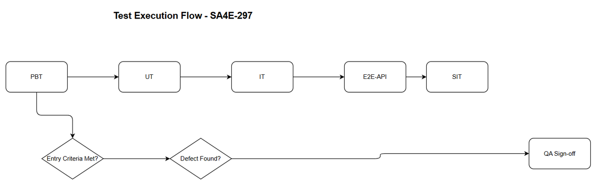
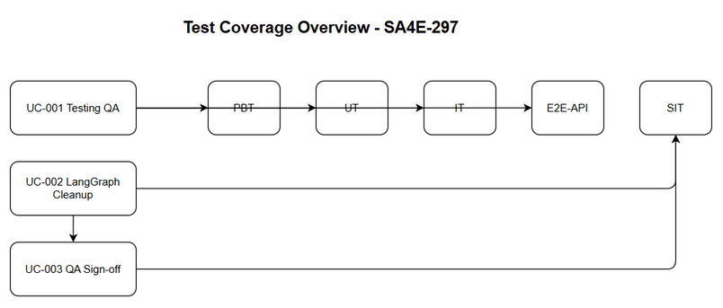

# Software Test Plan (STP)

## SA4E-297 — SA4E-289.8 – Testing QA & LangGraph Cleanup

---

## Document Information

| Field | Value |
|-------|-------|
| Jira Ticket | SA4E-297 |
| Title | SA4E-289.8 – Testing QA & LangGraph Cleanup |
| Author | QA Agent |
| Version | 1.0 |
| Date | 2026-09-16 |
| Status | Draft |
| Related BRD | documents/SA4E-297/BRD.md |
| Related FSD | documents/SA4E-297/FSD.md |
| Related TDD | documents/SA4E-297/TDD.md |

---

## Author Tracking

| Role | Name - Position | Responsibility |
|------|-----------------|----------------|
| Author | QA Agent – QA Engineer | Create document |
| Peer Reviewer | TBD – TBD | Review document |

---

## Revision History

| Version | Date | Author | Changes |
|---------|------|--------|---------|
| 1.0 | 2026-09-16 | QA Agent | Initiate document — auto-generated from BRD, FSD, and TDD |

---

## Sign-Off

| Name | Signature and date |
|------|--------------------|
| | ☐ I agree and confirm the test plan in this STP |
| | ☐ I agree and confirm the test plan in this STP |

---

## 1. Introduction

### 1.1 Purpose

This Test Plan defines strategy, scope, schedule and resources for verification of SA4E-297 — Testing QA & LangGraph Cleanup, part of Epic SA4E-289 Migrate LangGraph Workflow Engine to Pi SDK Option C. The plan ensures PiWorkflow Engine built on `@earendil-works/pi-agent-core` meets functional and non-functional quality gates, LangGraph legacy code is safely removed, and QA sign-off is achieved before deployment.

### 1.2 Test Objectives

- Verify all functional requirements from FSD UC-001/UC-002/UC-003 are implemented correctly
- Validate business rules BR-001 to BR-008 are enforced during test execution and cleanup
- Ensure non-functional requirements for performance and data retention are met
- Confirm LangGraph removal does not break PipelineState fields `ticketKey`, `threadId`, `currentPhase`, `pipelineStatus`
- Ensure regression-free behavior after cleanup
- Achieve QA sign-off checklist completion

### 1.3 References

| Document | Location |
|----------|----------|
| BRD | documents/SA4E-297/BRD.md |
| FSD | documents/SA4E-297/FSD.md |
| TDD | documents/SA4E-297/TDD.md |
| Pi Migration Plan | documents/pi-migration-plan.md |

---

## 2. Test Strategy

### 2.1 Test Levels

| Level | Scope | Automation | Tools |
|-------|-------|------------|-------|
| PBT | Correctness properties (random inputs) | Automated | fast-check |
| UT | Unit/edge case tests | Automated | vitest |
| IT | API integration (Hono app in-process) | Automated | vitest + Hono `app.request()` |
| E2E-API | REST endpoint E2E (real server) | Automated | vitest + fetch |
| E2E-UI | Browser UI E2E (Playwright) | Automated | Playwright |
| SIT | Manual exploratory / edge cases only | Manual | Browser |

### 2.2 Test Types

| Type | Description | Applicable |
|------|-------------|------------|
| Functional Testing | Verify features work per FSD use cases UC-001/UC-002/UC-003 | Yes |
| Regression Testing | Ensure existing features not broken after LangGraph removal | Yes |
| Performance Testing | Verify unit tests <2 min/module, integration <10 min | Yes |
| Security Testing | Verify JWT auth for /api/v1/tests/execute | Yes |
| Usability Testing | N/A - CLI/CI execution | No |
| Compatibility Testing | Verify RemoteCheckpointer config parity | Yes |

### 2.3 Test Approach

Risk-based prioritization. Automation first for deterministic flows: unit, integration, E2E-API. SIT limited to manual exploratory for cleanup verification and visual documentation checks. Property-based tests used for State Adapter mapping correctness. E2E-UI not applicable as feature is CLI/CI based; SIT manual covers sign-off checklist.

### 2.4 Entry Criteria

| Level | Entry Criteria |
|-------|---------------|
| UT/IT/E2E-API | Prerequisites SA4E-290 to SA4E-296 merged; RemoteCheckpointer accessible; TDD API contract defined |
| SIT | Unit + Integration tests passed; test data prepared; LangGraph cleanup branch ready |
| QA Sign-off | 100% test cases executed, 0 Critical defects open, ≤2 Major defects open |

### 2.5 Exit Criteria

| Level | Exit Criteria |
|-------|--------------|
| UT/IT/E2E | 100% test cases executed, Pass rate ≥95%, 0 Critical defects |
| SIT | QA sign-off checklist completed, defect closure verified, LangGraph cleanup verified |
| QA Sign-off | Sign-off recorded in KB, epic can progress to deployment |

### 2.6 E2E Automation Coverage

Classified to minimize manual SIT:
- CRUD / test execution trigger → E2E-API
- Auth checks → E2E-API
- State persistence validation → E2E-API + IT
- LangGraph removal verification → SIT manual (build check)
- QA sign-off checklist → SIT manual (human approval)



---

## 3. Test Scope

### 3.1 Features In Scope

| # | Feature / Story | Priority | FSD Reference | Test Type |
|---|----------------|----------|---------------|-----------|
| 1 | Testing QA for PiWorkflow Engine | MUST HAVE | UC-001, BR-001..BR-004 | Functional/Integration |
| 2 | LangGraph Cleanup | MUST HAVE | UC-002, BR-005..BR-007 | Functional/Regression |
| 3 | QA Sign-off | MUST HAVE | UC-003, BR-008 | Functional |

### 3.2 Features Out of Scope

| # | Feature | Reason |
|---|---------|--------|
| 1 | New Pi SDK features | Belongs to SA4E-290..SA4E-296 |
| 2 | Production deployment | DevOps phase |
| 3 | Performance tuning beyond baseline | Out of scope per BRD 1.2 |

**Test Coverage Overview**



**STP Test Cases Summary Table**

| Level | Count | Automated | Manual |
|-------|-------|-----------|--------|
| PBT | 2 | 2 | 0 |
| UT | 6 | 6 | 0 |
| IT | 4 | 4 | 0 |
| E2E-API | 3 | 3 | 0 |
| E2E-UI | 0 | 0 | 0 |
| SIT | 3 | 0 | 3 |
| **Total** | **18** | **15 (83%)** | **3 (17%)** |

---

## 4. Test Environment

### 4.1 Environment Requirements

| Environment | URL | Database | Purpose |
|-------------|-----|----------|---------|
| SIT | http://localhost:3000 | RemoteCheckpointer test DB | System Integration Testing |
| CI | N/A | SQLite test | Automated test runs |

### 4.2 Browser / Device Requirements

Not applicable for CLI tests. SIT manual uses Chrome 120+ on Windows.

### 4.3 Test Data Requirements

| Data Type | Description | Source | Preparation |
|-----------|-------------|--------|-------------|
| Test execution payload | ticketKey, scope | CSV testdata | Pre-seeded |
| PipelineState | ticketKey, threadId, currentPhase, pipelineStatus | Mock/RemoteCheckpointer | Setup script |
| JWT token | QA Engineer role | Auth service | Generated per run |

### 4.4 External Dependencies

| System | Dependency | Mock/Stub Available |
|--------|-----------|---------------------|
| RemoteCheckpointer | State persistence | No - use test instance |
| Knowledge Base MCP | Test results storage | Yes |

---

## 5. Test Schedule

| Phase | Start Date | End Date | Duration | Milestone |
|-------|-----------|----------|----------|-----------|
| Test Planning | 2026-09-16 | 2026-09-16 | 1 day | STP + STC approved |
| Test Data Preparation | 2026-09-17 | 2026-09-17 | 1 day | Test data ready |
| UT/IT/E2E Execution | 2026-09-18 | 2026-09-19 | 2 days | Automated results |
| SIT Manual | 2026-09-20 | 2026-09-20 | 1 day | SIT sign-off |
| Defect Fix & Retest | 2026-09-21 | 2026-09-22 | 2 days | All Critical/Major fixed |
| QA Sign-off | 2026-09-23 | 2026-09-23 | 1 day | Sign-off recorded |

---

## 6. Resources & Responsibilities

| Role | Name | Responsibility |
|------|------|---------------|
| Test Lead | QA Agent | Test planning, coordination, reporting |
| QA Engineer | TBD | Test case design, execution, defect reporting |
| BA | TBD | UAT support, acceptance criteria clarification |
| Developer | TBD | Bug fixing, unit test coverage |
| DevOps | TBD | Environment setup, deployment |

---

## 7. Risk & Mitigation

| # | Risk | Impact | Likelihood | Mitigation |
|---|------|--------|------------|------------|
| 1 | Regressions after LangGraph removal | High | Medium | Comprehensive integration tests before sign-off |
| 2 | Missing acceptance criteria in Jira | Medium | High | Confirm with stakeholders and epic owner |
| 3 | Pi SDK behavior differs from LangGraph | High | Medium | State Adapter validation and manual QA |
| 4 | Test coverage insufficient | Medium | Medium | Define coverage baseline from epic |

---

## 8. Defect Management

### 8.1 Severity Levels

| Severity | Definition | Example |
|----------|-----------|---------|
| Critical | System crash, data loss, security breach | RemoteCheckpointer unavailable |
| Major | Feature not working, workaround exists | Phase transition fails |
| Minor | UI issue, cosmetic defect | Logging format mismatch |
| Trivial | Typo, minor alignment issue | Documentation typo |

### 8.2 Priority Levels

| Priority | Definition | SLA (Fix Time) |
|----------|-----------|----------------|
| P1 | Must fix immediately | 4 hours |
| P2 | Must fix before release | 1 business day |
| P3 | Should fix if time permits | 3 business days |
| P4 | Nice to fix, can defer | Next release |

### 8.3 Defect Lifecycle

```
New → Open → In Progress → Fixed → Ready for Retest → Verified → Closed
                                                      → Reopened → In Progress
```

---

## 9. Test Metrics & Reporting

### 9.1 Metrics

| Metric | Formula | Target |
|--------|---------|--------|
| Test Execution Rate | Executed / Total × 100% | 100% |
| Pass Rate | Passed / Executed × 100% | ≥ 95% |
| Defect Density | Defects / Test Cases | ≤ 0.1 |
| Critical Defect Count | Count of Critical severity | 0 |
| Defect Fix Rate | Fixed / Total Defects × 100% | ≥ 90% |

### 9.2 Reporting Schedule

| Report | Frequency | Audience |
|--------|-----------|----------|
| Daily Test Status | Daily during SIT/UAT | Project team |
| Defect Summary | Daily | Dev team + PM |
| Test Completion Report | End of SIT / End of UAT | All stakeholders |

---

## 10. Appendix

### Glossary

| Term | Definition |
|------|------------|
| SIT | System Integration Testing |
| STP | Software Test Plan |
| STC | Software Test Cases |
| PBT | Property-Based Testing |

### Assumptions

- Previous stories SA4E-290 to SA4E-296 are completed and merged
- RemoteCheckpointer backend remains unchanged
- QA team has access to test environments
