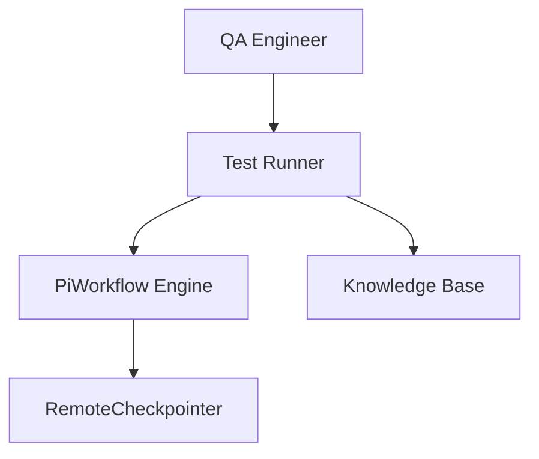
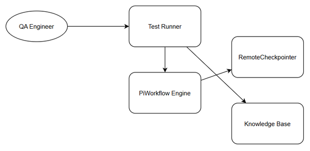
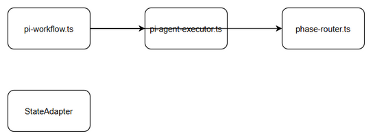
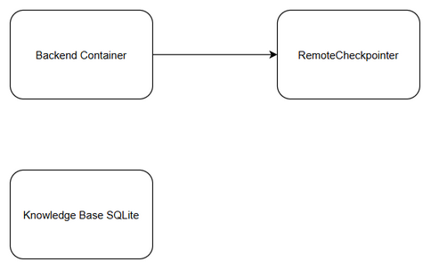
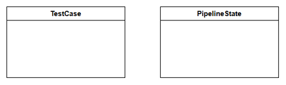
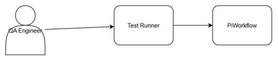

# Technical Design Document (TDD)

## SA4E-297 — SA4E-289.8 – Testing QA & LangGraph Cleanup

---

## Document Information

| Field | Value |
|-------|-------|
| Jira Ticket | SA4E-297 |
| Title | SA4E-289.8 – Testing QA & LangGraph Cleanup |
| Author | SA Agent |
| Version | 1.0 |
| Date | 2026-09-16 |
| Status | Draft |
| Related BRD | documents/SA4E-297/BRD.md |
| Related FSD | documents/SA4E-297/FSD.md |

---

## Author Tracking

| Role | Name - Position | Responsibility |
|------|-----------------|----------------|
| Author | SA Agent – Solution Architect | Create document |
| Peer Reviewer | TBD – TBD | Review document |

---

## Revision History

| Version | Date | Author | Changes |
|---------|------|--------|---------|
| 1.0 | 2026-09-16 | SA Agent | Initiate document — auto-generated from BRD and FSD |

---

## Sign-Off

| Name | Signature and date |
|------|--------------------|
| | ☐ I agree and confirm the technical design in this TDD |
| | ☐ I agree and confirm the technical design in this TDD |

---

## 1. Introduction

> **Scope Boundary:** This TDD specifies HOW to implement the requirements defined in the FSD.

### 1.1 Purpose

Design technical solution for Testing QA & LangGraph Cleanup supporting migration from LangGraph to Pi SDK Option C.

### 1.2 Scope

Test execution orchestration, integration test harness, LangGraph cleanup verification, QA sign-off recording.

### 1.3 Technology Stack

| Layer | Technology | Version |
|-------|-----------|---------|
| Language | TypeScript | 5.5.0 |
| Framework | Hono | 4.0.0 |
| Test Runner | Vitest | 4.1.9 |
| Pi SDK | @earendil-works/pi-agent-core | - |

### 1.4 Design Principles

- Reuse existing Hono/Vitest patterns
- Fail-fast on prerequisite missing
- Preserve PipelineState fields

### 1.5 Constraints

- pi-workflow module not indexed in Code Intelligence
- RemoteCheckpointer must remain unchanged

### 1.6 References

| Document | Location |
|----------|----------|
| BRD | documents/SA4E-297/BRD.md |
| FSD | documents/SA4E-297/FSD.md |

---

## 2. System Architecture

### 2.1 Architecture Overview




*[Edit in draw.io](diagrams/architecture.drawio)*

### 2.2 Component Diagram


*[Edit in draw.io](diagrams/component.drawio)*

### 2.3 Deployment Architecture


*[Edit in draw.io](diagrams/deployment.drawio)*

---

## 3. API Design

### 3.1 API Overview

| # | Endpoint | Method | Description |
|---|----------|--------|-------------|
| 1 | /api/v1/tests/execute | POST | Trigger test execution |

### 3.2 API: Test Execution

**Implements:** UC-001

| Attribute | Value |
|-----------|-------|
| Method | POST |
| Path | /api/v1/tests/execute |
| Auth | Bearer JWT |

**Request Body:**
```json
{
  "ticketKey": "SA4E-297",
  "scope": "unit"
}
```

**Response 200:**
```json
{
  "executionId": "uuid",
  "summary": {"passCount":42,"failCount":0}
}
```

---

## 4. Database Design


*[Edit in draw.io](diagrams/db-schema.drawio)*

No schema changes. PipelineState fields preserved.

---

## 5. Class / Module Design

Package structure `src/pi-workflow/` with adapters.

---

## 6. Integration Design

RemoteCheckpointer HTTP REST with retry & circuit breaker.


*[Edit in draw.io](diagrams/api-sequence-test.drawio)*

---

## 7. Security Design

JWT authentication, role-based authorization.

---

## 8. Performance & Scalability

Unit tests <2 min/module, Integration <10 min.

---

## 9. Monitoring & Observability

Pino logging, metrics for test_fail_rate.

---

## 10. Deployment Considerations

Config via env, feature flag PI_WORKFLOW_CLEANUP_ENABLED.

---

## 11. E2E Test Architecture

### 11.1 Framework & Language
- Framework: vitest + Playwright
- Language: TypeScript

### 11.2 Test Structure
Unit: backend/src/**/*.test.ts
Integration: backend/tests/integration/*.it.test.ts
E2E-API: backend/tests/e2e/*.e2e.test.ts

### 11.3 E2E-API Test Design for SA4E-297
File: PiWorkflowTests.e2e.test.ts
Cases: TC-001..TC-004

---

## Appendix
