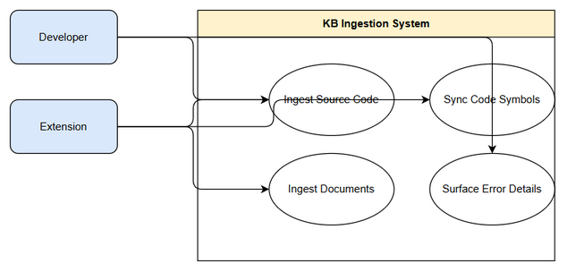
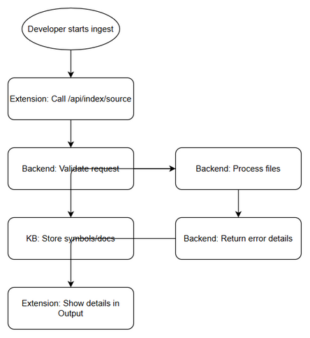

# Business Requirements Document (BRD)

## SA4E-300 — [Extension/Backend] Cải thiện error detail trong luồng ingest source code vào KB

---

## Document Information

| Field | Value |
|-------|-------|
| Jira Ticket | SA4E-300 |
| Title | [Extension/Backend] Cải thiện error detail trong luồng ingest source code vào KB |
| Author | BA Agent |
| Version | 1.0 |
| Date | 2026-09-17 |
| Status | Draft |

---

## Author Tracking

| Role | Name - Position | Responsibility |
|------|-----------------|----------------|
| Author | BA Agent – Business Analyst | Create document |
| Peer Reviewer | – | Review document |

---

## Revision History

| Version | Date | Author | Changes |
|---------|------|--------|---------|
| 1.0 | 2026-09-17 | BA Agent | Initiate document — auto-generated from Jira ticket SA4E-300 |

---

## Sign-Off

| Name | Signature and date |
|------|--------------------|
| | ☐ I agree and confirm all criteria on this BRD as expected requirements |
| | ☐ I agree and confirm all criteria on this BRD as expected requirements |

---

## 1. Introduction

### 1.1 Scope

Cải thiện error surfacing trong luồng ingest source code vào Knowledge Base từ Extension sang Backend. Hiện tại Extension gọi Backend qua các endpoint `POST /api/index/source`, `POST /api/index/full`, `POST /api/index/ingest-docs` và MCP `tools/call mem_sync_code`. Error handling đã có nền tảng retry backoff, Output channel "Kiro Indexer", status-bar tooltip khi backend báo `failed`, nhưng nhiều chỗ nuốt lỗi hoặc mất chi tiết khiến developer phải SSH backend đọc pino log.

Phạm vi bao gồm:
- Enrich error response từ Backend cho các ingest endpoint, trả về `{ error, details?, action? }` thay vì generic "Internal error".
- Client Extension đọc và hiển thị đầy đủ `details`/`action` từ backend vào Output channel và toast, không cắt xén.
- Backend trả chi tiết per-file failure `rejectedReasons`/`failedFiles` với `{ file, code, message }` cho `/api/index/source` và `/api/index/ingest-docs`.
- Loại bỏ `catch { /* silent */ }` và `console.debug/console.warn` trong luồng ingest, thay bằng Output channel.
- Đảm bảo developer phân biệt được ENOSPC, EACCES, 429 backpressure, 401 token expired chỉ từ Output channel.

### 1.2 Out of Scope

- Không refactor toàn bộ retry/polling logic.
- Không thay đổi contract của `parseIngestResponse`, `UNCONVERTIBLE` legacy marker.
- Không động vào Pega ingest flow (`PegaStreamIngester`, `PegaProjectIndexer`).
- Không thay đổi UI ngoài Output channel và toast hiện có.

### 1.3 Preliminary Requirement

- Backend codebase hiện tại có file `backend/src/server/routes/api-index.ts` với hàm `indexError`.
- Extension codebase có `extension/src/services/IndexerHttpClient.ts` và `extension/src/services/IndexingService.ts`.
- Rule `.kiro/steering/code-standards.md` về exception handling và `no-workaround-rule.md` đã tồn tại.

---

## 2. Business Requirements

### 2.1 High Level Process Map

Developer khởi tạo ingest source code từ Extension. Extension gọi Backend API, Backend thực hiện validate, process files, ghi vào Knowledge Base. Khi lỗi xảy ra, Backend trả về chi tiết lỗi, Extension hiển thị đầy đủ cho developer trong Output channel và toast.

*[Edit in draw.io](diagrams/use-case.drawio)*

*[Edit in draw.io](diagrams/business-flow.drawio)*

### 2.2 List of User Stories / Use Cases

| # | Story / Use Case / Epic | Priority | Source Ticket |
|---|-------------------------|----------|---------------|
| 1 | As a Developer, tôi muốn thấy chi tiết lỗi khi ingest source code thất bại để nhanh chóng xác định nguyên nhân | MUST HAVE | SA4E-300 |
| 2 | As a Developer, tôi muốn Backend trả về lý do lỗi theo từng file bị từ chối để biết file nào cần sửa | MUST HAVE | SA4E-300 |
| 3 | As a Developer, tôi muốn mọi lỗi mạng và lỗi hệ thống được log ra Output channel thay vì console.debug để dễ theo dõi | SHOULD HAVE | SA4E-300 |

---

### 2.3 Details of User Stories

#### Business Flow

**Step 1:** Developer trigger ingest source code từ Extension.
**Step 2:** Extension gọi `POST /api/index/source` hoặc `/api/index/ingest-docs` tới Backend.
**Step 3:** Backend validate request, token, project id.
**Step 4:** Backend process files, ghi vào Knowledge Base, theo dõi rejected files.
**Step 5:** Backend trả response `{ error?, details?, action?, failedFiles?, rejectedReasons? }`.
**Step 6:** Extension hiển thị kết quả thành công/thất bại kèm details vào Output channel "Kiro Indexer" và toast.
**Step 7:** Developer đọc chi tiết lỗi để fix mà không cần SSH backend.

> **Note:** Mọi 4xx/5xx phải có details, không trả generic "Internal error".

#### STORY 1: Hiển thị chi tiết lỗi ingest cho developer

> As a Developer, tôi muốn thấy chi tiết lỗi khi ingest source code thất bại để nhanh chóng xác định nguyên nhân

**Requirement Details:**
1. Backend `indexError` phải trả `{ error, details?, action? }` thay vì chỉ "Internal error". Tham chiếu pattern `handleSyncPegaRules`.
2. Client `httpPostWithDetail` phải đọc `err.body?.details` và `err.body?.action`, forward về caller với shape `{ ok, error, details?, action?, status }`.
3. Không còn `catch { /* silent */ }` ở `triggerDocumentIngest`, phải check `result.ok` và hiển thị warning.
4. `syncCodeSymbols` phải trả thông tin status/body thay vì `return null`.

**Data Fields:**
| Field | Type | Required | Description | Example |
|-------|------|----------|-------------|---------|
| error | string | Yes | Thông điệp lỗi | "Internal error" |
| details | string | No | Chi tiết kỹ thuật | "ENOSPC: disk full" |
| action | string | No | Hành động gợi ý | "Free disk space" |
| status | number | Yes | HTTP status code | 500 |

**Acceptance Criteria:**
1. Mọi 4xx/5xx response từ backend ingest endpoints đều có `{ error, details?, action? }`.
2. Client hiển thị đầy đủ details + action từ backend response trong Output channel + toast.
3. Không còn `catch { /* silent */ }` block ở luồng ingest.
4. Dev có thể phân biệt ENOSPC vs EACCES vs 429 vs 401 chỉ từ Output channel.
5. Unit tests cho `httpPostWithDetail` forward `err.body`, `indexError` include details, `triggerDocumentIngest` propagate ok/error.
6. `npm run build` + `npm test` pass ở cả backend và extension.

**Validation Rules:**
- `error` luôn có, không rỗng.
- `details` không vượt quá 2000 ký tự.

**Error Handling:**
- Network error ECONNREFUSED: log URL + error message vào Output channel.
- 401 Unauthorized: hiển thị action yêu cầu re-authenticate.
- 500 Internal error: hiển thị details từ backend.

#### STORY 2: Per-file failure details

> As a Developer, tôi muốn Backend trả về lý do lỗi theo từng file bị từ chối để biết file nào cần sửa

**Requirement Details:**
1. `handleIndexSource` và `writeFilesPhase` phải log `err.code` + `err.path` và thêm `rejectedReasons: [{file, code, message}]` vào response.
2. `handleIngestDocsFromTemp` phải trả `failedFiles: [{file, reason}]`.
3. `writeFilesPhase` phải log danh sách `rejected` như `handleIndexDocuments`.

**Acceptance Criteria:**
1. Response từ `/api/index/source` và `/api/index/ingest-docs` bao gồm `failedFiles/rejectedReasons`.
2. Mỗi entry có `file`, `code`, `message`.

#### STORY 3: Chuyển console sang Output channel

> As a Developer, tôi muốn mọi lỗi mạng và lỗi hệ thống được log ra Output channel thay vì console.debug để dễ theo dõi

**Requirement Details:**
1. `httpPostJsonOnce`, `httpGetOnce`, `readFileContent`, `parseIngestResponse` thay `console.debug/console.warn` bằng `IndexerHttpClient.getIndexerOutput().appendLine(...)`.
2. `pollIndexProgress` timeout phải log last progress snapshot vào Output channel.

**Acceptance Criteria:**
1. Không còn `console.debug/console.warn` trong luồng ingest.
2. Timeout log lý do và giữ status bar lâu hơn.

---

## 3. Dependencies

| Dependency | Type | Related Ticket | Description |
|------------|------|----------------|-------------|
| Backend API index routes | System | SA4E-300 | `backend/src/server/routes/api-index.ts` |
| Extension IndexerHttpClient | System | SA4E-300 | `extension/src/services/IndexerHttpClient.ts` |
| Extension IndexingService | System | SA4E-300 | `extension/src/services/IndexingService.ts` |
| Code standards rules | Compliance | SA4E-300 | Exception handling, no workaround |

---

## 4. Stakeholders

| Role | Name / Team | Responsibility | Source |
|------|-------------|----------------|--------|
| Reporter | Duc Nguyen Minh | Yêu cầu cải thiện error detail | SA4E-300 |
| Developer | Backend / Extension team | Triển khai | SA4E-300 |
| BA | BA Agent | Viết BRD | SA4E-300 |

---

## 5. Risks and Assumptions

### 5.1 Risks

| Risk | Impact | Likelihood | Mitigation |
|------|--------|------------|------------|
| Thay đổi response shape làm vỡ caller cũ | High | Medium | Unit tests và kiểm tra caller `httpPostWithDetail` |
| Log quá nhiều chi tiết gây spam Output | Medium | Low | Giới hạn độ dài details, chỉ log lỗi |
| Dead code `refreshTokenFn` gây nhầm lẫn | Low | High | Dọn sạch hoặc wire đúng |

### 5.2 Assumptions

- Backend logger pino hiện đang hoạt động.
- Extension Output channel "Kiro Indexer" đã tồn tại.
- Không thay đổi contract parseIngestResponse.

---

## 6. Non-Functional Requirements

| Category | Requirement | Details |
|----------|-------------|---------|
| Performance | Không làm tăng latency đáng kể | Enrich error không thêm query |
| Security | Không expose stack trace nhạy cảm | `details` chỉ chứa thông tin kỹ thuật an toàn |
| Availability | Error surfacing không ảnh hưởng uptime | Chỉ thay đổi response payload |

---

## 7. Related Tickets

| Ticket Key | Summary | Status | Type | Relationship |
|------------|---------|--------|------|--------------|
| SA4E-300 | [Extension/Backend] Cải thiện error detail trong luồng ingest source code vào KB | In Progress | Task | Main ticket |

---

## 8. Appendix

### Glossary

| Term | Definition |
|------|------------|
| KB | Knowledge Base |
| Ingest | Quá trình index source code/documents vào KB |
| Output channel | Kênh log trong VS Code Extension |

### Reference Documents

| Document | Link / Location |
|----------|-----------------|
| Jira Ticket | SA4E-300 |
| Backend file | backend/src/server/routes/api-index.ts |
| Extension file | extension/src/services/IndexerHttpClient.ts |
