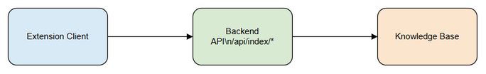
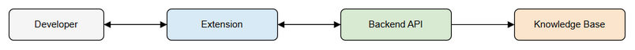

# Functional Specification Document (FSD)

## SA4E-300 — [Extension/Backend] Cải thiện error detail trong luồng ingest source code vào KB

---

## Document Information

| Field | Value |
|-------|-------|
| Jira Ticket | SA4E-300 |
| Title | [Extension/Backend] Cải thiện error detail trong luồng ingest source code vào KB |
| Author | BA Agent |
| Version | 1.0 |
| Date | 2026-09-17 |
| Status | Draft |
| Related BRD | documents/SA4E-300/BRD.md |

---

## Revision History

| Version | Date | Author | Changes |
|---------|------|--------|---------|
| 1.0 | 2026-09-17 | BA Agent | Initiate document — auto-generated from BRD and Jira tickets |

---

## 1. Introduction

### 1.1 Purpose

Tài liệu này mô tả chi tiết yêu cầu chức năng cho việc cải thiện error surfacing trong luồng ingest source code từ Extension sang Knowledge Base. Mục tiêu giúp developer nhận được thông tin lỗi đầy đủ, chi tiết từ Backend qua API và MCP, thay vì phải SSH đọc pino log.

### 1.2 Scope

Phạm vi chức năng bao gồm:
- Enrich error response từ Backend cho các endpoint ingest: `POST /api/index/source`, `POST /api/index/full`, `POST /api/index/ingest-docs` và MCP `mem_sync_code`.
- Extension đọc và hiển thị `details`/`action` từ backend response trong Output channel "Kiro Indexer" và toast.
- Backend trả chi tiết per-file failure `rejectedReasons`/`failedFiles`.
- Loại bỏ silent catch và `console.debug/console.warn`, thay bằng Output channel.
- Không thay đổi retry/polling logic, không thay đổi contract `parseIngestResponse`, không động vào Pega ingest flow.

### 1.3 Definitions & Acronyms

| Term | Definition |
|------|------------|
| KB | Knowledge Base |
| Ingest | Quá trình index source code/documents vào KB |
| Output channel | Kênh log trong VS Code Extension |
| MCP | Model Context Protocol |

### 1.4 References

| Document | Location |
|----------|----------|
| BRD | documents/SA4E-300/BRD.md |
| Jira Ticket | SA4E-300 |

---

## 2. System Overview

### 2.1 System Context Diagram


*[Edit in draw.io](diagrams/system-context.drawio)*

Extension Client tương tác với Backend API qua HTTP/MCP để thực hiện ingest source code và documents. Backend xử lý, ghi vào Knowledge Base và trả về kết quả kèm error details.

### 2.2 System Architecture

Các thành phần chính:
- **Extension**: `IndexerHttpClient.ts`, `IndexingService.ts` – gọi API, hiển thị lỗi.
- **Backend**: `backend/src/server/routes/api-index.ts` – xử lý ingest, sinh error response.
- **Knowledge Base**: lưu trữ symbols, documents.

Luồng chính: Developer → Extension → Backend → KB. Khi lỗi xảy ra, Backend trả `{ error, details?, action?, failedFiles?, rejectedReasons? }` → Extension hiển thị.

<!-- TA enrichment -->
### 2.3 Technical Architecture Notes

**Backend – `backend/src/server/routes/api-index.ts`**
- Hono route factory `registerIndexRoutes(app, registry, logger)` đăng ký các endpoint ingest.
- Authentication: `requireAuth` validate JWT session qua `validateSession`. 401 trả `{ error: 'Unauthorized' }`.
- Project isolation: `resolveRequestScope` đọc `X-Project-Id` header, fallback config, dùng `requireProjectId`.
- Concurrency control: `INDEX_CONCURRENCY_LIMIT = 3`, `activeIndexRequests` counter, trả 429 `{ error: 'Server busy', retryAfter: 2 }`.
- Error mapping: `indexError` map `PROJECT_REQUIRED` → 400, else log và trả 500 generic. Yêu cầu TA: enrich để trả `{ error, details?, action? }` theo BRD Story 1.
- Các handler chính:
  - `handleIndexSource`: nhận `{ files: SourceFile[] }`, strip workspace prefix, ghi vào `Temp/{userId}/{projectId}/source`, trả `{ written, skipped, rejected, deps, projectId }`.
  - `handleIndexDocuments`: dùng `writeFilesPhase` → Temp batch-docs, trả `{ indexed, rejected }`.
  - `handleIngestDocsFromTemp`: scan `Temp/{userId}/{projectId}/batch-docs`, dispatch `mem_ingest_file` qua `registry.getModule('memory')`, trả `{ ingested, errors, total }`.
  - `handleFullIndex` / `handleFileEvents` / `handleCancel` / `handleProgress`: decoupled indexer, không thay đổi.

**Extension – `extension/src/services/IndexerHttpClient.ts`**
- HTTP layer: `buildHeaders` tạo `Authorization`, `X-Project-Id`, `X-Workspace-Root`, `X-Rate-Limit-RPM`.
- `httpPostJsonOnce` / `httpGetOnce`: fetch với timeout, trả raw body + status, log lỗi vào Output channel thay vì console.debug.
- `httpPostWithDetail`: bọc `utilHttpPostJson`, bắt lỗi, trích `err.body?.details` và `err.body?.action`, trả `{ ok, error, status }`.
- `sendBatchWithRetry`: exponential backoff 2s/4s/8s cho 429/5xx/status 0, không retry 401/400. TA yêu cầu forward `err.body` nguyên vẹn.
- `triggerDocumentIngest`: gọi `POST /api/index/ingest-docs`, hiện đang catch silent → phải check `ok` và log.
- `triggerFullIndex`: gọi `POST /api/index/full`, parse message để show toast.
- `pollIndexProgress`: status bar polling, phải log timeout vào Output channel.

**Extension – `extension/src/services/IndexingService.ts`**
- Orchestrator: `indexWorkspace` điều phối code/documents/sync, concurrency guard `isProcessing`.
- Output channel: `this.outputChannel.appendLine` cho logs, thay thế console.
- Status bar: `showProgress`/`hideProgress` cho UX.
- Không thay đổi retry/polling logic, chỉ enrich error surfacing.

**Design Patterns**
- **Error Propagation Chain**: Backend → HTTP response → Extension `httpPostWithDetail` → Output channel/Toast. Không nuốt exception, luôn forward `err.body`.
- **Command-Query Separation**: Handlers chỉ ghi Temp, ingest là bước riêng.
- **Backpressure**: Concurrency limit + 429 retry.
- **Single Responsibility**: Mỗi handler một nhiệm vụ, `indexError` centralize mapping.

**Technical Constraints**
- Không đổi contract `parseIngestResponse` và legacy marker `UNCONVERTIBLE`.
- Không động vào Pega flow: `PegaService`, `PegaProjectIndexer`, `sync-pega-rules`.
- Giữ nguyên retry/polling logic, chỉ bổ sung error detail.
- Không expose stack trace nhạy cảm trong `details`.


---

## 3. Functional Requirements

### 3.1 Feature: Hiển thị chi tiết lỗi ingest cho developer

**Source:** BRD Story 1

#### 3.1.1 Description

Đảm bảo mọi lỗi 4xx/5xx từ ingest endpoints đều kèm `details` và `action`. Client phải forward thông tin này ra Output channel và toast, không cắt xén.

#### 3.1.2 Use Case

**Use Case ID:** UC-1
**Actor:** Developer
**Preconditions:** Extension đã kết nối Backend, có token hợp lệ.
**Postconditions:** Developer nhìn thấy chi tiết lỗi trong Output channel.

**Main Flow:**

| Step | Actor | System | Description |
|------|-------|--------|-------------|
| 1 | Developer | | Trigger ingest source code |
| 2 | | Extension | Gọi POST /api/index/source |
| 3 | | Backend | Validate và xử lý ingest |
| 4 | | Backend | Trả response kèm error/details/action |
| 5 | | Extension | Hiển thị details/action ra Output channel |
| 6 | Developer | | Đọc và xử lý lỗi |

**Alternative Flows:**

| ID | Condition | Steps |
|----|-----------|-------|
| AF-1 | Ingest thành công | Backend trả 200, Extension hiển thị ✅ Indexed: N files |

**Exception Flows:**

| ID | Condition | Steps |
|----|-----------|-------|
| EF-1 | Backend 500 | Backend trả {error, details, action}. Extension log URL + status + body ra Output |
| EF-2 | Network ECONNREFUSED | Extension log error message vào Output channel, không dùng console.debug |

#### 3.1.3 Business Rules

| Rule ID | Rule | Source |
|---------|------|--------|
| BR-1 | Backend indexError phải trả {error, details?, action?} thay vì generic "Internal error" | SA4E-300 Finding 1 |
| BR-2 | httpPostWithDetail phải đọc err.body?.details và err.body?.action | SA4E-300 Finding 2 |
| BR-3 | Không còn catch silent ở triggerDocumentIngest | SA4E-300 Finding 4 |

#### 3.1.4 Data Specifications

**Input Data:**

| Field | Type | Required | Validation | Description |
|-------|------|----------|------------|-------------|
| X-Project-Id | string | Yes | Non-empty | Project identifier |

**Output Data:**

| Field | Type | Description |
|-------|------|-------------|
| error | string | Thông điệp lỗi |
| details | string | Chi tiết kỹ thuật |
| action | string | Hành động gợi ý |
| status | number | HTTP status code |

#### 3.1.5 API Contract (Functional View)

**Endpoint:** `POST /api/index/source`
**Purpose:** Ingest source code files vào KB

**Input Parameters:**

| Parameter | Type | Required | Business Rule | Description |
|-----------|------|----------|---------------|-------------|
| X-Project-Id | header | Y | BR-1 | Project id |

**Output Data:**

| Field | Type | Description |
|-------|------|-------------|
| ingested | number | Số file ingest thành công |
| rejectedReasons | array | Danh sách file bị từ chối |
| error | string | Lỗi tổng thể nếu có |
| details | string | Chi tiết lỗi |
| action | string | Gợi ý xử lý |

**Business Error Scenarios:**

| Scenario | User Message | Trigger Condition |
|----------|-------------|-------------------|
| ENOSPC disk full | Disk full, free space required | Err.code ENOSPC |
| EACCES permission denied | Permission denied | Err.code EACCES |
| 401 Unauthorized | Re-authenticate required | Token expired |

<!-- TA enrichment -->
#### 3.1.6 Technical API Contract

> **Implements:** BRD Story 1, Story 2
> Developer có thể implement từ spec này mà không cần code review.

**Endpoint:** `POST /api/index/source`
- **Method:** POST
- **Path:** `/api/index/source`
- **Auth:** `Authorization: Bearer <token>` + `X-Project-Id` header required
- **Headers:**
  - `X-Project-Id: string` required
  - `X-Workspace-Root: string` optional
  - `Content-Type: application/json`
- **Request Body Schema:**
```json
{
  "files": [
    {
      "path": "string",
      "content": "string",
      "gitHash": "string?",
      "checksum": "string?"
    }
  ]
}
```
- **Success Response 200:**
```json
{
  "written": 12,
  "skipped": 0,
  "rejected": ["path/to/file.ts"],
  "deps": [],
  "projectId": "proj-123"
}
```
- **Error Response Shape:**
```json
{
  "error": "string",
  "details": "string?",
  "action": "string?",
  "status": 500
}
```
- **Per-file failure extension:** `rejected` array → TA recommends enrich to `rejectedReasons: [{ file, code, message }]`

**Endpoint:** `POST /api/index/full`
- **Method:** POST
- **Auth:** Bearer + `X-Project-Id`
- **Request Body:** `{}` (empty)
- **Success Response 202:**
```json
{
  "status": "started",
  "message": "Full index started",
  "projectId": "proj-123"
}
```
- **Error Response:** same shape `{ error, details?, action?, status }`

**Endpoint:** `POST /api/index/ingest-docs`
- **Method:** POST
- **Auth:** Bearer + `X-Project-Id`
- **Request Body:** `{}` (server reads from Temp folder)
- **Success Response 200:**
```json
{
  "ingested": 45,
  "errors": 2,
  "total": 47
}
```
- **Error Response:** `{ error, details?, action?, status }`
- **Per-file failure:** `failedFiles: [{ file, reason }]` – TA enrichment for Story 2

**Error Response Shape – Standard**
| Field | Type | Required | Description |
|-------|------|----------|-------------|
| error | string | Y | Human readable error |
| details | string | N | Technical detail ≤2000 chars |
| action | string | N | Suggested remediation |
| status | number | N | HTTP status code |

**Design Pattern – Error Propagation**
```ts
// Pseudocode for httpPostWithDetail
async function httpPostWithDetail(url, payload, token) {
  try {
    const res = await fetch(url, { headers, body })
    if (!res.ok) {
      const body = await res.json().catch(() => ({}))
      // Do NOT swallow – forward full body
      return { ok:false, error: body.error || 'Error', details: body.details, action: body.action, status: res.status }
    }
    return { ok:true }
  } catch (e) {
    // Network error – forward message to Output channel
    return { ok:false, error: e.message, status:0 }
  }
}
```
- Không dùng `catch { /* silent */ }`
- Không `console.debug`, dùng `IndexerHttpClient.getIndexerOutput().appendLine`
- Forward `err.body` nguyên vẹn về caller để hiển thị

#### 3.1.7 Sequence Diagram


*[Edit in draw.io](diagrams/sequence-error-surfacing.drawio)*

<!-- TA enrichment -->
**Detailed Error Flow – draw.io XML**

```xml
<mxfile>
  <diagram name="Error Flow - Ingest Source">
    <mxGraphModel>
      <root>
        <mxCell id="0"/>
        <mxCell id="1" parent="0"/>
        <mxCell id="developer" value="Developer" style="rounded=1;whiteSpace=wrap;html=1;" vertex="1" parent="1">
          <mxGeometry x="40" y="80" width="120" height="60" as="geometry"/>
        </mxCell>
        <mxCell id="extension" value="IndexerHttpClient&#xa;IndexingService" style="rounded=1;whiteSpace=wrap;html=1;" vertex="1" parent="1">
          <mxGeometry x="260" y="80" width="140" height="80" as="geometry"/>
        </mxCell>
        <mxCell id="backend" value="Backend&#xa;api-index.ts" style="rounded=1;whiteSpace=wrap;html=1;" vertex="1" parent="1">
          <mxGeometry x="520" y="80" width="140" height="80" as="geometry"/>
        </mxCell>
        <mxCell id="kb" value="Knowledge Base" style="rounded=1;whiteSpace=wrap;html=1;" vertex="1" parent="1">
          <mxGeometry x="770" y="80" width="120" height="60" as="geometry"/>
        </mxCell>
        <mxCell id="e1" edge="1" parent="1" source="developer" target="extension">
          <mxGeometry relative="1" as="geometry"/>
        </mxCell>
        <mxCell id="e1v" value="Trigger ingest source" edge="1" parent="1" source="developer" target="extension">
          <mxGeometry relative="1" as="geometry"/>
        </mxCell>
        <mxCell id="e2" edge="1" parent="1" source="extension" target="backend">
          <mxGeometry relative="1" as="geometry"/>
        </mxCell>
        <mxCell id="e2v" value="POST /api/index/source&#xa;with files batch" edge="1" parent="1" source="extension" target="backend">
          <mxGeometry relative="1" as="geometry"/>
        </mxCell>
        <mxCell id="e3" edge="1" parent="1" source="backend" target="kb">
          <mxGeometry relative="1" as="geometry"/>
        </mxCell>
        <mxCell id="e3v" value="Write Temp / Ingest" edge="1" parent="1" source="backend" target="kb">
          <mxGeometry relative="1" as="geometry"/>
        </mxCell>
        <mxCell id="e4" edge="1" parent="1" source="backend" target="extension">
          <mxGeometry relative="1" as="geometry"/>
        </mxCell>
        <mxCell id="e4v" value="200 OK or {error,details,action}" edge="1" parent="1" source="backend" target="extension">
          <mxGeometry relative="1" as="geometry"/>
        </mxCell>
        <mxCell id="e5" edge="1" parent="1" source="extension" target="developer">
          <mxGeometry relative="1" as="geometry"/>
        </mxCell>
        <mxCell id="e5v" value="Output channel / Toast" edge="1" parent="1" source="extension" target="developer">
          <mxGeometry relative="1" as="geometry"/>
        </mxCell>
      </root>
    </mxGraphModel>
  </diagram>
</mxfile>
```


### 3.2 Feature: Per-file failure details

**Source:** BRD Story 2

#### 3.2.1 Description

Backend trả chi tiết từng file bị từ chối với `file`, `code`, `message`.

#### 3.2.2 Use Case

**Use Case ID:** UC-2
**Actor:** Developer
**Preconditions:** Có file không hợp lệ trong batch ingest
**Postconditions:** Developer biết file nào lỗi và lý do

**Main Flow:**

| Step | Actor | System | Description |
|------|-------|--------|-------------|
| 1 | Developer | | Trigger ingest |
| 2 | | Backend | Process files, collect rejectedReasons |
| 3 | | Backend | Trả response kèm rejectedReasons/failedFiles |
| 4 | | Extension | Hiển thị danh sách file lỗi |

#### 3.2.3 Business Rules

| Rule ID | Rule | Source |
|---------|------|--------|
| BR-4 | handleIndexSource phải trả rejectedReasons [{file,code,message}] | SA4E-300 |
| BR-5 | handleIngestDocsFromTemp phải trả failedFiles [{file,reason}] | SA4E-300 |

#### 3.2.4 Data Specifications

**Output Data:**

| Field | Type | Description |
|-------|------|-------------|
| rejectedReasons | array | Mỗi item có file, code, message |
| failedFiles | array | Mỗi item có file, reason |

### 3.3 Feature: Chuyển console sang Output channel

**Source:** BRD Story 3

#### 3.3.1 Description

Thay thế `console.debug/console.warn` trong luồng ingest bằng `IndexerHttpClient.getIndexerOutput().appendLine(...)` để lỗi hiển thị trong VS Code Output.

#### 3.3.2 Business Rules

| Rule ID | Rule | Source |
|---------|------|--------|
| BR-6 | httpPostJsonOnce, httpGetOnce, readFileContent, parseIngestResponse dùng Output channel | SA4E-300 |

---

## 4. Data Model

> Logical data model cho error response. Physical schema trong TDD.

### 4.1 Entity Relationship Diagram

Không có thay đổi entity mới. Error response là DTO tạm thời.

---

## 5. Integration Specifications

### 5.1 External System: Backend API

| Attribute | Value |
|-----------|-------|
| Purpose | Ingest source code và documents |
| Direction | Outbound từ Extension |
| Data Format | JSON |
| Frequency | On-demand |

**Data Exchange:**

| Our Data | External Data | Direction | Business Rule |
|----------|--------------|-----------|---------------|
| Project Id | X-Project-Id | Send | BR-1 |
| Files | Ingest result | Receive | BR-4 |

---

## 6. Processing Logic

### 6.1 Ingest Source Code Flow

**Trigger:** Developer trigger ingest từ Extension
**Input:** Danh sách file source
**Output:** Kết quả ingest + error details

**Processing Steps:**

| Step | Description | Error Handling |
|------|-------------|----------------|
| 1 | Validate token/project | Trả 401 với action re-authenticate |
| 2 | Write files | Thu thập rejectedReasons nếu lỗi ENOSPC/EACCES |
| 3 | Ingest vào KB | Log lỗi per file vào failedFiles |
| 4 | Trả response | Luôn có error/details/action nếu fail |

---

## 7. Security Requirements

### 7.1 Authentication & Authorization

| Role | Permissions | Screens/Features |
|------|-------------|-------------------|
| Developer | Read error details | Output channel |

`details` chỉ chứa thông tin kỹ thuật an toàn, không expose stack trace nhạy cảm.

---

## 8. Non-Functional Requirements

| Category | Business Requirement | Acceptance Criteria |
|----------|---------------------|---------------------|
| Performance | Không làm tăng latency đáng kể | Enrich error không thêm query |
| Security | Không expose stack trace nhạy cảm | details chỉ chứa thông tin kỹ thuật an toàn |
| Availability | Error surfacing không ảnh hưởng uptime | Chỉ thay đổi response payload |

---

## 9. Error Handling (User-Facing)

### 9.1 Error Scenarios

| Scenario | Severity | User Message | Expected Behavior |
|----------|----------|-------------|-------------------|
| Internal error generic | Critical | Internal error | Đã loại bỏ, thay bằng details |
| Disk full ENOSPC | Warning | Disk full, free space | Hiển thị action |
| Permission denied EACCES | Warning | Permission denied | Hiển thị action |
| 401 Token expired | Warning | Re-authenticate required | Prompt re-auth |
| Network ECONNREFUSED | Warning | Backend unreachable | Log URL + error vào Output |

---

## 10. Testing Considerations

### 10.1 Test Scenarios

| ID | Scenario | Input | Expected Output | Priority |
|----|----------|-------|-----------------|----------|
| TC-1 | Backend 500 với details | API trả error + details | Client hiển thị details | High |
| TC-2 | File reject ENOSPC | File write fail | rejectedReasons chứa file,code,message | High |
| TC-3 | Network error | Backend unreachable | Output channel log error, không console.debug | Medium |
| TC-4 | triggerDocumentIngest fail | Backend 500 | Warning hiển thị, không báo success giả | High |

---

## 11. Appendix

### Diagrams

| Diagram | File |
|---------|------|
| System Context | [system-context.png](diagrams/system-context.png) |
| Sequence Error Surfacing | [sequence-error-surfacing.png](diagrams/sequence-error-surfacing.png) |
| Use Case | [use-case.png](diagrams/use-case.png) |
| Business Flow | [business-flow.png](diagrams/business-flow.png) |

### Change Log from BRD

FSD bổ sung API contract functional view, use case flows, error scenarios và sequence diagram cho error surfacing. Không thay đổi scope BRD.

<!-- TA enrichment -->
### Technical Constraints

| Constraint | Impact | Mitigation |
|------------|--------|------------|
| Không đổi contract `parseIngestResponse` và legacy marker `UNCONVERTIBLE` | Giữ backward compatibility với caller hiện tại | Unit tests cho `parseIngestResponse` giữ nguyên behavior |
| Không động vào Pega flow `PegaStreamIngester`, `PegaProjectIndexer` | Scope rõ ràng, tránh regression | Kiểm tra import graph, không sửa file Pega |
| Không thay đổi retry/polling logic | Đảm bảo stability của indexing pipeline | Chỉ thêm error detail, không sửa `sendBatchWithRetry` algorithm |
| Không expose stack trace nhạy cảm | Security requirement | `details` chỉ chứa err.message, err.code, không bao gồm stack |
| Giữ nguyên response shape cơ bản | Client hiện tại vẫn parse được | Thêm `details`/`action` là optional fields |

### Open Issues

| Issue ID | Description | Owner | Target Date |
|----------|-------------|-------|-------------|
| TA-01 | `indexError` hiện trả generic "Internal error" – cần enrich để trả `details`/`action` theo pattern `handleSyncPegaRules` | Backend DEV | 2026-09-20 |
| TA-02 | `httpPostWithDetail` hiện slice error message 200 chars, chưa trích `err.body?.details` | Extension DEV | 2026-09-20 |
| TA-03 | `triggerDocumentIngest` catch silent – cần check `ok` và log warning vào Output channel | Extension DEV | 2026-09-20 |
| TA-04 | `handleIngestDocsFromTemp` trả `ingested/errors/total` nhưng chưa có `failedFiles` detail | Backend DEV | 2026-09-22 |
| TA-05 | Cần bổ sung unit test cho error propagation chain từ Backend → Extension | QA | 2026-09-25 |

### Migration Notes

- Không có data migration DB.
- Response payload enrichment là backward compatible – thêm optional fields.
- Rollback: revert `indexError` enrichment và `httpPostWithDetail` change, không ảnh hưởng data.


