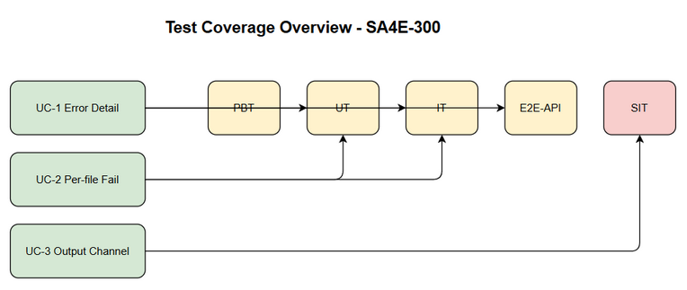
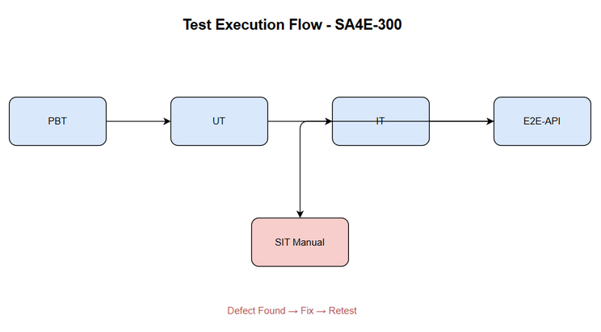

# Software Test Plan (STP)

## SA4E-300 — [Extension/Backend] Cải thiện error detail trong luồng ingest source code vào KB

---

## Document Information

| Field | Value |
|-------|-------|
| Jira Ticket | SA4E-300 |
| Title | [Extension/Backend] Cải thiện error detail trong luồng ingest source code vào KB |
| Author | QA Agent |
| Version | 1.0 |
| Date | 2026-09-17 |
| Status | Draft |
| Related BRD | BRD.md v1.0 |
| Related FSD | FSD.md v1.0 |
| Related TDD | TDD.md v1.0 |

---

## Author Tracking

| Role | Name - Position | Responsibility |
|------|-----------------|----------------|
| Author | QA Agent – QA Engineer | Create document |
| Peer Reviewer | – | Review document |

---

## Revision History

| Version | Date | Author | Changes |
|---------|------|--------|---------|
| 1.0 | 2026-09-17 | QA Agent | Initiate document — auto-generated from BRD, FSD, and TDD |

---

## Sign-Off

| Name | Signature and date |
|------|--------------------|
| | ☐ I agree and confirm the test plan in this STP |
| | ☐ I agree and confirm the test plan in this STP |

---

## 1. Introduction

### 1.1 Purpose

Test Plan cho SA4E-300 nhằm đảm bảo việc cải thiện error surfacing trong luồng ingest source code từ Extension sang Knowledge Base được thực hiện đúng yêu cầu BRD/FSD/TDD. Mục tiêu giúp developer nhận được thông tin lỗi đầy đủ, chi tiết từ Backend qua API và MCP, thay vì phải SSH đọc pino log.

### 1.2 Test Objectives

- Verify Backend `indexError` trả về `{ error, details?, action? }` thay vì generic "Internal error"
- Validate Client `httpPostWithDetail` forward `err.body.details/action` ra Output channel và toast
- Ensure per-file failure `rejectedReasons`/`failedFiles` được trả về đầy đủ
- Confirm `triggerDocumentIngest` không silent catch và propagate error
- Verify `console.debug/console.warn` được thay bằng Output channel
- Ensure error codes ENOSPC, EACCES, 429, 401 được surface đúng

### 1.3 References

| Document | Location |
|----------|----------|
| BRD | documents/SA4E-300/BRD.md |
| FSD | documents/SA4E-300/FSD.md |
| TDD | documents/SA4E-300/TDD.md |

---

## 2. Test Strategy

### 2.1 Test Levels

| Level | Scope | Automation | Tools |
|-------|-------|------------|-------|
| PBT | Correctness properties (random inputs) | Automated | fast-check |
| UT | Unit/edge case tests | Automated | vitest |
| IT | API integration (Hono app in-process) | Automated | vitest + Hono `app.request()` |
| E2E-API | REST endpoint E2E (real server) | Automated | vitest + fetch |
| E2E-UI | Browser UI E2E (Playwright) | Automated | Playwright |
| SIT | Manual exploratory / edge cases only | Manual | Browser |

### 2.2 Test Types

| Type | Description | Applicable |
|------|-------------|------------|
| Functional Testing | Verify features work per FSD use cases | Yes |
| Regression Testing | Ensure existing features are not broken | Yes |
| Security Testing | Verify auth 401/403 surfacing | Yes |
| Non-Functional | Performance impact của error enrichment | No |

### 2.3 Test Approach

Risk-based testing ưu tiên error propagation chain. Automate UT/IT/E2E-API cho Backend error mapping và Client forwarding. E2E-UI hạn chế cho Output channel hiển thị. SIT manual cho visual log verification.

**E2E Automation Coverage**: CRUD operations và error response verification được automate qua E2E-API. Output channel logging được verify qua E2E-UI. Các scenario timing/visual giữ manual SIT.

### 2.4 Test Levels Table

| Level | Scope | Automation | Tools |
|-------|-------|------------|-------|
| PBT | Correctness properties (random inputs) | Automated | fast-check |
| UT | Unit/edge case tests | Automated | vitest |
| IT | API integration (Hono app in-process) | Automated | vitest + Hono `app.request()` |
| E2E-API | REST endpoint E2E (real server) | Automated | vitest + fetch |
| E2E-UI | Browser UI E2E (Playwright) | Automated | Playwright |
| SIT | Manual exploratory / edge cases only | Manual | Browser |

### 2.5 Test Cases Summary Table

| Level | Count | Automated | Manual |
|-------|-------|-----------|--------|
| PBT | 2 | 2 | 0 |
| UT | 8 | 8 | 0 |
| IT | 6 | 6 | 0 |
| E2E-API | 6 | 6 | 0 |
| E2E-UI | 4 | 4 | 0 |
| SIT | 4 | 0 | 4 |
| **Total** | **30** | **26 (87%)** | **4 (13%)** |

### 2.6 Entry Criteria

| Level | Entry Criteria |
|-------|---------------|
| SIT | Code merged to test branch, unit tests passed, test data prepared |
| UAT | SIT completed with 0 Critical defects, STP/STC approved |

### 2.7 Exit Criteria

| Level | Exit Criteria |
|-------|--------------|
| SIT | 100% test cases executed, 0 Critical defects, ≤2 Major defects open |
| UAT | All UAT scenarios passed, business sign-off obtained |

---

## 3. Test Scope

### 3.1 Features In Scope

| # | Feature / Story | Priority | FSD Reference | Test Type |
|---|----------------|----------|---------------|-----------|
| 1 | Hiển thị chi tiết lỗi ingest cho developer | MUST HAVE | UC-1, BR-1, BR-2, BR-3 | Functional/E2E-API |
| 2 | Per-file failure details rejectedReasons/failedFiles | MUST HAVE | UC-2, BR-4, BR-5 | Functional/IT |
| 3 | Chuyển console sang Output channel | SHOULD HAVE | UC-3, BR-6 | UI/Integration |

### 3.2 Features Out of Scope

| # | Feature | Reason |
|---|---------|--------|
| 1 | Refactor toàn bộ retry/polling logic | BRD 1.2 out of scope |
| 2 | Thay đổi contract parseIngestResponse | Không đổi contract |
| 3 | Pega ingest flow | Không động vào Pega |

### 3.3 Test Environment

| Environment | URL | Database | Purpose |
|-------------|-----|----------|---------|
| SIT | http://localhost:3000 | SQLite | System Integration Testing |
| Dev | http://localhost:3000 | SQLite | E2E-API tests |

### 3.4 Test Data Requirements

| Data Type | Description | Source |
|-----------|-------------|--------|
| Pre-seeded users | Admin/Reader token | testdata/pre-seeded-users.csv |
| Error scenarios | ENOSPC, EACCES, 429, 401 | testdata/error-scenarios.csv |
| Per-file reject | Files with permission issues | testdata/per-file-reject.csv |

### 3.5 External Dependencies

| System | Dependency | Mock/Stub |
|--------|------------|-----------|
| Knowledge Base | mem_ingest_file | Real SQLite |
| Auth Service | JWT validation | Stub token |

---

## 4. Test Environment

### 4.1 Environment Requirements

Backend chạy Hono trên Node.js 20+, Extension chạy VS Code 1.100+.

### 4.2 Test Data

CSV files in `documents/SA4E-300/testdata/`.

### 4.3 Entry/Exit Criteria

Entry: BRD/FSD/TDD approved, code built.
Exit: All test cases PASS, no Critical/Major open.

---

## 5. Test Schedule

| Phase | Start Date | End Date | Duration |
|-------|-----------|----------|----------|
| Test Planning | 2026-09-17 | 2026-09-17 | 1 day |
| Test Data Preparation | 2026-09-17 | 2026-09-17 | 1 day |
| SIT Execution | 2026-09-18 | 2026-09-19 | 2 days |
| Defect Fix & Retest | 2026-09-20 | 2026-09-22 | 3 days |

---

## 6. Resources & Responsibilities

| Role | Responsibility |
|------|----------------|
| Test Lead | Test planning, coordination |
| QA Engineer | Test case design, execution |
| BA | UAT support |
| Developer | Bug fixing |
| DevOps | Environment setup |

---

## 7. Risk & Mitigation

| Risk | Impact | Mitigation |
|------|--------|------------|
| Thay đổi response shape làm vỡ caller cũ | High | Unit tests + integration tests |
| Log spam Output channel | Medium | Giới hạn độ dài details |

---

## 8. Defect Management

Severity: Critical, Major, Minor, Trivial.
Priority P1-P4 with SLA.

Defect lifecycle: New → Open → In Progress → Fixed → Verified → Closed.

---

## 9. Test Metrics

| Metric | Target |
|--------|--------|
| Test Execution Rate | 100% |
| Pass Rate | ≥95% |
| Critical Defect Count | 0 |

---

## 10. Appendix

### Diagram

---

**End of STP**
