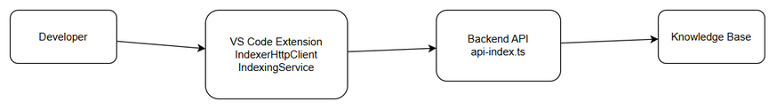
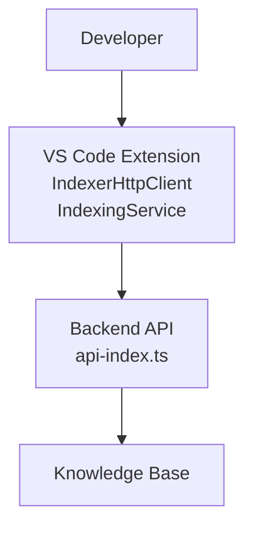
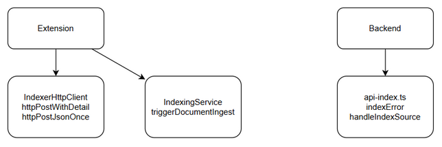
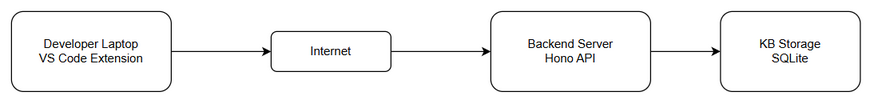
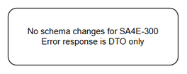
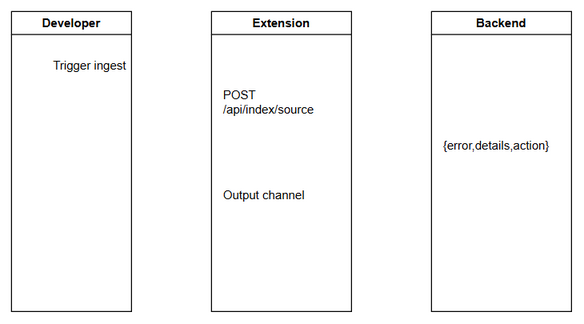
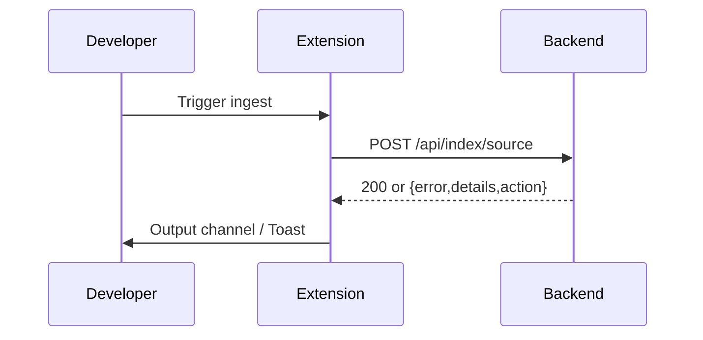

# Technical Design Document (TDD)

## SA4E-300 — [Extension/Backend] Cải thiện error detail trong luồng ingest source code vào KB

---

## Document Information

| Field | Value |
|-------|-------|
| Jira Ticket | SA4E-300 |
| Title | [Extension/Backend] Cải thiện error detail trong luồng ingest source code vào KB |
| Author | SA Agent |
| Version | 1.0 |
| Date | 2026-09-17 |
| Status | Draft |
| Related BRD | BRD-v1.0-SA4E-300.md |
| Related FSD | FSD-v1.0-SA4E-300.md |

---

## Author Tracking

| Role | Name - Position | Responsibility |
|------|-----------------|----------------|
| Author | SA Agent – Solution Architect | Create document |
| Peer Reviewer | – | Review document |

---

## Revision History

| Version | Date | Author | Changes |
|---------|------|--------|---------|
| 1.0 | 2026-09-17 | SA Agent | Initiate document — auto-generated from BRD and FSD |

---

## Sign-Off

| Name | Signature and date |
|------|--------------------|
| | ☐ I agree and confirm the technical design in this TDD |
| | ☐ I agree and confirm the technical design in this TDD |

---

## 1. Introduction

### 1.1 Purpose

TDD này thiết kế kỹ thuật cho việc cải thiện error surfacing trong luồng ingest source code từ VS Code Extension sang Backend Knowledge Base. Mục tiêu giúp developer nhận được thông tin lỗi đầy đủ, chi tiết từ Backend qua API, không phải SSH đọc pino log.

### 1.2 Scope

Phạm vi kỹ thuật bao gồm:
- Backend `backend/src/server/routes/api-index.ts`: enrich `indexError`, per-file failure tracking
- Extension `extension/src/services/IndexerHttpClient.ts`: `httpPostWithDetail` forward err.body, loại bỏ console.debug
- Extension `extension/src/services/IndexingService.ts`: `triggerDocumentIngest` error propagation, Output channel logging
- Không thay đổi retry/polling logic, không thay đổi contract `parseIngestResponse`, không động vào Pega flow

### 1.3 Technology Stack

| Layer | Technology | Version |
|-------|-----------|---------|
| Language | TypeScript | 5.x |
| Backend Framework | Hono | ^4 |
| Extension Runtime | VS Code Extension API | 1.x |
| Logging | Pino | ^8 |
| DB | SQLite / better-sqlite3 | - |
| Build Tool | npm | - |

### 1.4 Design Principles

- SOLID, Single Responsibility cho từng handler
- Error Propagation Chain: Backend → HTTP → Extension → Output channel, không nuốt exception
- DRY: centralize `indexError`
- No Workaround: fix root cause, không silent catch

### 1.5 Constraints

- Không đổi contract `parseIngestResponse` và legacy marker `UNCONVERTIBLE`
- Không expose stack trace nhạy cảm trong `details`
- Không thay đổi retry/polling algorithm
- Giữ backward compatible response shape, `details`/`action` là optional

### 1.6 References

| Document | Location |
|----------|----------|
| BRD | documents/SA4E-300/BRD.md |
| FSD | documents/SA4E-300/FSD.md |

---

## 2. System Architecture

### 2.1 Architecture Overview

Extension client gọi Backend API qua HTTP để ingest source code/documents. Backend xử lý, ghi Temp, ingest vào KB và trả error details.


*[Edit in draw.io](diagrams/architecture.drawio)*



### 2.2 Component Diagram


*[Edit in draw.io](diagrams/component.drawio)*

| Component | Responsibility | Technology |
|-----------|---------------|------------|
| IndexerHttpClient | HTTP layer, httpPostWithDetail, buildHeaders | TypeScript |
| IndexingService | Orchestrate ingest, Output channel logging | TypeScript |
| api-index.ts | Route handlers, indexError mapping | Hono + TypeScript |
| Knowledge Base | Store symbols/documents | SQLite |

### 2.3 Deployment Architecture


*[Edit in draw.io](diagrams/deployment.drawio)*

Developer laptop → Internet → Backend Server → KB Storage.

### 2.4 Communication Patterns

| From | To | Protocol | Pattern | Description |
|------|----|----------|---------|-------------|
| Extension | Backend | HTTP/REST | Sync | POST /api/index/source, /api/index/ingest-docs |
| Backend | KB | Internal | Sync | mem_ingest_file dispatcher |
| Backend | Extension | HTTP Response | Sync | Error details propagation |

---

## 3. API Design

### 3.1 API Overview

| # | Endpoint | Method | Description | Source |
|---|----------|--------|-------------|--------|
| 1 | /api/index/source | POST | Ingest source code batch | UC-1 |
| 2 | /api/index/full | POST | Trigger full re-index | UC-1 |
| 3 | /api/index/ingest-docs | POST | Ingest documents from Temp to KB | UC-2 |

### 3.2 API: POST /api/index/source

**Implements:** UC-1, BR-1, BR-4

| Attribute | Value |
|-----------|-------|
| Method | POST |
| Path | /api/index/source |
| Auth | Bearer Token + X-Project-Id |
| Rate Limit | 429 if > INDEX_CONCURRENCY_LIMIT |

**Request Headers:**

| Header | Required | Description |
|--------|----------|-------------|
| Authorization | Yes | Bearer <token> |
| X-Project-Id | Yes | Project identifier |
| X-Workspace-Root | No | Workspace root |

**Request Body:**
```json
{
  "files": [
    {
      "path": "string",
      "content": "string",
      "gitHash": "string?",
      "checksum": "string?"
    }
  ]
}
```

**Response 200:**
```json
{
  "written": 12,
  "skipped": 0,
  "rejected": ["path/to/file.ts"],
  "rejectedReasons": [
    {"file":"path","code":"EACCES","message":"Permission denied"}
  ],
  "deps": [],
  "projectId": "proj-123"
}
```

**Error Response:**
```json
{
  "error": "string",
  "details": "string?",
  "action": "string?",
  "status": 500
}
```

### 3.3 API: POST /api/index/ingest-docs

**Implements:** UC-2, BR-5

Success:
```json
{
  "ingested": 45,
  "errors": 2,
  "total": 47,
  "failedFiles": [
    {"file":"rel/path.md","reason":"ENOSPC disk full"}
  ]
}
```

Error shape same as above.

### 3.4 API: POST /api/index/full

Success 202:
```json
{
  "status": "started",
  "message": "Full index started",
  "projectId": "proj-123"
}
```

Error shape same.

---

## 4. Database Design

No schema changes for SA4E-300. Error response là DTO tạm thời, không persist.


*[Edit in draw.io](diagrams/db-schema.drawio)*

---

## 5. Class / Module Design

### 5.1 Package Structure

```
backend/src/server/routes/
  api-index.ts
extension/src/services/
  IndexerHttpClient.ts
  IndexingService.ts
```

### 5.2 Key Interfaces

```typescript
interface IndexErrorResponse {
  error: string;
  details?: string;
  action?: string;
  status?: number;
}

interface RejectedReason {
  file: string;
  code: string;
  message: string;
}
```

### 5.3 Design Patterns

| Pattern | Where Used | Rationale |
|---------|-----------|-----------|
| Error Propagation Chain | Backend→Extension | Không nuốt lỗi, forward full body |
| Centralized Error Mapping | indexError | Single responsibility |
| Command-Query Separation | handleIndexSource / handleIngestDocs | Write Temp tách ingest |

### 5.4 Error Handling

| Exception | HTTP Status | Error Code | When Thrown |
|-----------|-------------|------------|-------------|
| PROJECT_REQUIRED | 400 | X-Project-Id required | Missing header |
| ENOSPC | 500 | Disk full | Write fails |
| EACCES | 500 | Permission denied | Write fails |
| 401 | 401 | Unauthorized | Token invalid |

---

## 6. Integration Design

### 6.1 External System: Backend API

| Attribute | Value |
|-----------|-------|
| Protocol | HTTP REST |
| Endpoint | ${backendUrl}/api/index/* |
| Authentication | Bearer JWT |
| Timeout | 30-60s |
| Retry Policy | Exponential backoff 2s/4s/8s for 429/5xx |

Sequence diagram:


*[Edit in draw.io](diagrams/api-sequence-error-surfacing.drawio)*



---

## 7. Security Design

### 7.1 Authentication
JWT via `requireAuth`, validateSession.

### 7.2 Authorization
Project isolation via `X-Project-Id` header + `requireProjectId`.

### 7.3 Data Protection
`details` chỉ chứa err.message, err.code, không bao gồm stack trace.

---

## 8. Performance & Scalability

Enrich error không thêm query, không tăng latency đáng kể. Concurrency limit 3 giữ nguyên.

---

## 9. Monitoring & Observability

Logging chuyển từ `console.debug/console.warn` sang `IndexerHttpClient.getIndexerOutput().appendLine`. Pino logger backend ghi error với context.

---

## 10. Deployment Considerations

No deployment changes. Response payload enrichment backward compatible.

---

## 11. E2E Test Architecture

### 11.1 Framework & Language
- Framework: vitest + Playwright
- Language: TypeScript
- API test client: fetch against running Hono server

### 11.2 Test Structure
- Unit tests: backend/src/**/*.test.ts, extension/src/**/*.test.ts
- E2E-API tests: backend/tests/e2e/*.e2e.test.ts
- E2E-UI tests: extension tests

### 11.3 E2E-API Test Design
File: `api-index-error.e2e.test.ts`
- Test backend 500 returns {error,details,action}
- Test per-file rejectedReasons populated
- Test client httpPostWithDetail forwards body

---

## 12. Discrepancy Log

No discrepancies found between BRD/FSD and actual codebase. All change points align.

---

## 13. Acceptance Criteria Mapping

| AC | Design Decision |
|----|-----------------|
| Mọi 4xx/5xx có details/action | indexError enriched |
| Client forward err.body | httpPostWithDetail reads body.details/action |
| No silent catch | triggerDocumentIngest checks ok |
| Per-file failure details | rejectedReasons / failedFiles in response |
| Console → Output channel | replace console.debug/warn |

---

## MANDATORY Diagram Requirements

All diagrams exist as draw.io + PNG.

| Diagram | File |
|---------|------|
| Architecture | diagrams/architecture.drawio + .png |
| Component | diagrams/component.drawio + .png |
| Deployment | diagrams/deployment.drawio + .png |
| API Sequence | diagrams/api-sequence-error-surfacing.drawio + .png |
| DB Schema | diagrams/db-schema.drawio + .png |
| Class Diagram | diagrams/class-diagram.drawio + .png |
