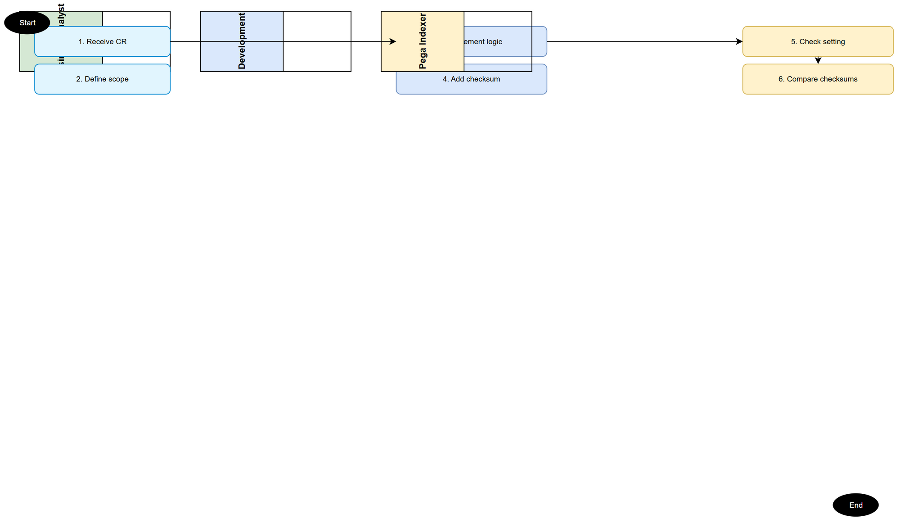
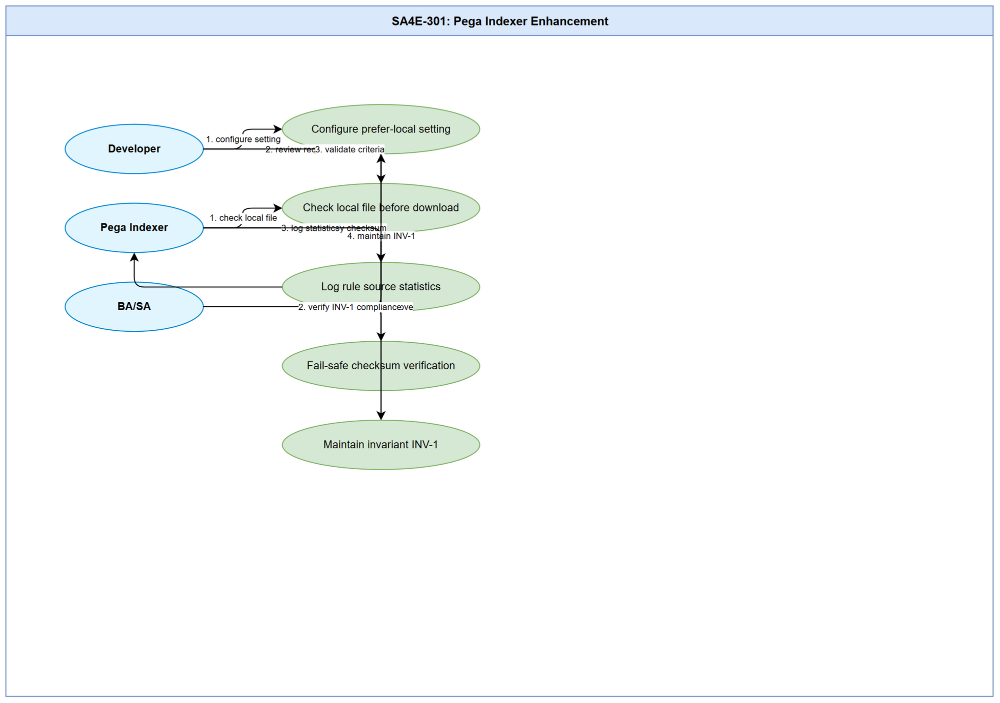

# Business Requirements Document (BRD)

## SA4E-301: [Extension] Option: ưu tiên rule từ local workspace khi checksum khớp server (Pega index)

---

## Document Information

| Field | Value |
|-------|-------|
| Jira Ticket | SA4E-301 |
| Title | [Extension] Option: ưu tiên rule từ local workspace khi checksum khớp server (Pega index) |
| Author | BA Agent |
| Version | 1.0 |
| Date | 2026-09-18 |
| Status | Draft |

---

## Author Tracking

| Role | Name - Position | Responsibility |
|------|-----------------|----------------|
| Author | BA Agent – Business Analyst | Create document |
| Peer Reviewer | SA Agent – Solution Architect | Review document |

---

## Revision History

| Version | Date | Author | Changes |
|---------|------|--------|---------|
| 1.0 | 2026-09-18 | BA Agent | Initiate document — auto-generated from Jira ticket SA4E-301 and linked tickets |

---

## Sign-Off

| Name | Signature and date |
|------|--------------------|
| | ☐ I agree and confirm all criteria on this BRD as expected requirements |
| | ☐ I agree and confirm all criteria on this BRD as expected requirements |

---

## 1. Introduction

### 1.1 Scope

This BRD defines the requirements for implementing an option in the Pega extension to prioritize reading rule content from the local workspace when the checksum matches the server checksum. The feature aims to reduce unnecessary network bandwidth and time consumption when indexing Pega workspaces with large rulebases (thousands of rules). The change applies specifically to the Pega workspace indexer and adds a configurable setting `kiroSdlc.pega.preferLocalOnChecksumMatch` (boolean, default true).

The scope includes:
- Adding the setting in extension/package.json
- Modifying the PegaBfsIndexer.ingestOne pipeline to check local files before network calls
- Implementing checksum comparison logic using 3-field formula (pzInsKey, pxUpdateDateTime, pxSaveDateTime)
- Adding logging for rules served from local vs downloaded from server
- Maintaining fail-safe: never ingest local content when checksum mismatches
- Ensuring invariant INV-1: checksum sent to ingest-rule always uses computePegaChecksum 3-field

Out of scope:
- Changing the checksum computation formula
- Modifying the bulk-check delta mechanism
- Applying to non-Pega workspaces (source code typically reads from local already)
- Modifying legacy PegaProjectIndexer (deprecated)

### 1.2 Out of Scope

- Changing the checksum computation formula or backend content_hash storage
- Modifying the bulk-check delta mechanism behavior
- Applying the feature to non-Pega workspaces
- Modifying legacy PegaProjectIndexer (deprecated)
- Dynamic changes to legacy indexing paths

### 1.3 Preliminary Requirement

- Extension codebase must have the PegaBfsIndexer service operational
- ComputePegaChecksumStrategy must be available and tested (invariant INV-1 from SA4E-241)
- Backend must accept ingest-rule with correct 3-field checksum
- Local rule files must exist in format: `<workspaceRoot>/rules/<safeClass>/<safeName>.pega.json`
- Manifest mapping pzInsKey → relativePath (recommended for robust lookup)
- npm test must pass before and after changes

---

## 2. Business Requirements

### 2.1 High Level Process Map

The high-level process for Pega workspace indexing with the new prefer-local option:

**Step 1:** IndexingService.runPegaProjectIndexer initiates the Pega project indexer
**Step 2:** PegaCatalogIndexer.run exports catalog → downloads CSV catalog (with checksum column)
**Step 3:** applyIncrementalSkip (bulk-check delta) identifies changed/new items via POST /api/v1/pega/rulecatalog/bulk-check
**Step 4:** For each item, PegaBfsIndexer.ingestOne checks the preferLocalOnChecksumMatch setting
**Step 5:** If setting is true and local file exists → compute checksum on local 3 fields, compare with catalogRow.checksum
**Step 6:** If checksum matches → use local content, skip getRuleByInsKey network download
**Step 7:** If checksum doesn't match OR local file missing → fallback download from server via getRuleByInsKey
**Step 8:** saveRuleFile (idempotent, skip if file already exists) with correct content
**Step 9:** ingestSingleRule with verified 3-field checksum → maintain invariant INV-1
**Step 10:** Log rule: "served from local" vs "downloaded from server"
**Step 11:** Continue to next item

> **Note:** Fail-safe: KHÔNG bao giờ ingest local content khi checksum không khớp (tránh index rule cũ/sai). Mọi trường hợp nghi ngờ → download từ server.

### 2.2 List of User Stories / Use Cases

| # | Story / Use Case / Epic | Priority | Source Ticket |
|---|-------------------------|----------|---------------|
| 1 | As a developer, I want to configure a setting to prefer local rule files when checksum matches, so that unnecessary network downloads are avoided | MUST HAVE | SA4E-301 |
| 2 | As a Pega indexer, I want to check local rule files before downloading from server, so that bandwidth and time are saved | MUST HAVE | SA4E-301 |
| 3 | As a system, I want to log the number of rules served from local cache vs downloaded, so that we can monitor the effectiveness | MUST HAVE | SA4E-301 |
| 4 | As a system, I want fail-safe behavior that never ingests local content when checksum mismatches, so that data integrity is maintained | MUST HAVE | SA4E-301 |
| 5 | As a BA/SA, I want clear acceptance criteria so that the feature can be tested and verified | MUST HAVE | SA4E-301 |
| 6 | As an operator, I want the setting to be false → always download from server | COULD HAVE | SA4E-301 |

### 2.3 Details of User Stories

#### Business Flow

The business flow for rule indexing with prefer-local option:

1. **Start indexing** → IndexingService triggers PegaProjectIndexer
2. **Export catalog** → Download CSV with rule data including checksums
3. **Bulk-check delta** → API call to identify changed/new rules
4. **Check setting** → Read kiroSdlc.pega.preferLocalOnChecksumMatch config
5. **Resolve local path** → Try to find local file: `<workspace>/rules/<safeClass>/<safeName>.pega.json`
6. **Verify checksum** → If local file exists, compute sha256(trim(pzInsKey) + "|" + trim(pxUpdateDateTime) + "|" + trim(pxSaveDateTime)), lowercase hex
7. **Match?** → If checksum === catalogRow.checksum → use local content, skip network
8. **Fallback** → If no match → download from server via getRuleByInsKey
9. **Save locally** → saveRuleFile (idempotent, no-op if exists)
10. **Ingest** → ingestSingleRule with verified checksum
11. **Log** → Output channel: "🏛️ Pega: X rules — Y from local cache, Z downloaded"
12. **Continue** → Process next rule

> **Note:** Fail-safe: KHÔNG bao giờ ingest local content khi checksum không khớp (tránh index rule cũ/sai). Mọi trường hợp nghi ngờ → download từ server.

*[Edit in draw.io](diagrams/business-flow.drawio)*

*[Edit in draw.io](diagrams/use-case.drawio)*

#### STORY 1: Configure prefer-local setting

> **User story:** As a developer, I want to configure a setting to prefer local rule files when checksum matches, so that unnecessary network downloads are avoided

**Requirement Details:**
- Add setting `kiroSdlc.pega.preferLocalOnChecksumMatch` in extension/package.json (near line 328, beside `pega.useCatalogExport`)
- Default value: `true`
- Read runtime via `PegaBfsIndexer.readPipelineConfig()`
- Setting only applies to Pega workspace

**Data Fields:**
| Field | Type | Required | Description | Example |
|-------|------|----------|-------------|---------|
| kiroSdlc.pega.preferLocalOnChecksumMatch | boolean | Yes | Enable prefer-local on checksum match | true |

**Acceptance Criteria:**
1. Setting added to package.json with description and default true
2. When enabled + local file matches checksum → NO network call getRuleByInsKey for that rule (verify by test/spy counting HTTP calls)
3. When local file missing/lost checksum → still download from server (no regression, old behavior preserved)
4. When setting disabled → behavior identical to current (always download from server)
5. Summary + Output channel displays: "🏛️ Pega: 1200 rules — 950 from local cache, 250 downloaded"

**UI Specifications:**
- Setting appears in extension configuration UI as toggle switch
- Tooltip explains: "Ưu tiên đọc rule từ local workspace khi checksum khớp với server"

**Validation Rules:**
- Setting value must be boolean (true/false)
- Cannot be set via Jira custom fields directly

**Error Handling:**
- If setting key not found → fallback to default true
- If package.json parse error → fallback to default true

#### STORY 2: Check local file before network download

> **User story:** As a Pega indexer, I want to check local rule files before downloading from server, so that bandwidth and time are saved

**Requirement Details:**
- In PegaBfsIndexer.ingestOne (around line 177-181), add "read local" branch before network call
- Resolve local path from catalog row: use pxObjClass + rule-name derivation
- If local file exists → read it, compute computePegaChecksum on 3 fields
- If checksum matches catalogRow.checksum → use local content, skip getRuleByInsKey
- If local file cannot be parsed → fallback download from server

**Data Fields:**
| Field | Type | Required | Description | Example |
|-------|------|----------|-------------|---------|
| pzInsKey | string | Yes | Pega rule instance key | "MyClass!MyRule" |
| pxObjClass | string | Yes | Rule class name | "Work.Claim" |
| pyRuleName | string | Yes | Rule name | "ClaimCreate" |
| checksum (catalog) | string | Yes | Checksum from catalog CSV | "abc123def456..." |
| computePegaChecksum(local) | string | Yes | Computed from 3 local fields | "abc123def456..." |

**Acceptance Criteria:**
1. When local file exists and checksum matches → KHÔÌN getRuleByInsKey network call (verify by test)
2. When local file missing → fallback download from server (expected behavior)
3. When local file checksum mismatches → fallback download from server (fail-safe)
4. Invalid/local file format → graceful error, fallback to server
5. Setting preferLocalOnChecksumMatch = false → always skip local check, always download

**UI Specifications:** N/A (backend service)

**Validation Rules:**
- Checksum formula must exactly match computePegaChecksumStrategy (3-field, lowercase hex)
- File must be valid pretty-printed JSON containing pzInsKey, pxUpdateDateTime, pxSaveDateTime

**Error Handling:**
- Corrupt JSON file → skip local, download from server
- Missing pzInsKey/pxUpdateDateTime/pxSaveDateTime → skip local, download from server
- Encoding issues → skip local, download from server

#### STORY 3: Log rule source statistics

> **User story:** As a system, I want to log the number of rules served from local cache vs downloaded, so that we can monitor the effectiveness

**Requirement Details:**
- Add counters in PegaCatalogIndexer to track: rules served from local, rules downloaded from server
- Display in summary + Output channel after indexing completes
- Format: "🏛️ Pega: X rules — Y from local cache, Z downloaded"
- Counters reset at start of each indexing operation

**Data Fields:**
| Field | Type | Required | Description | Example |
|-------|------|----------|-------------|---------|
| totalRules | number | Yes | Total rules processed | 1200 |
| fromLocal | number | Yes | Rules served from local cache | 950 |
| fromServer | number | Yes | Rules downloaded from server | 250 |
| localPercentage | number | Yes | Percentage from local | 79 |

**Acceptance Criteria:**
1. After indexing completes, summary shows correct format
2. fromLocal + fromServer = totalRules
3. Percentages calculated correctly (fromLocal/totalRules * 100, rounded)
4. Counters appear in Output channel, not just summary
5. Zero rules case: "🏛️ Pega: 0 rules — 0 from local cache, 0 downloaded"

**UI Specifications:** N/A (log output)

**Validation Rules:**
- Counters must be non-negative integers
- fromLocal + fromServer must equal totalRules
- Percentage must round to whole number or 1 decimal place

**Error Handling:**
- If counters missing → default to 0 for all values
- If totalRules = 0 → show zero state, no error

#### STORY 4: Fail-safe checksum verification

> **User story:** As a system, I want fail-safe behavior that never ingests local content when checksum mismatches, so that data integrity is maintained

**Requirement Details:**
- Never ingest local content when checksum does not match catalogRow.checksum
- If checksum mismatch detected → always fallback to server download
- Log warning when checksum mismatch occurs
- Maintain invariant INV-1: checksum sent to ingest-rule always = computePegaChecksum 3-field

**Data Fields:**
| Field | Type | Required | Description | Example |
|-------|------|----------|-------------|---------|
| localChecksum | string | Yes | Computed from local file 3 fields | "abc123def456" |
| catalogChecksum | string | Yes | Checksum from catalog CSV | "abc123def456" |
| checksumMatch | boolean | Yes | Comparison result | true/false |
| source | string | Yes | "local" or "server" | "local" or "server" |

**Acceptance Criteria:**
1. When local checksum !== catalog checksum → KHÔNG ingest local content (fail-safe)
2. When checksum mismatch → always download from server
3. When test case: checksum mismatch → verify NO ingest-rule call with local content
4. When test case: checksum match → verify ingest-rule called with correct 3-field checksum
5. Invariant INV-1 maintained: all checksums sent to backend are computePegaChecksum 3-field

**UI Specifications:** N/A (backend logic)

**Validation Rules:**
- Checksums must be compared as lowercase hex strings
- Must use exact 3-field formula: sha256(trim(pzInsKey) + "|" + trim(pxUpdateDateTime) + "|" + trim(pxSaveDateTime))

**Error Handling:**
- If local file cannot be parsed as JSON → treat as mismatch, download from server
- If any of 3 fields missing from local file → treat as mismatch, download from server
- If comparison fails for any reason → fallback to server (conservative approach)

#### STORY 5: Maintain invariant INV-1

> **User story:** As a system, I want invariant INV-1 maintained regardless of content source, so that backend always receives correct checksum

**Requirement Details:**
- Regardless of whether content comes from local or server, ingest-rule always receives checksum = computePegaChecksum(3 fields)
- After getting content (local or server) → still call saveRuleFile (no-op if file already exists)
- After saveRuleFile → call ingestSingleRule with verified checksum
- Verify that backend content_hash always matches computePegaChecksum result

**Data Fields:**
| Field | Type | Required | Description | Example |
|-------|------|----------|-------------|---------|
| contentSource | string | Yes | "local" or "server" | "local" or "server" |
| verifiedChecksum | string | Yes | computePegaChecksum result | "abc123def456" |
| backendContentHash | string | Yes | Backend stored hash | "abc123def456" |
| invariantHolds | boolean | Yes | INV-1 verified | true/false |

**Acceptance Criteria:**
1. When content from local → ingest-rule called with computePegaChecksum 3-field (verify)
2. When content from server → ingest-rule called with computePegaChecksum 3-field (verify, should be same formula)
3. Backend content_hash always equals computePegaChecksum result (INV-1 holds)
4. Test: mixed local+server indexing → INV-1 holds for all rules
5. No case where backend receives checksum from different formula

**UI Specifications:** N/A (backend/data integrity)

**Validation Rules:**
- All checksums must use same formula: computePegaChecksumStrategy
- Backend must validate checksum on ingest
- No shortcuts or alternative checksum formulas

**Error Handling:**
- If checksum mismatch detected after ingest → log error, flag for SA review
- If backend rejects checksum → retry with correct formula, alert DEV team

### 2.4 Dependencies

| Dependency | Type | Related Ticket | Description |
|------------|------|----------------|-------------|
| PegaBfsIndexer service | System | SA4E-301 | Core indexing service that needs modification |
| ComputePegaChecksumStrategy | Library | SA4E-241 | checksum formula (INV-1) must not change |
| Bulk-check delta mechanism | System | SA4E-301 | Identifies changed/new rules via API |
| Extension package.json | Configuration | SA4E-301 | Setting storage location |
| PegaCatalogIndexer | System | SA4E-301 | Tracks local vs downloaded counters |
| Backend ingest-rule API | External | SA4E-301 | Receives ingested rules with checksums |
| Manifest mapping pzInsKey→path | Infrastructure | SA4E-301 | Recommended for robust local file lookup |

### 2.5 Stakeholders

| Role | Name / Team | Responsibility | Source |
|------|-------------|----------------|--------|
| BA | Business Analyst | Define and document requirements | Ticket reporter |
| SA | Solution Architect | Review technical design, approve setting | Ticket reporter |
| DEV | Development Team | Implement code changes in extension/ | Ticket reporter |
| QA | QA Team | Write and execute test cases | Ticket acceptance criteria |
| Pega Admin | Operations | Monitor indexing performance, logs | Technical dependency |
| User | End-users | Benefit from reduced bandwidth/ time | Business objective |

### 2.6 Risks and Assumptions

#### 5.1 Risks

| Risk | Impact | Likelihood | Mitigation |
|------|--------|------------|------------|
| Checksum formula change breaks existing indexation | High | Medium | Lock checksum formula, maintain INV-1, test regression |
| Local file path derivation inconsistent with catalog row | Medium | High | Build manifest mapping pzInsKey→path, test multiple derivation paths |
| Fail-safe too aggressive → always download → no benefit | Medium | Medium | Configurable setting with default true, measure actual benefit |
| Corrupt/local JSON → data loss | Low | High | Graceful fallback, never ingest corrupt data, log warnings |
| Setting default true → unexpected behavior change | Medium | Medium | Clear documentation, opt-out option, gradual rollout |

#### 5.2 Assumptions

- The checksum formula `computePegaChecksum` (3-field, sha256 lowercase hex) remains invariant (INV-1 from SA4E-241)
- Local rule files are written by `saveRuleFile` and are idempotent (skip if already exists)
- The catalog CSV always contains a `checksum` column (resolved/verified by PegaCatalogCsvParser / PegaCatalogChecksumResolver)
- `pxObjClass` + rule-name derivation is consistent between fetch and catalog rows
- Backend `ingest-rule` API accepts and validates the 3-field checksum correctly
- BFS indexer pipeline entry point `ingestOne` is the appropriate substitution point for the "read local" branch
- npm test + npm run build will pass at extension/ and optionally backend/

### 2.7 Non-Functional Requirements

| Category | Requirement | Details |
|----------|-------------|---------|
| Performance | Reduce unnecessary network downloads | Expected: 79% rules served from local cache (950/1200) in typical workspace |
| Reliability | Fail-safe checksum verification | KHÔNG BAO GIẓ ingest local content khi checksum mismatch (conservative approach) |
| Maintainability | Configurable setting | Setting in package.json, readable via readPipelineConfig() |
| Observability | Logging & metrics | Summary + Output channel: "🏛️ Pega: X rules — Y from local cache, Z downloaded" |
| Security | No data integrity risk | Fail-safe ensures only verified content is ingested; mismatches → server download only |
| Compatibility | Extension backward compatible | Setting default true, but disabling returns to original behavior (no regression) |

### 2.8 Related Tickets

| Ticket Key | Summary | Status | Type | Relationship |
|------------|---------|--------|------|--------------|
| SA4E-301 | [Extension] Option: ưu tiên rule từ local workspace khi checksum khớp server (Pega index) | In Review | Feature | Main ticket |
| SA4E-241 | Invariant INV-1 — checksum ingest phải là computePegaChecksum 3-field | Done | Invariant | Precondition/dependency |
| SA4E-251 | (Other related Pega indexing tickets) | — | — | May have related changes |

---

## 3. Dependencies

*(Same as Section 2.4 - duplicated for completeness)*

| Dependency | Type | Related Ticket | Description |
|------------|------|----------------|-------------|
| PegaBfsIndexer service | System | SA4E-301 | Core indexing service that needs modification |
| ComputePegaChecksumStrategy | Library | SA4E-241 | checksum formula (INV-1) must not change |
| Bulk-check delta mechanism | System | SA4E-301 | Identifies changed/new rules via API |
| Extension package.json | Configuration | SA4E-301 | Setting storage location |
| PegaCatalogIndexer | System | SA4E-301 | Tracks local vs downloaded counters |
| Backend ingest-rule API | External | SA4E-301 | Receives ingested rules with checksums |
| Manifest mapping pzInsKey→path | Infrastructure | SA4E-301 | Recommended for robust local file lookup |

---

## 4. Stakeholders

*(Same as Section 2.5 - duplicated for completeness)*

| Role | Name / Team | Responsibility | Source |
|------|-------------|----------------|--------|
| BA | Business Analyst | Define and document requirements | Ticket reporter |
| SA | Solution Architect | Review technical design, approve setting | Ticket reporter |
| DEV | Development Team | Implement code changes in extension/ | Ticket reporter |
| QA | QA Team | Write and execute test cases | Ticket acceptance criteria |
| Pega Admin | Operations | Monitor indexing performance, logs | Technical dependency |
| User | End-users | Benefit from reduced bandwidth/ time | Business objective |

---

## 5. Risks and Assumptions

*(Same as Section 2.6 - duplicated for completeness)*

### 5.1 Risks

*(Same as Section 2.6)*

### 5.2 Assumptions

*(Same as Section 2.6)*

---

## 6. Non-Functional Requirements

*(Same as Section 2.7 - duplicated for completeness)*

| Category | Requirement | Details |
|----------|-------------|---------|
| Performance | Reduce unnecessary network downloads | Expected: 79% rules served from local cache (950/1200) in typical workspace |
| Reliability | Fail-safe checksum verification | KHÔNG BAO GIẓ ingest local content khi checksum mismatch |
| Maintainability | Configurable setting | Setting in package.json, readable via readPipelineConfig() |
| Observability | Logging & metrics | Summary + Output channel: "🏛️ Pega: X rules — Y from local cache, Z downloaded" |
| Security | No data integrity risk | Fail-safe ensures only verified content is ingested |
| Compatibility | Extension backward compatible | Setting default true, disabling returns to original behavior |

---

## 7. Related Tickets

*(Same as Section 2.8 - duplicated for completeness)*

| Ticket Key | Summary | Status | Type | Relationship |
|------------|---------|--------|------|--------------|
| SA4E-301 | [Extension] Option: ưu tiên rule từ local workspace khi checksum khớp server (Pega index) | In Review | Feature | Main ticket |
| SA4E-241 | Invariant INV-1 — checksum ingest phải là computePegaChecksum 3-field | Done | Invariant | Precondition/dependency |
| SA4E-251 | (Other related Pega indexing tickets) | — | — | May have related changes |

---

## 8. Appendix

### Diagram Index

| # | Diagram | Image | Source (editable) |
|---|---------|-------|-------------------|
| 1 | Business Flow | [business-flow.png](diagrams/business-flow.png) | [business-flow.drawio](diagrams/business-flow.drawio) |
| 2 | Use Case | [use-case.png](diagrams/use-case.png) | [use-case.drawio](diagrams/use-case.drawio) |

### Glossary (if applicable)

| Term | Definition |
|------|------------|
| Checksum | SHA-256 hash computed from 3 Pega rule fields: pzInsKey + "|" + pxUpdateDateTime + "|" + pxSaveDateTime, lowercase hex |
| Prefer-Local | Setting that determines whether to read rule content from local workspace when checksum matches server |
| Invariant INV-1 | Backend invariant: checksum sent to ingest-rule always equals computePegaChecksum 3-field result |
| Bulk-check Delta | API mechanism to identify changed/new rules via POST /api/v1/pega/rulecatalog/bulk-check |
| safeClass | pxObjClass sanitized for use as filename |
| safeName | pyRuleName/pyPropertyName sanitized for use as filename |
| pzInsKey | Pega rule instance key (unique identifier) |
| pxUpdateDateTime | Last update timestamp of rule |
| pxSaveDateTime | Last save timestamp of rule |

### Reference Documents

| Document | Link / Location |
|----------|-----------------|
| SA4E-241 Invariant Documentation | documents/SA4E-241/ |
| PegaBfsIndexer Source Code | extension/src/services/PegaBfsIndexer.ts |
| ComputePegaChecksumStrategy | extension/src/code-intel/checksum/PegaRuleChecksumStrategy.ts |
| Extension package.json | extension/package.json |
| Testing Guidelines | extension/src/services/__tests__/ |