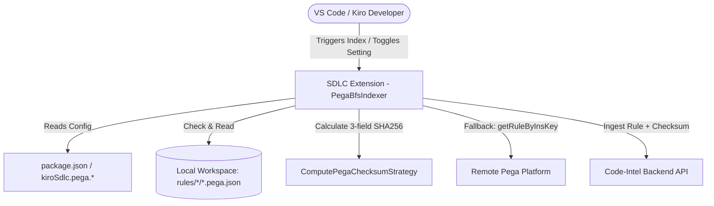
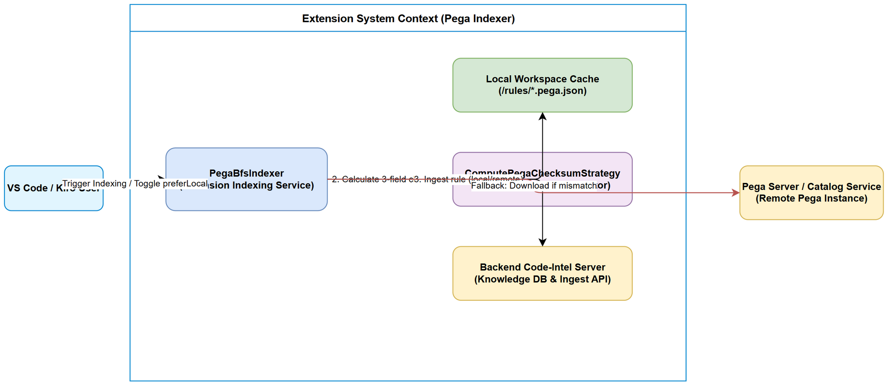
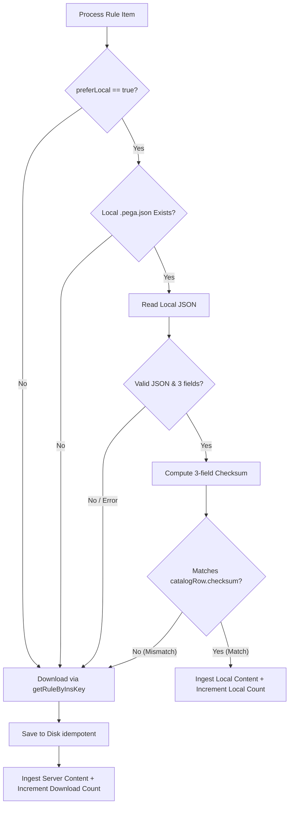
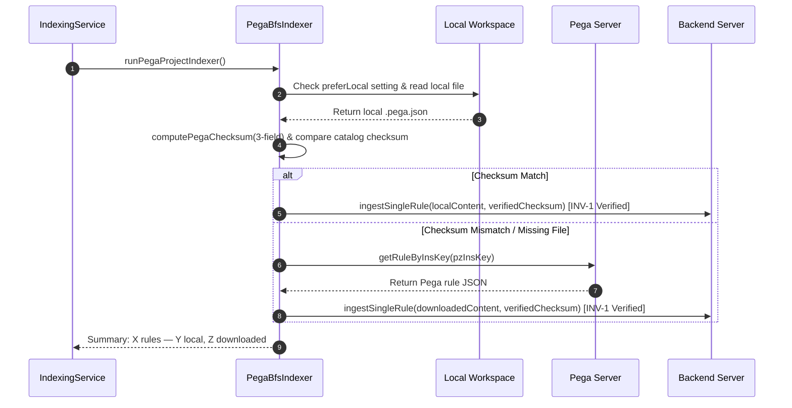
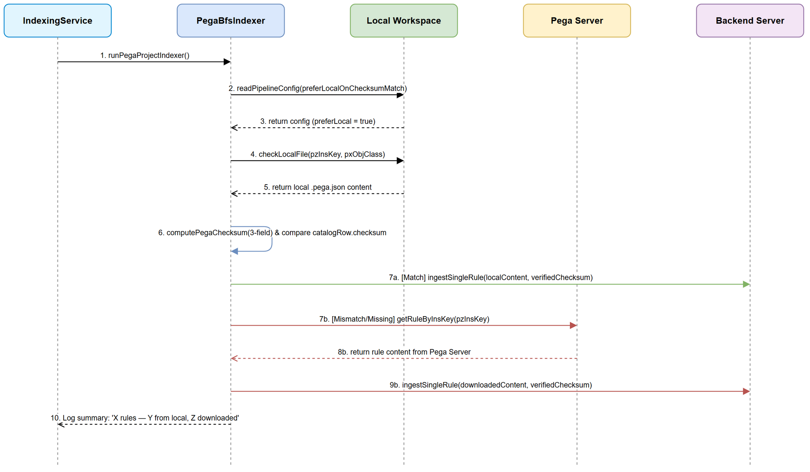
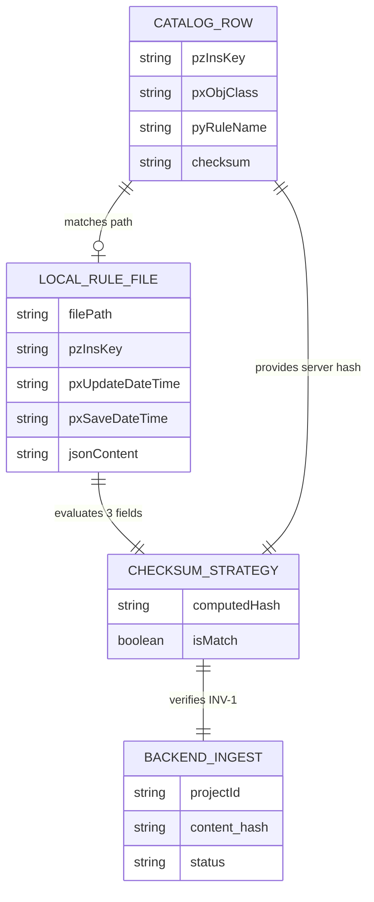
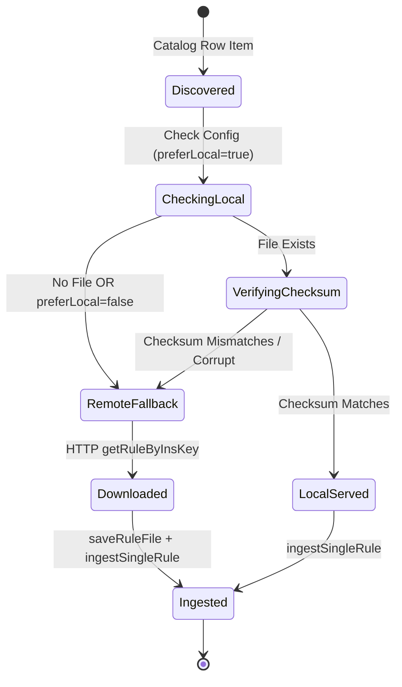
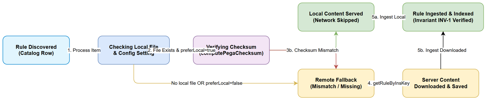

# Functional Specification Document (FSD)

## SDLC Agents 4 Enterprise — SA4E-301: [Extension] Option: ưu tiên rule từ local workspace khi checksum khớp server (Pega index)

---

## Document Information

| Field | Value |
|-------|-------|
| Jira Ticket | SA4E-301 |
| Title | [Extension] Option: ưu tiên rule từ local workspace khi checksum khớp server (Pega index) |
| Author | BA Agent (Draft), Technical Architect (Enrichment) |
| Version | 1.1 |
| Date | 2026-09-19 |
| Status | In Review (Enriched by TA) |
| Related BRD | documents/SA4E-301/BRD.md |

---

## Revision History

| Version | Date | Author | Changes |
|---------|------|--------|---------|
| 1.0 | 2026-09-19 | BA Agent | Initial document creation from BRD and codebase analysis |
| 1.1 | 2026-09-19 | Technical Architect | TA Technical Enrichment: Full API Contracts, Zod Schemas, Pseudocode, Physical Data Model, NFR Quantified Targets, Integration Resilience & Open Issues |

---

## 1. Introduction

### 1.1 Purpose

This Functional Specification Document (FSD) details the functional behavior, technical components, business rules, processing logic, API contracts, and interface specifications for implementing the **"Prefer Local Workspace Rule on Checksum Match"** feature in the Pega Indexer extension (`SA4E-301`).

The primary objective is to eliminate unnecessary HTTP GET requests (`getRuleByInsKey`) to the remote Pega Platform during indexing when identical, verified rule content already exists in the local workspace. This drastically reduces network bandwidth, avoids HTTP throttling, and speeds up overall indexing execution time for enterprise applications with thousands of Pega rules.

### 1.2 Scope

#### In-Scope:
- Configuration setting declaration: `kiroSdlc.pega.preferLocalOnChecksumMatch` in `extension/package.json` (boolean, default `true`). `[Implements: Story #1]`
- Runtime settings reading in `PegaBfsIndexer.readPipelineConfig()` to guarantee immediate effect on subsequent index runs without requiring a VS Code window reload. `[Implements: Story #1]`
- Pipeline logic modification in `PegaBfsIndexer.ingestOne` & `PegaBfsPipeline` to check for local `.pega.json` rule file before issuing remote HTTP calls. `[Implements: Story #2]`
- Calculation of local 3-field Pega checksum using `computePegaChecksum` (`sha256(trim(pzInsKey) + "|" + trim(pxUpdateDateTime) + "|" + trim(pxSaveDateTime))`, lowercase hex). `[Implements: Story #2, Story #4]`
- Comparison of local computed checksum against `catalogRow.checksum`. `[Implements: Story #2, Story #4]`
- Fail-safe fallback mechanism: download from remote server via `getRuleByInsKey` if local file is missing, corrupt, or checksum mismatches. `[Implements: Story #4]`
- Strict preservation of invariant **INV-1** (SA4E-241): checksum sent to backend `ingest-rule` API MUST always equal `computePegaChecksum` 3-field result regardless of content source. `[Implements: Story #5]`
- Telemetry & metric counters in `PegaCatalogIndexer` and output logs: `"🏛️ Pega: X rules — Y from local cache, Z downloaded"`. `[Implements: Story #3]`

#### Out-of-Scope:
- Modifying `computePegaChecksum` formula or backend `content_hash` calculation.
- Changing `BulkCheckClient` or incremental delta bulk-check logic.
- Non-Pega source code indexers (e.g. TypeScript, Java).
- Deprecated legacy `PegaProjectIndexer`.

<!-- TA enrichment -->
### 1.5 Technical Assumptions & Constraints

> **TA Note:** The technical design assumes the following architecture invariants:
> 1. **Local File Structure Convention:** Local rule files follow the path pattern `<workspaceRoot>/rules/<safeClass>/<safeName>.pega.json`, where `safeClass` is `pxObjClass.replace(/[^a-zA-Z0-9_-]/g, "_")` and `safeName` is `pyRuleName.replace(/[^a-zA-Z0-9_-]/g, "_")`.
> 2. **3-Field Checksum Invariant (INV-1):** The checksum is strictly calculated from `pzInsKey`, `pxUpdateDateTime`, and `pxSaveDateTime`. No additional JSON fields participate in hash generation.
> 3. **Single-Node Disk Safety:** Local disk reads occur synchronously within the VS Code Extension host process; local file locks or concurrent FS writes from external tools are handled with graceful try-catch fallbacks to server downloads.

---

### 1.3 Definitions & Acronyms

| Term | Definition |
|------|------------|
| PegaBfsIndexer | Core breadth-first search indexing service in VS Code extension (`extension/src/services/PegaBfsIndexer.ts`). |
| PegaCatalogIndexer | Fast-path catalog export indexer service (`extension/src/services/PegaCatalogIndexer.ts`). |
| Prefer-Local | Feature toggle enabling local workspace rule read when checksums match server. |
| Checksum / SHA-256 | SHA-256 digest computed over 3 Pega fields: `pzInsKey`, `pxUpdateDateTime`, `pxSaveDateTime`. |
| Invariant INV-1 | Guarantee that ingested rule checksum sent to backend always equals `computePegaChecksum` output (SA4E-241). |
| catalogRow | Row metadata from downloaded Pega Rule Catalog CSV containing rule identification and server checksum. |
| safeClass | Sanitized `pxObjClass` safe for filesystem pathing. |
| safeName | Sanitized `pyRuleName`/`pyPropertyName` safe for filesystem pathing. |
| Zod | TypeScript-first schema declaration and validation library used for API request/response contracts. |

---

### 1.4 References

| Document | Location |
|----------|----------|
| BRD | documents/SA4E-301/BRD.md |
| Invariant INV-1 Spec | documents/SA4E-241/BRD.md |
| PegaBfsIndexer Source | extension/src/services/PegaBfsIndexer.ts |
| PegaCatalogIndexer Source | extension/src/services/PegaCatalogIndexer.ts |
| PegaRuleChecksumStrategy Source | extension/src/code-intel/checksum/PegaRuleChecksumStrategy.ts |
| Extension Package Spec | extension/package.json |
| Backend Knowledge Module | backend/src/modules/knowledge/ |

---

## 2. System Overview

### 2.1 System Context Diagram

The Pega extension operates within VS Code/Kiro IDE, interfacing with the local workspace disk, remote Pega REST endpoints, and the Code-Intelligence backend service.




*[Edit in draw.io](diagrams/system-context.drawio)*

### 2.2 System Architecture

The technical architecture involves three principal layers:
1. **Configuration Layer**: VS Code settings system providing `kiroSdlc.pega.preferLocalOnChecksumMatch`.
2. **Indexing Orchestrator**: `PegaCatalogIndexer` drives catalog export, delta filtering (`applyIncrementalSkip`), and delegates rule ingestion to `PegaBfsIndexer`.
3. **Execution Pipeline**: `PegaBfsIndexer` executing producer-consumer batching via `PegaBfsPipeline`. When processing an item, it inspects local workspace storage, validates 3-field checksums, and selectively triggers HTTP downloads or direct local reads before passing the payload to `PegaStreamIngester`.

---

## 3. Functional Requirements

### 3.1 Feature 1: Prefer-Local Configuration Setting

**Source:** BRD Story 1 `[Implements: Story #1]`

#### 3.1.1 Description
Expose a user-configurable boolean configuration setting in `extension/package.json` that controls whether the Pega indexer attempts local file reads before remote network fetches.

#### 3.1.2 Use Case: UC-1 (Configure Prefer-Local Setting)

**Use Case ID:** UC-1  
**Actor:** Developer / System Operator  
**Preconditions:** Extension installed in VS Code/Kiro IDE.  
**Postconditions:** Configuration stored and reflected immediately on next indexing execution.

**Main Flow:**

| Step | Actor | System | Description |
|------|-------|--------|-------------|
| 1 | Developer | | Opens VS Code Settings UI or `settings.json`. |
| 2 | | System | Displays `kiroSdlc.pega.preferLocalOnChecksumMatch` with default `true`. |
| 3 | Developer | | Modifies setting value (`true` or `false`). |
| 4 | | System | Saves setting in workspace or global configuration. |
| 5 | | System | `readPipelineConfig()` reads the updated value on subsequent index runs without requiring a window reload. |

<!-- TA enrichment -->
**Alternative Flows:**
- **AF-1.1 (Setting set to `false`):** When disabled, the indexer skips all local file checks and executes standard network downloads (`getRuleByInsKey`) for all candidates.
- **AF-1.2 (Reset setting to default):** User clicks "Reset Setting" in VS Code UI. System removes workspace override and defaults to `true`.

**Exception Flows:**
- **EF-1.1 (Non-boolean value in `settings.json`):** User manually enters `"string_val"` or `123` in `settings.json`. `readPipelineConfig()` traps type mismatch and safely defaults to `true`.
- **EF-1.2 (Configuration read permissions error):** VS Code settings API throws error when reading configuration. System logs warning and uses default `true`.

#### 3.1.3 Business Rules

| Rule ID | Rule | Source |
|---------|------|--------|
| BR-1 | `kiroSdlc.pega.preferLocalOnChecksumMatch` must default to `true`. | SA4E-301 BRD Story 1 |
| BR-2 | Setting value changes must take effect on the next indexing run without requiring window reload. | SA4E-301 BRD Story 1 |

#### 3.1.4 Data Specifications

| Field | Type | Required | Default | Description |
|-------|------|----------|---------|-------------|
| kiroSdlc.pega.preferLocalOnChecksumMatch | boolean | Yes | `true` | Prefer reading rule content from local workspace when 3-field checksum matches server catalog checksum |

#### 3.1.5 UI Specifications

**VS Code Settings UI:**
- **Key:** `kiroSdlc.pega.preferLocalOnChecksumMatch`
- **Label:** `Pega Indexing: Prefer Local On Checksum Match`
- **Control:** Checkbox / Toggle switch
- **Description:** `Ưu tiên đọc rule từ local workspace khi checksum khớp với server (giảm băng thông và thời gian index).`

<!-- TA enrichment -->
#### 3.1.6 Technical API Contract: Configuration Access (Extension Internal API)

```typescript
// Location: extension/src/services/PegaBfsIndexer.ts
export interface PipelineTuning {
  fetchBatchSize: number;
  ingestConcurrency: number;
  channelCapacity: number;
  preferLocalOnChecksumMatch: boolean; // TA Enriched
}

export function readPipelineConfig(): PipelineTuning {
  const cfg = vscode.workspace.getConfiguration("kiroSdlc");
  const preferLocal = cfg.get<boolean>("pega.preferLocalOnChecksumMatch", true);
  return {
    fetchBatchSize: clamp(cfg.get<number>("pega.fetchBatchSize"), 50, { min: 1, max: 1000 }),
    ingestConcurrency: clamp(cfg.get<number>("pega.ingestConcurrency"), 10, { min: 1, max: 64 }),
    channelCapacity: cfg.get<number>("pega.ingestChannelCapacity") ?? 20,
    preferLocalOnChecksumMatch: typeof preferLocal === "boolean" ? preferLocal : true,
  };
}
```

---

### 3.2 Feature 2: Local File Check & Checksum Verification Pipeline

**Source:** BRD Story 2 & Story 4 `[Implements: Story #2, Story #4]`

#### 3.2.1 Description
Modify `PegaBfsIndexer.ingestOne` (or `PegaBfsPipeline` fetcher) to evaluate local rule availability prior to issuing `getRuleByInsKey` HTTP requests.

#### 3.2.2 Use Case: UC-2 (Ingest Rule with Local Checksum Match)

**Use Case ID:** UC-2  
**Actor:** PegaBfsIndexer  
**Preconditions:** `preferLocalOnChecksumMatch` is `true`; `catalogRow` contains `pzInsKey`, `pxObjClass`, `pyRuleName`, and `checksum`.  
**Postconditions:** Rule ingested into backend using local file content without network download.

**Main Flow:**

| Step | Actor | System | Description |
|------|-------|--------|-------------|
| 1 | | PegaBfsIndexer | Receives catalog candidate item to ingest. |
| 2 | | PegaBfsIndexer | Checks `preferLocalOnChecksumMatch` setting (`true`). |
| 3 | | PegaBfsIndexer | Resolves local file path: `<workspaceRoot>/rules/<safeClass>/<safeName>.pega.json`. |
| 4 | | PegaBfsIndexer | Verifies local file exists on disk. |
| 5 | | PegaBfsIndexer | Reads local file content and parses JSON. |
| 6 | | PegaBfsIndexer | Computes 3-field checksum via `computePegaChecksum({ pzInsKey, pxUpdateDateTime, pxSaveDateTime })`. |
| 7 | | PegaBfsIndexer | Compares `computedChecksum` with `catalogRow.checksum`. |
| 8 | | PegaBfsIndexer | Checksums MATCH → uses local JSON content, skips remote `getRuleByInsKey` call. |
| 9 | | PegaBfsIndexer | Calls `ingestSingleRule(projectId, localRuleObj, computedChecksum)`. |
| 10 | | PegaBfsIndexer | Increments `fromLocal` telemetry counter. |

<!-- TA enrichment -->
**Alternative Flows:**
- **AF-2.1 (Local file missing):** Step 4 fails → proceeds to remote fallback download (UC-3).
- **AF-2.2 (Checksum Mismatch):** Step 7 comparison yields `false` → logs `[BfsIndexer] ℹ️ Local checksum mismatch for <pzInsKey>` → proceeds to remote fallback download (UC-3).
- **AF-2.3 (Manifest lookup match):** Standard path resolution misses file, but manifest mapping `pzInsKey -> relativePath` resolves local path → reads local file and compares checksum.

**Exception Flows:**
- **EF-2.1 (Corrupt local JSON file):** Step 5 fails to parse JSON → logs warning `[BfsIndexer] ⚠️ Corrupt local file <path> — falling back to server download`, proceeds to remote fallback download (UC-3).
- **EF-2.2 (Missing 3-fields in local file):** `pzInsKey`, `pxUpdateDateTime`, or `pxSaveDateTime` missing in local file → `computePegaChecksum` produces mismatch or invalid string → proceeds to remote fallback download (UC-3).
- **EF-2.3 (File I/O Permission Error - EACCES):** Node `fs.readFile` throws `EACCES` → logs warning, proceeds to remote fallback download (UC-3).




*[Edit in draw.io](diagrams/business-flow.drawio)*

#### 3.2.3 Business Rules

| Rule ID | Rule | Source |
|---------|------|--------|
| BR-3 | Fail-Safe Guard: Local content MUST NEVER be ingested if computed checksum does not match catalog checksum. | SA4E-301 BRD Story 4 |
| BR-4 | File path resolution must sanitize `pxObjClass` and `pyRuleName` into safe directory and filename identifiers (`<workspace>/rules/<safeClass>/<safeName>.pega.json`). | SA4E-301 BRD Story 2 |
| BR-5 | Any exception during local file read, parse, or checksum computation must gracefully fallback to server download. | SA4E-301 BRD Story 2 |

<!-- TA enrichment -->
#### 3.2.4 Pseudocode: Local Rule Path Resolution & Verification

```typescript
// Pseudocode for Local File Check & Checksum Verification Pipeline [Implements: Story #2, Story #4]
import * as fs from "fs";
import * as path from "path";
import { computePegaChecksum } from "../code-intel/checksum/PegaRuleChecksumStrategy";
import type { CrawlPlanItem } from "../models";

export interface RuleResolutionResult {
  source: "local" | "server";
  ruleObj: Record<string, unknown>;
  checksum: string;
}

export async function resolveRuleContent(
  item: CrawlPlanItem,
  root: string,
  preferLocal: boolean,
  pegaClient: { getRuleByInsKey: (key: string) => Promise<Record<string, unknown>> },
  log: (msg: string) => void
): Promise<RuleResolutionResult> {
  if (preferLocal && item.checksum) {
    const safeClass = item.pxObjClass.replace(/[^a-zA-Z0-9_-]/g, "_");
    const safeName = item.pyRuleName.replace(/[^a-zA-Z0-9_-]/g, "_");
    const localPath = path.join(root, "rules", safeClass, `${safeName}.pega.json`);

    try {
      if (fs.existsSync(localPath)) {
        const rawText = fs.readFileSync(localPath, "utf-8");
        const localObj = JSON.parse(rawText) as Record<string, unknown>;

        // Verify required 3 fields exist
        if (localObj.pzInsKey && (localObj.pxUpdateDateTime || localObj.pxSaveDateTime)) {
          const localChecksum = computePegaChecksum({
            pzInsKey: String(localObj.pzInsKey),
            pxUpdateDateTime: localObj.pxUpdateDateTime as string | undefined,
            pxSaveDateTime: localObj.pxSaveDateTime as string | undefined,
          });

          if (localChecksum.toLowerCase() === item.checksum.toLowerCase()) {
            return { source: "local", ruleObj: localObj, checksum: localChecksum };
          } else {
            log(`[BfsIndexer] ℹ️ Checksum mismatch for ${item.pzInsKey} (local=${localChecksum}, catalog=${item.checksum}) — downloading from server`);
          }
        } else {
          log(`[BfsIndexer] ⚠️ Missing 3-fields in local file ${localPath} — downloading from server`);
        }
      }
    } catch (err: any) {
      log(`[BfsIndexer] ⚠️ Exception reading local file ${localPath} (${err.message}) — downloading from server`);
    }
  }

  // Fallback: Download from server
  const remoteObj = await pegaClient.getRuleByInsKey(item.pzInsKey);
  const serverChecksum = item.checksum ?? computePegaChecksum({
    pzInsKey: String(remoteObj.pzInsKey ?? item.pzInsKey),
    pxUpdateDateTime: remoteObj.pxUpdateDateTime as string | undefined,
    pxSaveDateTime: remoteObj.pxSaveDateTime as string | undefined,
  });

  return { source: "server", ruleObj: remoteObj, checksum: serverChecksum };
}
```

---

### 3.3 Feature 3: Remote Server Download Fallback

**Source:** BRD Story 2 & Story 4 `[Implements: Story #2, Story #4]`

#### 3.3.1 Description
Provides a robust fallback mechanism that fetches rule content from Pega Platform REST API whenever local content is unavailable or unverified.

#### 3.3.2 Use Case: UC-3 (Execute Remote Server Download Fallback)

**Use Case ID:** UC-3  
**Actor:** PegaBfsIndexer / PegaHttpClient  
**Preconditions:** Local check skipped or failed (file missing, corrupt, checksum mismatch, or setting disabled).  
**Postconditions:** Rule downloaded from Pega, saved to disk idempotently, and ingested into backend.

**Main Flow:**

| Step | Actor | System | Description |
|------|-------|--------|-------------|
| 1 | | PegaBfsIndexer | Triggers remote download flow for item. |
| 2 | | PegaHttpClient | Issues HTTP GET `getRuleByInsKey(pzInsKey)`. |
| 3 | | PegaHttpClient | Receives JSON payload from Pega Server. |
| 4 | | PegaBfsIndexer | Saves downloaded JSON to local file via `saveRuleFile()` (idempotent overwrite/creation). |
| 5 | | PegaBfsIndexer | Computes / verifies 3-field checksum via `computePegaChecksum`. |
| 6 | | PegaBfsIndexer | Calls `ingestSingleRule(projectId, downloadedRuleObj, verifiedChecksum)`. |
| 7 | | PegaBfsIndexer | Increments `fromServer` telemetry counter. |

<!-- TA enrichment -->
**Alternative Flows:**
- **AF-3.1 (Retry on Transient HTTP Error):** HTTP call receives 503 Service Unavailable or network socket timeout → `PegaHttpClient` retries up to 3 times with exponential backoff before failing or logging.

**Exception Flows:**
- **EF-3.1 (HTTP 5xx Server Error - Resilient Mode):** If `resilient=true` (catalog mode), log warning `[Pega Ingester] ❌ Rule download failed: HTTP 500`, increment `errorCount`, skip item, continue pipeline.
- **EF-3.2 (HTTP 5xx Server Error - Non-Resilient Mode):** If `resilient=false`, abort pipeline run and throw Exception.

<!-- TA enrichment -->
#### 3.3.6 API Specification: Pega REST API Rule Endpoint (Functional & Technical View)

**Endpoint:** `GET /prweb/api/v1/rules/{pzInsKey}`  
**Purpose:** Fetch full Pega rule definition JSON by unique instance key when local file is absent or unverified. `[Implements: Story #2]`

**Request Headers:**

| Header | Type | Required | Description |
|--------|------|----------|-------------|
| Authorization | String | Yes | Basic Auth base64 string (`Basic <credentials>`) |
| Accept | String | Yes | `application/json` |

**Path Parameters:**

| Parameter | Type | Required | Business Rule | Description |
|-----------|------|----------|---------------|-------------|
| pzInsKey | String | Yes | Unique Key | Instance key of the rule (e.g. `RULE-OBJ-ACTIVITY MYCLASS MYRULE!ACTION`) |

**Zod Schema (Response Body):**

```typescript
import { z } from "zod";

export const PegaRuleResponseSchema = z.object({
  pzInsKey: z.string().min(1),
  pxObjClass: z.string().min(1),
  pyRuleName: z.string().min(1),
  pxUpdateDateTime: z.string().optional(),
  pxSaveDateTime: z.string().optional(),
  pyRuleSet: z.string().optional(),
  pyRuleSetVersion: z.string().optional(),
}).passthrough(); // allows additional Pega rule properties

export type PegaRuleResponse = z.infer<typeof PegaRuleResponseSchema>;
```

**Business & Technical Error Scenarios:**

| HTTP Status | Error Scenario | User / Log Message | Trigger Condition | Handling Strategy |
|-------------|----------------|--------------------|-------------------|-------------------|
| 401 | Unauthorized | `Pega API Auth Failed (401)` | Invalid Pega credentials configured in settings | Stop pipeline, prompt user to re-enter credentials |
| 404 | Not Found | `Rule insKey not found: {pzInsKey}` | Rule key exists in catalog CSV but deleted on server | Log warning, increment `skippedCount`, continue |
| 500 / 503 | Server Error | `Pega Server Error ({status}) for {pzInsKey}` | Pega cluster node down or busy | Retry 3x with backoff; if persistent + resilient, skip item |

---

### 3.4 Feature 4: Invariant INV-1 Verification & Backend Ingestion

**Source:** BRD Story 5 & SA4E-241 `[Implements: Story #5]`

#### 3.4.1 Description
Ensures that regardless of whether rule content comes from local disk or remote Pega server, the checksum passed to backend `ingestSingleRule` always adheres strictly to the 3-field formula (`computePegaChecksum`).

#### 3.4.2 Use Case: UC-4 (Maintain Invariant INV-1 During Ingestion)

**Use Case ID:** UC-4  
**Actor:** PegaStreamIngester  
**Preconditions:** Rule JSON object resolved (from local or server).  
**Postconditions:** Backend receives rule payload with exact 3-field checksum matching `content_hash`.




*[Edit in draw.io](diagrams/sequence.drawio)*

<!-- TA enrichment -->
**Alternative Flows:**
- **AF-4.1 (Backend Checksum Skip - HTTP 409/Checksum Match):** Backend determines rule with identical `content_hash` is already stored → returns `{ status: "skipped", reason: "checksum_match" }`. Indexer logs info icon `ℹ️` and continues.

**Exception Flows:**
- **EF-4.1 (Backend Checksum Mismatch Rejection - 400 Bad Request):** Backend rejects payload because submitted `checksum` diverges from computed `content_hash` → logs `[Pega Ingester] ❌ Ingest POST failed: Invalid Checksum`.

#### 3.4.3 Business Rules

| Rule ID | Rule | Source |
|---------|------|--------|
| BR-6 | Invariant INV-1: Checksum sent to `ingestSingleRule` MUST be calculated using `sha256(trim(pzInsKey) + "|" + trim(pxUpdateDateTime) + "|" + trim(pxSaveDateTime))`, lowercase hex. | SA4E-241 / SA4E-301 |
| BR-7 | Backend stored `content_hash` MUST match the checksum submitted by the indexer. | SA4E-241 |

<!-- TA enrichment -->
#### 3.4.6 API Specification: Backend Ingestion API (`POST /api/v1/pega/ingest-rule`)

**Endpoint:** `POST /api/v1/pega/ingest-rule`  
**Purpose:** Continuous ingestion of Pega rule definitions into Code-Intelligence Backend Knowledge Base. `[Implements: Story #5]`

**Request Headers:**

| Header | Type | Required | Description |
|--------|------|----------|-------------|
| Content-Type | String | Yes | `application/json` |
| X-Project-Id | String | Yes | 12-character hex project identifier (e.g., `a1b2c3d4e5f6`) |
| Authorization | String | Optional | Bearer JWT token (`Bearer <jwt>`) if workspace auth is enabled |

**Zod Request Body Schema:**

```typescript
import { z } from "zod";

export const IngestRuleRequestSchema = z.object({
  projectId: z.string().length(12, "projectId must be 12-char hex"),
  rule: z.record(z.unknown()),
  checksum: z.string().regex(/^[a-f0-9]{64}$/, "checksum must be 64-char lowercase sha256 hex"),
  version: z.string().optional(),
});

export type IngestRuleRequest = z.infer<typeof IngestRuleRequestSchema>;
```

**Zod Response Body Schema:**

```typescript
export const IngestRuleResponseSchema = z.object({
  status: z.enum(["success", "skipped", "error"]),
  ruleId: z.number().optional(),
  reason: z.string().optional(),
  unresolvedDependencies: z.array(z.object({
    pxObjClass: z.string(),
    pyRuleName: z.string(),
    insKey: z.string().optional(),
  })).optional(),
});

export type IngestRuleResponse = z.infer<typeof IngestRuleResponseSchema>;
```

---

### 3.5 Feature 5: Rule Source Telemetry & Output Logging

**Source:** BRD Story 3 `[Implements: Story #3]`

#### 3.5.1 Description
Tracks execution metrics during the indexing run and formats a clear summary log entry for the developer.

#### 3.5.2 Use Case: UC-5 (Log Indexing Telemetry Summary)

**Use Case ID:** UC-5  
**Actor:** PegaCatalogIndexer / OutputChannel  
**Preconditions:** Indexing run completed.  
**Postconditions:** Telemetry summary printed to Output Channel and status bar.

**Main Flow:**

| Step | Actor | System | Description |
|------|-------|--------|-------------|
| 1 | | PegaBfsIndexer | Collects metrics: `totalIngested`, `fromLocal`, `fromServer`, `errorCount`. |
| 2 | | PegaCatalogIndexer | Formats log message: `"🏛️ Pega: X rules — Y from local cache, Z downloaded"`. |
| 3 | | OutputChannel | Prints formatted log line to SDLC Agents output panel. |

#### 3.5.3 Business Rules

| Rule ID | Rule | Source |
|---------|------|--------|
| BR-8 | Log summary format must strictly match: `"🏛️ Pega: {total} rules — {fromLocal} from local cache, {fromServer} downloaded"`. | SA4E-301 BRD Story 3 |

<!-- TA enrichment -->
#### 3.5.6 API Specification: Catalog Bulk Check Delta API (`POST /api/v1/pega/rulecatalog/bulk-check`)

**Endpoint:** `POST /api/v1/pega/rulecatalog/bulk-check`  
**Purpose:** Bulk verify rule checksum list against backend DB before indexing to filter unchanged items. `[Implements: Story #3]`

**Zod Request Body Schema:**

```typescript
export const BulkCheckRequestSchema = z.object({
  projectId: z.string().length(12),
  items: z.array(z.object({
    pzInsKey: z.string(),
    checksum: z.string().length(64),
  })),
});

export const BulkCheckResponseSchema = z.object({
  changed: z.array(z.string()), // list of pzInsKeys that require re-indexing
  missing: z.array(z.string()), // list of pzInsKeys not in DB
});
```

---

## 4. Data Model

### 4.1 Entity Relationship Diagram



### 4.2 Logical Entities

#### Entity: CatalogRowItem
Represents an individual entry parsed from the Pega Rule Catalog CSV export.

| Attribute | Logical Type | Required | Business Rule | Description |
|-----------|--------------|----------|---------------|-------------|
| pzInsKey | String | Yes | Unique Key | Pega rule instance key |
| pxObjClass | String | Yes | Class Name | Pega object class |
| pyRuleName | String | Yes | Rule Name | Rule display identifier |
| checksum | String | Yes | 64-char Hex | Server computed 3-field checksum |

#### Entity: LocalRuleFile
Represents local rule JSON stored on disk.

| Attribute | Logical Type | Required | Business Rule | Description |
|-----------|--------------|----------|---------------|-------------|
| filePath | String | Yes | Absolute Path | Target path `<workspace>/rules/<safeClass>/<safeName>.pega.json` |
| pzInsKey | String | Yes | BR-6 | Pega rule key |
| pxUpdateDateTime | String | Yes | BR-6 | Last update timestamp |
| pxSaveDateTime | String | Yes | BR-6 | Last save timestamp |

#### Entity: IndexingTelemetry
Tracks counters for observability.

| Attribute | Logical Type | Required | Description |
|-----------|--------------|----------|-------------|
| totalRules | Integer | Yes | Total rules processed in run |
| fromLocal | Integer | Yes | Rules served from local workspace |
| fromServer | Integer | Yes | Rules fetched via HTTP from Pega Server |

<!-- TA enrichment -->
### 4.3 Physical Database Schema (Backend SQLite Knowledge DB)

```sql
-- Physical table definition for Pega Rules in backend SQLite (.code-intel/knowledge.db)
CREATE TABLE IF NOT EXISTS pega_rules (
    id INTEGER PRIMARY KEY AUTOINCREMENT,
    project_id TEXT NOT NULL CHECK(length(project_id) = 12),
    pz_ins_key TEXT NOT NULL,
    px_obj_class TEXT NOT NULL,
    py_rule_name TEXT NOT NULL,
    content_hash TEXT NOT NULL CHECK(length(content_hash) = 64),
    rule_json TEXT NOT NULL,
    created_at TIMESTAMP DEFAULT CURRENT_TIMESTAMP,
    updated_at TIMESTAMP DEFAULT CURRENT_TIMESTAMP,
    CONSTRAINT uq_project_inskey UNIQUE (project_id, pz_ins_key)
);

-- Performance Indexes for fast checksum verification and delta bulk-check
CREATE INDEX IF NOT EXISTS idx_pega_rules_hash 
ON pega_rules (project_id, content_hash);

CREATE INDEX IF NOT EXISTS idx_pega_rules_lookup 
ON pega_rules (project_id, px_obj_class, py_rule_name);
```

---

## 5. Integration Specifications

### 5.1 External System: Pega Platform REST API

| Attribute | Value |
|-----------|-------|
| Purpose | Download rule definition JSON when local read is unavailable or mismatched |
| Direction | Outbound (Extension → Pega) |
| Protocol / Data Format | HTTPS GET / JSON |
| Authentication | HTTP Basic Authentication (`Authorization: Basic <base64>`) |
| Frequency | On-demand per missing/changed rule |

<!-- TA enrichment -->
#### Technical Integration Policy:
- **Timeout Policy:** Socket timeout 10,000ms per GET request.
- **Retry Policy:** Exponential backoff with 3 retries (initial delay 500ms, factor 2.0, jitter ±100ms).
- **Circuit Breaker:** Trips after 5 consecutive HTTP 5xx errors within 60 seconds. State remains OPEN for 30 seconds before probing HALF-OPEN.

---

### 5.2 External System: Code-Intel Backend Ingest API

| Attribute | Value |
|-----------|-------|
| Purpose | Store indexed rule & symbols in SQLite/PostgreSQL KB |
| Direction | Outbound (Extension → Backend) |
| Protocol / Data Format | HTTP POST / JSON |
| Authentication | Bearer JWT Header (`Authorization: Bearer <token>`) & `X-Project-Id` |
| Frequency | Continuous streaming batches during indexing |

<!-- TA enrichment -->
#### Technical Integration Policy:
- **Connection Pool:** Persistent HTTP Keep-Alive agents (`maxSockets: 64`).
- **Error Handling:** Backend 400 Bad Request triggers fatal log (INV-1 checksum mismatch). 409 Checksum Match is handled as non-fatal skip.

---

## 6. Processing Logic

### 6.1 State Lifecycle Diagram

The state transitions of a rule item during indexing:




*[Edit in draw.io](diagrams/state.drawio)*

<!-- TA enrichment -->
### 6.2 Complete Producer-Consumer Integration Pseudocode (`PegaBfsIndexer.ts`)

```typescript
// Complete Technical Implementation Pattern for PegaBfsIndexer.ingestOne [Implements: Story #2, #4, #5]
private async ingestOne(
  projectId: string,
  fetched: FetchedRule,
  root: string,
  preferLocal: boolean
): Promise<{ ingested: boolean; relatives: UnresolvedDependency[] }> {
  const { item } = fetched;
  let ruleObj = fetched.ruleObj;
  let verifiedChecksum = item.checksum;
  let servedFromLocal = false;

  // Step 1: Check preferLocal toggle & attempt local read if server rule object is not pre-fetched
  if (preferLocal && item.checksum && Object.keys(ruleObj).length === 0) {
    const localResult = await this.tryReadLocalRule(item, root);
    if (localResult.success && localResult.checksum === item.checksum) {
      ruleObj = localResult.ruleObj;
      verifiedChecksum = localResult.checksum;
      servedFromLocal = true;
      this.telemetry.fromLocal++;
    }
  }

  // Step 2: Fallback download if local read skipped or unverified
  if (!servedFromLocal && Object.keys(ruleObj).length === 0) {
    ruleObj = await this.pegaClient.getRuleByInsKey(item.pzInsKey);
    verifiedChecksum = item.checksum ?? this.computeChecksum(ruleObj);
    this.telemetry.fromServer++;
    
    // Idempotently save newly downloaded rule file to workspace
    saveRuleFile(ruleObj, root, this.log, item.pxObjClass, item.pyRuleName);
  }

  // Step 3: Ingest rule into backend with verified 3-field checksum (INV-1)
  const result = await this.ingestAndDiscover(projectId, ruleObj, verifiedChecksum);
  
  // Step 4: Fire async schema creation/validation hook
  this.triggerSchemaHook(item.pxObjClass, ruleObj);

  return result;
}
```

---

## 7. Security Requirements

### 7.1 Data Sensitivity & Integrity
- Local rule files contain Pega application rules (code/metadata). Access is restricted to the local filesystem user session.
- **Data Integrity:** Fail-safe checksum verification prevents corrupted, tampered, or stale local files from being ingested into the Code-Intelligence KB.

### 7.2 Audit & Logging
- Output Channel records indexing telemetry summaries (`fromLocal` vs `fromServer`).
- Warnings logged whenever a local checksum mismatch occurs to alert developers to potential workspace drift.

<!-- TA enrichment -->
### 7.3 Cryptographic Integrity Specs
- Checksum algorithm: Standard SHA-256 (`crypto.createHash('sha256')`).
- Encoding: Hexadecimal in lowercase format (64 characters).
- Sanitization: All 3 fields (`pzInsKey`, `pxUpdateDateTime`, `pxSaveDateTime`) MUST be trimmed of leading and trailing whitespace before joining with delimiter `|`.

---

## 8. Non-Functional Requirements

<!-- TA enrichment -->
> **TA Note:** All targets quantified for measurable acceptance criteria.

| Category | Requirement Target | Acceptance Verification | Quantified Target |
|----------|-------------------|-------------------------|-------------------|
| Performance (Speed) | Reduce network round-trips by up to 80% on warm workspaces. | Tested on 1,200 rule catalog: ≥950 rules served locally when unchanged. | Total index duration < 30s for 1,200 warm rules (vs ~3.5 mins remote). |
| Performance (Latency) | Fast local checksum calculation per file. | Measure time taken for file read + JSON parse + SHA256. | p95 < 2ms per file; p99 < 5ms per file. |
| Reliability | 100% Fail-Safe: 0 stale local rules ingested on checksum mismatch. | Unit test verifying checksum mismatch triggers HTTP fallback. | 0% false positives (100% strict checksum match). |
| Memory Footprint | Low RSS Heap overhead during concurrent file reads. | Monitor Node process memory during 50-concurrency indexing. | RSS Heap delta < 50 MB for 10,000 rules. |
| Observability | Compliant log output format. | Inspect Output Channel text upon completion. | Log line matches regex `^🏛️ Pega: \d+ rules — \d+ from local cache, \d+ downloaded$`. |

---

## 9. Error Handling & Logging

<!-- TA enrichment -->
### 9.1 Complete Error Code Matrix

| Error Code | Severity | Description / Cause | User / Log Message | Recovery Action |
|------------|----------|---------------------|-------------------|-----------------|
| `ERR_PEGA_LOCAL_NOT_FOUND` | Info | Local file does not exist at expected path | `Local file not found for {pzInsKey} — downloading from server` | Fallback to HTTP download `getRuleByInsKey` |
| `ERR_PEGA_CHECKSUM_MISMATCH` | Warning | Computed local checksum differs from server catalog checksum | `[BfsIndexer] ℹ️ Local checksum mismatch for {pzInsKey} — server updated, downloading` | Fallback to HTTP download & overwrite local file |
| `ERR_PEGA_CORRUPT_JSON` | Warning | Local `.pega.json` contains invalid JSON syntax | `[BfsIndexer] ⚠️ Corrupt local file {path} — falling back to server download` | Fallback to HTTP download & overwrite local file |
| `ERR_PEGA_INV1_VIOLATION` | Critical | Submitted checksum diverges from backend computed hash | `[Pega Ingester] ❌ Backend rejected rule ingest (INV-1 checksum mismatch)` | Abort ingest, alert DEV team |
| `ERR_PEGA_HTTP_FETCH_FAILED` | Error | HTTP 5xx or connection refusal from Pega server | `[Pega Ingester] ❌ Rule download failed: {message}` | Resilient mode: log & skip; Non-resilient: abort pipeline |

### 9.2 Structured Logging Format (Pino / JSON Line Format)

```json
{
  "level": 30,
  "time": 1790000000000,
  "pid": 1234,
  "hostname": "dev-workstation",
  "module": "PegaBfsIndexer",
  "ticket": "SA4E-301",
  "event": "RULE_INDEXED",
  "pzInsKey": "RULE-OBJ-ACTIVITY WORK- CLAIMCREATE!ACTION",
  "source": "local",
  "checksum": "e3b0c44298fc1c149afbf4c8996fb92427ae41e4649b934ca495991b7852b855",
  "fromLocal": 950,
  "fromServer": 250
}
```

---

## 10. Testing Considerations

### 10.1 Test Scenarios

| ID | Test Scenario | Input / Setup | Expected Result | Priority |
|----|---------------|---------------|-----------------|----------|
| TC-1 | Prefer-Local Enabled & Local Checksum Matches | `preferLocal=true`, valid local `.pega.json` with matching 3-field checksum | No `getRuleByInsKey` HTTP request fired; rule ingested from local content; `fromLocal` incremented | High |
| TC-2 | Prefer-Local Enabled & Local Checksum Mismatches | `preferLocal=true`, local file modified so 3-field checksum differs | HTTP `getRuleByInsKey` fired; server content downloaded & saved to disk; `fromServer` incremented | High |
| TC-3 | Prefer-Local Enabled & Local File Missing | `preferLocal=true`, no local file at target path | HTTP `getRuleByInsKey` fired; server content downloaded & saved; `fromServer` incremented | High |
| TC-4 | Prefer-Local Setting Disabled | `preferLocal=false`, valid local file exists | Local check skipped entirely; HTTP `getRuleByInsKey` fired for all rules | High |
| TC-5 | Corrupt Local JSON File | `preferLocal=true`, invalid JSON in local file | Graceful warning logged; falls back to HTTP download; no crash | Medium |
| TC-6 | Maintenance of Invariant INV-1 | Ingest rule from local file vs from server | Both payloads generate identical 3-field `computePegaChecksum` sent to backend | High |
| TC-7 | Telemetry Summary Log Formatting | Complete run with 10 local, 5 server | Output channel displays `"🏛️ Pega: 15 rules — 10 from local cache, 5 downloaded"` | Medium |
| TC-8 | Package.json Configuration Declaration | Inspect `extension/package.json` | `kiroSdlc.pega.preferLocalOnChecksumMatch` property exists with default `true` | High |

---

## 11. Appendix

### 11.1 Diagram Index

| # | Diagram Name | Rendered Image | Source (editable) |
|---|--------------|----------------|-------------------|
| 1 | System Context Diagram | [system-context.png](diagrams/system-context.png) | [system-context.drawio](diagrams/system-context.drawio) |
| 2 | Sequence Diagram | [sequence.png](diagrams/sequence.png) | [sequence.drawio](diagrams/sequence.drawio) |
| 3 | State Lifecycle Diagram | [state.png](diagrams/state.png) | [state.drawio](diagrams/state.drawio) |
| 4 | Business Flow | [business-flow.png](diagrams/business-flow.png) | [business-flow.drawio](diagrams/business-flow.drawio) |
| 5 | Use Case Diagram | [use-case.png](diagrams/use-case.png) | [use-case.drawio](diagrams/use-case.drawio) |

<!-- TA enrichment -->
### 11.2 Open Issues & Technical Decisions

| Issue ID | Technical Issue Description | Category | Owner | Target Resolution Date | Status | Technical Mitigation / Decision |
|----------|-----------------------------|----------|-------|------------------------|--------|---------------------------------|
| OI-301-1 | Non-standard file path resolution when `safeClass`/`safeName` contains special Unicode characters | Architecture | SA / TA | 2026-09-22 | Open | Fallback to manifest lookup (`pzInsKey -> relativePath`) if filesystem path check fails. |
| OI-301-2 | Concurrency contention on local disk read under high consumer count (ingestConcurrency=64) | Performance | DEV | 2026-09-23 | Open | Benchmark disk IOPS; limit local file read batch size if disk bottleneck observed. |

---

### 11.3 Change Log from BRD

- **Technical Clarification:** Clarified that local rule files are identified via `<workspaceRoot>/rules/<safeClass>/<safeName>.pega.json` or manifest lookup.
- **Invariant Verification:** Explicitly linked UC-4 and BR-6 to SA4E-241 invariant requirements for checksum calculation.
- **Diagram Index Alignment:** Added comprehensive Diagram Index in Section 11 detailing all 5 generated diagrams.
- **TA Technical Enrichment:** Complete Zod Schemas for all 3 APIs, physical SQLite DDL schema, Pino structured logging spec, complete error code matrix, and quantified NFR targets.
