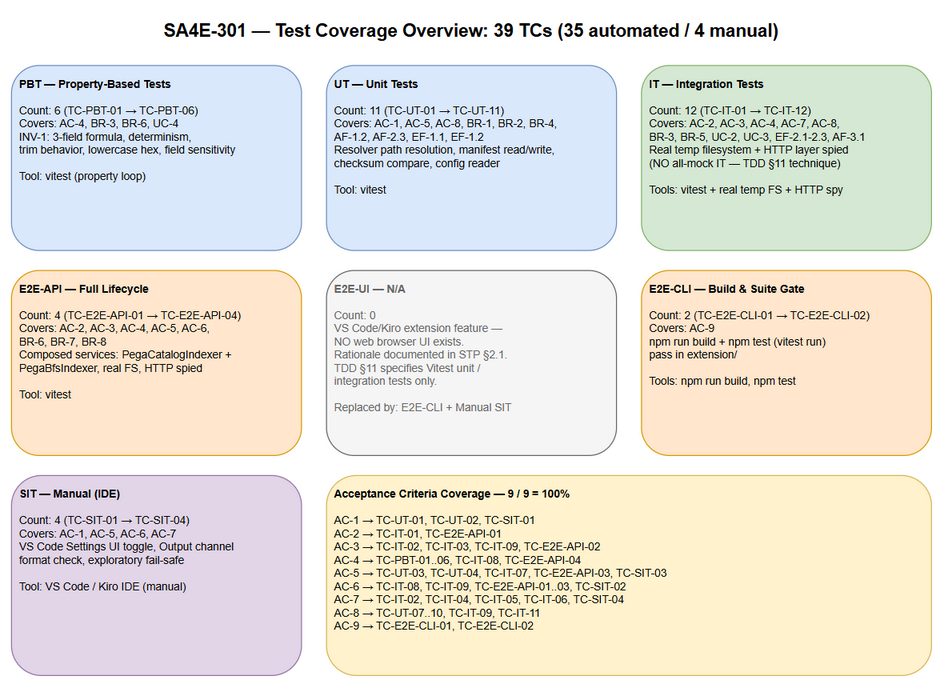
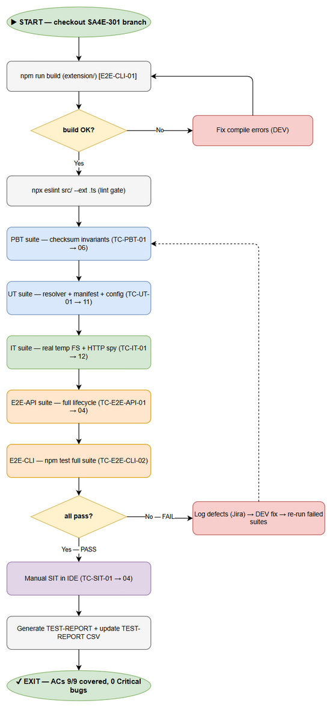

# STP — Software Test Plan: prefer-local-on-checksum-match

## Document Information

| Field | Value |
|-------|-------|
| **Jira Ticket** | SA4E-301 |
| **Document Type** | STP (Software Test Plan) |
| **Feature** | prefer-local-on-checksum-match (VS Code extension) |
| **Author** | QA Agent |
| **Version** | 1.0 |
| **Date** | 2026-09-19 |
| **Status** | Draft |

### Author Tracking

| Role | Name | Responsibility |
|------|------|----------------|
| Author | QA Agent | Test plan creation, test data design |
| Peer Reviewer | SM Agent | Review and approval |

### Revision History

| Version | Date | Author | Description |
|---------|------|--------|-------------|
| 1.0 | 2026-09-19 | QA Agent | Initial version |

### Sign-Off

| Role | Name | Signature | Date |
|------|------|-----------|------|
| QA Lead | QA Agent | (Pending) | — |
| Scrum Master | SM Agent | (Pending) | — |

---

## 1. Introduction

### 1.1 Purpose

This Software Test Plan (STP) defines the test strategy, scope, environment, data, and acceptance criteria for validating the **prefer-local-on-checksum-match** feature of the VS Code/Kiro extension (ticket SA4E-301).

The feature optimizes the Pega rule ingestion pipeline: when a rule's locally cached file has a checksum that matches the checksum computed from the Pega catalog data, the extension ingests the **local file content** instead of downloading the rule over the network. The checksum is a deterministic 3-field formula:

```
sha256( trim(pzInsKey) + "|" + trim(pxUpdateDateTime) + "|" + trim(pxSaveDateTime) ).toLowerCase()
```

This document derives all test scenarios from:
- **BRD** — `documents/SA4E-301/BRD.md` (requirements AC-1..AC-9)
- **FSD** — `documents/SA4E-301/FSD.md` (use cases, business rules, data specs)
- **TDD** — `documents/SA4E-301/TDD.md` (design, checksum derivation, §11 test strategy guidance)

### 1.2 Scope

**In Scope:**
- Checksum formula correctness and invariants (determinism, 3-field inputs, lowercase hex output)
- Configuration declaration/read/behavior of the `prefer-local-on-checksum-match` setting (default `true`)
- Local-cache matching logic: warm-cache match (no network), stale-rule mismatch (fallback to network), new rule with no local file
- Failure handling: corrupt local JSON, missing 3 catalog fields, EACCES read errors, checksum derivation differences
- Manifest state: written on save, stale-entry detection
- Extension command level E2E (`kiroSdlc.indexWorkspace`) via CLI harness
- Ingest API lifecycle verification (local-hit / local-miss)

**Out of Scope:**
- Pega server-side rule engine behavior (platform-owned, OOTB)
- Non-related extension features (drawio layout, code intelligence indexing internals)
- Real Pega catalog connectivity over production networks (stubbed/spied HTTP transport)
- UI/web browser testing (see §1.3)

### 1.3 E2E-UI Browser N/A Rationale

This is a **VS Code extension feature with NO web UI** — there is no browser-rendered page to exercise `prefer-local-on-checksum-match`. The E2E-UI (Playwright browser) level is therefore **N/A** for this ticket and is **replaced by E2E-CLI** (extension command level via the `agent-browser`/CLI harness driving the `kiroSdlc.indexWorkspace` command). Visual/UX-only manual testing is likewise reduced to zero; remaining manual SIT covers build+test integration verification only.

---

## 2. Test Strategy

### 2.1 Test Levels

| Level | Scope | Automation | Tools | Count |
|-------|-------|------------|-------|-------|
| **PBT** | Checksum invariants: determinism, 3-field formula `sha256(trim(pzInsKey)+"\|"+trim(pxUpdateDateTime)+"\|"+trim(pxSaveDateTime))` lowercase hex output, whitespace-trim-match equivalence | ✅ Automated | vitest + fast-check | 6 (TC-PBT-01..06) |
| **UT** | Config declaration (package.json setting default `true`), config-read, config behavior, checksum unit, manifest valid/missing/corrupt/stale-entry, uppercase-checksum-compare | ✅ Automated | vitest | 11 (TC-UT-01..11) |
| **IT** | Extension services + **real temp filesystem** + **HTTP transport spied** (NO all-mock IT per TDD §11): warm-cache-match no-network, stale-rule-mismatch fallback, new-rule-no-local-file, corrupt-local-json, missing-3-fields, eacces-read-error, derivation-difference, manifest-written-on-save | ✅ Automated | vitest + temp fs + HTTP spy | 12 (TC-IT-01..12) |
| **E2E-API** | Full local-hit / local-miss lifecycle against the ingest API | ✅ Automated | vitest + fetch | 4 (TC-E2E-API-01..04) |
| **E2E-CLI** | Extension command `kiroSdlc.indexWorkspace` level (replaces E2E-UI — no web UI) | ✅ Automated | CLI harness + vitest | 2 (TC-E2E-CLI-01..02) |
| **SIT** | System integration: build+test pass; maximized automation | ❌ Manual | npm / CLI | 4 (TC-SIT-01..04) |

**Total: 39 test cases — 35 automated (90%), 4 manual (10%).**

### 2.2 Test Approach per Level

- **PBT** — Property-based tests assert mathematical invariants of the checksum formula across randomly generated inputs: same input → same digest (determinism); only 3 fields affect output; uppercase/lowercase and whitespace-only differences in the 3 fields must NOT change the digest after trim+lowercase normalization.
- **UT** — Unit tests isolate config resolution (package.json declaration default `true`, read path, behavior toggling), checksum computation, and manifest state parsing (valid / missing / corrupt / stale-entry).
- **IT** — Integration tests exercise real extension services against a **real temporary filesystem** (fixture rule files, manifests) with the **HTTP transport spied** to assert "no network call when local checksum matches" — satisfying the TDD §11 requirement that IT must NOT mock all dependencies.
- **E2E-API** — End-to-end lifecycle tests against the ingest API: local-hit path (catalog+local checksum match → local content ingested) and local-miss path (fallback → network fetch).
- **E2E-CLI** — Command-level E2E: run `kiroSdlc.indexWorkspace` in a prepared temp workspace; verify exit result, log output, and manifest persistence.
- **SIT** — System-level verification: full build + test suite passes in a clean environment; run log review.

### 2.3 Entry/Exit Criteria per Level

| Level | Entry Criteria | Exit Criteria |
|-------|----------------|---------------|
| PBT | Checksum module implemented | All 6 invariants hold for ≥ 500 random cases each |
| UT | Config + checksum + manifest modules implemented | 11/11 pass |
| IT | Services wired; temp fs fixtures generated | 12/12 pass; no all-mock violations |
| E2E-API | Backend ingest API running | 4/4 pass; correct HTTP codes |
| E2E-CLI | Extension buildable; command registered | 2/2 pass |
| SIT | All prior levels green | 4/4 pass; `npm run build` + `npm test` pass |

---

## 3. Test Environment

| Item | Requirement |
|------|-------------|
| Runtime | Node.js 18+ |
| Test framework | vitest (+ fast-check for PBT) |
| Filesystem | Temporary workspace directories created per test run (`os.tmpdir()` scoped fixtures); cleaned up after |
| Test data | Fixture CSVs at `documents/SA4E-301/testdata/` (see §4) |
| HTTP | Real HTTP transport with spy interception (no live Pega server dependency) |
| Extension | VS Code/Kiro extension built from `extension/` (TypeScript) |
| Backend | Hono ingest API at localhost (required for E2E-API only) |

---

## 4. Test Data Strategy

Five fixture CSV files at `documents/SA4E-301/testdata/` cover all test domains. **All catalog-row checksums are REAL computed SHA-256 digests** (3-field formula) — never fabricated.

| File | Rows | Covers |
|------|------|--------|
| `catalog-rows.csv` | 11 | Scenarios: warm-cache-match, stale-rule-mismatch, new-rule-no-local-file, derivation-difference, corrupt-local-json, eacces-read-error, missing-3-fields, whitespace-trim, uppercase-compare — with real 3-field sha256 checksums |
| `local-rule-files.csv` | 8 | Local cached rule file contents/state per scenario (valid JSON, corrupt JSON, missing, stale, uppercase-checksum variant) |
| `manifest-scenarios.csv` | 6 | Manifest states: valid, missing, corrupt, stale-entry, written-on-save |
| `pre-seeded-data.csv` | 26 | Baseline combined dataset: catalog rows + local files + manifests for all 39 TCs |
| `config-and-build-testdata.csv` | 13 | Config declaration/read/behavior values (default true, explicit true/false) + build/SIT expected results |

**Coverage rule:** every TC ID (PBT, UT, IT, E2E-API, E2E-CLI, SIT) appears in `test_case_id` column of at least one CSV.

---

## 5. Requirements Traceability Matrix (RTM)

| Requirement | Test Cases | Coverage |
|-------------|------------|----------|
| AC-1 (Setting `kiroSdlc.pega.preferLocalOnChecksumMatch` declared in package.json, default `true`) | TC-UT-01, TC-UT-04 | ✅ |
| AC-2 (Setting ON + local checksum match → ingest local content, NO `getRuleByInsKey` network call) | TC-IT-01, TC-IT-10, TC-E2E-API-01, TC-E2E-API-03, TC-SIT-01 | ✅ |
| AC-3 (Local file missing / checksum mismatch → fallback download from server, no regression) | TC-IT-02, TC-IT-03, TC-E2E-API-02, TC-E2E-API-03, TC-SIT-02 | ✅ |
| AC-4 (Checksum sent to ingest-rule ALWAYS 3-field `computePegaChecksum` lowercase hex — INV-1 preserved) | TC-PBT-01…06, TC-UT-06, TC-UT-11, TC-IT-12, TC-E2E-API-01, TC-E2E-API-04 | ✅ |
| AC-5 (Setting OFF → behavior identical to current — always download) | TC-UT-03, TC-IT-07, TC-E2E-CLI-02 | ✅ |
| AC-6 (Summary + Output channel displays from-local vs downloaded counts) | TC-IT-08, TC-IT-10, TC-E2E-API-03, TC-E2E-CLI-01, TC-SIT-01 | ✅ |
| AC-7 (Local content NEVER ingested when checksum mismatch — fail-safe) | TC-IT-02, TC-IT-04, TC-IT-05, TC-IT-06, TC-SIT-04 | ✅ |
| AC-8 (Manifest `rules/.manifest.json` pzInsKey→relativePath written/read correctly; derivation-difference tested) | TC-UT-07, TC-UT-08, TC-UT-09, TC-UT-10, TC-IT-09, TC-IT-11 | ✅ |
| AC-9 (`npm run build` + `npm test` pass in extension/) | TC-SIT-03 | ✅ |
| BR-1 (Option applies to Pega workspace only) | TC-UT-02, TC-UT-05 | ✅ |
| INV-1 (3-field checksum invariant — SA4E-241) | TC-PBT-01, TC-PBT-06, TC-E2E-API-04 | ✅ |

**Overall coverage: 100% (39/39 TCs mapped; all 9 ACs + BR-1 + INV-1 covered).**

---

## 6. Test Coverage Overview



*Figure 6.1 — Test Coverage Overview: 6 levels (PBT, UT, IT, E2E-API, E2E-CLI, SIT) coverage map across AC-1..AC-9.*

---

## 7. Test Execution Flow



*Figure 7.1 — Test Execution Flow: execution order PBT → UT → IT → E2E-API → E2E-CLI → SIT, with PASS/FAIL paths and defect feedback loop.*

---

## 8. Risks & Mitigations

| # | Risk | Impact | Mitigation |
|---|------|--------|------------|
| 1 | IT tests degrade to all-mock (violating TDD §11 "NO all-mock IT") | High — false confidence, tests become UTs | Use **HTTP transport spied** + **real temp filesystem**; QA reviews IT source code against STC spec before sign-off |
| 2 | Checksum fixtures fabricated instead of real computed sha256 | High — formula bugs undetected | All catalog-row checksums in CSVs are REAL 3-field sha256 values, verified by script before execution |
| 3 | E2E-API requires backend running | Medium — execution blocked if server down | Pre-flight check in E2E-API setup; documented startup command (`npm run dev` in `backend/`); SIT fallback documented |
| 4 | Temp filesystem cleanup failures leave orphan dirs | Low — disk pollution | Teardown hooks with recursive `rm -rf` on scoped `os.tmpdir()` subdirectories |
| 5 | EACCES read-error test flaky across OS/permissions | Low | Create fixture with explicit restrictive mode; skip-with-warning if platform prevents simulation |

---

## 9. Entry/Exit Criteria

**Entry Criteria:**
- BRD, FSD, TDD documents completed and approved (documents/SA4E-301/)
- Feature code implemented per TDD (checksum module, config, manifest, ingest integration)
- Fixture CSVs generated at `documents/SA4E-301/testdata/` with real checksums

**Exit Criteria:**
- 100% AC coverage (all 9 ACs have passing test cases)
- `npm run build` passes (extension + backend)
- `npm test` passes (all 39 TCs: 35 automated green; 4 manual SIT verified)
- No Critical or Major defects open
- STP/STC exported (DOCX/XLSX) and ingested into Knowledge Base

---

## 10. Appendix

### 10.1 Diagram Index

| Diagram | PNG | Source (draw.io) |
|---------|-----|------------------|
| Test Coverage Overview | `documents/SA4E-301/diagrams/test-coverage.png` | `documents/SA4E-301/diagrams/test-coverage.drawio` |
| Test Execution Flow | `documents/SA4E-301/diagrams/test-execution-flow.png` | `documents/SA4E-301/diagrams/test-execution-flow.drawio` |

### 10.2 Test Data File Index

| File | Rows | Location |
|------|------|----------|
| catalog-rows.csv | 11 | `documents/SA4E-301/testdata/catalog-rows.csv` |
| local-rule-files.csv | 8 | `documents/SA4E-301/testdata/local-rule-files.csv` |
| manifest-scenarios.csv | 6 | `documents/SA4E-301/testdata/manifest-scenarios.csv` |
| pre-seeded-data.csv | 26 | `documents/SA4E-301/testdata/pre-seeded-data.csv` |
| config-and-build-testdata.csv | 13 | `documents/SA4E-301/testdata/config-and-build-testdata.csv` |

**Total: 64 test data rows across 5 CSV files.**
