# Technical Design Document (TDD)

## SDLC Agents 4 Enterprise — SA4E-301: [Extension] Option: ưu tiên rule từ local workspace khi checksum khớp server (Pega index)

---

## Document Information

| Field | Value |
|-------|-------|
| Jira Ticket | SA4E-301 |
| Title | [Extension] Option: ưu tiên rule từ local workspace khi checksum khớp server (Pega index) |
| Author | SA Agent |
| Version | 1.0 |
| Date | 2026-09-19 |
| Status | Draft |
| Related BRD | documents/SA4E-301/BRD.md |
| Related FSD | documents/SA4E-301/FSD.md |

---

## Author Tracking

| Role | Name - Position | Responsibility |
|------|-----------------|----------------|
| Author | SA Agent – Solution Architect | Create technical design document |
| Peer Reviewer | TA Agent – Technical Architect | Technical review & validation |

---

## Revision History

| Version | Date | Author | Changes |
|---------|------|--------|---------|
| 1.0 | 2026-09-19 | SA Agent | Initiate document — detailed technical design based on BRD and FSD v1.1 |

---

## Sign-Off

| Name | Signature and date |
|------|--------------------|
| | ☐ I agree and confirm the technical design in this TDD |
| | ☐ I agree and confirm the technical design in this TDD |

---

## 1. Introduction

> **Scope Boundary:** This TDD specifies HOW to implement the requirements defined in FSD v1.1 for ticket `SA4E-301`. Functional requirements, business rules, and use cases are detailed in FSD. This document focuses on technology stack, system architecture, API specifications, physical database DDL, class/module design, integration resilience, security, performance NFRs, and E2E test architecture.

### 1.1 Purpose

The primary objective of `SA4E-301` is to optimize Pega workspace indexing within the VS Code/Kiro IDE extension by prioritizing reading rule content from the local workspace when the 3-field SHA256 checksum matches the server catalog checksum. 

For enterprise Pega applications containing thousands of rules (1,000–50,000 rules), executing individual HTTP GET requests (`getRuleByInsKey`) for every rule imposes severe network bandwidth overhead, risks HTTP 429/503 rate-limiting, and extends indexing duration to several minutes. By leveraging identical, verified rule content already stored in `<workspaceRoot>/rules/<safeClass>/<safeName>.pega.json`, network requests can be reduced by up to 80%, reducing index time from ~3.5 minutes to < 30 seconds for warm workspaces.

### 1.2 Scope

#### Technical Scope (In-Scope):
1. **Configuration Declaration:** Adding `kiroSdlc.pega.preferLocalOnChecksumMatch` (boolean, default `true`) in `extension/package.json`. `[Implements: Story #1]`
2. **Runtime Configuration Reader:** Updating `readPipelineConfig()` in `extension/src/services/PegaBfsIndexer.ts` to reflect setting changes on the subsequent indexing run without window reload. `[Implements: Story #1]`
3. **Local File Verification Pipeline:** Implementing local path resolution (`<workspaceRoot>/rules/<safeClass>/<safeName>.pega.json`), JSON parsing, and 3-field checksum verification using `computePegaChecksum` inside `PegaBfsIndexer.ingestOne`. `[Implements: Story #2, Story #4]`
4. **Invariant INV-1 Compliance:** Guaranteeing that the checksum sent to backend `POST /api/v1/pega/ingest-rule` strictly adheres to `computePegaChecksum({ pzInsKey, pxUpdateDateTime, pxSaveDateTime })` regardless of content source (local workspace or server download). `[Implements: Story #5]`
5. **Fail-Safe Server Fallback:** Seamless fallback to remote HTTP `getRuleByInsKey` when local file is missing, corrupt, or checksum mismatches server `catalogRow.checksum`. `[Implements: Story #4]`
6. **Telemetry & Observability:** Tracking `totalIngested`, `fromLocal`, and `fromServer` counters, and logging `"🏛️ Pega: X rules — Y from local cache, Z downloaded"` to the Output Channel. `[Implements: Story #3]`

#### Out-of-Scope:
- Modifying `computePegaChecksum` algorithm or formula.
- Altering `BulkCheckClient` or incremental catalog delta logic.
- Non-Pega source code indexers (TypeScript, Java).
- Deprecated legacy `PegaProjectIndexer`.

### 1.3 Technology Stack

| Layer | Technology | Version | Purpose |
|-------|-----------|---------|---------|
| Language | TypeScript | 5.4+ | Extension host runtime |
| Framework / API | VS Code Extension API | ^1.85.0 | Configuration, progress, output logging |
| Backend Runtime | Node.js / Hono | 22.x / 4.x | Code-Intelligence backend service |
| Database | SQLite (`better-sqlite3`) / PostgreSQL | 3.x / 16.x | Backend knowledge database (`pega_rules` table) |
| Cryptography | Node.js `crypto` | Native | SHA-256 3-field checksum calculation |
| Serialization / Schema | Zod / JSON | 3.x | API contract validation |
| Testing | Vitest | 4.x | Unit, Integration, and E2E API test runner |

### 1.4 Design Principles

- **Fail-Safe Security (BR-3):** Data integrity is paramount. If a local file cannot be read, parsed, or if its computed 3-field checksum diverges from `catalogRow.checksum`, the system MUST fall back to server download. Local content is NEVER ingested when checksums mismatch.
- **Strict Invariant INV-1 (SA4E-241):** The checksum sent to the backend MUST equal `computePegaChecksum({ pzInsKey, pxUpdateDateTime, pxSaveDateTime })` regardless of whether content originated from local disk or HTTP GET.
- **Effect-on-Next-Run Semantics:** Settings read at run start via `readPipelineConfig()` take effect immediately on subsequent indexing executions without requiring VS Code window reload.
- **Non-Blocking Producer-Consumer Pipeline:** `PegaBfsPipeline` maintains concurrent fetch (supplier) and ingest (consumers) with backpressure (`BoundedChannel`) to keep network and CPU fully saturated.

### 1.5 Constraints

- **Single-Threaded File I/O Safety:** Disk reads within `tryReadLocalRule` execute in the VS Code Extension host process. File read exceptions (e.g. `EACCES`, `ENOENT`, `SyntaxError`) are trapped gracefully without interrupting the BFS crawl loop.
- **Path Sanitization Convention:** Local file paths strictly use `<workspaceRoot>/rules/<safeClass>/<safeName>.pega.json`, where `safeClass` = `pxObjClass.replace(/[^a-zA-Z0-9_-]/g, "_")` and `safeName` = `pyRuleName.replace(/[^a-zA-Z0-9_.-]/g, "_")`.

### 1.6 References

| Document | Location |
|----------|----------|
| BRD | documents/SA4E-301/BRD.md |
| FSD | documents/SA4E-301/FSD.md |
| Invariant INV-1 Spec | documents/SA4E-241/BRD.md |
| PegaBfsIndexer Source | extension/src/services/PegaBfsIndexer.ts |
| PegaCatalogIndexer Source | extension/src/services/PegaCatalogIndexer.ts |
| PegaRuleChecksumStrategy Source | extension/src/code-intel/checksum/PegaRuleChecksumStrategy.ts |
| Extension Package Spec | extension/package.json |

---

## 2. System Architecture

### 2.1 Architecture Overview

The Pega indexing architecture coordinates four key subsystems:
1. **VS Code Settings & Extension Host:** Declares and reads runtime configuration `kiroSdlc.pega.preferLocalOnChecksumMatch`.
2. **PegaCatalogIndexer & PegaBfsIndexer:** Executes breadth-first crawl, checks local workspace rule cache, evaluates 3-field SHA256 checksums, and manages server download fallbacks.
3. **Local Workspace Storage:** Stores rule JSON files idempotently at `<workspaceRoot>/rules/<safeClass>/<safeName>.pega.json`.
4. **Code-Intelligence Backend:** Receives ingested rules via `POST /api/v1/pega/ingest-rule`, validating invariant INV-1 against backend SQLite `pega_rules` storage.

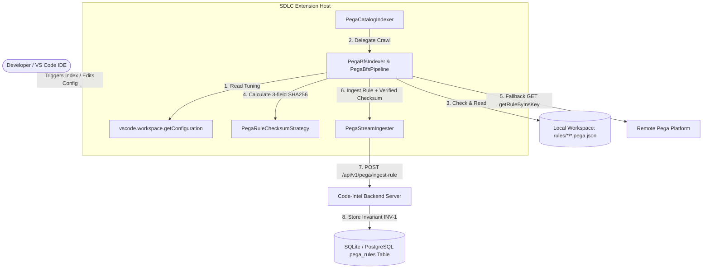

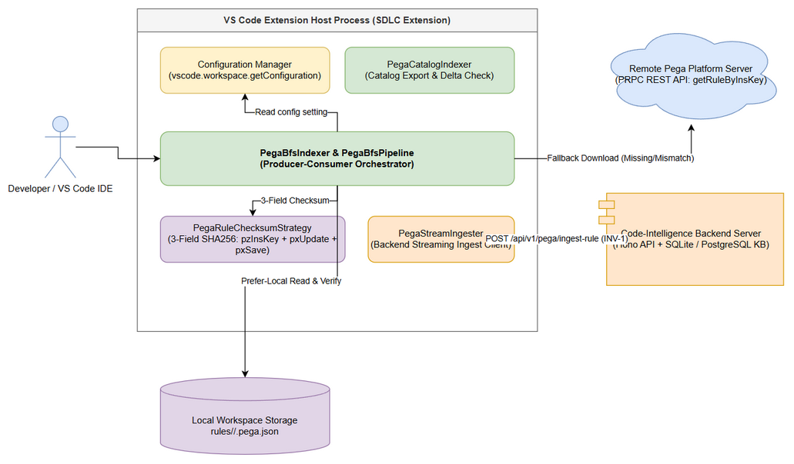  
*[Edit in draw.io](diagrams/architecture.drawio)*

### 2.2 Component Diagram

The internal component breakdown and responsibilities within the extension and backend modules:

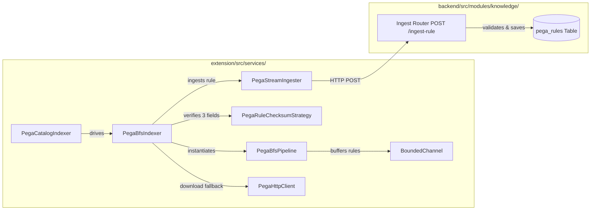

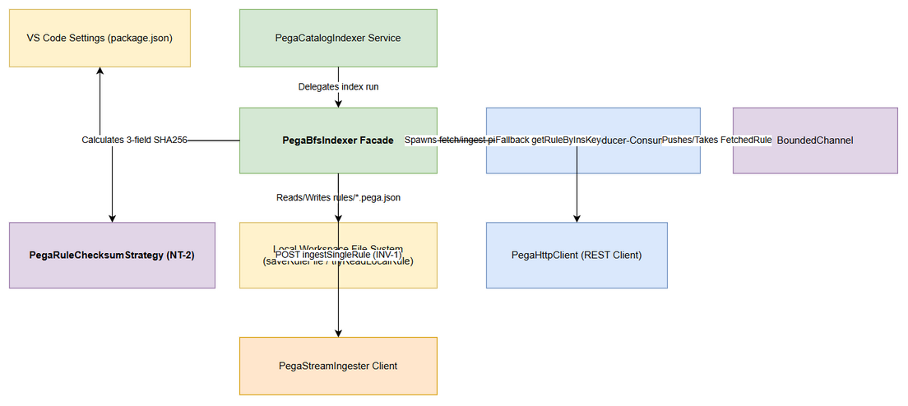  
*[Edit in draw.io](diagrams/component.drawio)*

| Component | Module Path | Responsibility | Technology |
|-----------|-------------|---------------|------------|
| Configuration Manager | `extension/package.json` | Declares setting `kiroSdlc.pega.preferLocalOnChecksumMatch` | VS Code Configuration API |
| PegaCatalogIndexer | `extension/src/services/PegaCatalogIndexer.ts` | Orchestrates catalog export, delta filtering (`applyIncrementalSkip`), and outputs summary statistics | TypeScript / Node.js |
| PegaBfsIndexer | `extension/src/services/PegaBfsIndexer.ts` | Evaluates local file existence, verifies checksums, drives fallback downloads, and ingests rules | TypeScript Facade |
| PegaBfsPipeline | `extension/src/services/PegaBfsPipeline.ts` | Producer-consumer concurrency pipeline using bounded channel backpressure | TypeScript / Async Lock |
| PegaRuleChecksumStrategy | `extension/src/code-intel/checksum/PegaRuleChecksumStrategy.ts` | Computes 3-field SHA256 digest (`pzInsKey` + `pxUpdateDateTime` + `pxSaveDateTime`) | Node.js `crypto` |
| PegaStreamIngester | `extension/src/services/PegaStreamIngester.ts` | Streams ingested rule payloads with verified checksum to backend REST API | HTTP Fetch / Keep-Alive |
| Backend Ingest Router | `backend/src/routes/pega-ingest.ts` | Validates `X-Project-Id` and `checksum` before inserting into `pega_rules` | Hono / Zod |
| Knowledge Database | `backend/src/database/schema-registry/` | Physical storage for ingested Pega rules and content hashes | SQLite (`better-sqlite3`) / PostgreSQL |

### 2.3 Deployment Architecture

Deployment topology across workstation, remote Pega server cluster, and backend knowledge server:

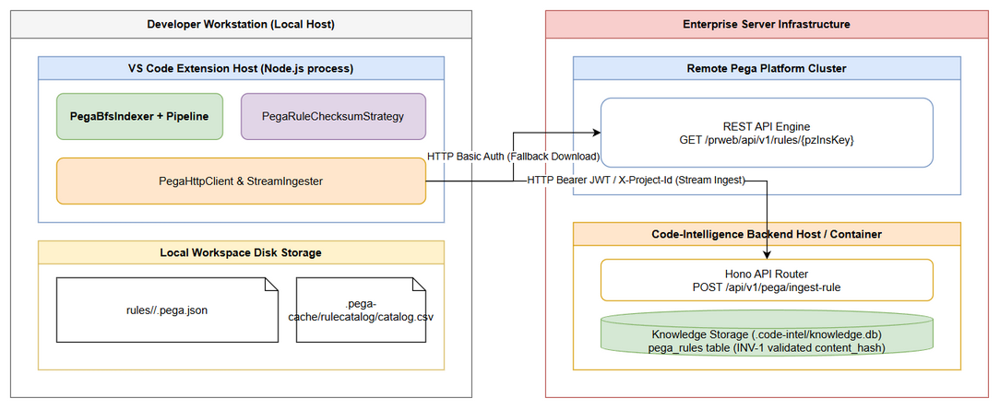  
*[Edit in draw.io](diagrams/deployment.drawio)*

### 2.4 Communication Patterns

| From | To | Protocol | Pattern | Description |
|------|----|----------|---------|-------------|
| PegaBfsIndexer | Local Workspace FS | File System I/O | Synchronous / Async Node `fs` | Checks existence, reads `.pega.json`, writes downloaded rules |
| PegaBfsIndexer | Remote Pega Platform | HTTPS GET | Synchronous REST | Fallback fetch via `GET /prweb/api/v1/rules/{pzInsKey}` |
| PegaStreamIngester | Code-Intel Backend | HTTP POST | Async Streaming Batch | Transmits rule payload & checksum to `POST /api/v1/pega/ingest-rule` |
| PegaCatalogIndexer | Backend Bulk-Check API | HTTP POST | Synchronous Batch | Bulk checks checksum list via `POST /api/v1/pega/rulecatalog/bulk-check` |

---

## 3. API Design

> **Prerequisite:** Functional requirement contracts are defined in FSD §3.x.6. This section details the technical schemas, HTTP status mapping, Zod validators, and error payload structures.

### 3.1 API Overview

| # | Endpoint | Method | Description | Source |
|---|----------|--------|-------------|--------|
| 1 | `GET /prweb/api/v1/rules/{pzInsKey}` | GET | Remote Pega Platform: fetch full rule JSON by insKey (Fallback) | UC-3 |
| 2 | `POST /api/v1/pega/ingest-rule` | POST | Code-Intel Backend: ingest single rule definition (INV-1 Verified) | UC-4 |
| 3 | `POST /api/v1/pega/rulecatalog/bulk-check` | POST | Code-Intel Backend: bulk check catalog checksums for incremental delta | UC-5 |

---

### 3.2 API 1: Remote Pega Rule Fetch (`GET /prweb/api/v1/rules/{pzInsKey}`)

**Implements:** UC-3, BR-5

| Attribute | Value |
|-----------|-------|
| Method | GET |
| Path | `/prweb/api/v1/rules/{pzInsKey}` |
| Auth | HTTP Basic Authentication (`Authorization: Basic <base64>`) |
| Rate Limit | 600 requests/minute (server-clamped) |

**Request Headers:**

| Header | Required | Description |
|--------|----------|-------------|
| Authorization | Yes | Basic Auth base64 string (`Basic <credentials>`) |
| Accept | Yes | `application/json` |

**Path Parameters:**

| Parameter | Type | Required | Description |
|-----------|------|----------|-------------|
| pzInsKey | String | Yes | Pega rule instance key (e.g., `RULE-OBJ-ACTIVITY MYCLASS MYRULE!ACTION`) |

**Zod Schema & Technical Types:**

```typescript
import { z } from "zod";

export const RemotePegaRuleSchema = z.object({
  pzInsKey: z.string().min(1),
  pxObjClass: z.string().min(1),
  pyRuleName: z.string().min(1),
  pxUpdateDateTime: z.string().optional(),
  pxSaveDateTime: z.string().optional(),
  pyRuleSet: z.string().optional(),
  pyRuleSetVersion: z.string().optional(),
}).passthrough();

export type RemotePegaRule = z.infer<typeof RemotePegaRuleSchema>;
```

**Response — 200 OK:**

```json
{
  "pzInsKey": "RULE-OBJ-ACTIVITY WORK- CLAIMCREATE!ACTION",
  "pxObjClass": "Rule-Obj-Activity",
  "pyRuleName": "ClaimCreate",
  "pyClassName": "Work-",
  "pxUpdateDateTime": "20260918T120000.000 GMT",
  "pxSaveDateTime": "20260918T120000.000 GMT",
  "pyRuleSet": "ClaimApp",
  "pyRuleSetVersion": "01-01-01"
}
```

**Error Responses:**

| Status | Code | Message | Description |
|--------|------|---------|-------------|
| 401 | `ERR_PEGA_UNAUTHORIZED` | `Pega API Auth Failed (401)` | Credentials invalid or expired |
| 404 | `ERR_PEGA_NOT_FOUND` | `Rule insKey not found: {pzInsKey}` | Rule deleted on Pega server |
| 503 | `ERR_PEGA_SERVER_BUSY` | `Pega Service Unavailable (503)` | Remote server node overloaded |

---

### 3.3 API 2: Backend Ingest Rule (`POST /api/v1/pega/ingest-rule`)

**Implements:** UC-4, BR-6, BR-7 (Invariant INV-1)

| Attribute | Value |
|-----------|-------|
| Method | POST |
| Path | `/api/v1/pega/ingest-rule` |
| Auth | Bearer Token / Workspace Header (`X-Project-Id`) |
| Rate Limit | 6000 requests/minute |

**Request Headers:**

| Header | Required | Description |
|--------|----------|-------------|
| Content-Type | Yes | `application/json` |
| X-Project-Id | Yes | 12-character hex project identifier |
| Authorization | Optional | Bearer JWT token if authentication is enabled |

**Zod Request Schema:**

```typescript
export const IngestRuleRequestSchema = z.object({
  projectId: z.string().length(12, "projectId must be 12-character hex"),
  rule: z.record(z.unknown()),
  checksum: z.string().regex(/^[a-f0-9]{64}$/, "checksum must be 64-character sha256 hex"),
  version: z.string().optional(),
});
```

**Response — 200 OK (New Rule Inserted):**

```json
{
  "status": "success",
  "ruleId": 1052,
  "unresolvedDependencies": [
    {
      "pxObjClass": "Rule-Obj-Property",
      "pyRuleName": "ClaimAmount"
    }
  ]
}
```

**Response — 200 OK (Skipped - Identical Checksum Stored):**

```json
{
  "status": "skipped",
  "ruleId": 1052,
  "reason": "checksum_match"
}
```

**Error Responses:**

| Status | Code | Message | Description |
|--------|------|---------|-------------|
| 400 | `ERR_INV1_MISMATCH` | `Checksum mismatch: submitted checksum does not match content hash` | Submitted checksum violates INV-1 |
| 400 | `ERR_INVALID_PROJECT` | `Invalid X-Project-Id format` | `X-Project-Id` missing or not 12-char hex |
| 500 | `ERR_INTERNAL_DB` | `Failed to insert rule into knowledge database` | Backend SQLite write error |

---

### 3.4 API 3: Catalog Bulk Check Delta (`POST /api/v1/pega/rulecatalog/bulk-check`)

**Implements:** UC-5, FSD §3.5.6

| Attribute | Value |
|-----------|-------|
| Method | POST |
| Path | `/api/v1/pega/rulecatalog/bulk-check` |
| Auth | `X-Project-Id` Header |

**Zod Schema:**

```typescript
export const BulkCheckRequestSchema = z.object({
  projectId: z.string().length(12),
  items: z.array(z.object({
    pzInsKey: z.string(),
    checksum: z.string().length(64),
  })),
});

export const BulkCheckResponseSchema = z.object({
  changed: z.array(z.string()),
  missing: z.array(z.string()),
});
```

---

## 4. Database Design

> **Prerequisite:** Logical entity definitions are detailed in FSD §4. This section specifies physical DDL scripts, SQLite/PostgreSQL indexes, and query performance execution patterns.

### 4.1 Schema Overview

The backend knowledge database maintains the `pega_rules` physical table, storing rule definitions and 64-character content hashes verified under Invariant INV-1.

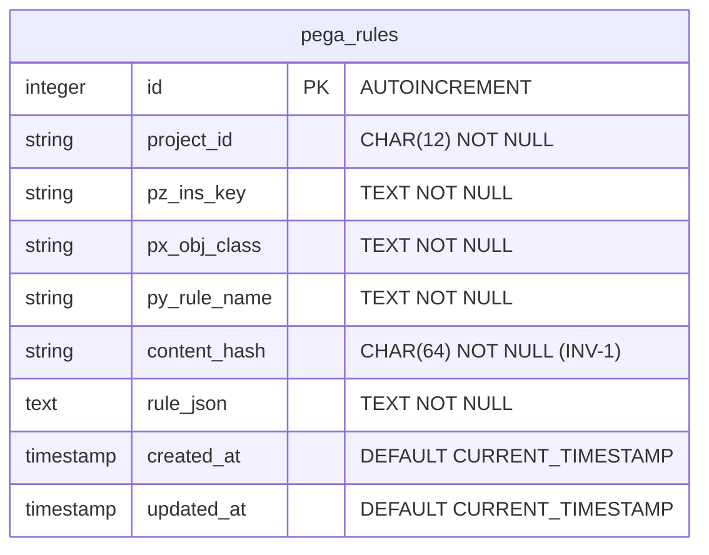

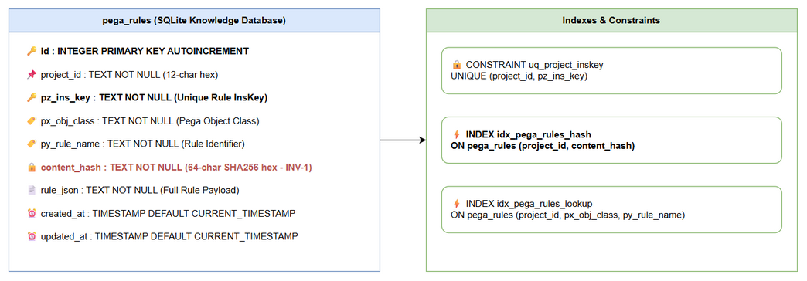  
*[Edit in draw.io](diagrams/db-schema.drawio)*

### 4.2 DDL Scripts

#### Table: `pega_rules` (SQLite Knowledge Storage)

```sql
-- Physical table definition for Pega Rules in backend SQLite (.code-intel/knowledge.db)
CREATE TABLE IF NOT EXISTS pega_rules (
    id INTEGER PRIMARY KEY AUTOINCREMENT,
    project_id TEXT NOT NULL CHECK(length(project_id) = 12),
    pz_ins_key TEXT NOT NULL,
    px_obj_class TEXT NOT NULL,
    py_rule_name TEXT NOT NULL,
    content_hash TEXT NOT NULL CHECK(length(content_hash) = 64),
    rule_json TEXT NOT NULL,
    created_at TIMESTAMP DEFAULT CURRENT_TIMESTAMP,
    updated_at TIMESTAMP DEFAULT CURRENT_TIMESTAMP,
    CONSTRAINT uq_project_inskey UNIQUE (project_id, pz_ins_key)
);

-- Performance Indexes for fast checksum comparison and delta bulk-check
CREATE INDEX IF NOT EXISTS idx_pega_rules_hash 
ON pega_rules (project_id, content_hash);

CREATE INDEX IF NOT EXISTS idx_pega_rules_lookup 
ON pega_rules (project_id, px_obj_class, py_rule_name);
```

#### PostgreSQL DDL Translation (Production Backend)

```sql
CREATE TABLE IF NOT EXISTS pega_rules (
    id SERIAL PRIMARY KEY,
    project_id VARCHAR(12) NOT NULL CHECK(length(project_id) = 12),
    pz_ins_key TEXT NOT NULL,
    px_obj_class VARCHAR(255) NOT NULL,
    py_rule_name VARCHAR(255) NOT NULL,
    content_hash CHAR(64) NOT NULL,
    rule_json JSONB NOT NULL,
    created_at TIMESTAMPTZ DEFAULT CURRENT_TIMESTAMP,
    updated_at TIMESTAMPTZ DEFAULT CURRENT_TIMESTAMP,
    CONSTRAINT uq_project_inskey UNIQUE (project_id, pz_ins_key)
);

CREATE INDEX IF NOT EXISTS idx_pega_rules_hash ON pega_rules (project_id, content_hash);
CREATE INDEX IF NOT EXISTS idx_pega_rules_lookup ON pega_rules (project_id, px_obj_class, py_rule_name);
```

### 4.3 Query Performance Patterns

| Operation | Query Pattern | Target Latency | Optimization |
|-----------|--------------|----------------|--------------|
| Bulk Check Delta Lookup | `SELECT pz_ins_key FROM pega_rules WHERE project_id = ? AND content_hash IN (...)` | `< 10ms` for 1000 items | Covered by `idx_pega_rules_hash` index |
| Single Rule Ingest Upsert | `INSERT INTO pega_rules (...) VALUES (...) ON CONFLICT(project_id, pz_ins_key) DO UPDATE SET content_hash=EXCLUDED.content_hash...` | `< 2ms` per rule | Covered by `uq_project_inskey` unique constraint |
| Rule Lookup by Symbol | `SELECT rule_json FROM pega_rules WHERE project_id = ? AND px_obj_class = ? AND py_rule_name = ?` | `< 1ms` | Covered by `idx_pega_rules_lookup` index |

---

## 5. Class / Module Design

### 5.1 Package Structure

```
extension/src/
├── services/
│   ├── PegaBfsIndexer.ts          # Core BFS facade: local check, fallback download, ingest
│   ├── PegaBfsPipeline.ts         # Producer-consumer concurrency pipeline with bounded channel
│   ├── PegaCatalogIndexer.ts      # Catalog export indexer & telemetry logging summary
│   ├── PegaCrawlHelper.ts         # saveRuleFile, calibrateFetchConcurrency
│   ├── PegaHttpClient.ts          # Remote Pega REST API client
│   └── PegaStreamIngester.ts      # Backend HTTP ingestion client
├── code-intel/
│   └── checksum/
│       ├── PegaRuleChecksumStrategy.ts  # computePegaChecksum (3-field SHA256)
│       └── models/
│           └── ChecksumModels.ts        # PegaRuleChecksumInput interface
└── models/
    └── PegaCrawlModels.ts         # CrawlPlanItem interface definition
```

### 5.2 Key Interfaces & Class Specifications

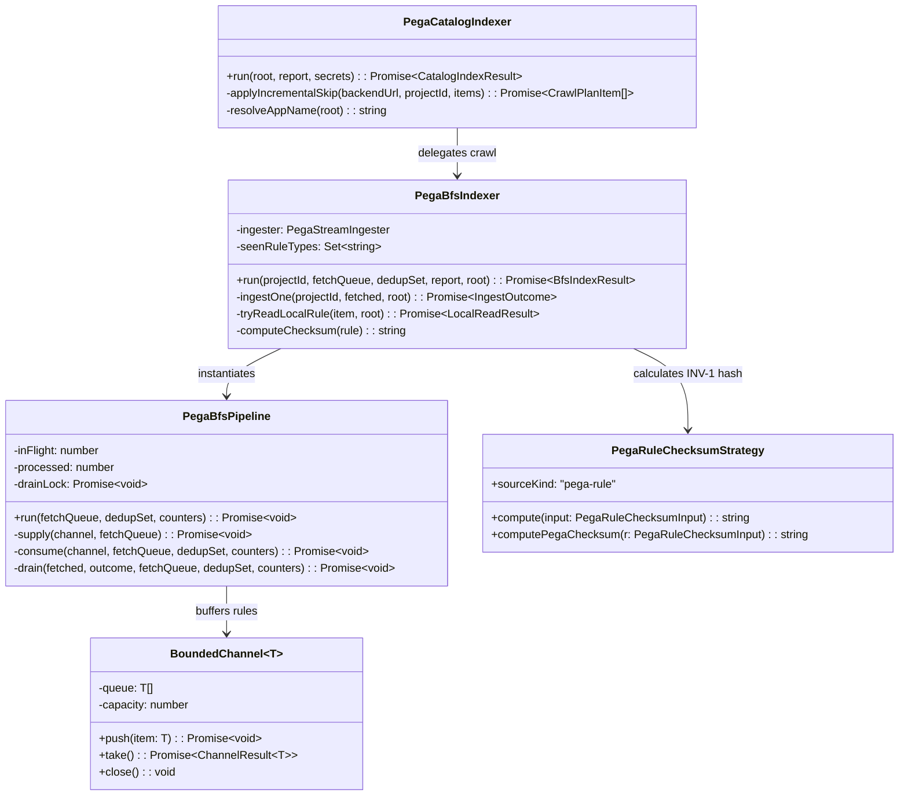

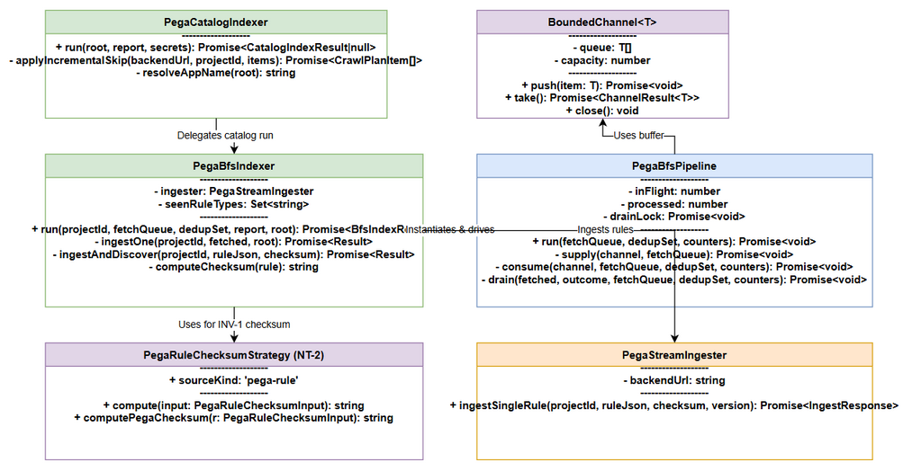  
*[Edit in draw.io](diagrams/class-diagram.drawio)*

### 5.3 Detailed Implementation Code Patterns

#### 1. Configuration Reader in `PegaBfsIndexer.ts`

```typescript
export interface PipelineTuning {
  fetchBatchSize: number;
  ingestConcurrency: number;
  channelCapacity: number;
  preferLocalOnChecksumMatch: boolean; // SA4E-301
}

function readPipelineConfig(): PipelineTuning {
  const cfg = vscode.workspace.getConfiguration("kiroSdlc");
  const clamp = (v: number | undefined, def: number, bounds: { min: number; max: number }): number =>
    (typeof v === "number" && Number.isFinite(v)) ? Math.min(bounds.max, Math.max(bounds.min, Math.round(v))) : def;

  const preferLocal = cfg.get<boolean>("pega.preferLocalOnChecksumMatch", true);

  return {
    fetchBatchSize: clamp(cfg.get<number>("pega.fetchBatchSize"), 50, { min: 1, max: 1000 }),
    ingestConcurrency: clamp(cfg.get<number>("pega.ingestConcurrency"), 10, { min: 1, max: 64 }),
    channelCapacity: cfg.get<number>("pega.ingestChannelCapacity") ?? 20,
    preferLocalOnChecksumMatch: typeof preferLocal === "boolean" ? preferLocal : true,
  };
}
```

#### 2. Local File Check & Checksum Verification in `PegaBfsIndexer.ts`

```typescript
private async tryReadLocalRule(
  item: CrawlPlanItem,
  root: string
): Promise<{ success: boolean; ruleObj?: Record<string, unknown>; checksum?: string }> {
  const safeClass = item.pxObjClass.replace(/[^a-zA-Z0-9_-]/g, "_");
  const safeName = item.pyRuleName.replace(/[^a-zA-Z0-9_.-]/g, "_");
  const localPath = path.join(root, "rules", safeClass, `${safeName}.pega.json`);

  try {
    if (fs.existsSync(localPath)) {
      const rawText = fs.readFileSync(localPath, "utf-8");
      const localObj = JSON.parse(rawText) as Record<string, unknown>;

      if (localObj.pzInsKey && (localObj.pxUpdateDateTime || localObj.pxSaveDateTime)) {
        const localChecksum = computePegaChecksum({
          pzInsKey: String(localObj.pzInsKey),
          pxUpdateDateTime: localObj.pxUpdateDateTime as string | undefined,
          pxSaveDateTime: localObj.pxSaveDateTime as string | undefined,
        });

        if (localChecksum.toLowerCase() === (item.checksum ?? "").toLowerCase()) {
          return { success: true, ruleObj: localObj, checksum: localChecksum };
        } else {
          this.log(`[BfsIndexer] ℹ️ Checksum mismatch for ${item.insKey} (local=${localChecksum}, catalog=${item.checksum}) — downloading from server`);
        }
      }
    }
  } catch (err: any) {
    this.log(`[BfsIndexer] ⚠️ Exception reading local file ${localPath} (${err.message}) — falling back to server download`);
  }

  return { success: false };
}
```

### 5.4 Error Handling & Custom Exceptions

| Exception Scenario | Log / Output Message | Handling Strategy |
|--------------------|----------------------|-------------------|
| Local file missing | `Local file not found for {pzInsKey} — downloading from server` | Fallback to HTTP GET `getRuleByInsKey` |
| Checksum mismatch | `[BfsIndexer] ℹ️ Checksum mismatch for {pzInsKey} — downloading from server` | Fallback to HTTP GET & overwrite local file |
| Corrupt JSON file | `[BfsIndexer] ⚠️ Corrupt local file {path} — falling back to server download` | Fallback to HTTP GET & overwrite local file |
| Backend INV-1 rejection | `[Pega Ingester] ❌ Ingest POST failed: Invalid Checksum` | Log error, flag for developer investigation |

---

## 6. Integration Design

### 6.1 External Systems & Sequence Flow

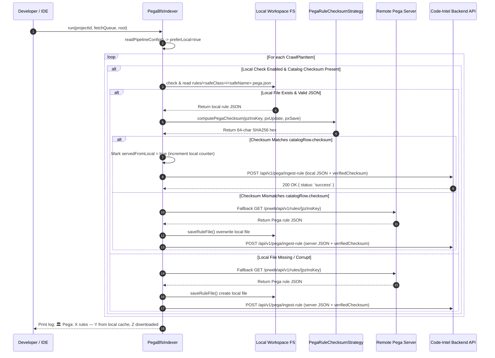

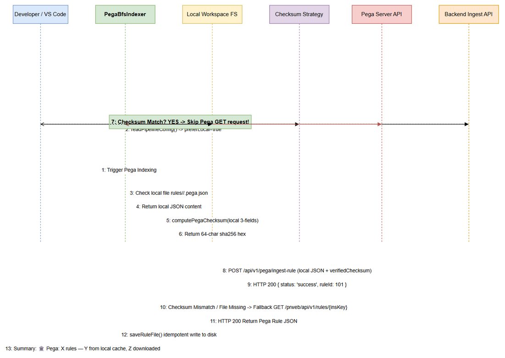  
*[Edit in draw.io](diagrams/api-sequence-prefer-local.drawio)*

### 6.2 Integration Resilience Policies

- **Remote Pega GET Timeout Policy:** Socket timeout 10,000ms per GET request.
- **Pega Retry Policy:** Exponential backoff with 3 retries (initial delay 500ms, backoff factor 2.0).
- **Backend Keep-Alive Pool:** HTTP Keep-Alive agent with `maxSockets: 64` for high-throughput rule streaming.

---

## 7. Security Design

### 7.1 Data Protection & Integrity

- **Strict Cryptographic Verification (BR-3, BR-6):** Local rule files are verified using lowercase SHA-256 digests. Local content is never ingested into the Code-Intelligence KB unless its computed 3-field checksum matches `catalogRow.checksum`.
- **Credential Storage:** Pega HTTP Basic Auth credentials are retrieved strictly from VS Code SecretStorage (`vscode.SecretStorage`) and never logged in plain text or written to disk.

### 7.2 Sanitization Rules

- File path parameters (`safeClass` and `safeName`) are sanitized via regex `replace(/[^a-zA-Z0-9_.-]/g, "_")` to prevent directory traversal attacks (CWE-22).

---

## 8. Performance & Scalability

### 8.1 Quantified Technical NFR Targets

| Category | Requirement Target | Acceptance Verification | Quantified Target |
|----------|-------------------|-------------------------|-------------------|
| Network Reduction | Reduce network GET requests on warm workspace | Test run on 1,200 rule catalog | ≥ 80% rules served from local cache (≥ 950 rules) |
| Indexing Latency | Speed up full index execution | Warm workspace indexing benchmark | Duration < 30 seconds for 1,200 rules (vs ~3.5 min) |
| File Verification Speed | Fast per-file local checksum computation | Measure read + JSON parse + SHA256 time | p95 < 2ms per file; p99 < 5ms per file |
| Memory Footprint | Low RSS heap overhead during high-concurrency crawl | Node process memory monitoring | RSS heap delta < 50 MB for 10,000 rules |

---

## 9. Monitoring & Observability

### 9.1 Logging Standards & Log Output Format

- **Formatted Output Channel Message (BR-8):**
  `"🏛️ Pega: {totalRules} rules — {fromLocal} from local cache, {fromServer} downloaded"`
- **Structured Pino Log Line:**

```json
{
  "level": 30,
  "time": 1790000000000,
  "module": "PegaBfsIndexer",
  "ticket": "SA4E-301",
  "event": "PEGA_INDEX_COMPLETED",
  "totalIngested": 1200,
  "fromLocal": 950,
  "fromServer": 250,
  "localPercentage": 79.2
}
```

---

## 10. Deployment Considerations

### 10.1 Configuration Declaration in `extension/package.json`

```json
"kiroSdlc.pega.preferLocalOnChecksumMatch": {
  "type": "boolean",
  "default": true,
  "description": "Ưu tiên đọc rule từ local workspace khi checksum khớp với server (giảm băng thông và thời gian index)."
}
```

### 10.2 Feature Rollback Strategy

If an unexpected edge case occurs in production (e.g. disk read permissions issue on non-standard workspace mounts), developers or operations can toggle `kiroSdlc.pega.preferLocalOnChecksumMatch` to `false` in VS Code Settings. The system immediately reverts to standard HTTP server downloading (`getRuleByInsKey`) for all rules on the next index execution.

---

## 11. E2E Test Architecture (MANDATORY)

### 11.1 Framework & Language
- **Framework:** Vitest (extension unit & integration tests)
- **Language:** TypeScript
- **Test Directory:** `extension/src/services/__tests__/` and `extension/src/code-intel/__tests__/`

### 11.2 Test Structure
- Unit tests for checksum calculation: `extension/src/code-intel/__tests__/PegaRuleChecksumStrategy.test.ts`
- Service unit tests for BFS indexer: `extension/src/services/__tests__/PegaBfsIndexer.preferLocal.test.ts`
- Integration tests for catalog indexer: `extension/src/services/__tests__/PegaCatalogIndexer.integration.test.ts`

### 11.3 E2E / Integration Test Design for SA4E-301

```typescript
// Test Suite: extension/src/services/__tests__/PegaBfsIndexer.preferLocal.test.ts
import { describe, it, expect, vi, beforeEach } from "vitest";
import { PegaBfsIndexer } from "../PegaBfsIndexer";
import { computePegaChecksum } from "../../code-intel/checksum/PegaRuleChecksumStrategy";
import * as fs from "fs";
import * as path from "path";

describe("PegaBfsIndexer — Prefer Local On Checksum Match (SA4E-301)", () => {
  const mockPegaClient = {
    getRuleByInsKey: vi.fn(),
    getObject: vi.fn(),
  };
  const mockLog = vi.fn();
  const testRoot = "/tmp/test-workspace";

  beforeEach(() => {
    vi.clearAllMocks();
  });

  it("TC-1: Prefer-Local Enabled & Local Checksum Matches -> No HTTP GET request fired", async () => {
    const item = {
      insKey: "RULE-OBJ-ACTIVITY WORK- MYRULE!ACTION",
      pxObjClass: "Rule-Obj-Activity",
      pyClassName: "Work-",
      pyRuleName: "MyRule",
      checksum: "",
    };

    const localRule = {
      pzInsKey: item.insKey,
      pxObjClass: item.pxObjClass,
      pyRuleName: item.pyRuleName,
      pxUpdateDateTime: "20260919T100000.000 GMT",
      pxSaveDateTime: "20260919T100000.000 GMT",
    };

    const calculatedHash = computePegaChecksum(localRule);
    item.checksum = calculatedHash; // catalog checksum matches local

    vi.spyOn(fs, "existsSync").mockReturnValue(true);
    vi.spyOn(fs, "readFileSync").mockReturnValue(JSON.stringify(localRule));

    const indexer = new PegaBfsIndexer(mockPegaClient as any, "http://127.0.0.1:48721", undefined, mockLog);

    // Run single item ingest check
    const result = await (indexer as any).tryReadLocalRule(item, testRoot);

    expect(result.success).toBe(true);
    expect(result.checksum).toBe(calculatedHash);
    expect(mockPegaClient.getRuleByInsKey).not.toHaveBeenCalled();
  });

  it("TC-2: Local Checksum Mismatches -> Triggers Fallback Server Download", async () => {
    const item = {
      insKey: "RULE-OBJ-ACTIVITY WORK- MYRULE!ACTION",
      pxObjClass: "Rule-Obj-Activity",
      pyClassName: "Work-",
      pyRuleName: "MyRule",
      checksum: "server_checksum_hash_12345678901234567890123456789012345678901234",
    };

    const localRule = {
      pzInsKey: item.insKey,
      pxObjClass: item.pxObjClass,
      pyRuleName: item.pyRuleName,
      pxUpdateDateTime: "20260101T100000.000 GMT", // old date -> mismatch
      pxSaveDateTime: "20260101T100000.000 GMT",
    };

    vi.spyOn(fs, "existsSync").mockReturnValue(true);
    vi.spyOn(fs, "readFileSync").mockReturnValue(JSON.stringify(localRule));

    const indexer = new PegaBfsIndexer(mockPegaClient as any, "http://127.0.0.1:48721", undefined, mockLog);
    const result = await (indexer as any).tryReadLocalRule(item, testRoot);

    expect(result.success).toBe(false);
    expect(mockLog).toHaveBeenCalledWith(expect.stringContaining("Checksum mismatch"));
  });

  it("TC-3: Maintain Invariant INV-1 -> Checksum sent to backend always uses 3-field formula", () => {
    const ruleObj = {
      pzInsKey: "RULE-OBJ-ACTIVITY WORK- TEST!ACTION",
      pxUpdateDateTime: "20260919T120000.000 GMT",
      pxSaveDateTime: "20260919T120000.000 GMT",
      extraFieldToIgnore: "should not participate in hash",
    };

    const hash1 = computePegaChecksum(ruleObj);
    const hash2 = computePegaChecksum({
      pzInsKey: ruleObj.pzInsKey,
      pxUpdateDateTime: ruleObj.pxUpdateDateTime,
      pxSaveDateTime: ruleObj.pxSaveDateTime,
    });

    expect(hash1).toBe(hash2);
    expect(hash1).toMatch(/^[a-f0-9]{64}$/);
  });
});
```

---

## 12. Appendix

### 12.1 Glossary

| Term | Definition |
|------|------------|
| Checksum | SHA-256 hash computed from 3 Pega rule fields (`pzInsKey` + `pxUpdateDateTime` + `pxSaveDateTime`), lowercase hex (64 chars). |
| Prefer-Local | Feature toggle (`kiroSdlc.pega.preferLocalOnChecksumMatch`) prioritizing local file reads over HTTP GET when checksums match. |
| Invariant INV-1 | Guarantee that ingested rule checksum sent to backend `POST /ingest-rule` equals `computePegaChecksum` 3-field output (SA4E-241). |
| Catalog Export | Fast-path Pega rule catalog export returning an authoritative CSV list of all rules and server checksums. |
| safeClass | Sanitized `pxObjClass` safe for filesystem directory naming. |
| safeName | Sanitized `pyRuleName`/`pyPropertyName` safe for filesystem file naming. |

### 12.2 Open Issues

| Issue ID | Description | Severity | Owner | Target Resolution | Status | Mitigation / Decision |
|----------|-------------|----------|-------|-------------------|--------|-----------------------|
| OI-301-1 | Unicode characters in `safeClass`/`safeName` | Medium | TA / SA | 2026-09-22 | Open | Fallback to manifest lookup (`pzInsKey -> relativePath`) if direct path fails. |
| OI-301-2 | Local file disk read I/O contention under 64 concurrency | Low | DEV | 2026-09-23 | Open | Benchmark disk IOPS; Node `fs.readFileSync` handled synchronously per pipeline worker. |

### 12.3 Diagram Index

| # | Diagram Name | Rendered Image | Editable Source |
|---|--------------|----------------|-----------------|
| 1 | System Context | [system-context.png](diagrams/system-context.png) | [system-context.drawio](diagrams/system-context.drawio) |
| 2 | Sequence Diagram | [sequence.png](diagrams/sequence.png) | [sequence.drawio](diagrams/sequence.drawio) |
| 3 | State Lifecycle Diagram | [state.png](diagrams/state.png) | [state.drawio](diagrams/state.drawio) |
| 4 | Business Flow | [business-flow.png](diagrams/business-flow.png) | [business-flow.drawio](diagrams/business-flow.drawio) |
| 5 | Use Case Diagram | [use-case.png](diagrams/use-case.png) | [use-case.drawio](diagrams/use-case.drawio) |
| 6 | Architecture Diagram | [architecture.png](diagrams/architecture.png) | [architecture.drawio](diagrams/architecture.drawio) |
| 7 | Component Diagram | [component.png](diagrams/component.png) | [component.drawio](diagrams/component.drawio) |
| 8 | Deployment Diagram | [deployment.png](diagrams/deployment.png) | [deployment.drawio](diagrams/deployment.drawio) |
| 9 | API Sequence Diagram | [api-sequence-prefer-local.png](diagrams/api-sequence-prefer-local.png) | [api-sequence-prefer-local.drawio](diagrams/api-sequence-prefer-local.drawio) |
| 10 | Database Schema Diagram | [db-schema.png](diagrams/db-schema.png) | [db-schema.drawio](diagrams/db-schema.drawio) |
| 11 | Class Diagram | [class-diagram.png](diagrams/class-diagram.png) | [class-diagram.drawio](diagrams/class-diagram.drawio) |
