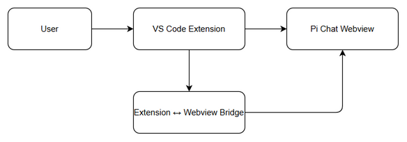
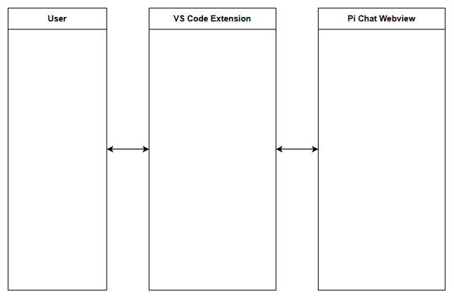

# Functional Specification Document (FSD)

## Pi Chat 3-pane Layout Redesign — SA4E-305: SA4E-289.9 - Pi Chat 3-pane Layout Redesign

---

## Document Information

| Field | Value |
|-------|-------|
| Jira Ticket | SA4E-305 |
| Title | SA4E-289.9 - Pi Chat 3-pane Layout Redesign |
| Author | BA Agent |
| Version | 1.0 |
| Date | 2026-09-24 |
| Status | Draft |
| Related BRD | documents/SA4E-305/BRD.md |

---

## Revision History

| Version | Date | Author | Changes |
|---------|------|--------|---------|
| 1.0 | 2026-09-24 | BA Agent | Initiate document — auto-generated from BRD and Jira tickets |

---

## 1. Introduction

### 1.1 Purpose

This FSD specifies the functional requirements for redesigning Pi Chat webview to a 3-pane workflow layout as per SA4E-305. It defines how the UI should behave, component interactions, data flow via extension-webview bridge, and integration points.

### 1.2 Scope

Redesign Pi chat webview to 3-pane workflow layout covering Toolbar / Left / Center / Right / Input / Status Bar components, plus Approval Panel and Worklist tab integration. Reuse existing Svelte components/stores, avoid hardcoded session/provider/model per SEC-289-11, use real data via extension <-> webview bridge, and follow frontend-structure steering. Scope aligns with BRD Section 1.1.

### 1.3 Definitions & Acronyms

| Term | Definition |
|------|------------|
| Pi Chat | Webview chat interface in SDLC Agents VS Code extension |
| 3-pane layout | Toolbar / Left / Center / Right / Input / Status Bar layout |
| Webview Bridge | Extension <-> webview messaging channel for real data |

### 1.4 References

| Document | Location |
|----------|----------|
| BRD | documents/SA4E-305/BRD.md |
| PI-CHAT-LAYOUT-SPEC.md | documents/SA4E-289/PI-CHAT-LAYOUT-SPEC.md |
| PI-CHAT-UI-LAYOUT-CHECKLIST.md | documents/SA4E-289/PI-CHAT-UI-LAYOUT-CHECKLIST.md |

---

## 2. System Overview

### 2.1 System Context Diagram

*[Edit in draw.io](diagrams/system-context.drawio)*

The system consists of VS Code Extension host interacting with Pi Chat Webview via Extension-Webview Bridge. User interacts through Extension UI. No external backend changes are required for layout redesign.

### 2.2 System Architecture

Frontend Svelte webview components are restructured to 3-pane layout. Stores remain reused. Communication to extension host uses existing message passing API. Layout components: Toolbar, LeftPane, CenterPane, RightPane, InputArea, StatusBar, ApprovalPanel, WorklistTab.

---

## 3. Functional Requirements

### 3.1 Feature: 3-pane Layout Redesign

**Source:** BRD Story 1

#### 3.1.1 Description

Redesign Pi chat webview to display 3-pane workflow layout with Toolbar, Left, Center, Right, Input and Status Bar. Reuse existing Svelte components/stores, no hardcoded session/provider/model, real data via bridge.

#### 3.1.2 Use Case

**Use Case ID:** UC-01
**Actor:** User
**Preconditions:** Pi Chat webview is open, runtime model-resolution fixed
**Postconditions:** 3-pane layout rendered with data bound

**Main Flow:**

| Step | Actor | System | Description |
|------|-------|--------|-------------|
| 1 | User opens Pi Chat | | User triggers webview |
| 2 | | System loads layout | Layout components mount |
| 3 | | System fetches data | Data via ext<->webview bridge |
| 4 | | System renders UI | Toolbar/Left/Center/Right/Input/Status Bar displayed |
| 5 | User interacts | | User operates within layout |

**Alternative Flows:** N/A

**Exception Flows:**

| ID | Condition | Steps |
|----|-----------|-------|
| EF-1 | Data bridge failure | Show error state, retry |

#### 3.1.3 Business Rules

| Rule ID | Rule | Source |
|---------|------|--------|
| BR-1 | No hardcoded session/provider/model | SEC-289-11 |
| BR-2 | Reuse existing Svelte components/stores | BRD |
| BR-3 | Real data via extension-webview bridge | BRD |

#### 3.1.4 Data Specifications

No new data fields introduced. Existing stores used.

#### 3.1.5 UI Specifications

**Screen: Pi Chat 3-pane**

| No. | Element | Type | Required | Behavior | Validation |
|-----|---------|------|----------|----------|------------|
| 1 | Toolbar | Container | Y | Top actions | - |
| 2 | Left Pane | Container | Y | Navigation/context | - |
| 3 | Center Pane | Container | Y | Main chat/workflow | - |
| 4 | Right Pane | Container | Y | Details/approval | - |
| 5 | Input | Input | Y | User input | - |
| 6 | Status Bar | Container | Y | Status info | - |
| 7 | Approval Panel | Panel | Y | Approval workflow | - |
| 8 | Worklist Tab | Tab | Y | Worklist view | - |

#### 3.1.6 API Contract (Functional View)

No new API. Uses existing extension message passing.

---

### 3.2 Feature: Approval Panel and Worklist Integration

**Source:** BRD Story 2

#### 3.2.1 Description

Integrate Approval Panel and Worklist tab within 3-pane layout.

#### 3.2.2 Use Case

**Use Case ID:** UC-02
**Actor:** User
**Preconditions:** 3-pane layout loaded
**Postconditions:** Approval Panel and Worklist accessible

**Main Flow:**

| Step | Actor | System | Description |
|------|-------|--------|-------------|
| 1 | User selects tab | | Switch to Worklist |
| 2 | | System renders tab | Worklist content displayed |
| 3 | User opens Approval | | Approval Panel shown |

---

## 4. Data Model

No new entities. Logical data model unchanged.

### 4.1 Entity Relationship Diagram

N/A

---

## 5. Integration Specifications

### 5.1 External System: VS Code Extension Host

| Attribute | Value |
|-----------|-------|
| Purpose | Provide real data to webview |
| Direction | Bidirectional |
| Data Format | JSON messages |
| Frequency | Real-time on demand |

**Data Exchange:**

| Our Data | External Data | Direction | Business Rule |
|----------|---------------|-----------|---------------|
| UI state | Chat messages | Receive | BR-3 |
| User input | Commands | Send | - |

---

## 6. Processing Logic

### 6.1 Load 3-pane Layout

**Trigger:** User opens Pi Chat
**Input:** Store state
**Output:** Rendered UI

**Processing Steps:**

| Step | Description | Error Handling |
|------|-------------|----------------|
| 1 | Mount layout components | Log error if missing |
| 2 | Fetch data via bridge | Retry 3 times |
| 3 | Render panes | Fallback to empty state |

**Activity Diagram:**

---

## 7. Security Requirements

### 7.1 Authentication & Authorization

No changes. Existing extension authentication applies.

### 7.2 Data Sensitivity

No sensitive data added.

---

## 8. Non-Functional Requirements

| Category | Business Requirement | Acceptance Criteria |
|----------|----------------------|---------------------|
| Performance | UI responsive | Page loads < 2s |
| Security | No hardcoded credentials | SEC-289-11 enforced |
| Availability | Webview available | 99.9% during use |

---

## 9. Error Handling (User-Facing)

| Scenario | Severity | User Message | Expected Behavior |
|----------|----------|-------------|-------------------|
| Bridge timeout | Warning | Data unavailable, retrying | Auto retry |

---

## 10. Testing Considerations

| ID | Scenario | Input | Expected Output | Priority |
|----|----------|-------|-----------------|----------|
| TC-01 | Open Pi Chat | Click icon | 3-pane layout displayed | High |
| TC-02 | Approval Panel | Open panel | Panel visible in Right pane | High |

---

## 11. Appendix

### Diagrams

| Diagram | File |
|---------|------|
| System Context | [system-context.png](diagrams/system-context.png) |
| Sequence | [sequence.png](diagrams/sequence.png) |
| State | [state.png](diagrams/state.png) |

### Change Log from BRD

FSD elaborates UI specifications and use cases derived from BRD Stories 1-2. No functional deviation.

