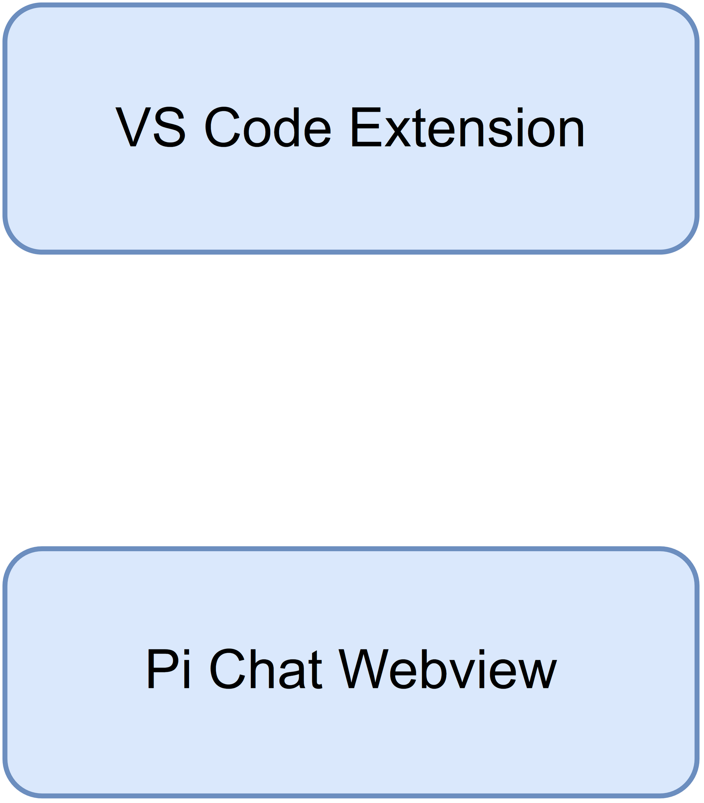
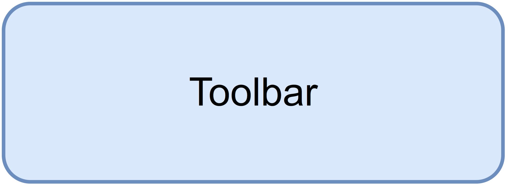
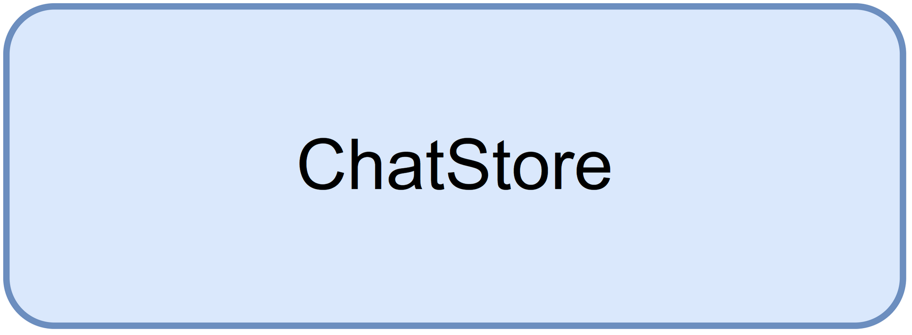

# Technical Design Document

## SA4E-305 Pi Chat 3-pane Layout Redesign

### 1. Architecture Overview
Design based on FSD.

### 2. Component Design
...

### 3. Class Design
...

### Diagram Index
| # | Diagram | Image | Source |
|---|---------|-------|--------|
| 1 | Architecture |  | *[Edit](diagrams/architecture.drawio)* |
| 2 | Component |  | *[Edit](diagrams/component.drawio)* |
| 3 | Class |  | *[Edit](diagrams/class.drawio)* |
