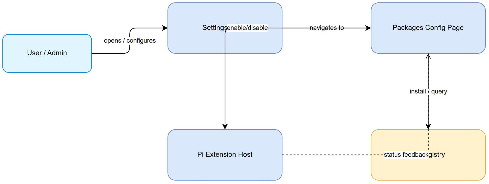
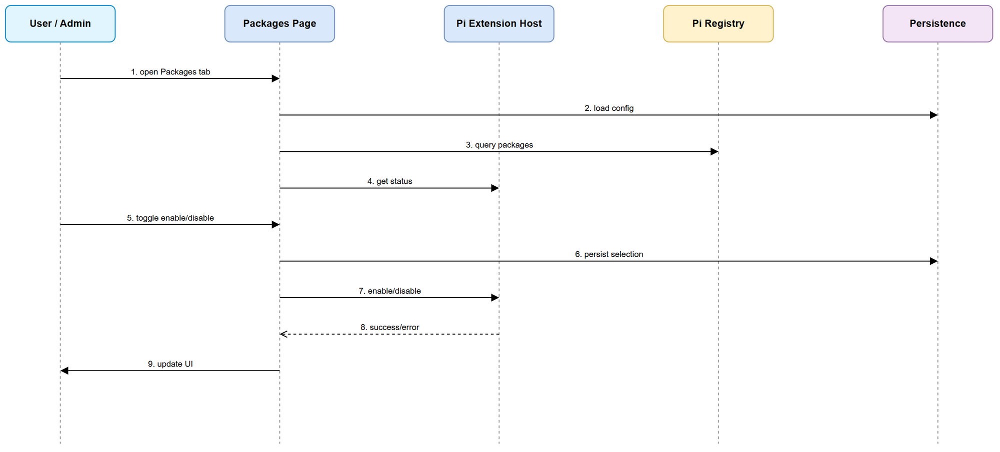
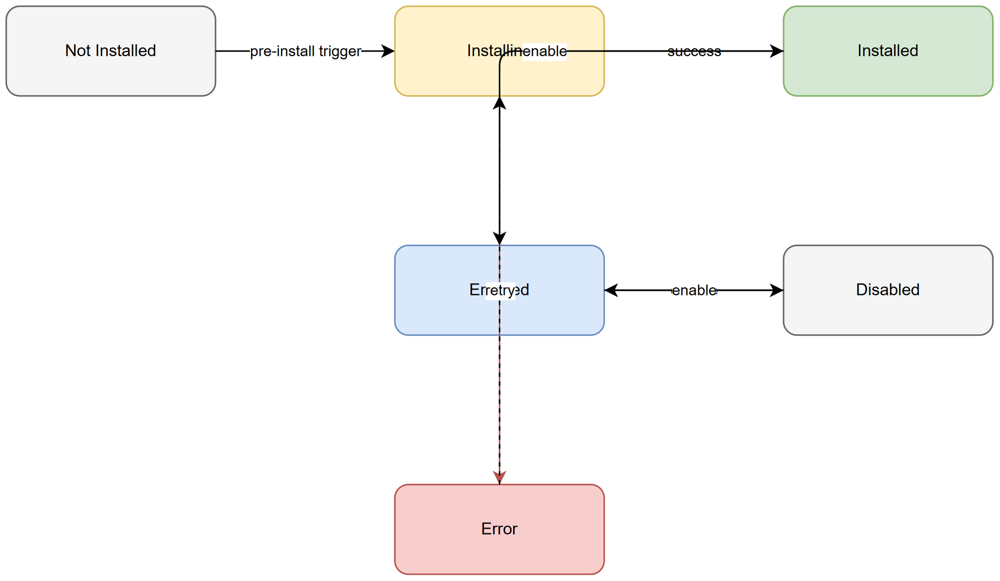

# Functional Specification Document (FSD)

## SA4E-289.10 — SA4E-306: SA4E-289.10 - Pi Packages Config Page + Pre-install 7 Packages

---

## Document Information

| Field | Value |
|-------|-------|
| Jira Ticket | SA4E-306 |
| Title | SA4E-289.10 - Pi Packages Config Page + Pre-install 7 Packages |
| Author | BA Agent |
| Version | 1.0 |
| Date | 2026-09-24 |
| Status | Draft |
| Related BRD | documents/SA4E-306/BRD.md |

---

## Revision History

| Version | Date | Author | Changes |
|---------|------|--------|---------|
| 1.0 | 2026-09-24 | BA Agent | Initiate document — auto-generated from BRD SA4E-306 |

---

## 1. Introduction

### 1.1 Purpose
This FSD specifies the functional behavior of the Pi Packages Config Page and pre-installation of 7 core Pi packages as part of SA4E-289 migration to Pi SDK Option C. It defines use cases, business rules, data specifications, UI behavior, integration points, and processing logic derived from BRD SA4E-306.

### 1.2 Scope
- Add Settings panel tab "Packages" to configure Pi packages enable/disable.
- Persist user selections across sessions.
- Pre-install 7 core packages on first run: pi-mcp-adapter, pi-web-access, @juicesharp/rpiv-todo, @juicesharp/rpiv-ask-user-question, pi-lens, context-mode, pi-subagents.
- UI shows install progress, status indicators, and error feedback.
- Pi extension host is mandatory for all packages.

### 1.3 Definitions & Acronyms

| Term | Definition |
|------|------------|
| Pi Extension | Pi package requiring extension host with pi.on/pi.events registration |
| Packages Config Page | Settings panel tab for managing Pi packages |
| Pi Registry | Source of truth for package metadata and install artifacts |

### 1.4 References

| Document | Location |
|----------|----------|
| BRD | documents/SA4E-306/BRD.md |
| Pi Migration Plan | extension/docs/pi-migration-plan.md |
| PI-PACKAGES-DECISION.md | documents/SA4E-289/PI-PACKAGES-DECISION.md |

---

## 2. System Overview

### 2.1 System Context Diagram

*[Edit in draw.io](diagrams/system-context.drawio)*

The system interacts with User/Admin via Settings Panel, Packages Config Page communicates with Pi Extension Host for runtime enable/disable, queries Pi Registry for package metadata, and persists configuration locally.

### 2.2 System Architecture
Settings UI → Packages Config Page component → Package Service → Pi Extension Host API + Local Config Store + Pi Registry client. Pre-install orchestrator runs at startup, checks installed packages and triggers installs via Pi Registry.

---

## 3. Functional Requirements

### 3.1 Feature: Pi Packages Configuration Page

**Source:** BRD Story 1 SA4E-306

#### 3.1.1 Description
Provide Settings panel tab "Packages" listing Pi packages with enable/disable toggles, version, and status. Persist selections and reflect current enabled state after reload.

#### 3.1.2 Use Case

**Use Case ID:** UC-1
**Actor:** User/Admin
**Preconditions:** User authenticated, Pi extension host initialized
**Postconditions:** Package enable/disable state persisted and runtime updated

**Main Flow:**

| Step | Actor | System | Description |
|------|-------|--------|-------------|
| 1 | User opens Settings → Packages | | Navigates to tab |
| 2 | | System loads config | Retrieves package list from persistence |
| 3 | | System queries host | Gets runtime enabled state |
| 4 | User views list | | Sees name, version, enabled toggle, status |
| 5 | User toggles enable/disable | | Requests state change |
| 6 | | System persists selection | Updates config store |
| 7 | | System calls host | Applies enable/disable |
| 8 | | System shows feedback | Success/error toast |

**Alternative Flows:**
| ID | Condition | Steps |
|----|-----------|-------|
| AF-1 | Extension host unavailable | Show warning "Pi extension host required" and disable toggles |
| AF-2 | Package not installed | Show install button, trigger install flow |

**Exception Flows:**
| ID | Condition | Steps |
|----|-----------|-------|
| EF-1 | Persist failure | Show error toast, revert UI state |
| EF-2 | Host call fails | Show error toast with retry option |

#### 3.1.3 Business Rules

| Rule ID | Rule | Source |
|---------|------|--------|
| BR-1 | Packages tab must be named "Packages" | BRD 2.3 |
| BR-2 | PackageId must be non-empty string | BRD Validation |
| BR-3 | Enabled must be boolean | BRD Validation |
| BR-4 | All 7 pre-install packages must be listed | BRD Story 2 |
| BR-5 | Extension host mandatory; bare agent cannot load packages | BRD 1.3 |

#### 3.1.4 Data Specifications

**Input Data:**

| Field | Type | Required | Validation | Description |
|-------|------|----------|------------|-------------|
| packageId | String | Y | non-empty | Unique identifier |
| enabled | Boolean | Y | true/false | Toggle state |
| confirmToggle | Boolean | N | - | User confirmation |

**Output Data:**

| Field | Type | Description |
|-------|------|-------------|
| packageId | String | Identifier |
| packageName | String | Display name |
| version | String | Installed version |
| enabled | Boolean | Current state |
| status | String | installed/pending/error |

#### 3.1.5 UI Specifications

**Screen: Packages Config Page**

| No. | Element | Type | Required | Behavior | Validation |
|-----|---------|------|----------|----------|------------|
| 1 | Packages Tab | Tab | Y | Opens packages list | - |
| 2 | Package List | Table | Y | Shows Name, Version, Enabled, Status | - |
| 3 | Enable Toggle | Switch | Y | Toggles package | Enabled boolean |
| 4 | Status Indicator | Label | N | Shows install status | - |
| 5 | Install Progress | Progress bar | N | Shows during pre-install | - |

#### 3.1.6 API Contract (Functional View)

**Endpoint:** `GET /api/packages/list`
**Purpose:** Retrieve package list with enabled state

**Input Parameters:**
| Parameter | Type | Required | Business Rule | Description |
|-----------|------|----------|---------------|-------------|
| - | - | - | - | No input |

**Output Data:**
| Field | Type | Description |
|-------|------|-------------|
| packageId | String | - |
| packageName | String | - |
| version | String | - |
| enabled | Boolean | - |
| status | String | - |

**Business Error Scenarios:**
| Scenario | User Message | Trigger Condition |
|----------|-------------|-------------------|
| Host unavailable | Pi extension host required | Host not initialized |
| Persist error | Failed to save settings | DB write failure |

### 3.2 Feature: Pre-install 7 Core Packages

**Source:** BRD Story 2 SA4E-306

#### 3.2.1 Description
On first run/setup, automatically install 7 core Pi packages and enable by default.

#### 3.2.2 Use Case

**Use Case ID:** UC-2
**Actor:** System
**Preconditions:** Fresh install or first run detected
**Postconditions:** 7 packages installed and enabled

**Main Flow:**
| Step | Actor | System | Description |
|------|-------|--------|-------------|
| 1 | | System detects first run | Checks install marker |
| 2 | | System queries installed packages | Compares with required list |
| 3 | | System installs missing packages | Calls Pi Registry |
| 4 | | System enables packages | Calls extension host |
| 5 | | System logs status | Persists install log |

**Exception Flows:**
| ID | Condition | Steps |
|----|-----------|-------|
| EF-1 | Install timeout | Retry up to 3 times, then mark error |
| EF-2 | Missing extension host | Block install, show prerequisite message |

#### 3.2.3 Business Rules
| Rule ID | Rule | Source |
|---------|------|--------|
| BR-6 | Package names must match registry identifiers exactly | BRD Validation |
| BR-7 | Retry install up to 3 times on timeout | BRD Error Handling |
| BR-8 | Packages enabled by default after install | BRD Acceptance Criteria |

---

## 4. Data Model

> Note: Logical model defined below. Physical DDL in TDD §4.

### 4.1 Entity Relationship Diagram

*ER diagram not applicable for config-only feature; package data is managed by Pi Extension Host and local config store.*

### 4.2 Logical Entities

#### Entity: PackageConfig

| Attribute | Type | Required | Business Rule | Description |
|-----------|------|----------|---------------|-------------|
| packageId | String | Y | BR-2 | Unique identifier |
| packageName | String | Y | - | Display name |
| version | String | N | - | Installed version |
| enabled | Boolean | Y | BR-3 | Enable state |
| status | String | N | - | installed/pending/error |
| lastUpdated | DateTime | N | - | Timestamp |

---

## 5. Integration Specifications

### 5.1 External System: Pi Extension Host

| Attribute | Value |
|-----------|-------|
| Purpose | Runtime enable/disable of Pi extensions |
| Direction | Bidirectional |
| Data Format | JSON |
| Frequency | On-demand |

**Data Exchange:**
| Our Data | External Data | Direction | Business Rule |
|----------|--------------|-----------|---------------|
| packageId, enabled | status | Send/Receive | BR-5 |

### 5.2 External System: Pi Registry

| Attribute | Value |
|-----------|-------|
| Purpose | Retrieve package metadata and install artifacts |
| Direction | Outbound |
| Data Format | JSON |
| Frequency | On-demand / first run |

---

## 6. Processing Logic

### 6.1 Pre-install Packages Process

**Trigger:** System startup first run detection
**Schedule:** Once per installation
**Input:** Required package list
**Output:** Install log

**Processing Steps:**
| Step | Description | Error Handling |
|------|-------------|----------------|
| 1 | Check installed packages | Log missing |
| 2 | Download/install each package | Retry 3x, mark error |
| 3 | Enable packages via host | Log failure |
| 4 | Update config store | Rollback on failure |

**Activity Diagram:**
*Use system context and sequence diagrams for flow.*

---

## 7. Security Requirements

### 7.1 Authentication & Authorization

| Role | Permissions | Screens/Features |
|------|-------------|-------------------|
| Admin | Read/Write | Packages Config Page |
| User | Read | Packages Config Page (view only) |

### 7.2 Data Sensitivity Classification

| Data Type | Classification | Business Requirement |
|-----------|----------------|----------------------|
| Package config | Internal | Settings access control |

### 7.3 Audit Trail

| Event | Logged Fields | Retention | Business Reason |
|-------|--------------|-----------|-----------------|
| Package enable/disable | userId, packageId, timestamp | 90 days | Compliance |

---

## 8. Non-Functional Requirements

| Category | Business Requirement | Acceptance Criteria |
|----------|---------------------|---------------------|
| Performance | Packages list loads within 2 seconds | For up to 50 packages |
| Availability | Packages config UI available after extension host startup | Dependent on Pi SDK init |
| Scalability | Config page supports future packages | No hard limit |
| Security | Package enable/disable requires authentication | Settings panel access control |

---

## 9. Error Handling (User-Facing)

### 9.1 Error Scenarios

| Scenario | Severity | User Message | Expected Behavior |
|----------|----------|-------------|-------------------|
| Package install failure | Warning | Install failed, retry? | Show retry button |
| Extension host unavailable | Critical | Pi extension host required | Disable toggles, show warning |
| Persist failure | Warning | Failed to save settings | Revert UI, show toast |

---

## 10. Testing Considerations

### 10.1 Test Scenarios

| ID | Scenario | Input | Expected Output | Priority |
|----|----------|-------|-----------------|----------|
| TC-1 | View packages list | Open Packages tab | List shows 7 pre-install packages | High |
| TC-2 | Toggle enable | Toggle package | State persists after reload | High |
| TC-3 | Pre-install first run | Fresh install | All 7 packages installed and enabled | High |
| TC-4 | Install timeout retry | Simulate network failure | Retry 3 times then error | Medium |

---

## 11. Appendix

### Diagrams

| Diagram | File |
|---------|------|
| System Context | [system-context.png](diagrams/system-context.png) |
| Sequence | [sequence.png](diagrams/sequence.png) |
| State | [state.png](diagrams/state.png) |

### Change Log from BRD
FSD adds functional use cases, API contract view, integration specs, and processing logic derived from BRD requirements. No deviation from BRD scope.

### Diagram Index

| # | Diagram | Image | Source (editable) |
|---|---------|-------|-------------------|
| 1 | System Context |  | *[Edit in draw.io](diagrams/system-context.drawio)* |
| 2 | Sequence |  | *[Edit in draw.io](diagrams/sequence.drawio)* |
| 3 | State |  | *[Edit in draw.io](diagrams/state.drawio)* |
