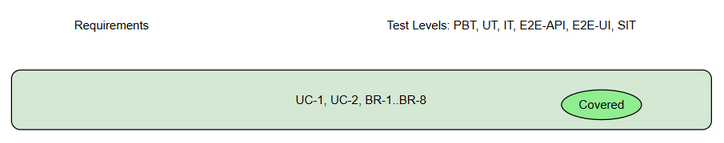
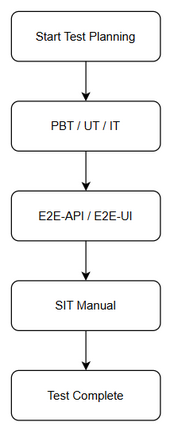

# Software Test Plan (STP)

## SA4E-289.10 — SA4E-306: SA4E-289.10 - Pi Packages Config Page + Pre-install 7 Packages

---

## Document Information

| Field | Value |
|-------|-------|
| Jira Ticket | SA4E-306 |
| Title | SA4E-289.10 - Pi Packages Config Page + Pre-install 7 Packages |
| Author | QA Agent |
| Version | 1.0 |
| Date | 2026-09-25 |
| Status | Draft |
| Related BRD | BRD.md |
| Related FSD | FSD.md |
| Related TDD | TDD.md |

---

## Author Tracking

| Role | Name - Position | Responsibility |
|------|-----------------|----------------|
| Author | QA Agent – QA Engineer | Create document |
| Peer Reviewer | TBD – TBD | Review document |

---

## Revision History

| Version | Date | Author | Changes |
|---------|------|--------|---------|
| 1.0 | 2026-09-25 | QA Agent | Initiate document — auto-generated from BRD, FSD, and TDD |

---

## Sign-Off

| Name | Signature and date |
|------|--------------------|
| | ☐ I agree and confirm the test plan in this STP |
| | ☐ I agree and confirm the test plan in this STP |

---

## 1. Introduction

### 1.1 Purpose
This test plan defines the strategy, scope, resources, and schedule for testing the Pi Packages Config Page and pre-installation of 7 core Pi packages as part of SA4E-289 migration to Pi SDK Option C. The objective is to verify functional requirements from FSD UC-1/UC-2, business rules BR-1 to BR-8, acceptance criteria from BRD, and non-functional requirements for performance, security, and availability.

### 1.2 Test Objectives
- Verify all functional requirements from FSD UC-1 Pi Packages Configuration Page and UC-2 Pre-install 7 Core Packages are implemented correctly
- Validate business rules BR-1 to BR-8 are enforced
- Ensure UI specifications for Packages tab, Package List table, Enable Toggle, Status Indicator, and Install Progress are correct
- Validate API contract GET /api/packages/list
- Ensure non-functional requirements are met: packages list loads within 2 seconds, authentication required, UI available after extension host startup
- Verify pre-install orchestrator retries install up to 3 times on timeout and blocks when extension host missing
- Validate error handling for persist failure, host call failure, install failure, and extension host unavailable

### 1.3 References
| Document | Location |
|----------|----------|
| BRD | documents/SA4E-306/BRD.md |
| FSD | documents/SA4E-306/FSD.md |
| TDD | documents/SA4E-306/TDD.md |

---

## 2. Test Strategy

### 2.1 Test Levels

| Level | Scope | Automation | Tools |
|-------|-------|------------|-------|
| PBT | Correctness properties (random inputs) | Automated | fast-check |
| UT | Unit/edge case tests | Automated | vitest |
| IT | API integration (Hono app in-process) | Automated | vitest + Hono `app.request()` |
| E2E-API | REST endpoint E2E (real server) | Automated | vitest + fetch |
| E2E-UI | Browser UI E2E (Playwright) | Automated | Playwright |
| SIT | Manual exploratory / edge cases only | Manual | Browser |

### 2.2 Test Types
| Type | Description | Applicable |
|------|-------------|------------|
| Functional Testing | Verify features work per FSD use cases UC-1, UC-2 | Yes |
| Regression Testing | Ensure existing Settings panel features not broken | Yes |
| Performance Testing | Verify packages list loads within 2 seconds for up to 50 packages | Yes |
| Security Testing | Verify package enable/disable requires authentication, settings access control | Yes |
| Usability Testing | Verify UI/UX meets specifications: Packages tab, toggle, status | Yes |
| Compatibility Testing | Browser compatibility for Settings panel | No |

### 2.3 Test Approach
Risk-based prioritization focusing on Pi extension host mandatory adoption and pre-install reliability. Functional happy path and alternative/exception flows automated via E2E-UI and E2E-API. Business rule validation automated via UT/IT. Non-functional performance tested via E2E-UI measurement. Manual SIT reserved for visual layout, timing of blocking overlay, and complex UX judgment.

**E2E Automation Coverage:**
| Scenario Type | Classify As | Reason |
|--------------|-------------|--------|
| CRUD operations via UI (toggle enable/disable) | E2E-UI | Deterministic, easy automate |
| Form validation | E2E-UI | Input/output clear |
| API response verification | E2E-API | No browser needed |
| RBAC/auth checks | E2E-API | API-level check sufficient |
| Status changes | E2E-UI | Click + verify badge |
| Confirmation dialogs | E2E-UI | Click + verify |
| Regression | E2E-UI | Fast re-run |
| Blocking overlay timing | SIT | Visual timing hard automate |
| Visual/layout verification | SIT | Human eyes needed |

### 2.4 Test Levels Table

| Level | Scope | Automation | Tools |
|-------|-------|------------|-------|
| PBT | Correctness properties (random inputs) | Automated | fast-check |
| UT | Unit/edge case tests | Automated | vitest |
| IT | API integration (Hono app in-process) | Automated | vitest + Hono `app.request()` |
| E2E-API | REST endpoint E2E (real server) | Automated | vitest + fetch |
| E2E-UI | Browser UI E2E (Playwright) | Automated | Playwright |
| SIT | Manual exploratory / edge cases only | Manual | Browser |

### 2.5 Test Cases Summary

| Level | Count | Automated | Manual |
|-------|-------|-----------|--------|
| PBT | 2 | 2 | 0 |
| UT | 4 | 4 | 0 |
| IT | 3 | 3 | 0 |
| E2E-API | 3 | 3 | 0 |
| E2E-UI | 8 | 8 | 0 |
| SIT | 4 | 0 | 4 |
| **Total** | **24** | **20 (83%)** | **4 (17%)** |

### 2.6 Entry Criteria
| Level | Entry Criteria |
|-------|---------------|
| SIT | Code deployed to SIT environment, unit tests passed, test data prepared, Pi extension host initialized |
| UAT | SIT completed with no Critical/Major defects open, UAT environment ready, packages pre-installed |

### 2.7 Exit Criteria
| Level | Exit Criteria |
|-------|--------------|
| SIT | 100% test cases executed, 0 Critical defects, ≤2 Major defects open, packages list loads ≤2s |
| UAT | All UAT scenarios passed, business sign-off obtained |

---

## 3. Test Scope

### 3.1 Features In Scope
| # | Feature / Story | Priority | FSD Reference | Test Type |
|---|----------------|----------|---------------|-----------|
| 1 | Packages config page accessible from Settings panel tab | High | UC-1, BR-1 | Functional/E2E-UI |
| 2 | Display list of Pi packages with enable/disable toggles, version, status | High | UC-1, BR-4 | Functional/E2E-UI |
| 3 | Persist user selections across sessions | High | UC-1, EF-1 | Functional/E2E-API |
| 4 | Pre-install 7 core packages on first run | High | UC-2, BR-6, BR-8 | Functional/E2E-API |
| 5 | Extension host mandatory enforcement | High | BR-5, AF-1 | Functional/Security |
| 6 | Error handling: install failure, persist failure, host call fails | Medium | EF-1, EF-2, FSD 9 | Functional |
| 7 | Performance: packages list loads within 2 seconds | Medium | NFR Performance | Non-Functional |
| 8 | Authentication required for enable/disable | Medium | FSD 7.1 | Security |

### 3.2 Features Out of Scope
| # | Feature | Reason |
|---|---------|--------|
| 1 | Implementation details of Pi extension host runtime embedding vs harness selection | Recorded in PI-PACKAGES-DECISION.md, not testable via UI |
| 2 | Runtime model-resolution fixes | Prerequisite, not covered in this BRD |
| 3 | Packaging/distribution beyond enable/disable UI | Out of scope per BRD 1.2 |

---

## 4. Test Environment

### 4.1 Environment Requirements
| Environment | URL | Database | Purpose |
|-------------|-----|----------|---------|
| SIT | http://localhost:3000 | SQLite | System Integration Testing |
| UAT | TBD | TBD | User Acceptance Testing |

### 4.2 Browser / Device Requirements
| Browser | Version | OS | Required |
|---------|---------|-----|----------|
| Chrome | 120+ | Windows/Mac/Linux | Yes |
| Edge | 120+ | Windows | No |

### 4.3 Test Data Requirements
| Data Type | Description | Source | Preparation |
|-----------|-------------|--------|-------------|
| Package config | packageId, packageName, version, enabled, status | Seed CSV | Pre-seeded users and packages |
| Pre-install list | 7 core packages identifiers | BRD 2.3 | Hard-coded |
| Auth tokens | Admin/User JWT | Auth service | Generate via API |

### 4.4 External Dependencies
| System | Dependency | Mock/Stub Available |
|--------|-----------|---------------------|
| Pi Extension Host | Runtime enable/disable | No - real host required |
| Pi Registry | Package metadata/install | Mock for SIT |

---

## 5. Test Schedule
| Phase | Start Date | End Date | Duration | Milestone |
|-------|-----------|----------|----------|-----------|
| Test Planning | 2026-09-25 | 2026-09-25 | 1 day | STP + STC approved |
| Test Data Preparation | 2026-09-26 | 2026-09-26 | 1 day | Test data ready |
| SIT Execution | 2026-09-27 | 2026-09-29 | 3 days | SIT sign-off |
| Defect Fix & Retest | 2026-09-30 | 2026-10-01 | 2 days | All Critical/Major fixed |
| UAT Execution | 2026-10-02 | 2026-10-03 | 2 days | UAT sign-off |

---

## 6. Resources & Responsibilities
| Role | Name | Responsibility |
|------|------|---------------|
| Test Lead | QA Agent | Test planning, coordination, reporting |
| QA Engineer | QA Agent | Test case design, execution, defect reporting |
| BA | BA Agent | UAT support, acceptance criteria clarification |
| Developer | DEV Agent | Bug fixing, unit test coverage |
| DevOps | DevOps Agent | Environment setup, deployment |

---

## 7. Risk & Mitigation
| # | Risk | Impact | Likelihood | Mitigation |
|---|------|--------|------------|------------|
| 1 | Pi extension host adoption increases run path complexity | High | Medium | Prototype early, record decision |
| 2 | Bare Agent cannot load extensions leading to runtime errors | High | High | Enforce extension host mandatory, validate in CI |
| 3 | Pre-install failures due to network/registry | Medium | Medium | Retry logic and error reporting UI |
| 4 | Test data not available on time | Medium | Medium | Prepare mock data in advance |

---

## 8. Defect Management

### 8.1 Severity Levels
| Severity | Definition | Example |
|----------|-----------|---------|
| Critical | System crash, data loss, security breach | Extension host unavailable, packages not load |
| Major | Feature not working, workaround exists | Toggle does not persist |
| Minor | UI issue, cosmetic defect | Misaligned status label |
| Trivial | Typo, minor alignment issue | Tab label spacing |

### 8.2 Priority Levels
| Priority | Definition | SLA (Fix Time) |
|----------|-----------|----------------|
| P1 | Must fix immediately | 4 hours |
| P2 | Must fix before release | 1 business day |
| P3 | Should fix if time permits | 3 business days |
| P4 | Nice to fix, can defer | Next release |

### 8.3 Defect Lifecycle
```
New → Open → In Progress → Fixed → Ready for Retest → Verified → Closed
                                                      → Reopened → In Progress
```

---

## 9. Test Metrics & Reporting
| Metric | Formula | Target |
|--------|---------|--------|
| Test Execution Rate | Executed / Total × 100% | 100% |
| Pass Rate | Passed / Executed × 100% | ≥ 95% |
| Defect Density | Defects / Test Cases | ≤ 0.1 |
| Critical Defect Count | Count of Critical severity | 0 |
| Defect Fix Rate | Fixed / Total Defects × 100% | ≥ 90% |

---

## 10. Appendix

### Glossary
| Term | Definition |
|------|------------|
| SIT | System Integration Testing |
| UAT | User Acceptance Testing |
| STP | Software Test Plan |
| STC | Software Test Cases |

### Assumptions
- Pi extension host will be integrated via pi-coding-agent harness or embedded runtime
- Packages are available in Pi registry with stable identifiers
- Users have permission to enable/disable packages via Settings



