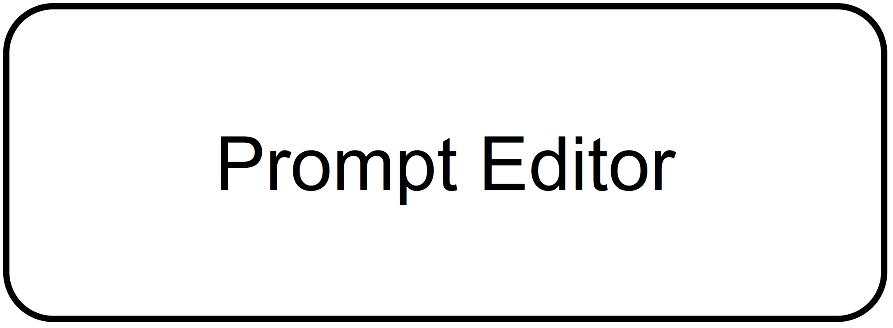
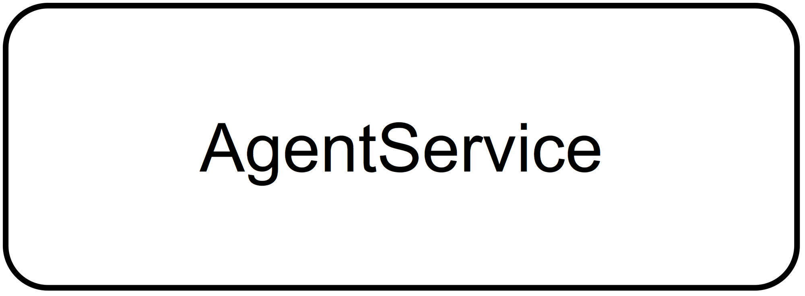
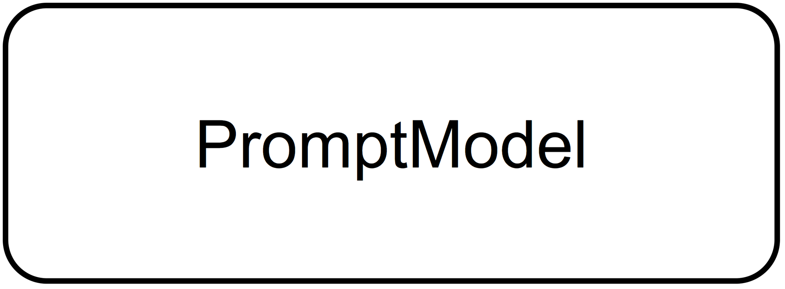

# Technical Design Document

## SA4E-306 Pi Chat Prompt Editing + Agent Improvement

### 1. Architecture Overview

### 2. Component Design

### 3. Class Design

### Diagram Index
| # | Diagram | Image | Source |
|---|---------|-------|--------|
| 1 | Architecture |  | *[Edit](diagrams/architecture.drawio)* |
| 2 | Component |  | *[Edit](diagrams/component.drawio)* |
| 3 | Class |  | *[Edit](diagrams/class.drawio)* |
