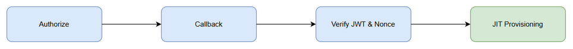

# Functional Specification Document (FSD)
## SA4E-307 — SSO Provider Strategy Abstraction + Registry + Refactor Entra

---

## Document Information

| Field | Value |
|-------|-------|
| Jira Ticket | SA4E-307 |
| Title | SSO Provider Strategy Abstraction + Registry + Refactor Entra |
| Author | BA Agent |
| Version | 1.0 |
| Date | 2026-09-22 |
| Status | Draft |
| Related BRD | documents/SA4E-307/BRD.md |

---

## 1. Introduction

### 1.1 Purpose
Mô tả chức năng chi tiết của Strategy abstraction cho SSO, registry singleton, Entra provider implementation, JIT provisioning service và dynamic routes theo code thực tế.

### 1.2 Scope
Trích xuất trực tiếp từ các file:
- `backend/src/server/auth/strategies/SsoProviderStrategy.ts`
- `backend/src/server/auth/strategies/SsoStrategyRegistry.ts`
- `backend/src/server/auth/strategies/EntraProviderStrategy.ts`
- `backend/src/server/auth/strategies/index.ts`
- `backend/src/server/services/JitProvisioningService.ts`
- `backend/src/server/routes/auth/sso-dynamic.ts`

### 1.3 Definitions
| Term | Definition |
|------|------------|
| NormalizedProfile | Chuẩn hoá profile SSO: provider, externalSubjectId, email, emailVerified, name, groups |
| PKCE | Proof Key for Code Exchange S256 |
| JIT | Just-In-Time provisioning |

---

## 2. System Overview

### 2.1 System Context

*[Edit in draw.io](diagrams/authorize_callback_verify_jit.drawio)*

User khởi tạo authorize → Strategy tạo URL → IdP → Callback → Token exchange → Verify JWT/Nonce → Normalize → JIT Provision → User DB

### 2.2 Architecture
- Strategy Layer: `SsoProviderStrategy` interface + concrete `EntraProviderStrategy`
- Registry: `SsoStrategyRegistry` singleton
- Service: `JitProvisioningService` sử dụng `DatabaseAdapter`
- Routes: `sso-dynamic.ts` public endpoints

---

## 3. Functional Requirements

### 3.1 Feature: SSO Strategy Interface

**Source:** BRD STORY 1

#### 3.1.1 Description
Định nghĩa contract chung cho mọi SSO provider.

#### 3.1.2 Use Case UC-01 Build Authorize URL
**Actor:** Backend
**Preconditions:** Provider đã được register
**Main Flow:**
| Step | Actor | System | Description |
|------|-------|--------|-------------|
| 1 | | SsoProviderStrategy.buildAuthorizeUrl | Nhận options.redirectTo/state |
| 2 | | System | Trả AuthorizeResult {url, state, nonce?, codeVerifier?} |

**Business Rules:**
| Rule ID | Rule | Source |
|---------|------|--------|
| BR-01 | `providerType` phải readonly string | SsoProviderStrategy.ts:38 |
| BR-02 | `buildAuthorizeUrl` trả url + state | SsoProviderStrategy.ts:39 |

#### 3.1.3 Data Specifications
**Input Data:**
| Field | Type | Required | Validation | Description |
|-------|------|----------|------------|-------------|
| redirectTo | string | N | URL | Redirect sau login |
| state | string | N | - | CSRF state |

**Output Data:**
| Field | Type | Description |
|-------|------|-------------|
| url | string | IdP authorize URL |
| state | string | CSRF state |
| nonce | string | OIDC nonce |
| codeVerifier | string | PKCE verifier |

### 3.2 Feature: SsoStrategyRegistry

**Source:** BRD STORY 1

#### 3.2.1 Description
Singleton quản lý mapping providerType → strategy.

**Business Rules:**
| Rule ID | Rule | Source |
|---------|------|--------|
| BR-03 | Register lưu key lowercase | SsoStrategyRegistry.ts:15 |
| BR-04 | get/has case-insensitive | SsoStrategyRegistry.ts:18-23 |

**API Contract:**
`register(strategy)`, `get(providerType)`, `has(providerType)`, `list()`, `clear()`

### 3.3 Feature: EntraProviderStrategy

**Source:** BRD STORY 2

#### 3.3.1 Build Authorize URL
**Input:** `AuthorizeOptions`
**Process:**
1. Load config via `loadEntraConfigAsync(process.env)`
2. Nếu !config → throw 'SSO not enabled'
3. state = options.state || generateState()
4. verifier = generateVerifier(); challenge = codeChallenge(verifier)
5. nonce = generateNonce()
6. Build URL `config.authority/oauth2/v2.0/authorize?client_id&response_type=code&redirect_uri&scope&code_challenge&code_challenge_method=S256&state&nonce`
7. Return {url, state, nonce, codeVerifier}

**Business Rules:**
| Rule ID | Rule | Source |
|---------|------|--------|
| BR-05 | PKCE method S256 bắt buộc | EntraProviderStrategy.ts:43 |
| BR-06 | Config load async, fallback env | EntraProviderStrategy.ts:26 |

#### 3.3.2 Handle Callback
**Input:** `CallbackParams {code, state, storedState?, codeVerifier?, nonce?}`
**Process:**
1. Load config
2. codeVerifier = params.codeVerifier || params.storedState?.codeVerifier
3. expectedNonce = params.nonce || params.storedState?.nonce
4. POST token endpoint với grant_type=authorization_code, code_verifier
5. Verify id_token qua `getEntraVerifierAsync`
6. Decode payload, validate tokenNonce === expectedNonce → else error 401 invalid_nonce
7. Email = claims.email || payload.preferred_username || payload.upn
8. emailVerified = isEntraEmailVerified(payload) using xms_edov/email_verified
9. Return NormalizedProfile

**Business Rules:**
| Rule ID | Rule | Source |
|---------|------|--------|
| BR-07 | Nonce phải khớp payload.nonce | EntraProviderStrategy.ts:99-103 |
| BR-08 | Email verified dựa trên xms_edov | EntraProviderStrategy.ts:122-140 |
| BR-09 | externalSubjectId = oid || sub | EntraProviderStrategy.ts:114 |

**Error Scenarios:**
| Scenario | User Message | Trigger |
|----------|--------------|---------|
| token_exchange_failed | SSO provider error | token endpoint !ok |
| verifier_unavailable | Internal error | getEntraVerifierAsync null |
| invalid_nonce | Unauthorized | nonce mismatch |

### 3.4 Feature: JitProvisioningService.provision

**Source:** BRD STORY 3

#### 3.4.1 Description
Tạo hoặc liên kết user từ claims SSO.

**Main Flow:**
1. Normalize provider, email lowercased, oid, name, groups
2. Nếu !email hoặc !oid → auditReject + throw Missing required claims
3. Map accessGroup qua `mapGroup(groups, fallback)`
4. Lookup user by external_provider + external_subject_id → nếu found → updateLastLogin → return
5. Lookup user by email → nếu found:
   - emailVerified? else reject
   - account_type not in LOCAL/SSO? reject HYBRID
   - already linked? reject duplicate
   - account_type LOCAL? reject auto-link
   - Update users set external_provider, external_subject_id, access_group_id, last_login, account_type='SSO' → auditLink → return linked
6. JIT create:
   - emailVerified? else reject
   - userId = 'user-' + uuid.slice(0,8)
   - username = generateUsername(email, name)
   - INSERT users with password_hash null, status ACTIVE, account_type SSO
   - auditProvision → return created

**Business Rules:**
| Rule ID | Rule | Source |
|---------|------|--------|
| BR-10 | Default group grp-viewer | JitProvisioningService.ts:30 |
| BR-11 | ENTRA_GROUP_MAPPING parse JSON | JitProvisioningService.ts:38-47 |
| BR-12 | Không auto-link LOCAL | JitProvisioningService.ts:110-113 |
| BR-13 | Không cho phép HYBRID | JitProvisioningService.ts:93-96 |
| BR-14 | Yêu cầu emailVerified cho JIT/link | JitProvisioningService.ts:86-90,128 |

**Data Specifications Input:**
| Field | Type | Required | Description |
|-------|------|----------|-------------|
| provider | string | Y | entra/google/... |
| email | string | Y | Normalized lower |
| emailVerified | boolean | Y | Verified flag |
| externalSubjectId/oid/sub | string | Y | IdP subject |
| name | string | N | Display name |
| groups | string[] | N | Entra groups |

**Output:**
| Field | Type | Description |
|-------|------|-------------|
| user | object | User record |
| created | boolean | New user? |
| linked | boolean | Linked existing? |

### 3.5 Feature: sso-dynamic Routes

**Endpoints:**
- `GET /sso/providers` → Trả danh sách `sso_providers` enabled AND client_id <> ''
- `GET /:provider/login` → Lookup `sso_providers` enabled, nếu `registry.has(provider)` → redirect `/auth/${provider}/login?redirect_to=...`, nếu provider in KNOWN_PROVIDERS → 501 not implemented, else 404

**Business Rules:**
| Rule ID | Rule | Source |
|---------|------|--------|
| BR-15 | Chỉ advertise provider có client_id | sso-dynamic.ts:18-20 |
| BR-16 | Dispatch dựa trên registry.has | sso-dynamic.ts:39 |

---

## 4. Data Model

### 4.1 Entities
**users**
| Attribute | Type | Business Rule |
|-----------|------|---------------|
| user_id | string | PK, format user-xxxx |
| username | string | Generated from email/name |
| email | string | Lowercased unique |
| external_provider | string | entra/... |
| external_subject_id | string | oid/sub |
| account_type | string | LOCAL/SSO |
| access_group_id | string | grp-viewer default |
| status | string | ACTIVE |

**sso_providers**
| Attribute | Type | Description |
|-----------|------|-------------|
| provider_type | string | entra/google/github |
| enabled | boolean | |
| client_id | string | |
| redirect_uri | string | |

---

## 5. Integration Specifications

### 5.1 External System: Entra ID
| Attribute | Value |
|-----------|-------|
| Purpose | SSO authentication |
| Direction | Outbound/Inbound |
| Data Format | OAuth2/OIDC JSON |
| Frequency | Real-time |

**Data Exchange:**
| Our Data | External Data | Direction | Rule |
|----------|--------------|-----------|------|
| client_id | client_id | Send | Config |
| code_verifier | code_verifier | Send | PKCE |
| id_token | claims | Receive | Verify RS256 |

---

## 6. Processing Logic

### 6.1 JIT Provision Flow
**Trigger:** Callback success
**Steps:**
1. Normalize claims
2. Validate email/oid
3. Lookup external identity
4. Lookup email
5. Create or link

**Activity Diagram:** Refer to `diagrams/authorize_callback_verify_jit.png`

---

## 7. Security Requirements

### 7.1 Authentication & Authorization
- PKCE S256 bắt buộc cho Entra
- Nonce validation chống replay
- RS256 verify qua JWKS
- Email verified gate cho JIT/link

### 7.2 Audit Trail
| Event | Logged Fields | Reason |
|-------|---------------|--------|
| SSO_JIT_PROVISION | userId,email,oid,provider | Compliance |
| SSO_LINKED | userId,email,oid,provider | Traceability |
| SSO_LINK_REJECTED_* | details | Security |

---

## 8. Non-Functional Requirements

| Category | Requirement | Acceptance Criteria |
|----------|-------------|---------------------|
| Security | PKCE + nonce | Code implements S256 & nonce check |
| Security | Anti-takeover | LOCAL auto-link rejected |
| Maintainability | SOLID, ≤200 lines/file | Code review |
| Audit | All provision/link/reject audited | recordAudit called |

---

## 9. Error Handling

| Scenario | Severity | User Message | Expected Behavior |
|----------|----------|--------------|-------------------|
| Missing claims | Critical | Missing required claims | Audit reject, throw |
| Email not verified | Warning | Email not verified | Reject JIT/link |
| Invalid nonce | Critical | Unauthorized | 401 error |
| Duplicate email link | Warning | Email already linked | Audit reject |

---

## 10. Testing Considerations

| ID | Scenario | Input | Expected Output | Priority |
|----|----------|-------|-----------------|----------|
| TC-01 | Entra authorize URL | options state | url contains code_challenge S256 | High |
| TC-02 | Callback nonce mismatch | wrong nonce | invalid_nonce 401 | High |
| TC-03 | JIT new user | verified email, new oid | user created, account_type SSO | High |
| TC-04 | Link existing SSO user | existing external identity | updateLastLogin, created false | High |
| TC-05 | Reject LOCAL auto-link | existing LOCAL user | error auto-link not allowed | High |

---

## 11. Appendix

### Diagrams
| Diagram | File |
|---------|------|
| Authorize Callback Verify JIT Flow | [authorize_callback_verify_jit.png](diagrams/authorize_callback_verify_jit.png) |

### Change Log from BRD
- FSD được tạo hoàn toàn từ code thực tế, không bịa đặt thông tin.
- Diagram tham chiếu được cập nhật đúng luồng authorize → callback → verify → JIT.
