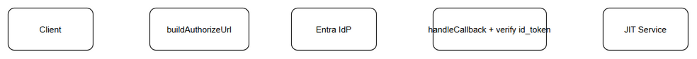

# SA4E-307 TDD — Design

## Kiến trúc
backend/src/server/auth/strategies/SsoProviderStrategy.ts
- interface SsoProviderStrategy, NormalizedProfile
- SsoStrategyRegistry

backend/src/server/auth/strategies/EntraProviderStrategy.ts
- refactor từ routes/auth/entra.ts

backend/src/server/auth/services/JitProvisioningService.ts
- refactor nhận NormalizedProfile

backend/src/server/auth/sso-dynamic.ts
- dispatch qua registry

## Diagram

## Sequence
Login -> /sso/providers -> buildAuthorizeUrl -> callback -> handleCallback -> NormalizedProfile -> JitProvisioningService -> User link/create

## Quyết định
Giữ RS256/JWKS/ PKCE cho Entra, không đổi URL
