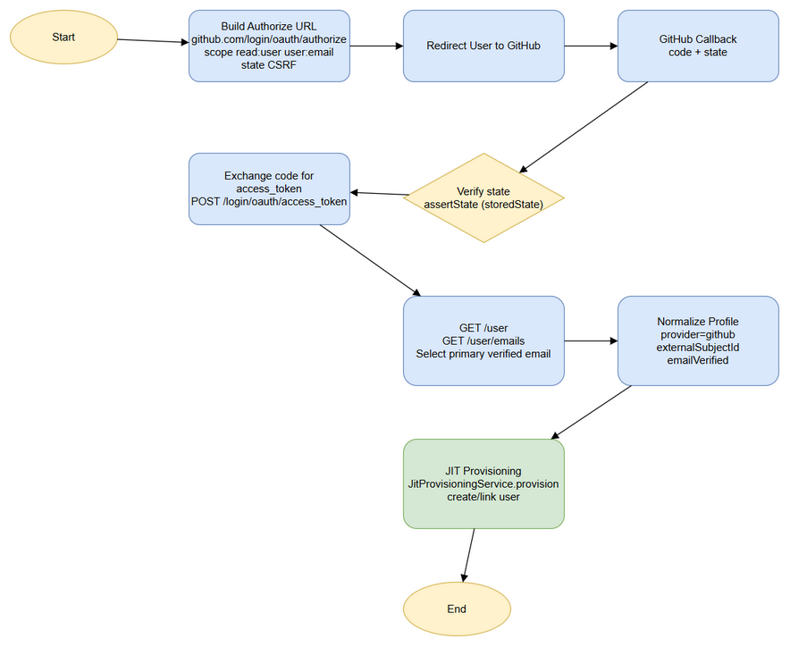

# Functional Specification Document (FSD)

## SDLC Agents 4 Enterprise — SA4E-309: [Backend] GitHub SSO (OAuth2, non-OIDC) provider strategy

---

## Document Information

| Field | Value |
|-------|-------|
| Jira Ticket | SA4E-309 |
| Title | [Backend] GitHub SSO (OAuth2, non-OIDC) provider strategy |
| Author | BA Agent |
| Version | 1.0 |
| Date | 2026-09-22 |
| Status | Draft |
| Related BRD | documents/SA4E-309/BRD.md |

---

## Revision History

| Version | Date | Author | Changes |
|---------|------|--------|---------|
| 1.0 | 2026-09-22 | BA Agent | Rewrite FSD based on code review of GitHubProviderStrategy, SsoProviderStrategy, JitProvisioningService |

---

## 1. Introduction

### 1.1 Purpose

Specify functional behavior of GitHubProviderStrategy implementing OAuth2 non-OIDC SSO, including authorize URL construction, callback handling, token exchange, profile normalization, and JIT provisioning integration.

### 1.2 Scope

Functional scope covers `GitHubProviderStrategy.buildAuthorizeUrl` and `handleCallback`, state CSRF verification, GitHub REST API integration, email verification, and NormalizedProfile output to JitProvisioningService. Technical implementation details remain in TDD.

### 1.3 Definitions & Acronyms

| Term | Definition |
|------|------------|
| OAuth2 | Authorization framework, non-OIDC |
| PKCE | Proof Key for Code Exchange, not supported by GitHub |
| JIT | Just-In-Time provisioning |
| NormalizedProfile | provider, externalSubjectId, email, emailVerified, name |

### 1.4 References

| Document | Location |
|----------|----------|
| BRD | documents/SA4E-309/BRD.md |
| Code | backend/src/server/auth/strategies/GitHubProviderStrategy.ts |

---

## 2. System Overview

### 2.1 System Context Diagram

System interacts with GitHub OAuth service and internal User DB.

### 2.2 System Architecture

GitHubProviderStrategy implements SsoProviderStrategy interface. Registry dispatches provider by type. Callback handler uses JitProvisioningService to create/link users.

*[Edit in draw.io](diagrams/authorize_callback_verify_jit.drawio)*

---

## 3. Functional Requirements

### 3.1 Feature: GitHub OAuth2 Sign-In

**Source:** BRD Story 1

#### 3.1.1 Description

Provide sign-in flow using GitHub OAuth2 Authorization Code grant without OIDC.

#### 3.1.2 Use Case

**Use Case ID:** UC-01
**Actor:** End User
**Preconditions:** GitHub provider enabled in config
**Postconditions:** User authenticated, JIT provisioned/linked

**Main Flow:**
| Step | Actor | System | Description |
|------|-------|--------|-------------|
| 1 | User | | Requests GitHub sign in |
| 2 | | System | buildAuthorizeUrl returns url+state |
| 3 | User | GitHub | Authenticates and authorizes |
| 4 | GitHub | System | Redirects to callback with code+state |
| 5 | | System | assertState validates state |
| 6 | | System | exchangeCode → access_token |
| 7 | | GitHub | GET /user, GET /user/emails |
| 8 | | System | Select primary verified email |
| 9 | | System | Normalize profile |
| 10 | | System | JitProvisioningService.provision |

**Alternative Flows:**
| ID | Condition | Steps |
|----|-----------|-------|
| AF-1 | State mismatch | Reject 401 invalid_state |
| AF-2 | Email not verified | Reject 403 email_not_verified |

**Exception Flows:**
| ID | Condition | Steps |
|----|-----------|-------|
| EF-1 | Token exchange fails | Return 502 |
| EF-2 | User API fails | Return 502 |

#### 3.1.3 Business Rules

| Rule ID | Rule | Source |
|---------|------|--------|
| BR-01 | Authorize URL must be https://github.com/login/oauth/authorize | Code |
| BR-02 | Scopes default to read:user user:email | Code |
| BR-03 | State must be verified via assertState | Code |
| BR-04 | No PKCE/nonce for GitHub | Code comment |
| BR-05 | Primary verified email required | Code |
| BR-06 | externalSubjectId = GitHub user.id as string | Code |

#### 3.1.4 Data Specifications

**Input Data:**
| Field | Type | Required | Validation | Description |
|-------|------|----------|------------|-------------|
| code | string | Y | Non-empty | Authorization code |
| state | string | Y | Matches storedState | CSRF token |
| client_id | string | Y | From config | |
| client_secret | string | Y | From config | |

**Output Data:**
| Field | Type | Description |
|-------|------|-------------|
| provider | string | 'github' |
| externalSubjectId | string | GitHub user id |
| email | string | Primary verified email |
| emailVerified | boolean | true |
| name | string | user.name || user.login |

#### 3.1.5 API Contract (Functional View)

**Endpoint:** `GET /auth/github/authorize`
**Purpose:** Build authorization URL

**Input Parameters:**
| Parameter | Type | Required | Business Rule | Description |
|-----------|------|----------|---------------|-------------|
| state | string | N | BR-03 | CSRF token |

**Output:**
| Field | Type | Description |
|-------|------|-------------|
| url | string | Authorize URL |
| state | string | Issued state |

**Business Error Scenarios:**
| Scenario | User Message | Trigger |
|----------|--------------|---------|
| SSO not enabled | 400 | Config missing |

**Endpoint:** `GET /auth/github/callback?code=&state=`
**Purpose:** Handle callback

**Business Error Scenarios:**
| Scenario | User Message | Trigger |
|----------|--------------|---------|
| invalid_state | 401 | State mismatch |
| email_not_verified | 403 | No verified email |
| token_exchange_failed | 502 | GitHub token error |

---

## 4. Data Model

Logical entities: users, sso_providers.

**Entity: users**
| Attribute | Type | Required | Business Rule | Description |
|-----------|------|----------|---------------|-------------|
| user_id | string | Y | | |
| email | string | Y | Lowercased | |
| external_provider | string | N | 'github' | |
| external_subject_id | string | N | GitHub id | |
| account_type | string | Y | 'SSO' | |

---

## 5. Integration Specifications

### 5.1 External System: GitHub OAuth

| Attribute | Value |
|-----------|-------|
| Purpose | Identity federation |
| Direction | Outbound |
| Data Format | JSON |
| Frequency | On-demand |

**Data Exchange:**
| Our Data | External Data | Direction | Business Rule |
|----------|--------------|-----------|---------------|
| client_id | client_id | Send | |
| code | access_token | Receive | |
| access_token | user profile | Send | |

Endpoints:
- `https://github.com/login/oauth/authorize`
- `https://github.com/login/oauth/access_token`
- `https://api.github.com/user`
- `https://api.github.com/user/emails`

---

## 6. Processing Logic

### 6.1 JIT Provisioning

**Trigger:** NormalizedProfile from GitHub strategy
**Processing Steps:**
| Step | Description | Error Handling |
|------|-------------|----------------|
| 1 | Check existing external identity | Update last_login |
| 2 | Check email match | Reject if email not verified |
| 3 | Create new user | Require emailVerified |

---

## 7. Security Requirements

### 7.1 Authentication & Authorization
State CSRF protection mandatory. Client secret stored server-side.

### 7.2 Data Sensitivity
Access token short-lived, not logged.

### 7.3 Audit Trail
Provision, link, reject events audited via `recordAudit`.

---

## 8. Non-Functional Requirements

| Category | Business Requirement | Acceptance Criteria |
|----------|---------------------|---------------------|
| Security | CSRF protection | State mismatch rejected |
| Security | Email verification | Unverified email rejected |
| Performance | Callback latency | < 2s end-to-end |

---

## 9. Error Handling (User-Facing)

| Scenario | Severity | User Message | Expected Behavior |
|----------|----------|-------------|-------------------|
| invalid_state | Critical | Invalid session | Redirect to login error |
| email_not_verified | Warning | Email not verified | Show error, no provision |
| token_exchange_failed | Critical | Sign in temporarily unavailable | Retry later |

---

## 10. Testing Considerations

| ID | Scenario | Input | Expected Output | Priority |
|----|----------|-------|-----------------|----------|
| TC-01 | Successful sign in | Valid code+state | User provisioned | High |
| TC-02 | State mismatch | Wrong state | 401 invalid_state | High |
| TC-03 | Email unverified | GitHub returns unverified | 403 email_not_verified | High |
| TC-04 | No primary email | Emails list empty | 403 | Medium |

---

## 11. Appendix

### Diagrams

| Diagram | File |
|---------|------|
| Authorize Callback Verify JIT | [authorize_callback_verify_jit.png](diagrams/authorize_callback_verify_jit.png) |

### Change Log from BRD
FSD adds functional API contract, business rules BR-01..BR-06, data specifications, integration endpoints per code review.
