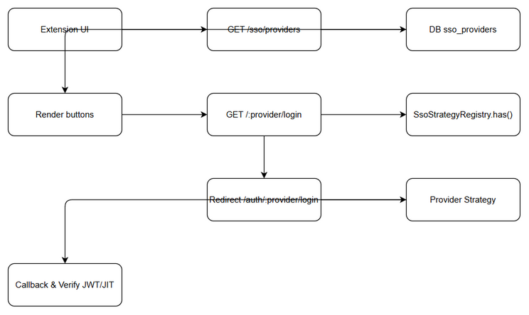

# Business Requirements Document (BRD)

## SDLC Agents 4 Enterprise — SA4E-310: [Extension] UI provider selection for Google/GitHub SSO

---

## Document Information

| Field | Value |
|-------|-------|
| Jira Ticket | SA4E-310 |
| Title | [Extension] UI provider selection for Google/GitHub SSO |
| Author | BA Agent |
| Version | 1.0 |
| Date | 2026-09-22 |
| Status | Draft |

---

## Author Tracking

| Role | Name - Position | Responsibility |
|------|-----------------|----------------|
| Author | BA Agent – Business Analyst | Create document |
| Peer Reviewer | – | Review document |

---

## Revision History

| Version | Date | Author | Changes |
|---------|------|--------|---------|
| 1.0 | 2026-09-22 | BA Agent | Initiate document — rewrite based on code review of backend/src/server/routes/auth/sso-dynamic.ts and SsoStrategyRegistry |

---

## Sign-Off

| Name | Signature and date |
|------|--------------------|
| | ☐ I agree and confirm all criteria on this BRD as expected requirements |
| | ☐ I agree and confirm all criteria on this BRD as expected requirements |

---

## 1. Introduction

### 1.1 Scope

UI provider selection for Google/GitHub SSO on Extension login panel. Login panel renders "Sign in with Google / Sign in with GitHub" buttons based on enabled providers from `/sso/providers`. Provider list is sourced from DB table `sso_providers` where `enabled = 1 AND client_id <> ''`. No secrets are exposed. When user selects a provider, `GET /:provider/login` checks `ssoStrategyRegistry.has(provider)` and redirects to `/auth/:provider/login` for loopback flow. UI reflects enabled/disabled state and shows user-facing error messages.

### 1.2 Out of Scope

Backend provider strategy implementation for Google OIDC + PKCE and GitHub OAuth2 is out of scope, covered by SA4E-308 and SA4E-309. Entra ID integration is covered by parent epic SA4E-262. Admin configuration UI for enabling providers is out of scope.

### 1.3 Preliminary Requirement

- `sso_providers` table with columns `provider_id`, `provider_type`, `name`, `enabled`, `client_id`, `redirect_uri`, `login_ui_html` must exist.
- `ssoStrategyRegistry` must be instantiated and strategies for `google`, `github` must be registered to pass `has()` check.
- Depends on SA4E-307, SA4E-308, SA4E-309.

---

## 2. Business Requirements

### 2.1 High Level Process Map

*[Edit in draw.io](diagrams/authorize_callback_verify_jit.drawio)*

High-level flow: Extension UI → GET `/sso/providers` → DB `sso_providers` → render buttons → user click → GET `/:provider/login` → `ssoStrategyRegistry.has()` → redirect to `/auth/:provider/login` → Provider Strategy → Callback & Verify JWT/JIT.

### 2.2 List of User Stories / Use Cases

| # | Story / Use Case / Epic | Priority | Source Ticket |
|---|-------------------------|----------|---------------|
| 1 | As a end user, I want to see only enabled SSO providers on login page so that I can choose a valid sign-in method | MUST HAVE | SA4E-310 |
| 2 | As a end user, I want to click a provider button and be redirected to correct auth flow so that I can sign in with SSO | MUST HAVE | SA4E-310 |
| 3 | As a system, I want to not expose secrets via provider list endpoint so that security is preserved | MUST HAVE | SA4E-310 |

---

### 2.3 Details of User Stories

#### Business Flow

**Step 1:** Extension UI calls `GET /sso/providers`
**Step 2:** Backend queries `sso_providers WHERE enabled = 1 AND client_id <> ''` 
**Step 3:** Backend returns safe fields: `provider_id, provider_type, name, login_ui_html`
**Step 4:** UI renders buttons for each provider
**Step 5:** User clicks provider button → `GET /:provider/login`
**Step 6:** Backend fetches provider row, checks `ssoStrategyRegistry.has(provider)`
**Step 7:** If registered, redirect to `/auth/${provider}/login?redirect_to=...`
**Step 8:** Provider Strategy handles authorize and callback, JIT provisioning occurs
**Step 9:** Success → user signed in, status bar updated. Error → user-facing message

> **Note:** Code reference: `backend/src/server/routes/auth/sso-dynamic.ts:12-22` for providers list, `sso-dynamic.ts:27-47` for login redirect and registry check.

#### STORY 1: Provider visibility based on enabled flag

> As a end user, I want to see only enabled SSO providers on login page so that I can choose a valid sign-in method

**Requirement Details:**
1. `GET /sso/providers` returns only providers enabled in DB with non-empty client_id
2. Response never includes `client_secret`, `tenant_id` or other secrets
3. UI renders button per provider in order of `provider_type`

**Data Fields:**
| Field | Type | Required | Description | Example |
|-------|------|----------|-------------|---------|
| provider_id | string | Yes | Primary key | google-001 |
| provider_type | string | Yes | Type identifier | google |
| name | string | Yes | Display name | Sign in with Google |
| login_ui_html | string | No | Optional UI hint | <button>... |

**Acceptance Criteria:**
1. Provider enabled in Admin → button shown on login
2. Provider disabled → button hidden
3. Provider enabled but client_id empty → not advertised

**UI Specifications:**
| No. | Name | Type | Required | Description | Note |
|-----|------|------|----------|-------------|------|
| 1 | Provider Button | Button | Yes | Rendered per provider | Label from `name` |
| 2 | Login Panel | Container | Yes | Holds provider buttons | |

**Validation Rules:**
- Do not expose secret fields
- Filter by `enabled = 1 AND client_id <> ''`

**Error Handling:**
- DB error → return `{ providers: [] }` empty list

#### STORY 2: Provider login redirect

> As a end user, I want to click a provider button and be redirected to correct auth flow so that I can sign in with SSO

**Requirement Details:**
1. `GET /:provider/login` validates provider exists and enabled
2. If `ssoStrategyRegistry.has(provider)` true → redirect to `/auth/${provider}/login`
3. If known provider but not implemented → 501 with message
4. Unknown provider → 404

**Acceptance Criteria:**
1. Click provider → completes sign in, status bar updated
2. Provider not registered → 501 message
3. User-facing error shown for unknown/disabled provider

**UI Specifications:**
| No. | Name | Type | Required | Description | Note |
|-----|------|------|----------|-------------|------|
| 1 | Sign in with Google | Button | Yes | Navigates to /google/login | |
| 2 | Sign in with GitHub | Button | Yes | Navigates to /github/login | |

---

## 3. Dependencies

| Dependency | Type | Related Ticket | Description |
|------------|------|----------------|-------------|
| Google SSO strategy | System | SA4E-308 | OIDC + PKCE provider strategy |
| GitHub SSO strategy | System | SA4E-309 | OAuth2 provider strategy |
| Dynamic SSO routes | System | SA4E-310 | Routes implementation in sso-dynamic.ts |
| sso_providers DB table | Infrastructure | SA4E-262 | Provider config storage |

---

## 4. Stakeholders

| Role | Name / Team | Responsibility | Source |
|------|-------------|----------------|--------|
| Reporter | Duc Nguyen Minh | Requirement owner | SA4E-310 |
| Epic Owner | SDLC Team | Epic SA4E-262 | Parent |

---

## 5. Risks and Assumptions

### 5.1 Risks

| Risk | Impact | Likelihood | Mitigation |
|------|--------|------------|------------|
| Provider enabled but strategy not registered | High | Medium | Registry check returns 501, log warning |
| UI renders stale provider list | Medium | Low | Cache bust on login page load |

### 5.2 Assumptions

- DB `sso_providers` is source of truth for enabled state
- `ssoStrategyRegistry.has()` reflects actual implementation availability

---

## 6. Non-Functional Requirements

| Category | Requirement | Details |
|----------|-------------|---------|
| Security | No secret exposure | `/sso/providers` returns safe fields only |
| Performance | Fast provider list | DB query indexed on enabled/client_id |
| Availability | Provider list endpoint always available | Graceful fallback to empty list |

---

## 7. Related Tickets

| Ticket Key | Summary | Status | Type | Relationship |
|------------|---------|--------|------|--------------|
| SA4E-310 | [Extension] UI provider selection for Google/GitHub SSO | To Do | Story | Main ticket |
| SA4E-308 | [Backend] Google SSO (OIDC + PKCE) provider strategy | To Do | Story | Depends |
| SA4E-309 | [Backend] GitHub SSO (OAuth2) provider strategy | To Do | Story | Depends |
| SA4E-262 | [SSO] Tích hợp Microsoft Entra ID... | In Progress | Epic | Parent |

---

## 8. Appendix

### Diagram Index

| Diagram | File |
|---------|------|
| Authorize Callback Verify JIT | [authorize_callback_verify_jit.png](diagrams/authorize_callback_verify_jit.png) |
| UI Wireframe | [ui_wireframe.png](diagrams/ui_wireframe.png) |
| UI Mockup | [ui_mockup.png](diagrams/ui_mockup.png) |

### Reference Documents

| Document | Location |
|----------|----------|
| MULTI-PROVIDER-SSO-PLAN | documents/SA4E-262/MULTI-PROVIDER-SSO-PLAN.md |
| sso-dynamic.ts | backend/src/server/routes/auth/sso-dynamic.ts |
| SsoStrategyRegistry.ts | backend/src/server/auth/strategies/SsoStrategyRegistry.ts |
