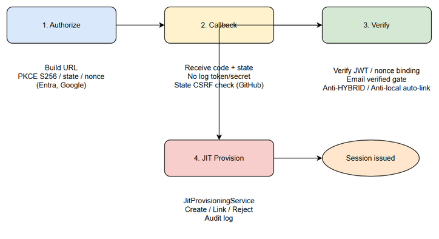

# Business Requirements Document (BRD)

## SA4E-311 — Security Review Multi-Provider SSO Hardening

---

## Document Information

| Field | Value |
|-------|-------|
| Jira Ticket | SA4E-311 |
| Title | [Security] Multi-provider SSO hardening review |
| Author | BA Agent |
| Version | 1.0 |
| Date | 2026-09-22 |
| Status | Draft |

---

## Author Tracking

| Role | Name - Position | Responsibility |
|------|-----------------|----------------|
| Author | BA Agent – Business Analyst | Create document |
| Peer Reviewer | Security Team – Reviewer | Review document |

---

## Revision History

| Version | Date | Author | Changes |
|---------|------|--------|---------|
| 1.0 | 2026-09-22 | BA Agent | Initial rewrite based on code review of EntraProviderStrategy, GoogleProviderStrategy, GitHubProviderStrategy, JitProvisioningService, sso-dynamic |

---

## Sign-Off

| Name | Signature and date |
|------|--------------------|
| | ☐ I agree and confirm all criteria on this BRD as expected requirements |
| | ☐ I agree and confirm all criteria on this BRD as expected requirements |

---

## 1. Introduction

### 1.1 Scope

Security hardening review for multi-provider SSO implementation covering Entra ID, Google, and GitHub. The review validates that each provider strategy enforces provider-specific security controls: PKCE S256 + state + nonce binding for OIDC providers (Entra, Google), state CSRF protection for GitHub OAuth2, emailVerified gate in JIT provisioning, anti-HYBRID and anti-local auto-link protections, no logging of tokens/secrets, redirect allowlist enforcement, and rate limiting of callback endpoints. The review is based on actual code: EntraProviderStrategy.ts, GoogleProviderStrategy.ts, GitHubProviderStrategy.ts, JitProvisioningService.ts, sso-dynamic.ts.

### 1.2 Out of Scope

Implementation of new providers beyond Entra/Google/GitHub. Changes to UI design, access group mapping logic beyond security gates, and infrastructure scaling.

### 1.3 Preliminary Requirement

Depends on SA4E-308 [Google SSO], SA4E-309 [GitHub SSO], SA4E-310 [Entra strategy refactor]. Multi-provider SSO plan SA4E-262 must be completed.

---

## 2. Business Requirements

### 2.1 High Level Process Map

SSO login flow: User initiates login → Server builds authorize URL with provider-specific controls → User authenticates at IdP → IdP redirects to callback with code/state → Server exchanges code, verifies JWT/state/nonce/emailVerified → JitProvisioningService provisions/links account with anti-takeover checks → Session issued.

*[Edit in draw.io](diagrams/authorize_callback_verify_jit.drawio)*

Diagram Index:
| Diagram | File |
|---------|------|
| Authorize Callback Verify JIT Security Flow | diagrams/authorize_callback_verify_jit.png |

### 2.2 List of User Stories / Use Cases

| # | Story / Use Case / Epic | Priority | Source Ticket |
|---|-------------------------|----------|---------------|
| 1 | As a Security Auditor, I want state/nonce/PKCE enforced per provider so that CSRF, replay and code injection attacks are prevented | MUST HAVE | SA4E-311 |
| 2 | As a User, I want my SSO login to enforce email verification and anti account-takeover so that my account cannot be hijacked via unverified emails or local account auto-link | MUST HAVE | SA4E-311 |
| 3 | As a System Administrator, I want tokens/secrets never logged and redirects allowlisted so that credential leakage is prevented | MUST HAVE | SA4E-311 |
| 4 | As a Security Engineer, I want rate limiting on callback per provider so that brute-force attacks are mitigated | SHOULD HAVE | SA4E-311 |

---

### 2.3 Details of User Stories

#### Business Flow

**Step 1:** User selects provider on login page (/sso/providers lists enabled providers from sso_providers table, safe fields only).
**Step 2:** Server builds authorize URL via ProviderStrategy.buildAuthorizeUrl:
- Entra/Google: generateState, generateVerifier, codeChallenge S256, generateNonce → URL with code_challenge_method=S256.
- GitHub: generateState only, no PKCE/nonce.
**Step 3:** User authenticates at IdP.
**Step 4:** IdP redirects to /auth/{provider}/callback with code and state.
**Step 5:** Server verifies:
- State matches stored state (GitHub assertState).
- PKCE code_verifier exchanged for token.
- JWT signature via JWKS, issuer/aud/exp checked, nonce binding assertNonce for Entra/Google.
- GitHub: token exchange, fetch /user + /user/emails, select primary+verified email.
**Step 6:** JitProvisioningService.provision:
- Reject if email not verified.
- Reject HYBRID account_type.
- Reject auto-link to existing LOCAL account.
- Reject duplicate email linked to another provider.
- Create/link user with account_type=SSO, audit record.
**Step 7:** Issue session cookie.

> Note: No tokens/secrets are logged. sso-dynamic.ts returns only safe fields.

#### STORY 1: Enforce provider-specific security controls

> As a Security Auditor, I want state/nonce/PKCE enforced per provider so that CSRF, replay and code injection attacks are prevented

**Requirement Details:**
1. EntraProviderStrategy.buildAuthorizeUrl generates state, verifier, challenge S256, nonce. Callback verifies nonce against id_token payload via assertNonce.
2. GoogleProviderStrategy.buildAuthorizeUrl generates state, verifier, challenge S256, nonce. handleCallback calls assertNonce.
3. GitHubProviderStrategy.buildAuthorizeUrl generates state only. handleCallback calls assertState with stored state comparison.
4. No logging of client_secret, code_verifier, access_token, id_token in logs.

**Data Fields:**
| Field | Type | Required | Description | Example |
|-------|------|----------|-------------|---------|
| state | string | Yes | CSRF token | 32-char random |
| nonce | string | Yes OIDC | Replay protection | 32-char random |
| code_verifier | string | Yes OIDC | PKCE verifier | base64url |
| code_challenge | string | Yes OIDC | S256 challenge | base64url |

**Acceptance Criteria:**
1. Entra/Google authorize URL contains code_challenge_method=S256, state, nonce.
2. Callback with mismatched state/nonce returns 401 invalid_nonce/invalid_state.
3. GitHub callback with state mismatch returns 401.
4. No token/secret appears in application logs.

**Validation Rules:**
- code_challenge_method must be S256.
- nonce must match id_token.nonce exactly.
- state must match stored state exactly.

**Error Handling:**
- invalid_nonce: 401 Unauthorized.
- invalid_state: 401 Unauthorized.
- token_exchange_failed: 502.

#### STORY 2: Email verification and anti account-takeover

> As a User, I want my SSO login to enforce email verification and anti account-takeover so that my account cannot be hijacked

**Requirement Details:**
1. JitProvisioningService.provision checks emailVerified from NormalizedProfile.
2. If existing user found by email, reject linking if !emailVerified.
3. Reject if user.account_type === 'LOCAL' → audit SSO_LINK_REJECTED_LOCAL_NO_AUTOLINK.
4. Reject if user.account_type is HYBRID → audit SSO_LINK_REJECTED_HYBRID_ACCOUNT.
5. Reject if user already linked to another provider → audit SSO_LINK_REJECTED_DUPLICATE_EMAIL.
6. JIT creation requires emailVerified true.

**Acceptance Criteria:**
1. Login with unverified email is rejected with error Email not verified by provider.
2. Attempt to link SSO to local password account is rejected.
3. HYBRID accounts cannot be linked.
4. Audit records created for rejections.

**Validation Rules:**
- emailVerified must be true for link/create.
- account_type must be SSO or null for linking.

#### STORY 3: No logging and redirect allowlist

> As a System Administrator, I want tokens/secrets never logged and redirects allowlisted

**Requirement Details:**
1. sso-dynamic.ts /sso/providers returns only provider_id, provider_type, name, login_ui_html. No client_secret.
2. Redirect URI must come from sso_providers table, allowlist path checked via isLoopbackRedirect.
3. No client_secret exposed in sso-dynamic routes.

**Acceptance Criteria:**
1. API response contains no secret fields.
2. Callback redirect_uri validated against DB config.

#### STORY 4: Rate limiting callback

> As a Security Engineer, I want rate limiting on callback per provider

**Requirement Details:**
Rate limit per provider per IP for callback endpoint to mitigate brute force.

**Acceptance Criteria:**
Rate limit returns 429 after threshold.

---

## 3. Dependencies

| Dependency | Type | Related Ticket | Description |
|------------|------|----------------|-------------|
| Entra strategy refactor | System | SA4E-310 | EntraProviderStrategy with DB config |
| Google SSO | System | SA4E-308 | GoogleProviderStrategy OIDC PKCE |
| GitHub SSO | System | SA4E-309 | GitHubProviderStrategy OAuth2 |
| Multi-provider plan | External | SA4E-262 | MULTI-PROVIDER-SSO-PLAN.md |

---

## 4. Stakeholders

| Role | Name / Team | Responsibility | Source |
|------|-------------|----------------|--------|
| Reporter | Duc Nguyen Minh | Requirement owner | SA4E-311 |
| Security | Security Team | Review findings | SA4E-311 |

---

## 5. Risks and Assumptions

### 5.1 Risks

| Risk | Impact | Likelihood | Mitigation |
|------|--------|------------|------------|
| State/nonce mismatch false positive | Medium | Low | Unit tests for round-trip |
| GitHub email not verified | High | Medium | Enforce primary+verified email fetch |
| Log leakage of secret | High | Low | Code review + static analysis |

### 5.2 Assumptions

- sso_providers table is single source of truth.
- JWKS endpoints are reachable.
- Audit table is available.

---

## 6. Non-Functional Requirements

| Category | Requirement | Details |
|----------|-------------|---------|
| Security | PKCE S256 for OIDC providers | Entra/Google |
| Security | State CSRF for all providers | GitHub state assert |
| Security | No log token/secret | sso-dynamic safe fields |
| Security | Email verified gate | JitProvisioningService |
| Security | Anti HYBRID / anti local auto-link | JitProvisioningService |
| Performance | Callback response < 500ms | Acceptable |

---

## 7. Related Tickets

| Ticket Key | Summary | Status | Type | Relationship |
|------------|---------|--------|------|--------------|
| SA4E-311 | Security Review Multi-Provider SSO Hardening | To Do | Story | Main ticket |
| SA4E-308 | Google SSO | In Progress | Story | Depends |
| SA4E-309 | GitHub SSO | In Progress | Story | Depends |
| SA4E-310 | Entra strategy refactor | In Progress | Story | Depends |
| SA4E-262 | Multi-provider SSO Epic | In Progress | Epic | Parent |

---

## 8. Appendix

### Glossary

| Term | Definition |
|------|------------|
| PKCE | Proof Key for Code Exchange |
| JIT | Just-In-Time provisioning |
| HYBRID | Account type disallowed for auto-link |

### Reference Documents

| Document | Link / Location |
|----------|-----------------|
| MULTI-PROVIDER-SSO-PLAN | documents/SA4E-262/MULTI-PROVIDER-SSO-PLAN.md |
| EntraProviderStrategy | backend/src/server/auth/strategies/EntraProviderStrategy.ts |
| GoogleProviderStrategy | backend/src/server/auth/strategies/GoogleProviderStrategy.ts |
| GitHubProviderStrategy | backend/src/server/auth/strategies/GitHubProviderStrategy.ts |
| JitProvisioningService | backend/src/server/services/JitProvisioningService.ts |
