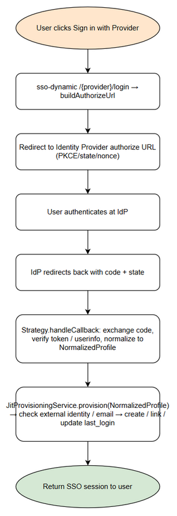

# Functional Specification Document (FSD)

## SA4E-Agents — SA4E-312: [QA/Docs] Multi-provider SSO test planning + documentation

---

## Document Information

| Field | Value |
|-------|-------|
| Jira Ticket | SA4E-312 |
| Title | [QA/Docs] Multi-provider SSO test planning + documentation |
| Author | BA Agent |
| Version | 1.0 |
| Date | 2026-09-22 |
| Status | Draft |
| Related BRD | documents/SA4E-312/BRD.md |

---

## Revision History

| Version | Date | Author | Changes |
|---------|------|--------|---------|
| 1.0 | 2026-09-22 | BA Agent | Initial FSD auto-generated from BRD and code review |

---

## 1. Introduction

### 1.1 Purpose
This FSD specifies functional requirements for QA test planning and documentation update for multi-provider SSO, based on actual code implementation of Strategy pattern, JitProvisioningService, and sso-dynamic registry.

### 1.2 Scope
Scope covers functional description of multi-provider SSO flows for Entra, Google, GitHub; RTM requirements; documentation updates for auth-sso with sequences and config reference.

### 1.3 Definitions & Acronyms

| Term | Definition |
|------|------------|
| SSO | Single Sign-On |
| OIDC | OpenID Connect |
| PKCE | Proof Key for Code Exchange |
| JIT | Just-In-Time provisioning |
| NormalizedProfile | Provider-agnostic user profile |

### 1.4 References

| Document | Location |
|----------|----------|
| BRD | documents/SA4E-312/BRD.md |
| MULTI-PROVIDER-SSO-PLAN | documents/SA4E-262/MULTI-PROVIDER-SSO-PLAN.md |

---

## 2. System Overview

### 2.1 System Context Diagram

System interacts with external Identity Providers: Microsoft Entra, Google, GitHub. Backend exposes /sso/providers, /auth/{provider}/login, /auth/{provider}/callback. Extension renders login buttons.

### 2.2 System Architecture
Components:
- SsoProviderStrategy interface
- SsoStrategyRegistry singleton
- Provider strategies: EntraProviderStrategy, GoogleProviderStrategy, GitHubProviderStrategy
- sso-dynamic routes dispatch via registry
- JitProvisioningService consumes NormalizedProfile
- Database: users, sso_providers

---

## 3. Functional Requirements

### 3.1 Feature: Multi-Provider SSO Strategy Dispatch

**Source:** BRD Story 4, SA4E-307

#### 3.1.1 Description
Strategy abstraction allows adding providers without changing core flow. Registry dispatches to appropriate strategy.

#### 3.1.2 Use Case
**Use Case ID:** UC-01
**Actor:** User / Extension
**Preconditions:** Provider enabled in sso_providers
**Postconditions:** User authenticated or error returned

**Main Flow:**
| Step | Actor | System | Description |
|------|-------|--------|-------------|
| 1 | User | | Clicks Sign in with Provider |
| 2 | | sso-dynamic | GET /sso/providers, returns enabled providers |
| 3 | | sso-dynamic | GET /{provider}/login → buildAuthorizeUrl via strategy |
| 4 | | Provider Strategy | Returns authorize URL |
| 5 | Browser | IdP | User authenticates |
| 6 | IdP | Backend | Redirect with code+state |
| 7 | Strategy | | handleCallback exchange + verify |
| 8 | JitProvisioningService | | Provision/link user |
| 9 | Backend | User | Session created |

**Alternative Flows:**
AF-1 Provider not in registry → return 501 Not Implemented
AF-2 Provider disabled → 404

**Exception Flows:**
EF-1 Invalid state/nonce → reject 401
EF-2 Email not verified → reject 403

#### 3.1.3 Business Rules
| Rule ID | Rule | Source |
|---------|------|--------|
| BR-01 | Strategy must normalize to NormalizedProfile | SA4E-307 |
| BR-02 | JitProvisioningService must not hardcode provider | SA4E-307 |
| BR-03 | Email verified required for JIT/link | MULTI-PROVIDER-SSO-PLAN |

#### 3.1.4 Data Specifications
**Input Data:**
| Field | Type | Required | Validation | Description |
|-------|------|----------|------------|-------------|
| provider | string | Y | in ['entra','google','github'] | Provider type |

**Output Data:**
| Field | Type | Description |
|-------|------|-------------|
| NormalizedProfile | object | provider, externalSubjectId, email, emailVerified, name, groups |

#### 3.1.5 API Contract
**Endpoint:** GET /sso/providers
**Purpose:** List enabled providers
**Output:** providers[]
**Business Error:** Empty list if none enabled

---

### 3.2 Feature: Google SSO OIDC PKCE

**Source:** BRD Story 5, SA4E-308

#### 3.2.1 Description
GoogleProviderStrategy implements OIDC with PKCE S256, nonce, JWKS verification.

#### 3.2.2 Use Case
**Use Case ID:** UC-02
**Actor:** User
**Preconditions:** Google provider configured in sso_providers
**Postconditions:** User logged in via Google

**Main Flow:**
1 buildAuthorizeUrl with client_id, redirect_uri, scope openid email profile, code_challenge, state, nonce
2 User authorizes at accounts.google.com/o/oauth2/v2/auth
3 Callback exchanges code for id_token
4 Verify id_token via Google JWKS, issuer https://accounts.google.com, aud, exp, nonce
5 Normalize sub→externalSubjectId

**Exception Flows:**
EF-1 Invalid nonce → 401
EF-2 email_verified false → 403

#### 3.2.3 Business Rules
| Rule ID | Rule | Source |
|---------|------|--------|
| BR-04 | Google uses PKCE S256 | SA4E-308 |
| BR-05 | Nonce must match | SA4E-308 |

---

### 3.3 Feature: GitHub SSO OAuth2

**Source:** BRD Story 6, SA4E-309

#### 3.3.1 Description
GitHubProviderStrategy implements OAuth2 non-OIDC. No PKCE/nonce. Uses state for CSRF. Fetches /user and /user/emails.

#### 3.3.2 Use Case
**Use Case ID:** UC-03

**Main Flow:**
1 buildAuthorizeUrl to github.com/login/oauth/authorize scope read:user user:email state
2 Callback exchanges code for access_token
3 GET /user, GET /user/emails
4 Select primary verified email
5 Normalize id→externalSubjectId

**Exception Flows:**
EF-1 State mismatch → 401
EF-2 No verified email → 403

#### 3.3.3 Business Rules
| Rule ID | Rule | Source |
|---------|------|--------|
| BR-06 | GitHub does not support PKCE/nonce | SA4E-309 |
| BR-07 | Email verification from /user/emails verified flag | SA4E-309 |

---

### 3.4 Feature: JIT Provisioning

**Source:** Code review JitProvisioningService.ts

#### 3.4.1 Description
Provision new SSO user or link existing user based on external_provider + external_subject_id or email.

#### 3.4.2 Business Rules
- Existing external identity → update last_login
- Email match existing SSO user → link external identity
- Email match LOCAL account → reject auto-link
- Email not verified → reject JIT/link
- Default group grp-viewer

---

## 4. Data Model

### 4.1 Entity Relationship Diagram
Logical entities: users, sso_providers

#### Entity: users
| Attribute | Type | Required | Business Rule | Description |
|-----------|------|----------|---------------|-------------|
| user_id | string | Y | | Primary key |
| email | string | Y | | Normalized lower case |
| external_provider | string | N | | entra/google/github |
| external_subject_id | string | N | | Provider subject |
| account_type | string | Y | | SSO / LOCAL |
| access_group_id | string | Y | | grp-viewer default |

#### Entity: sso_providers
| Attribute | Type | Required | Business Rule | Description |
|-----------|------|----------|---------------|-------------|
| provider_type | string | Y | | entra/google/github |
| client_id | string | Y | | |
| client_secret | string | Y | Masked | |
| redirect_uri | string | Y | | |
| enabled | boolean | Y | | |

---

## 5. Integration Specifications

### 5.1 External System: Google
| Attribute | Value |
|-----------|-------|
| Purpose | OIDC authentication |
| Direction | Inbound |
| Data Format | JWT |
| Frequency | Real-time |

### 5.2 External System: GitHub
| Attribute | Value |
|-----------|-------|
| Purpose | OAuth2 authentication |
| Direction | Inbound |
| Data Format | JSON REST |
| Frequency | Real-time |

---

## 6. Processing Logic

### 6.1 Authorize-Callback-Verify-JIT Flow
**Trigger:** User clicks Sign in
**Processing Steps:**
| Step | Description | Error Handling |
|------|-------------|----------------|
| 1 | buildAuthorizeUrl | Config missing → 400 |
| 2 | Redirect to IdP | |
| 3 | handleCallback | Invalid state/nonce → 401 |
| 4 | Verify token/userinfo | Verification fail → 401 |
| 5 | Normalize profile | Missing email → 400 |
| 6 | JIT provision | Email unverified → 403 |

**Activity Diagram:**

---

## 7. Security Requirements

### 7.1 Authentication & Authorization
- State parameter validated per request
- Nonce validated for OIDC providers
- PKCE code_verifier validated
- Email verified gate enforced

### 7.2 Data Sensitivity
- client_secret classified Confidential
- id_token not logged

---

## 8. Non-Functional Requirements

| Category | Business Requirement | Acceptance Criteria |
|----------|---------------------|---------------------|
| Security | CSRF protection | State mismatch rejects |
| Security | Email verification | Unverified email rejects JIT |

---

## 9. Error Handling

| Scenario | Severity | User Message | Expected Behavior |
|----------|----------|-------------|-------------------|
| invalid_nonce | Critical | Invalid session | Reject login |
| email_not_verified | Warning | Email not verified | Reject link/JIT |
| invalid_state | Critical | CSRF detected | Reject |

---

## 10. Testing Considerations

| ID | Scenario | Input | Expected Output | Priority |
|----|----------|-------|-----------------|----------|
| TC-SSO-01 | Google login success | Valid code | User provisioned | High |
| TC-SSO-02 | GitHub login success | Valid code | User provisioned | High |
| TC-SSO-03 | Invalid nonce | Tampered nonce | 401 | High |
| TC-SSO-04 | Unverified email | email_verified false | 403 | High |

---

## 11. Appendix

### Diagrams

| Diagram | File |
|---------|------|
| Authorize Callback Verify JIT Flow | [authorize_callback_verify_jit.png](diagrams/authorize_callback_verify_jit.png) |

### Change Log from BRD
FSD adds functional details for Strategy dispatch, Google OIDC PKCE, GitHub OAuth2, JIT provisioning based on code review.
