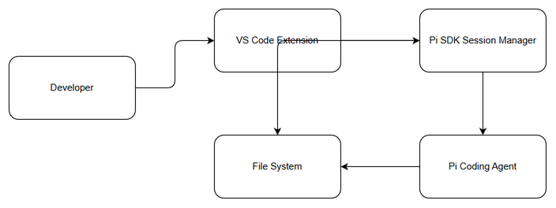
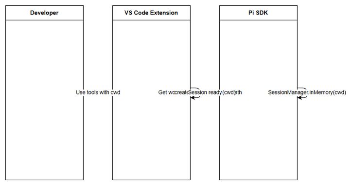

# Functional Specification Document (FSD)

## Pi Coding Agent — SA4E-313: Pass IDE workspace root as cwd to Pi SDK session (fix 'unknown workspace')

---

## Document Information

| Field | Value |
|-------|-------|
| Jira Ticket | SA4E-313 |
| Title | Pass IDE workspace root as cwd to Pi SDK session (fix 'unknown workspace') |
| Author | BA Agent |
| Version | 1.0 |
| Date | 2026-09-24 |
| Status | Draft |
| Related BRD | documents/SA4E-313/BRD.md |

---

## Revision History

| Version | Date | Author | Changes |
|---------|------|--------|---------|
| 1.0 | 2026-09-24 | BA Agent | Initiate document — auto-generated from BRD and Jira tickets |

---

## 1. Introduction

### 1.1 Purpose

This FSD specifies the functional behavior required to pass the IDE workspace root as current working directory to the Pi SDK session, ensuring built-in tools resolve against the correct project and eliminating the 'unknown workspace' prompt.

### 1.2 Scope

The system will automatically detect VS Code workspace root via `workspace.workspaceFolders[0].uri.fsPath` and pass it as `cwd` to `createAgentSession()` and `SessionManager.inMemory(cwd)`. Built-in tools `ls/read/bash/edit/write/grep/find` will resolve relative paths against this cwd. DefaultResourceLoader will auto-discover AGENTS.md/context files walking up from cwd.

Out of scope: changes to Pi SDK core library, multi-root workspace support beyond first folder, sessions created outside VS Code extension.

### 1.3 Definitions & Acronyms

| Term | Definition |
|------|------------|
| cwd | Current working directory passed to Pi SDK |
| Pi SDK | Pi coding agent SDK |
| SessionManager | Pi SDK session manager responsible for tool execution context |

### 1.4 References

| Document | Location |
|----------|----------|
| BRD | documents/SA4E-313/BRD.md |
| Pi SDK docs | https://pi.dev/docs/latest/sdk |

---

## 2. System Overview

### 2.1 System Context Diagram

*[Edit in draw.io](diagrams/system-context.drawio)*

The Pi Coding Agent Extension interacts with VS Code workspace API to obtain workspace root, then initializes Pi SDK session with cwd. The session executes built-in tools against File System and loads project context files.

### 2.2 System Architecture

Extension layer: VS Code extension entry point detects workspace folder.
Session layer: `createAgentSession({ cwd, sessionManager: SessionManager.inMemory(cwd) })`.
Tool layer: Built-in tools resolve paths relative to cwd.
Resource layer: DefaultResourceLoader walks up from cwd to discover steering files.

---

## 3. Functional Requirements

### 3.1 Feature: Pass IDE workspace root as cwd to Pi SDK session

**Source:** BRD Story 1

#### 3.1.1 Description

Automatically use IDE workspace root as current working directory for Pi SDK session so built-in tools operate in correct project without manual path input.

#### 3.1.2 Use Case

**Use Case ID:** UC-1
**Actor:** Developer
**Preconditions:** VS Code opened with at least one workspace folder
**Postconditions:** Pi chatbox operates with workspace-aware cwd

**Main Flow:**

| Step | Actor | System | Description |
|------|-------|--------|-------------|
| 1 | Developer opens VS Code workspace | | Workspace folder available |
| 2 | | Extension | Detect workspace root via workspace.workspaceFolders[0].uri.fsPath |
| 3 | | Extension | Call createAgentSession({ cwd, sessionManager: SessionManager.inMemory(cwd) }) |
| 4 | | Pi SDK | Initialize session with provided cwd |
| 5 | | Tools | Resolve ls/read/bash/edit/write/grep/find against cwd |
| 6 | | DefaultResourceLoader | Walk up from cwd to discover AGENTS.md/context files |
| 7 | Developer | Chatbox | Interact without workspace path prompt |

**Alternative Flows:**

| ID | Condition | Steps |
|----|-----------|-------|
| AF-1 | workspaceFolders undefined | Log warning, fallback to process.cwd(), notify user |

**Exception Flows:**

| ID | Condition | Steps |
|----|-----------|-------|
| EF-1 | Invalid path | Do not create session, surface error to user |
| EF-2 | workspaceFolders empty | Log warning, fallback to process.cwd() |

#### 3.1.3 Business Rules

| Rule ID | Rule | Source |
|---------|------|--------|
| BR-1 | createAgentSession() must receive cwd = active IDE workspace root | BRD 2.3 |
| BR-2 | SessionManager must be constructed with same cwd via SessionManager.inMemory(cwd) | BRD 2.3 |
| BR-3 | Built-in tools must resolve against workspace root | BRD 2.3 |
| BR-4 | Chatbox must not prompt for workspace path when cwd is set | BRD 2.3 |
| BR-5 | AGENTS.md / context files from workspace root must be auto-loaded | BRD 2.3 |
| BR-6 | cwd must be valid absolute filesystem path | BRD Validation |
| BR-7 | workspaceFolders must exist and have at least one entry | BRD Validation |

#### 3.1.4 Data Specifications

**Input Data:**

| Field | Type | Required | Validation | Description |
|-------|------|----------|------------|-------------|
| cwd | string | Y | Absolute path | Absolute path to IDE workspace root |
| workspaceFolders | array | Y | Length >=1 | VS Code workspace folders |

**Output Data:**

| Field | Type | Description |
|-------|------|-------------|
| session | object | Initialized Pi SDK session with cwd |
| contextFiles | array | Auto-discovered AGENTS.md files |

#### 3.1.5 UI Specifications

**Screen: Pi Chatbox**

| No. | Element | Type | Required | Behavior | Validation |
|-----|---------|------|----------|----------|------------|
| 1 | Chatbox input | Text Input | Y | User input area | No change |
| 2 | Agent responses | Text Area | Y | Displays agent output | Should not contain workspace path prompt |

#### 3.1.6 API Contract (Functional View)

**Endpoint:** `createAgentSession({ cwd, tools, sessionManager })`
**Purpose:** Initialize Pi SDK session with workspace-aware cwd

**Input Parameters:**

| Parameter | Type | Required | Business Rule | Description |
|-----------|------|----------|---------------|-------------|
| cwd | string | Y | BR-6 | Absolute workspace root path |
| sessionManager | SessionManager | Y | BR-2 | In-memory session manager with cwd |

**Output Data:**

| Field | Type | Description |
|-------|------|-------------|
| session | object | Active agent session |

**Business Error Scenarios:**

| Scenario | User Message | Trigger Condition |
|----------|-------------|-------------------|
| Workspace not detected | Workspace not found, using fallback directory | workspaceFolders undefined |
| Invalid path | Invalid workspace path | cwd not absolute |

---

## 4. Data Model

> No persistent data model changes. cwd is runtime parameter.

### 4.1 Entity Relationship Diagram

N/A — runtime context only.

---

## 5. Integration Specifications

### 5.1 External System: VS Code Workspace API

| Attribute | Value |
|-----------|-------|
| Purpose | Retrieve IDE workspace root |
| Direction | Inbound |
| Data Format | URI fsPath |
| Frequency | On-demand at session start |

**Data Exchange:**

| Our Data | External Data | Direction | Business Rule |
|----------|--------------|-----------|---------------|
| cwd | workspaceFolders[0].uri.fsPath | Receive | BR-1 |

### 5.2 External System: Pi SDK

| Attribute | Value |
|-----------|-------|
| Purpose | Session creation with cwd |
| Direction | Outbound |
| Data Format | JSON config |
| Frequency | Per session |

---

## 6. Processing Logic

### 6.1 Workspace Detection and Session Initialization

**Trigger:** VS Code extension activation with active workspace
**Schedule:** On-demand
**Input:** workspace.workspaceFolders
**Output:** Initialized agent session with cwd

**Processing Steps:**

| Step | Description | Error Handling |
|------|-------------|----------------|
| 1 | Get workspaceFolders[0].uri.fsPath | If undefined, log warning and fallback |
| 2 | Validate absolute path | If invalid, surface error |
| 3 | Create SessionManager.inMemory(cwd) | Propagate SDK errors |
| 4 | Call createAgentSession with cwd | Log failure |
| 5 | Load DefaultResourceLoader from cwd | Continue without context if missing |

**Activity Diagram:**

---

## 7. Security Requirements

### 7.1 Authentication & Authorization

Not applicable — local extension operation.

### 7.2 Data Sensitivity Classification

| Data Type | Classification | Business Requirement |
|-----------|---------------|---------------------|
| cwd path | Internal | Must be within allowed workspace |

### 7.3 Audit Trail

| Event | Logged Fields | Retention | Business Reason |
|-------|--------------|-----------|-----------------|
| Session created with cwd | cwd, timestamp | 30 days | Debugging |

---

## 8. Non-Functional Requirements

| Category | Business Requirement | Acceptance Criteria |
|----------|---------------------|---------------------|
| Performance | Negligible overhead | cwd resolution synchronous < 50ms |
| Security | Path sanitization | cwd validated as absolute |
| Availability | No downtime | Client-side update |

---

## 9. Error Handling (User-Facing)

### 9.1 Error Scenarios

| Scenario | Severity | User Message | Expected Behavior |
|----------|----------|-------------|-------------------|
| workspaceFolders undefined | Warning | Workspace not detected, using fallback | Log warning, continue |
| Invalid path | Error | Invalid workspace path | Do not create session |

---

## 10. Testing Considerations

### 10.1 Test Scenarios

| ID | Scenario | Input | Expected Output | Priority |
|----|----------|-------|-----------------|----------|
| TC-1 | Valid workspace | workspaceFolders with path | Session created with cwd | High |
| TC-2 | No workspace | workspaceFolders undefined | Fallback with warning | High |
| TC-3 | Invalid path | cwd relative | Error surfaced | Medium |

---

## 11. Appendix

### Diagrams

| Diagram | File |
|---------|------|
| System Context | [system-context.png](diagrams/system-context.png) |
| Sequence | [sequence.png](diagrams/sequence.png) |
| State | [state.png](diagrams/state.png) |

### Change Log from BRD

FSD clarifies API contract for createAgentSession and session manager initialization, and documents error handling for missing workspace.
