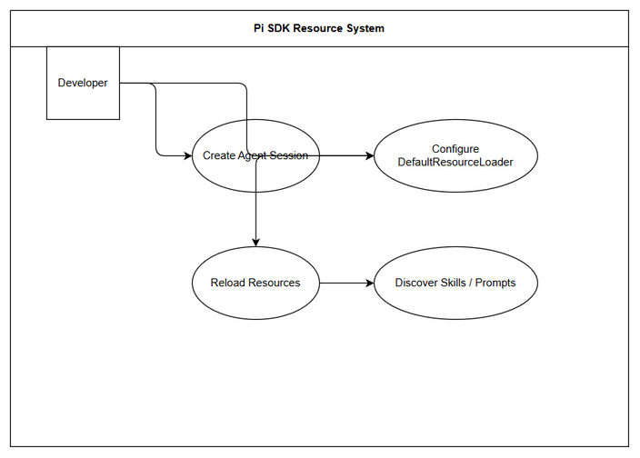

# Business Requirements Document (BRD)

## SDLC Agents 4 Enterprise — SA4E-314: Wire up DefaultResourceLoader (cwd + agentDir) for resource discovery

---

## Document Information

| Field | Value |
|-------|-------|
| Jira Ticket | SA4E-314 |
| Title | Wire up DefaultResourceLoader (cwd + agentDir) for resource discovery |
| Author | BA Agent |
| Version | 1.0 |
| Date | 2026-09-24 |
| Status | Draft |

---

## Author Tracking

| Role | Name - Position | Responsibility |
|------|-----------------|----------------|
| Author | BA Agent – Business Analyst | Create document |
| Peer Reviewer | Duc Nguyen Minh – Creator | Review document |

---

## Revision History

| Version | Date | Author | Changes |
|---------|------|--------|---------|
| 1.0 | 2026-09-24 | BA Agent | Initiate document — auto-generated from Jira ticket SA4E-314 and linked tickets |

---

## Sign-Off

| Name | Signature and date |
|------|--------------------|
| | ☐ I agree and confirm all criteria on this BRD as expected requirements |
| | ☐ I agree and confirm all criteria on this BRD as expected requirements |

---

## 1. Introduction

### 1.1 Scope

Thiết lập DefaultResourceLoader làm nền tảng để Pi SDK tự động discover skills, extensions, prompt templates và context files của project SDLC Agents. Ticket này là nền tảng — 3 ticket còn lại (custom tools, system prompt/skills, prompt templates/settings) build trên loader này.

Yêu cầu cụ thể:
- Construct DefaultResourceLoader tường minh với cwd (workspace root, xem SA4E-313) và agentDir để kiểm soát discovery và cho phép override.
- Gọi loader.reload() trước khi tạo session.
- Session được tạo với resourceLoader tường minh và diagnostics được log.

Discovery mặc định: `<cwd>/.pi/skills`, `<cwd>/.pi/extensions`, `<cwd>/.pi/prompts`, AGENTS.md (walk up từ cwd) và `~/.pi/agent/...`.

### 1.2 Out of Scope

- Triển khai custom tools, system prompt/skills, prompt templates/settings — thuộc ticket khác.
- Thay đổi logic discovery core của Pi SDK.
- Triển khai UI cho resource discovery.

### 1.3 Preliminary Requirement

- SA4E-313 phải hoàn thành để cung cấp cwd workspace root đúng.
- Pi SDK `@earendil-works/pi-coding-agent` đã cài đặt và import được.
- Workspace có cấu trúc `.pi/skills`, `.pi/extensions`, `.pi/prompts`, AGENTS.md.

---

## 2. Business Requirements

### 2.1 High Level Process Map

*[Edit in draw.io](diagrams/use-case.drawio)*

*[Edit in draw.io](diagrams/business-flow.drawio)*

Process tổng quát: Developer khởi tạo agent session → Hệ thống xác định cwd và agentDir → Tạo DefaultResourceLoader với tham số → Reload loader để discover resources → Tạo session với resourceLoader → Trả về session sẵn sàng sử dụng.

### 2.2 List of User Stories / Use Cases

| # | Story / Use Case / Epic | Priority | Source Ticket |
|---|-------------------------|----------|---------------|
| 1 | As a Developer, I want to create an agent session with explicit DefaultResourceLoader configured with cwd and agentDir so that resource discovery is deterministic and controllable | MUST HAVE | SA4E-314 |
| 2 | As a System, I want loader.reload() to be invoked before session creation so that discovered skills, prompts, extensions are up-to-date | MUST HAVE | SA4E-314 |
| 3 | As a Developer, I want diagnostics/warnings from loader to be logged so that discovery issues are visible | SHOULD HAVE | SA4E-314 |

---

### 2.3 Details of User Stories

---

#### Business Flow

**Step 1:** Xác định workspace root cwd từ VS Code workspaceFolders hoặc cấu hình.
**Step 2:** Lấy agentDir qua getAgentDir().
**Step 3:** Khởi tạo DefaultResourceLoader với { cwd, agentDir }.
**Step 4:** Gọi loader.reload() để discover resources.
**Step 5:** Tạo session qua createAgentSession với resourceLoader và sessionManager.
**Step 6:** Log diagnostics/warnings từ loader.
**Step 7:** Trả về session đã cấu hình.

> **Note:** Nếu cwd không hợp lệ, loader sẽ fallback và phát warning. Cần đảm bảo cwd được resolve đúng theo SA4E-313.

---

#### STORY 1: Wire up DefaultResourceLoader with cwd + agentDir

> As a Developer, I want to create an agent session with explicit DefaultResourceLoader configured with cwd and agentDir so that resource discovery is deterministic and controllable

**Requirement Details:**

1. Sử dụng DefaultResourceLoader từ `@earendil-works/pi-coding-agent`.
2. Truyền cwd là workspace root, agentDir từ getAgentDir().
3. Session được tạo với resourceLoader tường minh.

**Data Fields (if applicable):**

| Field | Type | Required | Description | Example |
|-------|------|----------|-------------|---------|
| cwd | string | Yes | Workspace root path | C:\Users\ASUS\orca\workspaces\SDLC-Agents-4-Enterprise\SA4E-254 |
| agentDir | string | Yes | Agent directory path | ~/.pi/agent |
| resourceLoader | DefaultResourceLoader | Yes | Loader instance | new DefaultResourceLoader({cwd, agentDir}) |

**Acceptance Criteria:**

1. Session được tạo với resourceLoader tường minh (DefaultResourceLoader)
2. cwd + agentDir được truyền đúng
3. loader.reload() được gọi trước khi tạo session
4. loader.getSkills() / getPrompts() / getAgentsFiles() trả về resource discover từ workspace
5. Diagnostics/warnings từ loader được log ra

**UI Specifications (if applicable):**

| No. | Name | Type | Required | Description | Note |
|-----|------|------|----------|-------------|------|
| 1 | N/A | N/A | No | No UI component | Backend configuration only |

**Validation Rules (if applicable):**

- cwd phải là đường dẫn tồn tại và là thư mục.
- agentDir phải resolve được.

**Error Handling (if applicable):**

- cwd invalid: Log warning và fallback.
- loader.reload() fail: Throw error và abort session creation.

---

#### STORY 2: Reload loader before session creation

> As a System, I want loader.reload() to be invoked before session creation so that discovered skills, prompts, extensions are up-to-date

**Requirement Details:**

1. Đảm bảo loader.reload() được gọi đồng bộ trước createAgentSession.
2. Không tạo session nếu reload thất bại.

**Acceptance Criteria:**

1. loader.reload() được gọi trước khi tạo session.
2. Resources được discover mới nhất từ workspace.

**Validation Rules:**

- reload must complete without exception.

**Error Handling:**

- Reload error: Log error và abort.

---

#### STORY 3: Log diagnostics/warnings

> As a Developer, I want diagnostics/warnings from loader to be logged so that discovery issues are visible

**Requirement Details:**

1. Capture diagnostics/warnings từ DefaultResourceLoader.
2. Log ra console/logger với mức appropriate.

**Acceptance Criteria:**

1. Diagnostics/warnings từ loader được log ra.

---

## 3. Dependencies

| Dependency | Type | Related Ticket | Description |
|------------|------|----------------|-------------|
| Workspace root cwd | System | SA4E-313 | Cần cwd đúng để discovery |
| Pi SDK | External | N/A | @earendil-works/pi-coding-agent |
| Parent Epic | Epic | SA4E-289 | Migrate LangGraph Workflow Engine to Pi SDK (Option C) |

---

## 4. Stakeholders

| Role | Name / Team | Responsibility | Source |
|------|-------------|----------------|--------|
| Creator/Reporter | Duc Nguyen Minh | Yêu cầu và review | SA4E-314 |
| Business Analyst | BA Agent | Tạo BRD | SA4E-314 |
| Developer | TBD | Triển khai | SA4E-289 |

---

## 5. Risks and Assumptions

### 5.1 Risks

| Risk | Impact | Likelihood | Mitigation |
|------|--------|------------|------------|
| cwd không chính xác | High | Medium | Phụ thuộc SA4E-313, validate path tồn tại |
| Pi SDK API thay đổi | Medium | Low | Theo dõi release notes, pin version |

### 5.2 Assumptions

- SA4E-313 cung cấp cwd đúng.
- Pi SDK hỗ trợ DefaultResourceLoader với tham số cwd và agentDir.
- Workspace có cấu trúc `.pi/*` chuẩn.

---

## 6. Non-Functional Requirements

| Category | Requirement | Details |
|----------|-------------|---------|
| Performance | Resource discovery | Reload nên hoàn thành trong < 2s cho workspace trung bình |
| Security | Path traversal | Loader chỉ discover trong cwd và agentDir cho phép |
| Scalability | N/A | Không yêu cầu đặc biệt |
| Availability | N/A | N/A |

> No specific non-functional requirements identified. To be confirmed with technical team.

---

## 7. Related Tickets

| Ticket Key | Summary | Status | Type | Relationship |
|------------|---------|--------|------|--------------|
| SA4E-314 | Wire up DefaultResourceLoader (cwd + agentDir) for resource discovery | In Progress | Task | Main ticket |
| SA4E-289 | Migrate LangGraph Workflow Engine to Pi SDK (Option C) | In Progress | Epic | Parent |
| SA4E-313 | [Reference] workspace cwd | ? | Task | Dependency |

---

## 8. Appendix

### Glossary

| Term | Definition |
|------|------------|
| DefaultResourceLoader | Lớp của Pi SDK để discover skills, extensions, prompts, context files |
| cwd | Current working directory, workspace root |
| agentDir | Directory chứa agent resources người dùng |

### Reference Documents

| Document | Link / Location |
|----------|-----------------|
| Pi SDK Docs | https://pi.dev/docs/latest/sdk |
| Example SDK | examples/sdk/04-skills.ts, 06-extensions.ts, 07-context-files.ts, 08-prompt-templates.ts |
