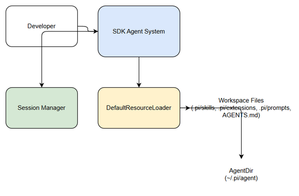
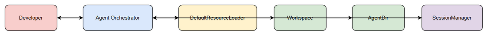

# Functional Specification Document (FSD)

## SDLC Agents 4 Enterprise — SA4E-314: Wire up DefaultResourceLoader (cwd + agentDir) for resource discovery

---

## Document Information

| Field | Value |
|-------|-------|
| Jira Ticket | SA4E-314 |
| Title | Wire up DefaultResourceLoader (cwd + agentDir) for resource discovery |
| Author | BA Agent |
| Version | 1.0 |
| Date | 2026-09-24 |
| Status | Draft |
| Related BRD | documents/SA4E-314/BRD.md |

---

## Revision History

| Version | Date | Author | Changes |
|---------|------|--------|---------|
| 1.0 | 2026-09-24 | BA Agent | Initiate document — auto-generated from BRD and Jira tickets |

---

## 1. Introduction

### 1.1 Purpose

This FSD defines the functional behavior for wiring up DefaultResourceLoader from `@earendil-works/pi-coding-agent` with explicit `cwd` and `agentDir` parameters, invoking `loader.reload()` before session creation, and logging diagnostics for deterministic resource discovery in SDLC Agents 4 Enterprise.

### 1.2 Scope

In scope: construction of DefaultResourceLoader with workspace root `cwd` (from SA4E-313) and `agentDir`, mandatory `reload()` before session creation, diagnostics logging, and session creation with explicit resource loader. Out of scope: custom tools, system prompt/skills, prompt templates/settings — handled by separate tickets. Reference BRD Section 1.1-1.2.

### 1.3 Definitions & Acronyms

| Term | Definition |
|------|------------|
| DefaultResourceLoader | Lớp của Pi SDK để discover skills, extensions, prompts, context files |
| cwd | Current working directory, workspace root |
| agentDir | Directory chứa agent resources người dùng |
| Pi SDK | `@earendil-works/pi-coding-agent` |

### 1.4 References

| Document | Location |
|----------|----------|
| BRD | documents/SA4E-314/BRD.md |
| Pi SDK Docs | https://pi.dev/docs/latest/sdk |
| SA4E-313 | Workspace root cwd reference |

---

## 2. System Overview

### 2.1 System Context Diagram

*[Edit in draw.io](diagrams/system-context.drawio)*

The SDK Agent System interacts with Developer, DefaultResourceLoader, Workspace Files (`.pi/skills`, `.pi/extensions`, `.pi/prompts`, AGENTS.md), AgentDir (`~/.pi/agent`), and Session Manager. Loader discovers resources from workspace and agent directory; session is created with explicit loader.

### 2.2 System Architecture

High-level architecture consists of:
- **Agent Orchestrator** — initiates session creation, resolves cwd/agentDir
- **DefaultResourceLoader** — Pi SDK component for resource discovery
- **Workspace / AgentDir** — source of skills, extensions, prompts, context files
- **Session Manager** — creates agent session with injected resource loader
- **Diagnostics Logger** — captures warnings/errors from loader

---

## 3. Functional Requirements

### 3.1 Feature: Wire up DefaultResourceLoader with cwd + agentDir

**Source:** BRD Story 1 — As a Developer, I want to create an agent session with explicit DefaultResourceLoader configured with cwd and agentDir...

#### 3.1.1 Description

Create DefaultResourceLoader instance using workspace root `cwd` and `agentDir` obtained via `getAgentDir()`. Ensure session is created with explicit resource loader for deterministic discovery.

#### 3.1.2 Use Case

**Use Case ID:** UC-1
**Actor:** Developer
**Preconditions:** SA4E-313 completed, Pi SDK installed, workspace contains `.pi/*` structure
**Postconditions:** Agent session created with explicit DefaultResourceLoader

**Main Flow:**

| Step | Actor | System | Description |
|------|-------|--------|-------------|
| 1 | Developer | | Requests agent session creation |
| 2 | | Agent Orchestrator | Resolve cwd from workspaceFolders |
| 3 | | Agent Orchestrator | Get agentDir via getAgentDir() |
| 4 | | Agent Orchestrator | Instantiate DefaultResourceLoader({cwd, agentDir}) |
| 5 | | Agent Orchestrator | Call loader.reload() |
| 6 | | Session Manager | Create session with resourceLoader |
| 7 | | Agent Orchestrator | Log diagnostics/warnings |
| 8 | Agent Orchestrator | Developer | Return configured session |

**Alternative Flows:**

| ID | Condition | Steps |
|----|-----------|-------|
| AF-1 | cwd invalid | Log warning, fallback to default cwd, continue |

**Exception Flows:**

| ID | Condition | Steps |
|----|-----------|-------|
| EF-1 | loader.reload() fails | Log error, abort session creation, throw error |
| EF-2 | cwd does not exist | Log warning, use fallback, notify developer |

#### 3.1.3 Business Rules

| Rule ID | Rule | Source |
|---------|------|--------|
| BR-1 | cwd must be existing directory path | BRD §2.3 Validation |
| BR-2 | agentDir must resolve to valid path | BRD §2.3 Validation |
| BR-3 | session must be created with explicit DefaultResourceLoader | BRD Story 1 AC1 |
| BR-4 | loader.reload() must be called before session creation | BRD Story 2 |

#### 3.1.4 Data Specifications

**Input Data:**

| Field | Type | Required | Validation | Description |
|-------|------|----------|------------|-------------|
| cwd | string | Y | Path exists, is directory | Workspace root path |
| agentDir | string | Y | Path resolvable | Agent directory path |
| resourceLoader | DefaultResourceLoader | Y | Instance of DefaultResourceLoader | Loader instance |

**Output Data:**

| Field | Type | Description |
|-------|------|-------------|
| session | AgentSession | Configured agent session with resource loader |
| diagnostics | array | Warnings/errors from loader |

#### 3.1.5 UI Specifications

No UI component. Backend configuration only.

#### 3.1.6 API Contract (Functional View)

> Note: Technical details specified in TDD.

**Purpose:** Create agent session with explicit resource loader

**Input Parameters:**

| Parameter | Type | Required | Business Rule | Description |
|-----------|------|----------|---------------|-------------|
| cwd | string | Y | BR-1 | Workspace root |
| agentDir | string | Y | BR-2 | Agent directory |

**Output Data:**

| Field | Type | Description |
|-------|------|-------------|
| session | object | Agent session object |

**Business Error Scenarios:**

| Scenario | User Message | Trigger Condition |
|----------|-------------|-------------------|
| Invalid cwd | Workspace root not found | cwd path does not exist |
| Reload failure | Resource discovery failed | loader.reload() throws |

---

### 3.2 Feature: Reload loader before session creation

**Source:** BRD Story 2

#### 3.2.1 Description

Ensure `loader.reload()` is invoked synchronously before `createAgentSession` to guarantee up-to-date discovery of skills, prompts, extensions.

#### 3.2.2 Use Case

**Use Case ID:** UC-2
**Actor:** System
**Preconditions:** DefaultResourceLoader instantiated
**Postconditions:** Resources discovered and ready for session

**Main Flow:**

| Step | Actor | System | Description |
|------|-------|--------|-------------|
| 1 | | Agent Orchestrator | Call loader.reload() |
| 2 | | DefaultResourceLoader | Discover .pi/* and agentDir resources |
| 3 | | Agent Orchestrator | Verify reload success |
| 4 | | Agent Orchestrator | Proceed to session creation |

**Exception Flows:**

| ID | Condition | Steps |
|----|-----------|-------|
| EF-1 | Reload exception | Log error, abort session creation |

#### 3.2.3 Business Rules

| Rule ID | Rule | Source |
|---------|------|--------|
| BR-5 | Reload must complete without exception before session creation | BRD Story 2 |

#### 3.2.4 Data Specifications

**Input Data:**

| Field | Type | Required | Validation | Description |
|-------|------|----------|------------|-------------|
| resourceLoader | DefaultResourceLoader | Y | Instance | Loader to reload |

**Output Data:**

| Field | Type | Description |
|-------|------|-------------|
| discoveredSkills | array | Skills discovered |
| discoveredPrompts | array | Prompts discovered |

---

### 3.3 Feature: Log diagnostics/warnings

**Source:** BRD Story 3

#### 3.3.1 Description

Capture and log diagnostics/warnings emitted by DefaultResourceLoader for visibility into discovery issues.

#### 3.3.2 Use Case

**Use Case ID:** UC-3
**Actor:** Developer
**Preconditions:** Loader instantiated and reloaded
**Postconditions:** Diagnostics logged to console/logger

**Main Flow:**

| Step | Actor | System | Description |
|------|-------|--------|-------------|
| 1 | | DefaultResourceLoader | Emit diagnostics/warnings |
| 2 | | Agent Orchestrator | Capture diagnostics |
| 3 | | Diagnostics Logger | Log with appropriate level |

---

## 4. Data Model

> Note: Logical data model only. Physical implementation in TDD.

No persistent database entities introduced. Resource discovery is in-memory.

### 4.1 Entity Relationship Diagram

N/A — No relational data model for this feature.

---

## 5. Integration Specifications

### 5.1 External System: Pi SDK @earendil-works/pi-coding-agent

| Attribute | Value |
|-----------|-------|
| Purpose | Resource discovery and agent session management |
| Direction | Inbound/Outbound |
| Data Format | JS/TS objects |
| Frequency | On-demand per session creation |

**Data Exchange:**

| Our Data | External Data | Direction | Business Rule |
|----------|--------------|-----------|---------------|
| cwd, agentDir | - | Send | BR-1, BR-2 |
| - | discovered resources | Receive | - |

---

## 6. Processing Logic

### 6.1 Session Creation with Resource Loader

**Trigger:** Developer requests agent session
**Input:** cwd, agentDir
**Output:** Agent session with resource loader

**Processing Steps:**

| Step | Description | Error Handling |
|------|-------------|----------------|
| 1 | Resolve cwd | Log warning if invalid, fallback |
| 2 | Get agentDir | Throw if unresolved |
| 3 | Instantiate DefaultResourceLoader | Throw if construction fails |
| 4 | Call loader.reload() | Abort on exception |
| 5 | Create session via createAgentSession | Abort on failure |
| 6 | Log diagnostics | Continue regardless |

**Activity Diagram:**

---

## 7. Security Requirements

### 7.1 Authentication & Authorization

No specific auth changes. Existing developer session context used.

### 7.2 Data Sensitivity Classification

| Data Type | Classification | Business Requirement |
|-----------|---------------|---------------------|
| Workspace paths | Internal | Path traversal prevention |

### 7.3 Audit Trail

| Event | Logged Fields | Retention | Business Reason |
|-------|--------------|-----------|-----------------|
| Session created | cwd, agentDir, timestamp | 30 days | Traceability |
| Loader warning | message, path | 30 days | Discovery issues |

---

## 8. Non-Functional Requirements

| Category | Business Requirement | Acceptance Criteria |
|----------|---------------------|---------------------|
| Performance | Resource discovery | Reload < 2s for average workspace |
| Security | Path traversal | Loader only discovers within cwd and agentDir |
| Availability | N/A | - |

---

## 9. Error Handling (User-Facing)

### 9.1 Error Scenarios

| Scenario | Severity | User Message | Expected Behavior |
|----------|----------|-------------|-------------------|
| Invalid cwd | Warning | Workspace root not found, using fallback | Log warning, continue |
| Reload failure | Critical | Resource discovery failed | Abort session creation, show error |
| Missing Pi SDK | Critical | Pi SDK not installed | Prevent session creation |

---

## 10. Testing Considerations

### 10.1 Test Scenarios

| ID | Scenario | Input | Expected Output | Priority |
|----|----------|-------|-----------------|----------|
| TC-1 | Valid cwd/agentDir | Existing paths | Session created with loader | High |
| TC-2 | Invalid cwd | Non-existent path | Warning logged, fallback used | Medium |
| TC-3 | Reload failure | Mock loader error | Error logged, session aborted | High |
| TC-4 | Diagnostics logging | Loader emits warnings | Warnings appear in logs | Medium |

---

## 11. Appendix

### Diagrams

| Diagram | File |
|---------|------|
| System Context | [system-context.png](diagrams/system-context.png) |
| Sequence | [sequence.png](diagrams/sequence.png) |
| State | [state.png](diagrams/state.png) |

### Change Log from BRD

FSD adds functional use cases, business rules, data specifications, integration specs, processing logic, and diagrams derived from BRD requirements. No deviation from BRD scope.

---

*Document generated from BRD SA4E-314 — Version 1.0*
