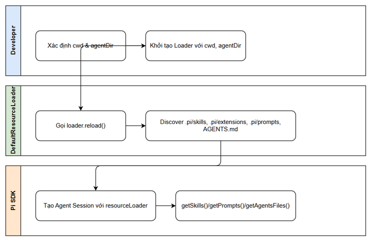
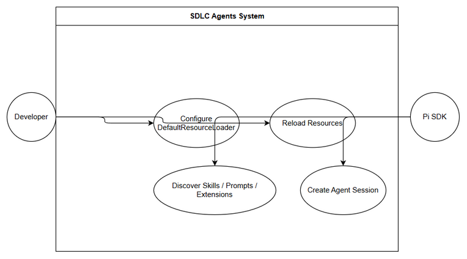

# Business Requirements Document (BRD)

## SA4E-315 — Wire up DefaultResourceLoader (cwd + agentDir) for resource discovery

---

## Document Information

| Field | Value |
|-------|-------|
| Jira Ticket | SA4E-315 |
| Title | Wire up DefaultResourceLoader (cwd + agentDir) for resource discovery |
| Author | BA Agent |
| Version | 1.0 |
| Date | 2026-09-24 |
| Status | Draft |

---

## Author Tracking

| Role | Name - Position | Responsibility |
|------|-----------------|----------------|
| Author | BA Agent | Create document |
| Peer Reviewer | BA Agent | Review document |

---

## Revision History

| Version | Date | Author | Changes |
|---------|------|--------|---------|
| 1.0 | 2026-09-24 | BA Agent | Initiate document — auto-generated from Jira ticket SA4E-315 and linked tickets |

---

## Sign-Off

| Name | Signature and date |
|------|--------------------|
| | ☐ Tôi xác nhận và đồng ý tất cả tiêu chí trong BRD này là yêu cầu mong đợi |
| | ☐ Tôi xác nhận và đồng ý tất cả tiêu chí trong BRD này là yêu cầu mong đợi |

---

## 1. Giới thiệu

### 1.1 Phạm vi

Thiết lập DefaultResourceLoader làm nền tảng để Pi SDK tự động discover skills, extensions, prompt templates và context files của project SDLC Agents. Ticket này là ticket nền – 3 ticket con còn lại xây dựng trên loader này.

Thực hiện việc khởi tạo DefaultResourceLoader một cách tường minh với tham số cwd (workspace root, tham khảo SA4E-313) và agentDir để kiểm soát quá trình discovery và cho phép override.

### 1.2 Ngoài phạm vi

- Không bao gồm việc phát triển Pi SDK hoặc thay đổi logic discovery bên trong thư viện.
- Không bao gồm việc triển khai UI người dùng cuối.
- Không bao gồm việc migrate dữ liệu lịch sử.

### 1.3 Yêu cầu sơ bộ

- Workspace root đã được xác định (SA4E-313).
- Pi SDK đã được cài đặt và khả dụng trong project.
- Agent directory có thể lấy qua `getAgentDir()`.

---

## 2. Yêu cầu nghiệp vụ

### 2.1 Sơ đồ quy trình cấp cao

Quy trình khởi tạo session với Resource Loader tường minh:

1. Xác định cwd và agentDir
2. Tạo instance DefaultResourceLoader với cwd + agentDir
3. Gọi loader.reload()
4. Tạo Agent Session với resourceLoader được truyền vào
5. Sử dụng loader.getSkills()/getPrompts()/getAgentsFiles() để truy xuất tài nguyên

*[Edit in draw.io](diagrams/business-flow.drawio)*

*[Edit in draw.io](diagrams/use-case.drawio)*

### 2.2 Danh sách User Stories / Use Cases

| # | Story / Use Case / Epic | Priority | Source Ticket |
|---|-------------------------|----------|---------------|
| 1 | Là Developer, tôi muốn cấu hình DefaultResourceLoader tường minh với cwd và agentDir để Pi SDK discover tài nguyên dự án một cách có kiểm soát | MUST HAVE | SA4E-315 |
| 2 | Là Hệ thống, tôi muốn reload tài nguyên từ workspace để đảm bảo dữ liệu mới nhất được sử dụng | MUST HAVE | SA4E-315 |

---

### 2.3 Chi tiết User Stories

---

#### Business Flow

**Bước 1:** Xác định `cwd` là workspace root và lấy `agentDir` qua `getAgentDir()`

**Bước 2:** Khởi tạo `DefaultResourceLoader({ cwd, agentDir: getAgentDir() })`

**Bước 3:** Gọi `await loader.reload()` để tải tài nguyên

**Bước 4:** Tạo session bằng `createAgentSession({ resourceLoader: loader, sessionManager: SessionManager.inMemory(cwd) })`

**Bước 5:** Truy xuất tài nguyên qua `loader.getSkills()`, `loader.getPrompts()`, `loader.getAgentsFiles()`

**Bước 6:** Ghi log diagnostics/warnings từ loader

> **Lưu ý:** Discovery mặc định bao gồm `<cwd>/.pi/skills`, `<cwd>/.pi/extensions`, `<cwd>/.pi/prompts`, `AGENTS.md` (walk up từ cwd) và `~/.pi/agent/...`

---

#### STORY 1: Cấu hình DefaultResourceLoader tường minh

> Là Developer, tôi muốn cấu hình DefaultResourceLoader tường minh với cwd và agentDir để Pi SDK discover tài nguyên dự án một cách có kiểm soát

**Requirement Details:**

1. Session được tạo với resourceLoader tường minh là DefaultResourceLoader
2. cwd và agentDir được truyền đúng vào constructor
3. loader.reload() được gọi trước khi tạo session
4. loader.getSkills() / getPrompts() / getAgentsFiles() trả về resource discover từ workspace
5. Diagnostics/warnings từ loader được log ra

**Data Fields (if applicable):**

| Field | Type | Required | Description | Example |
|-------|------|----------|-------------|---------|
| cwd | string | Yes | Workspace root directory | C:\Users\ASUS\... |
| agentDir | string | Yes | Agent directory path | ~/.pi/agent/... |

**Acceptance Criteria:**

1. Session được tạo với resourceLoader tường minh (DefaultResourceLoader)
2. cwd + agentDir được truyền đúng
3. loader.reload() được gọi trước khi tạo session
4. loader.getSkills() / getPrompts() / getAgentsFiles() trả về resource discover từ workspace
5. Diagnostics/warnings từ loader được log ra

**UI Specifications (if applicable):**

Không áp dụng cho ticket này.

**Validation Rules (if applicable):**

- cwd phải tồn tại và là thư mục hợp lệ
- agentDir phải tồn tại và là thư mục hợp lệ

**Error Handling (if applicable):**

- cwd không tồn tại: Log warning và fallback về mặc định
- agentDir không tồn tại: Log warning

---

## 3. Dependencies

| Dependency | Type | Related Ticket | Description |
|------------|------|----------------|-------------|
| Workspace root determination | System | SA4E-313 | cwd cần được xác định trước |
| Pi SDK | External | N/A | Thư viện @earendil-works/pi-coding-agent |
| Parent Epic | Epic | SA4E-289 | Migrate LangGraph Workflow Engine to Pi SDK (Option C) |

---

## 4. Stakeholders

| Role | Name / Team | Responsibility | Source |
|------|-------------|----------------|--------|
| Reporter | Duc Nguyen Minh | Yêu cầu tính năng | SA4E-315 |
| Parent Epic Owner | SA4E-289 Team | Giám sát tiến độ | SA4E-289 |

---

## 5. Rủi ro và Giả định

### 5.1 Rủi ro

| Risk | Impact | Likelihood | Mitigation |
|------|--------|------------|------------|
| Pi SDK thay đổi API DefaultResourceLoader | High | Medium | Theo dõi release notes và cập nhật sớm |
| Workspace root không xác định chính xác | Medium | Low | Tham chiếu SA4E-313 và kiểm tra tự động |

### 5.2 Assumptions

- Pi SDK version hiện tại hỗ trợ DefaultResourceLoader với tham số cwd và agentDir
- Cấu trúc thư mục .pi/skills, .pi/extensions, .pi/prompts tồn tại trong workspace

---

## 6. Yêu cầu phi chức năng

| Category | Requirement | Details |
|----------|-------------|---------|
| Performance | N/A | Không có yêu cầu cụ thể |
| Security | N/A | Không có yêu cầu cụ thể |
| Scalability | N/A | Không có yêu cầu cụ thể |
| Availability | N/A | Không có yêu cầu cụ thể |

> No specific non-functional requirements identified. To be confirmed with technical team.

---

## 7. Related Tickets

| Ticket Key | Summary | Status | Type | Relationship |
|------------|---------|--------|------|--------------|
| SA4E-315 | Wire up DefaultResourceLoader (cwd + agentDir) for resource discovery | In Progress | Task | Main ticket |
| SA4E-289 | Migrate LangGraph Workflow Engine to Pi SDK (Option C) | In Progress | Epic | Parent |
| SA4E-313 | Determine workspace root cwd | ? | ? | Referenced |

---

## 8. Appendix

### Diagram Index

| Diagram | File |
|---------|------|
| Use Case Diagram | diagrams/use-case.drawio |
| Business Flow Diagram | diagrams/business-flow.drawio |

### Glossary

| Term | Definition |
|------|------------|
| DefaultResourceLoader | Class của Pi SDK để discover tài nguyên |
| cwd | Current working directory - workspace root |
| agentDir | Thư mục agent của Pi SDK |

### Reference Documents

| Document | Link / Location |
|----------|-----------------|
| Pi SDK Docs | https://pi.dev/docs/latest/sdk (Configuring a session) |
| Example Code | examples/sdk/04-skills.ts, 06-extensions.ts, 07-context-files.ts, 08-prompt-templates.ts |
