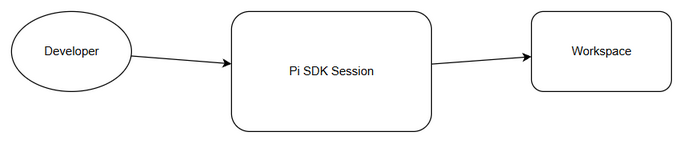
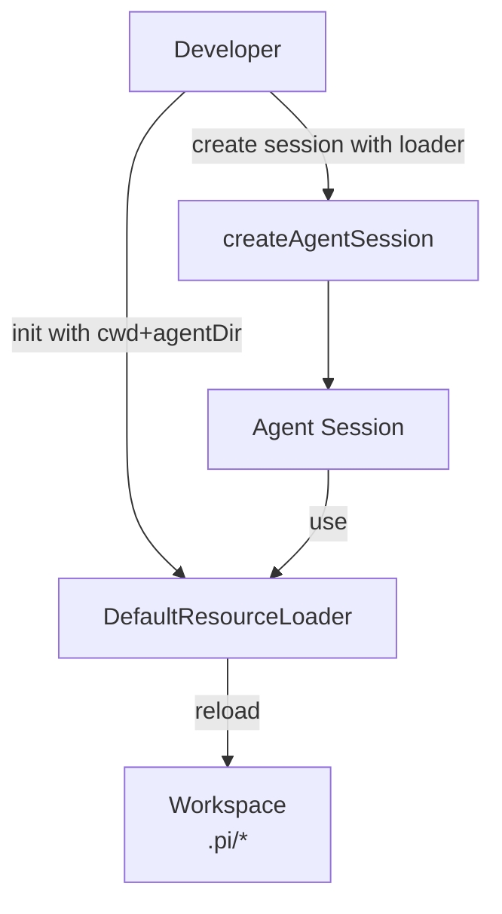
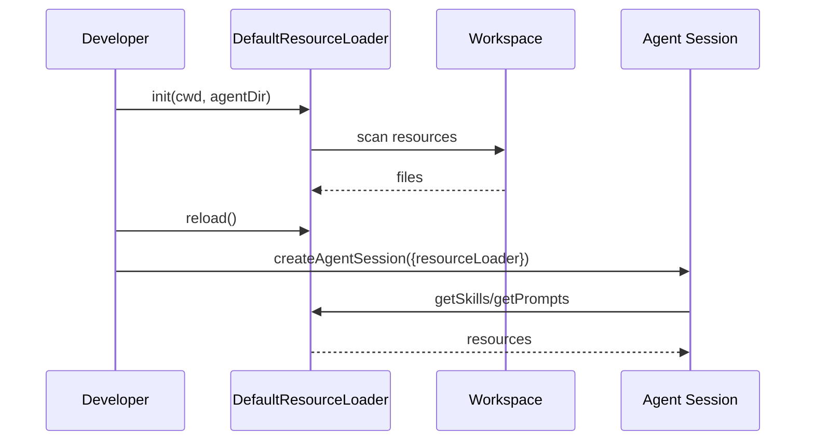

# Functional Specification Document (FSD)

## SA4E-315 — Wire up DefaultResourceLoader (cwd + agentDir) for resource discovery

---

## Document Information

| Field | Value |
|-------|-------|
| Jira Ticket | SA4E-315 |
| Title | Wire up DefaultResourceLoader (cwd + agentDir) for resource discovery |
| Author | BA Agent |
| Version | 1.0 |
| Date | 2026-09-24 |
| Status | Draft |
| Related BRD | documents/SA4E-315/BRD.md |

---

## Revision History

| Version | Date | Author | Changes |
|---------|------|--------|---------|
| 1.0 | 2026-09-24 | BA Agent | Initiate document — auto-generated from BRD and Jira tickets |

---

## 1. Introduction

### 1.1 Purpose

This FSD specifies the functional requirements for wiring up DefaultResourceLoader explicitly with cwd and agentDir parameters to enable controlled resource discovery for Pi SDK sessions in SDLC Agents workspace.

### 1.2 Scope

Reference BRD scope: Setup DefaultResourceLoader as foundation for Pi SDK to auto-discover skills, extensions, prompt templates and context files. Explicit initialization with cwd and agentDir.

Out of scope per BRD: Pi SDK development, UI implementation, data migration.

### 1.3 Definitions & Acronyms

| Term | Definition |
|------|------------|
| DefaultResourceLoader | Class of Pi SDK to discover resources |
| cwd | Current working directory - workspace root |
| agentDir | Agent directory of Pi SDK |
| Pi SDK | @earendil-works/pi-coding-agent |

### 1.4 References

| Document | Location |
|----------|----------|
| BRD | documents/SA4E-315/BRD.md |
| Pi SDK Docs | https://pi.dev/docs/latest/sdk (Configuring a session) |

---

## 2. System Overview

### 2.1 System Context Diagram

*[Edit in draw.io](diagrams/system-context.drawio)*

The system interacts with Developer as actor who configures session, Pi SDK Session component which uses DefaultResourceLoader, and Workspace which contains .pi/skills, .pi/extensions, .pi/prompts.

### 2.2 System Architecture

High-level components:
- Session Factory / createAgentSession
- DefaultResourceLoader instance
- Session Manager (in-memory)
- Workspace file system

---

## 3. Functional Requirements

### 3.1 Feature: Explicit DefaultResourceLoader Configuration

**Source:** BRD Story 1

#### 3.1.1 Description

Developer configures DefaultResourceLoader explicitly with cwd and agentDir, reloads resources, creates agent session with resourceLoader, and retrieves discovered resources.

#### 3.1.2 Use Case

**Use Case ID:** UC-001
**Actor:** Developer
**Preconditions:** Workspace root determined, Pi SDK installed, agentDir retrievable
**Postconditions:** Agent session created with explicit resource loader, diagnostics logged

**Main Flow:**

| Step | Actor | System | Description |
|------|-------|--------|-------------|
| 1 | Developer | | Determines cwd and retrieves agentDir via getAgentDir() |
| 2 | | System | Creates DefaultResourceLoader({cwd, agentDir}) |
| 3 | Developer | | Calls loader.reload() |
| 4 | | System | Loads resources from workspace |
| 5 | Developer | | Creates session via createAgentSession({resourceLoader, sessionManager}) |
| 6 | | System | Session ready, resources accessible via getSkills/getPrompts/getAgentsFiles |

**Alternative Flows:**

| ID | Condition | Steps |
|----|-----------|-------|
| AF-1 | cwd not exists | Log warning, fallback to default |
| AF-2 | agentDir not exists | Log warning, continue with limited discovery |

**Exception Flows:**

| ID | Condition | Steps |
|----|-----------|-------|
| EF-1 | loader.reload() fails | Log error, abort session creation |

#### 3.1.3 Business Rules

| Rule ID | Rule | Source |
|---------|------|--------|
| BR-1 | Session must be created with explicit DefaultResourceLoader instance | BRD Story 1 |
| BR-2 | cwd and agentDir must be passed to constructor | BRD Acceptance Criteria |
| BR-3 | loader.reload() must be called before session creation | BRD Acceptance Criteria |
| BR-4 | Diagnostics/warnings from loader must be logged | BRD Story 1 |

#### 3.1.4 Data Specifications

**Input Data:**

| Field | Type | Required | Validation | Description |
|-------|------|----------|------------|-------------|
| cwd | string | Y | Directory exists | Workspace root directory |
| agentDir | string | Y | Directory exists | Agent directory path |

**Output Data:**

| Field | Type | Description |
|-------|------|-------------|
| skills | array | Discovered skills from workspace |
| prompts | array | Discovered prompt templates |
| agentsFiles | array | Discovered agent context files |

#### 3.1.5 UI Specifications

Not applicable.

#### 3.1.6 API Contract (Functional View)

> Note: Technical details in TDD.

**Purpose:** Create agent session with explicit resource loader.

**Input Parameters:**

| Parameter | Type | Required | Business Rule | Description |
|-----------|------|----------|---------------|-------------|
| resourceLoader | DefaultResourceLoader | Y | BR-1 | Initialized loader |
| sessionManager | SessionManager | Y | - | In-memory session manager with cwd |

**Business Error Scenarios:**

| Scenario | User Message | Trigger Condition |
|----------|-------------|-------------------|
| Invalid cwd | Workspace root not found | cwd directory missing |
| Loader reload failure | Resource discovery failed | Exception during reload |

---

### 3.2 Feature: Resource Reload

**Source:** BRD Story 2

#### 3.2.1 Description

System reloads resources from workspace to ensure latest data.

#### 3.2.2 Use Case

**Use Case ID:** UC-002
**Actor:** System
**Preconditions:** Loader initialized
**Postconditions:** Resources refreshed

**Main Flow:**

| Step | Actor | System | Description |
|------|-------|--------|-------------|
| 1 | | System | Calls loader.reload() |
| 2 | | System | Scans <cwd>/.pi/skills, extensions, prompts, AGENTS.md |
| 3 | | System | Updates internal resource cache |

---

## 4. Data Model

> Note: Logical data model. Physical implementation in TDD.

### 4.1 Entity Relationship Diagram

No persistent entities. Resource discovery is filesystem-based.

### 4.2 Logical Entities

N/A - File system discovery.

---

## 5. Integration Specifications

### 5.1 External System: Pi SDK

| Attribute | Value |
|-----------|-------|
| Purpose | Resource discovery and session management |
| Direction | Bidirectional |
| Data Format | File system |
| Frequency | On-demand |

**Data Exchange:**

| Our Data | External Data | Direction | Business Rule |
|----------|--------------|-----------|---------------|
| cwd, agentDir | - | Send | BR-2 |
| - | skills, prompts | Receive | Discovery |

---

## 6. Processing Logic

### 6.1 Resource Discovery Process

**Trigger:** Session initialization
**Schedule:** On-demand
**Input:** cwd, agentDir
**Output:** Discovered resources

**Processing Steps:**

| Step | Description | Error Handling |
|------|-------------|----------------|
| 1 | Determine cwd and agentDir | Warn if missing |
| 2 | Instantiate DefaultResourceLoader | Fail if Pi SDK not available |
| 3 | Call loader.reload() | Log error on failure |
| 4 | Create Agent Session | Abort if loader not ready |
| 5 | Log diagnostics | Continue |

**Activity Diagram:**

Sequence diagram shows flow.

---

## 7. Security Requirements

No specific security requirements per BRD.

---

## 8. Non-Functional Requirements

| Category | Business Requirement | Acceptance Criteria |
|----------|---------------------|---------------------|
| Performance | N/A | - |
| Security | N/A | - |
| Scalability | N/A | - |
| Availability | N/A | - |

---

## 9. Error Handling (User-Facing)

### 9.1 Error Scenarios

| Scenario | Severity | User Message | Expected Behavior |
|----------|----------|-------------|-------------------|
| cwd not exists | Warning | Workspace root not found, using default | Log warning, fallback |
| agentDir not exists | Warning | Agent directory missing | Log warning |
| reload fails | Critical | Resource discovery failed | Abort session creation |

---

## 10. Testing Considerations

### 10.1 Test Scenarios

| ID | Scenario | Input | Expected Output | Priority |
|----|----------|-------|-----------------|----------|
| TC-1 | Valid cwd and agentDir | Existing paths | Session created, resources discovered | High |
| TC-2 | Missing cwd | Invalid path | Warning logged, fallback | Medium |
| TC-3 | Reload after file change | Modified .pi/skills | New skills visible | High |

---

## 11. Appendix

### Diagrams

| Diagram | File |
|---------|------|
| System Context Diagram | diagrams/system-context.png |
| Sequence Diagram | diagrams/sequence.png |
| State Diagram | diagrams/state.png |

### Change Log from BRD

FSD adds functional use cases, API contracts, processing logic, and diagrams to support implementation.

---

## Diagram Index

| Diagram | File |
|---------|------|
| System Context | diagrams/system-context.drawio |
| Sequence | diagrams/sequence.drawio |
| State | diagrams/state.drawio |

